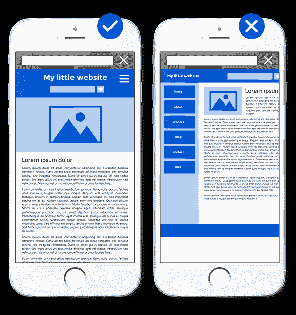
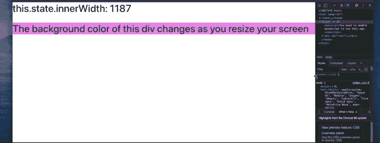

# 反应—随着屏幕大小的变化显示不同的内容

> 原文：<https://blog.devgenius.io/react-displaying-different-things-as-screen-size-changes-c123a6749156?source=collection_archive---------2----------------------->


随着越来越多的移动用户出现，我们越来越需要让我们的 web 应用程序具有响应性，即使对于初学者也是如此。这里，*响应式*应用意味着它显示内容的方式会根据我们的屏幕大小而变化。

## 响应式和非响应式网页设计示例



在这里，假设一个网站首先是为桌面用户开发的。如果这个网站*有响应*并且我们在移动浏览器上访问它，我们可能会看到类似左图的内容。然而，如果网站*没有* *响应*，我们可能会看到如右图所示的灾难。

在本文中，我将带您完成一个简单的任务——在我们调整屏幕大小时改变一个分区的背景颜色。

# 我们的目标是创造



# 创建我们的 React 应用

[https://ZL-Liu . medium . com/list/react-explained-simple-for-初学者-5a3c51d27b57](https://zl-liu.medium.com/list/react-explained-simply-for-beginners-5a3c51d27b57)

如果您不太确定如何创建 React 应用程序，请查看我创建的 React 文章列表，以便开始使用。让我们创建一个普通的单页 React 应用程序，然后继续。

# 添加代码来显示我们的屏幕大小

# 代码中发生了什么

## 定义我们的国家

```
state = {
    innerWidth: window.innerWidth
}
```

如果我们想让某个东西动态更新，我们需要把它放在我们的`state`中。在这里，`innerWidth`代表我们当前屏幕的宽度，我们首先将它设置为`window.innerWidth`，这将给出我们刚才所说的。

## 一旦我们的组件挂载，添加一个事件监听器

```
componentDidMount() {
    window.addEventListener("resize", this.resize.bind(this))
    this.resize()
}
```

一旦我们的组件完成加载(挂载)，就会调用`componentDidMount`函数。一旦这个函数被调用，我们就添加一个事件监听器来寻找一个`"resize"`事件，当你改变你的屏幕尺寸时就会触发这个事件。我们的事件监听器被绑定到我们的`resize`函数(我们将在下一步到达)——本质上，每当我们调整屏幕大小时，一个`"resize"`事件将被触发，我们的`resize`函数将被调用。

## 编写 resize 函数

```
resize() {
    this.setState({innerWidth: window.innerWidth})
}
```

这个函数的主要目的是更新我们的状态。每当我们的屏幕尺寸发生变化时，这个函数都会被调用，它实际上将我们状态的`innerWidth`属性设置为当前的屏幕尺寸。

## 编写 getColor 函数

```
getColor(innerWidth) {
    if (innerWidth <= 500) return "red"
    if (innerWidth <= 600) return "blue"
    if (innerWidth <= 700) return "green"
    if (innerWidth <= 800) return "yellow"
    if (innerWidth <= 900) return "pink"
    if (innerWidth <= 1000) return "beige"
    if (innerWidth <= 1100) return "lightblue"
    return "violet"
}
```

这个函数接受一个整数(屏幕大小)并返回相应的颜色。这些数字和颜色是任意选择的，你可以随意摆弄它们。

## 编写我们的渲染函数

```
render() {
    const style = {
        "background-color": this.getColor(this.state.innerWidth)
    } return <div>
        <h1>
            this.state.innerWidth: {this.state.innerWidth}
        </h1> <br /> <h1 style={style}>
            The background color of this div changes as you resize your screen
        </h1>
    </div>
}
```

无论这个函数返回什么，都是我们在应用程序上看到的东西。在这里，为了访问我们状态中的`innerWidth`，我们使用了`this.state.innerWidth`，我们在这里使用了两次——一次是简单地显示我们的屏幕宽度，另一次是根据我们的屏幕大小改变我们的`div`的背景颜色。

这里，我们将`h1`标签的样式设置为动态。当我们改变屏幕尺寸时(使用 inspect 面板)，`this.state.innerWidth`也会改变，`this.getColor(this.state.innerWidth)`也会改变。

# 运行和测试我们的响应式应用

```
npm run start
```

## 打开检查面板

*   右键→ *检查*
*   向左/向右拖动屏幕以改变屏幕尺寸


# 一些最后的话

这可能不是最先进的方法——可能有高水平的库使我们能够以更短、更强大的方式做类似的事情。然而，我希望这篇短文能给你一个简单易懂的方法来动态地改变你的应用程序的外观。

# 结论

如果这篇文章有价值，并且你希望支持我成为一名作家，请考虑注册一个 Medium 会员——每月 5 美元，你可以无限制地访问 Medium 上的故事。如果你用我下面的链接注册，我会给你零额外费用赚一点佣金。

[***注册使用我这里的链接阅读无限媒体文章***](https://zl-liu.medium.com/membership) ！

如果这篇文章为你提供了巨大的价值，请考虑给我买杯咖啡——非常感谢每一份小小的贡献！

[*https://www.buymeacoffee.com/zlliu*](https://www.buymeacoffee.com/zlliu)

如果你希望在我发布时得到通知，请考虑加入我的电子邮件列表。

[](https://zl-liu.medium.com/subscribe) [## 每当 Zlliu 发布时收到一封电子邮件。

### 每当 Zlliu 发布时收到一封电子邮件。注册后，如果您还没有中型帐户，您将创建一个…

zl-liu.medium.com](https://zl-liu.medium.com/subscribe)