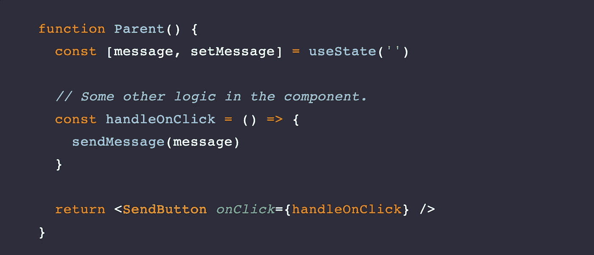
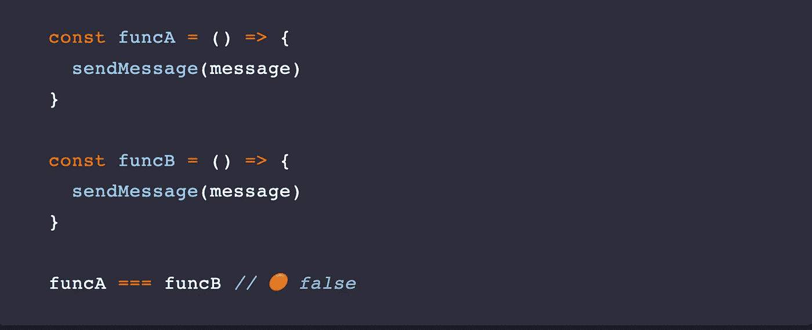
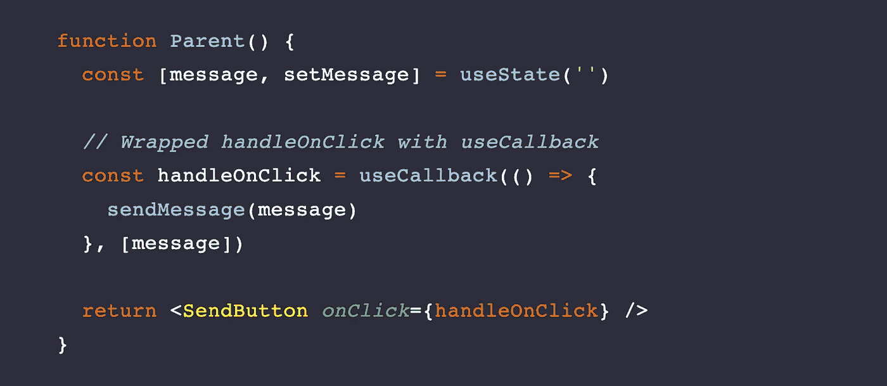
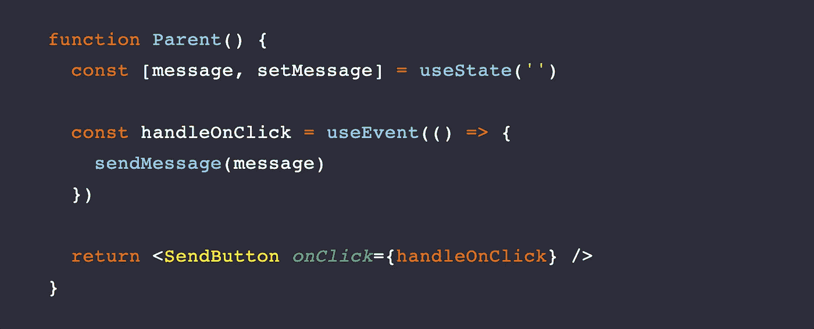
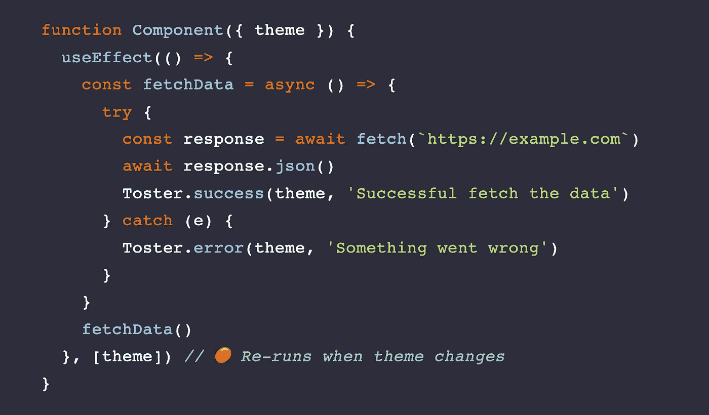
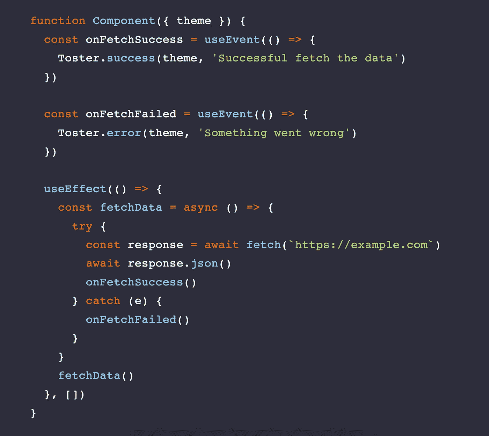
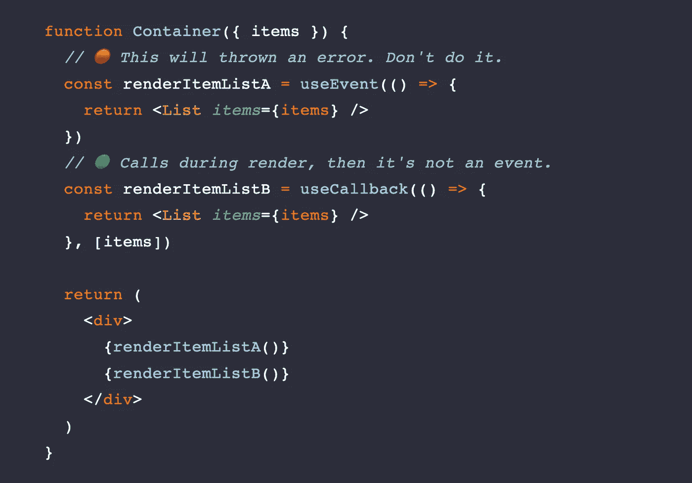
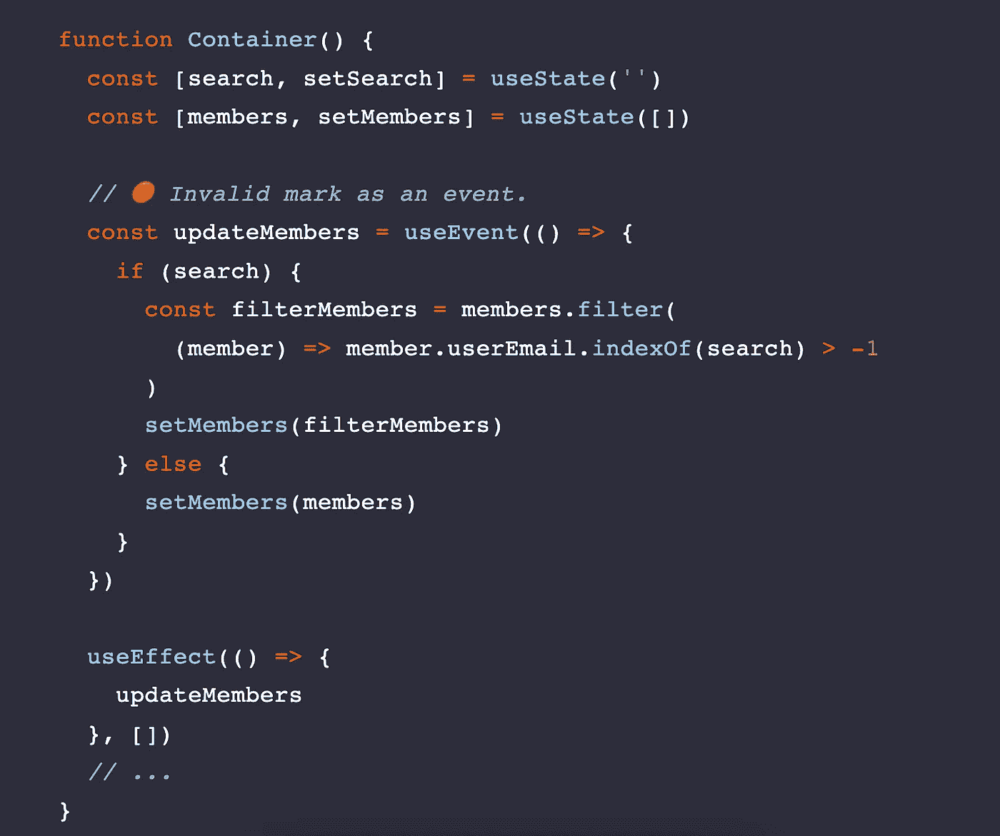

# React Hook —使用事件

> 原文：<https://blog.devgenius.io/react-hook-useevent-aa2bc203574d?source=collection_archive---------0----------------------->

*👉🏼在我的网站上看文章* [*在这里看*](https://oukunanan.me/react/use-event-hook?utm_source=medium&utm_medium=referal&utm_campaign=use-event-hook) *👈🏼*

# TLDR

useEvent 钩子**将*保持函数引用，并且不会在重新呈现的*组件之间重新创建**** *。*

# *为什么使用事件？*

*考虑下面的代码片段:*

**

*我们假设在内部用 ***React.memo*** 包装了“SendButton ”,当“Parent”被重新呈现时，“SendButton”也被重新呈现。*

***React.memo 在重新渲染之间做了** ***浅显的比较*** 会破坏记忆，因为 handleOnClick 函数在每次重新渲染上都有一个 ***唯一的函数引用。****

*如果“SendButton”包含嵌套的或许多组件，这可能会导致性能问题，因为它们将被重新呈现。*

**

*即使函数体是相同的，但每次重新呈现时，都会创建一个新的“handleOnClick”函数，并且每个函数都是唯一的。*

# *用 useCallback 求解*

**

*我们用 ***useCallback*** 包装了“handleOnClick”。除非 ***消息*** 的依赖关系发生变化，否则不会构造新的函数，“发送按钮”也不会重新呈现。不过很容易解决🤓。*

*大概不会。考虑如果 ***消息经常改变*** ，“handleOnClick”在每个重新渲染的版本中都是唯一的。此外，我们不能删除依赖项的消息，因为 handleOnClick 需要最新的消息值。Goshhhhhhhh。*

*我们做了几件事，但问题仍然存在。让我们来讨论一下**使用事件**。*

# *向 useEvent 问好*

**

**useEvent* 接口类似于 useCallback，但是 ***不包含依赖列表*** 。“handleOnClick”总是相同的参考值，并且*消息*将总是反映当前值。*

*这样一来，背“SendButton”就行了，因为 onClick 道具的功能永远是一样的。*

# *使用事件的示例*

**

*这是一个有点做作的例子，但无论如何🥲.如你所见。我们使用*获取*来获取数据。如果成功，成功烤面包机被激活；否则，故障烤面包机被激活。而且，《烤面包机》要求使用 ***主题和消息作为自变量*。***

*问题是，一旦主题改变，我们必须重新运行 useEffect 并获取数据，因为 useEffect 有一个主题作为依赖项。这不是我们想要的。我们只想第一次安装该组件。请尝试使用 useEvent 挂钩来解决该问题。*

**

*它可以分为两个功能。 ***onFetchSuccess，onFetchFailed*** 用 useEvent 钩子包装。结果。这些函数可以访问最新的*主题*值和 useEffect，无需添加主题作为依赖项。*

# *什么时候不应该使用 useEvent？*

## *在渲染过程中调用函数*

*如果在渲染过程中调用了 use event***，则会抛出异常*** 。在这种情况下，useCallback 仍然有效。*

**

## *并非所有的功能都是事件*

*考虑下面根据“搜索”过滤“成员”的代码片段*

**

*是 ***不工作*。**由于“更新成员”被标记为事件。useEffect 将不再依赖于“搜索”，“成员”将不再在搜索时更新。*所以请确保您正确地将该功能标记为事件*。*

# *结论*

*useEvent 可以解决重新验证太多 useCallback 的问题，或者回答这样一个问题(我是否应该到处使用 Callback？).如果你想进一步了解 useEvent。请检查 React Github 上的[官方 RFC。](https://github.com/reactjs/rfcs/blob/useevent/text/0000-useevent.md)*

*但与此同时，我写了这篇文章。在 React 的当前版本中，useEvent 钩子*不可用*。所以请密切关注下一次更新！感谢您的阅读。希望你喜欢。👋🏼*