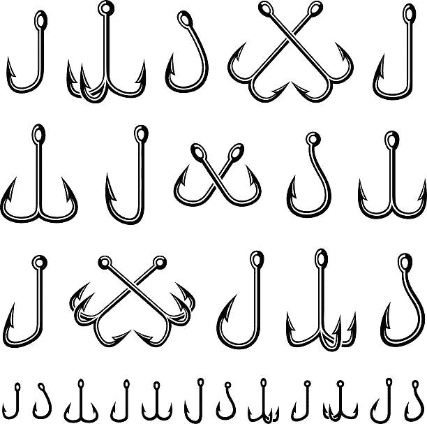

# 终极反作用挂钩备忘单

> 原文：<https://blog.devgenius.io/react-hooks-cheat-sheet-79af985a5105?source=collection_archive---------2----------------------->



## **反应简介**

什么是“反应”？

用于构建用户界面的 JavaScript 库

安装

*   首先，从[https://nodejs.org/en/](https://nodejs.org/en/)安装节点
*   要查看是否安装了 npm，请在命令行中键入以下内容:

npm -v

*   代码编辑[https://code.visualstudio.com/](https://code.visualstudio.com/)

创建 React 应用程序

```
// Create a new app
npx create-react-app my-app-name// Run the created app
cd my-app-name
npm start/yarn start// [http://localhost:3000](http://localhost:3000)
```

成分

react 应用程序由多个组件组成。例如，在电子商务应用程序中，我们可以有一个搜索栏组件、产品组件和边栏组件

主要组成部分

*   功能部件
*   类组件

功能组件示例

```
function App() {
  return (
    <div className="App">
       <h1>My First Functional Component</h1>
    </div>
  );
}
```

类组件

```
class HelloWorld extends React.Component {
  render() {
    return <h1>Hello World!</h1>;
  }
}
```

**反作用钩**

*   在 React 16.8 版本中引入

# 先决条件

1.  节点版本 6 或以上
2.  NPM 版本 5.2 或以上
3.  创建-反应-应用程序工具，用于运行反应应用程序

# 反作用挂钩安装

```
npm install create-react-app -gcreate-react-app react-hooksnpm install react@16.7.0-alpha.2 --savenpm install react-dom@16.7.0-alpha.2 axios --save
```

**管理状态**

*   国家使用

Hook 使用 useState()函数组件来设置和恢复状态。

例子

```
import React, { useState } from 'react';function Example() {
  // Declare a new state variable, which we'll call "count"  const [count, setCount] = useState(0);
  return (
    <div>
      <p>You clicked {count} times</p>
      <button onClick={() => setCount(count + 1)}>
        Click me
      </button>
    </div>
  );
}
```

*   *使用减速箱*

*当有复杂的状态逻辑时，useReducer* 通常比 useState 更可取。

例子

```
import React, { useReducer } from 'react';function Counter() {
  // First render will create the state, and it will
  // persist through future renders
  const [sum, dispatch] = useReducer((state, action) => {
    return state + action;
  }, 0); return (
    <>
      {sum} <button onClick={() => dispatch(1)}>
        Add 1
      </button>
    </>
  );
}
```

**处理副作用**

*   使用效果

useEffect(回调，依赖项)是管理功能组件中的副作用的挂钩。通过使用这个 Hook，您可以告诉 React，您的组件需要在呈现之后做一些事情。

```
import React, { useState, useEffect } from 'react';
function Example() {
  const [count, setCount] = useState(0); // Similar to componentDidMount and componentDidUpdate:  useEffect(() => {    // Update the document title using the browser API    document.title = `You clicked ${count} times`;  });
  return (
    <div>
      <p>You clicked {count} times</p>
      <button onClick={() => setCount(count + 1)}>
        Click me
      </button>
    </div>
  );
}
```

*   使用布局效果

useLayoutEffect 的工作原理类似于 useEffect，但它更像 useEffect 挂钩那样异步工作，它在所有 DOM 加载完成后同步激发。

例子

```
function App(){ const [count, setCount] = React.useState('0') React.useLayoutEffect(() => { console.log(count)}, [count])return( <div> <h1>The count is {count} </h1> <button onClick={() => setCount(count + 1)}></button </div> )}
```

**使用上下文 API**

*   useContext

React 的 *useContext hook* 让数据在应用程序中的传递变得非常容易，而无需手动向下传递道具

```
import React from "react";
import ReactDOM from "react-dom";// Create a Context
const NumberContext = React.createContext();
// It returns an object with 2 values:
// { Provider, Consumer }function App() {
  // Use the Provider to make a value available to all
  // children and grandchildren
  return (
    <NumberContext.Provider value={42}>
      <div>
        <Display />
      </div>
    </NumberContext.Provider>
  );
}function Display() {
  // Use the Consumer to grab the value from context
  // Notice this component didn't get any props!
  return (
    <NumberContext.Consumer>
      {value => <div>The answer is {value}.</div>}
    </NumberContext.Consumer>
  );
}ReactDOM.render(<App />, document.querySelector("#root"));
```

**忆起一切**

*   使用备忘录

反作用*使用 Memo* Hook 返回一个 memoized 值。可以将 memoization 视为缓存一个值，这样就不需要重新计算该值。

例子

```
import { useState, useMemo } from 'react';export function CalculateFactorial() {const [number, setNumber] = useState(1);const [inc, setInc] = useState(0);const factorial = useMemo(() => factorialOf(number), [number]);const onChange = event => {setNumber(Number(event.target.value));};const onClick = () => setInc(i => i + 1);return (<div>Factorial of<input type="number" value={number} onChange={onChange} />is {factorial}<button onClick={onClick}>Re-render</button></div>);}function factorialOf(n) {console.log('factorialOf(n) called!');return n <= 0 ? 1 : n * factorialOf(n - 1);}
```

*   使用回调

回调确保函数不会在任务完成之前运行，而是会在任务完成之后立即运行。

*useCallback*—*useCallback*将返回回调的记忆版本，该版本仅在依赖项之一发生变化时发生变化。

例子

```
const Counter = () => {const [counter, setCounter] = useState(0);const handleIncrement = React.useCallback(() => {setCounter(counter + 1);}, [])return <div>Counter:{counter}<br/><button onClick={handleIncrement }>Increment</button></div>}
```

**使用参考文献**

*   useRef

useRef Hook 允许您在呈现之间保持值。

例子

```
function SomeComponent() {const usernameRef = React.useRef('');const handleSomething = () => {console.log(usernameRef.currrent);usernameRef.current = someOtherValue;
}}
```

*   userequisitivehandle

> `useImperativeHandle`自定义使用`ref`时对父组件公开的实例值。`useImperativeHandle`应与`forwardRef`连用

它使您能够控制返回值。不是返回实例元素，而是显式地声明返回值将是什么。

例子

```
function FancyInput(props, ref) { const inputRef = useRef(); useImperativeHandle(ref, () => ({ focus: () => {
      inputRef.current.focus();
    }
  }));
  return <input ref={inputRef} ... />;
}
FancyInput = forwardRef(FancyInput);
```

**参考**

React 文档

**结论**

使用 React 钩子的好处是:**可重用性、可读性和可测试性**。在本文中，我们探讨了 React 简介、React 钩子的概念和类型，并给出了合适的例子。希望你能从这篇文章中学到一些东西。

快乐学习！