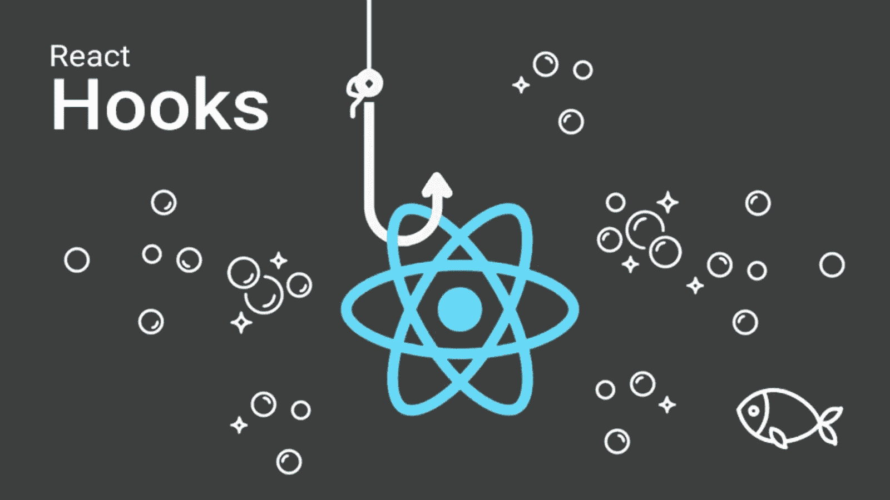

# React 钩子教程:使用状态和生命周期

> 原文：<https://blog.devgenius.io/react-hooks-tutorial-usestate-and-lifecycle-5618ecbb37ab?source=collection_archive---------6----------------------->

# 将 useState 与 React 一起使用

他的教程将会教你在你的属性政府中使用反应钩子的基本知识。

*在本教程中，我们将介绍:*

*创建一个使用 useState 的组件*

*   *添加一个 useEffect 钩子，当我们的组件被分离时清除我们的状态*
*   *在钩子中使用变量*

*React 钩子是 React 的一个新特性，使得编写功能组件变得很容易。*

有两种类型的钩子:状态和使用状态。

*useState 挂钩用于创建可与 JSX 一起使用的有状态功能组件。useState 钩子取一个初始状态，并返回一个函数，该函数在每次提交时返回状态值。*

这个教程向你展示了如何在你自己的项目中使用 useState 钩子！

**小节:** *钩子是 React 16.8 中新增的。他们让你不用写类就可以使用状态和其他 React 特性*

类组件与挂钩

**部分** : *从 react 库导入使用状态*

**部分** : *编写一个返回某些东西的功能组件*

**部分** : *调用功能组件顶部的使用状态钩子*

**Section** : *将这段代码复制并粘贴到您想要使用*的任何地方

> ***新增状态变量:***
> 
> `***const [name,setName] = useState("Initial value")***`

要点:你可以在 React 中使用钩子来代替类。

useState 是一个强大的特性。它可以用在许多不同的方面，每种方式都有独特的动画，这使得 useState 成为最重要的钩子之一。

如本教程所示，通过用 useState 钩子包装无状态组件，可以在任何 React 组件中直接使用 useState。最终结果是，当状态改变时，组件将增量更新，而不需要每次都消化整个状态。

这使得它非常适合跟踪小块数据，就像我们在这里演示的那样。我们还展示了它如何与其他 React 挂钩(如 useEffect 和 useReducer)一起工作，如果您需要这样做的话。

如果您正在寻找一种方法来为您的项目快速组织 useState 挂钩，那么我推荐利用像 react-hooks-toolkit 这样的库。

# **奖金:**

Hooks API 强大而优雅，但不可否认并不总是最容易理解的。虽然我们刚刚介绍的所有内容可能对每个人来说都不是小菜一碟，但我们建议您坚持完成。一旦你对 useState 有所了解，你就会对它的威力有独特的欣赏。即使您在日常工作中从未使用过该功能，但知道在适当的时候如何实现它也是很有价值的。

如果你已经读到这里，谢谢你。如果你喜欢，分享和评论文章，我们可以接触到更多的人。保持平静。

