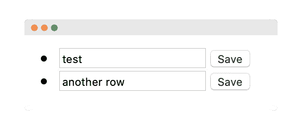

# React 挂钩——使用包装器来记忆事件处理程序，并防止不必要的重新呈现

> 原文：<https://blog.devgenius.io/react-hooks-using-a-wrapper-to-memoize-event-handlers-and-to-prevent-unnecessary-re-renders-9e7fbbc0f95c?source=collection_archive---------0----------------------->

几周前，我遇到了 React 挂钩、事件处理程序和不必要的重新渲染的问题。使用类解决方案是相当琐碎的，使用钩子，没有那么多。

我们应用程序的简化要求:

*   显示项目列表。
*   每个项目都有一个输入字段。
*   每个项目都有一个保存按钮。
*   更改或保存一个项目不会导致其他项目的重新渲染。

当然，如果渲染是廉价的，那么每次重新渲染是完全有意义的。在这种特殊情况下，我们希望防止其他项目的重新渲染。

# 我们的数据集

# 为什么使用 React 钩子会更困难？

下面的例子是呈现所有`Item`组件的`ItemList`组件的可能实现。

使用 [useCallback](https://reactjs.org/docs/hooks-reference.html#usecallback) 钩子来记忆`handleChange`函数。只有当其中一个依赖关系(在本例中为`setItems`)发生变化时，才会重新创建该函数。到目前为止还好。

问题是`handleSave`函数没有被记忆。在每次渲染`ItemList`时，都会创建一个新的`handleSave`函数。因此，当一个`Item`更新时，所有其他的`Item`组件也会重新渲染。我们不能在这里使用`useCallback`，因为`handleSave`依赖于`items`。`items`当单个项目更新时，将始终改变。

您可以尝试几个解决方案:

*   改为将`handleSave`的所有依赖项作为参数传递。在这种情况下，`Item`组件也需要接收所有这些依赖项作为道具。
*   将整个项目对象传递给`Item`组件。这将使`Item`中的道具等式检查更加复杂，也更容易出错。
*   使用`useRef()`钩子，每次改变`items`时，将其写入 ref，并在`handleSave`函数内从 ref 读取`items`。那么`items`就不再是`handleSave`的附属品了。
*   将变量`idToSave`保持在状态。在保存时设置`idToSave`。然后用`useEffect(() => { /* save */ }, [idToSave])`“反应式”触发保存功能。

相反，我主张有一个更好的解决方案。🎉

# 首先，项目组件

我们的`Item`组件非常简单。它有一个保存和编辑状态。最需要注意的是[的反应。备忘录](https://reactjs.org/docs/react-api.html#reactmemo)部分。这是一个高阶组件，只有当其中一个道具改变时才会重新渲染。

# 诀窍是，项目包装

通过使用一个`ItemWrapper`组件，我们可以记住两个事件处理程序。结果是一个`Item`组件，仅在单个`item`改变时才重新呈现。

它向树中添加了一个额外的组件，但是随着结构的增长而提供值。这也反映了我们的情况:每个条目都有一个保存功能，需要整个`item`对象，但是`Item`组件本身不需要。因此，您可能会将 ItemWrapper 视为 save 函数的提供者。

而`ItemList`将变成:

# 还有一件事…

在这个例子中，我们将`setItems`传递给`ItemWrapper`，有更好的解决方案。您可以将`handleChange`和`handleSave`向上移动一步，但是我认为一个简单的`reducer`会使这个例子更完整。

当然，对于这个“Hello World”示例来说，所有这些可能感觉过于复杂，但是在更复杂的真实世界应用程序中，这种结构对我来说最有意义。

完整的例子可以在下面找到，或者在 CodeSandbox 的[这里。](https://codesandbox.io/s/billowing-monad-g7r4p?file=/src/App.js)

*原载于*【https://www.arthurvisser.com】**。**