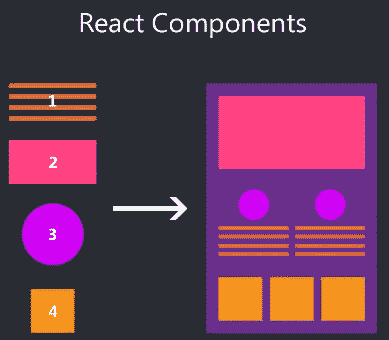

# React 面试:基于课程和功能组件的区别

> 原文：<https://blog.devgenius.io/react-interview-difference-between-class-based-functional-component-f0c24e8b73a3?source=collection_archive---------10----------------------->

## react 中基于类的组件与功能组件

这是一个非常著名的面试问题，在 React 的每次面试中都会被问到，因为它基于 **react 生命周期方法**。你可以说没有生命周期方法的 react 是**空**，因为**挂载**，**更新** & **卸载** dom。感谢[技术 Suneja](https://www.youtube.com/watch?v=UbLYdbOPLe8&ab_channel=TechnicalSuneja) 对上述话题的很好的解释。



React 中的组件

**文档对象模型** (DOM)是放置所有元素的地方。现在，假设您想要操作 dom，如果没有 react app 的生命周期方法，首次加载内容、更新内容或从 dom 中删除内容是不可能的。所以 react 本身在内部使用这些方法，不管是基于类的组件还是有方法的组件，如果你使用功能性的组件，那么你就有 T21 来实现 react 中的生命周期方法。React 有 3 个阶段，即。**安装**、**更新** & **卸载**。

# I)基于类的组件

(I)基于类的组件是**有状态或无状态**组件，因为它依赖于**状态的值。** (ii)在基于类的组件中有一个 **render** 函数，用于返回 react 元素。
(iii)我们有两个选项的类组件使用**道具**并设置**状态**。

基于类的组件基于 **3** 生命周期方法，即

1.  **componentDidMount()** —组件首次加载或渲染时。
    例如，当你想加载 web 服务并且它的响应或内容应该在页面加载时可用时，你可以使用这个方法。
2.  **componentDidUpdate() —** 每当第一次加载页面时，都会调用 componentDidMount()。
3.  c**componentdidunmount()—**无论何时从 dom 中移除任何组件，都会调用 componentWillUnmount()。

注意——如果你想在加载 DOM 之前加载**，那么你需要使用**构造函数**。例如，你想在加载页面之前初始化值或变量。**

```
 //initialize variable before page load
  constructor() {
    super();

    //creating state by intializing setting variable count to 0
    this.state = {
      count: 0,
    };
  }
```

例如，点击此处观看[演示](https://stackblitz.com/edit/react-xb5w7q?file=src/components/Counter.js\)

# II)基于功能的组件

(I)在基于类中，我们已经看到了实现生命周期的各种方法，但是功能组件是**无状态的**，从版本 **16.8** 开始，钩子被用来实现生命周期方法。
为了在使用基于功能的组件时实现安装，我们有**挂钩**。在 react 中通常使用 **useEffect()** 钩子来实现一个生命周期。

(ii)在功能组件中，没有可用的渲染功能。
(iii)功能组件只接受**道具**作为参数。

示例:

```
1\. load page on mounting
  useEffect(() => {
    console.log('Functional component: Mounting...');
  });

2\. load component only when data is updated, just add [] with dependency
  useEffect(() => {
    console.log('Functional component: Updating...');
  }, [number]);

3\. To acheive unmounting we need to return a callback
  useEffect(() => {
    return () => {
      console.log('Functional component: Unmounted and Removed...');
    };
  }, [number]);
```

—点击此处观看[演示](https://stackblitz.com/edit/react-25yecg?file=src%2FApp.js)