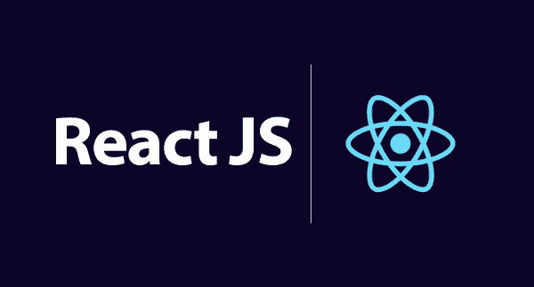

# 反应 JS

> 原文：<https://blog.devgenius.io/react-js-59abc96fd2d2?source=collection_archive---------11----------------------->

# **React JS 是什么？**

React JS 是由脸书开发的开源 JavaScript 库，用于开发交互式 web 和移动用户界面。React JS 关注的是利用 JavaScript 的表现力和类似 HTML 的模板语法的组件。React 是基于组件的库，用于开发交互式 UI，它是目前最流行的 JavaScript 前端库，是强大的基础和大型社区基础。React JS 基本上是视图 MVC(模型-视图-控制器)。React 的主要方面是虚拟 DOM、单向绑定和服务器端呈现。虚拟 DOM 是一个节点树，它将元素、属性和内容作为对象和属性列出。

# 为什么反应 JS？

使用 React JS 的主要原因是其他框架，正如我们可以从图表中看到的，还有从各种资源接收的数据，如初始数据、实时数据、传递给调度程序的用户输入数据。然后，调度程序将数据转发到商店，最终从商店到达视图。视图是用户与应用程序交互的部分。无论如何，我们认为浏览器作为一个网页本身就是一个视图。每次在后端添加或更新新数据时，浏览器都会重新加载网页，并再次重复整个过程。但是传统数据流的主要缺点是文档对象模型。DOM 是由浏览器创建的对象。每次加载网页时，可以在后端动态添加或删除数据。但是每次修改都在同一个页面上创建新的 DOM。DOM 的重复创建导致了不必要的内存浪费，降低了应用程序的性能。

此外，DOM 的操作非常昂贵。因此，有一种新的技术可以解决这个问题。这就是“React JS”拯救我们的地方。使用 React JS，我们可以将整个应用程序分成不同的独立组件。React JS 应用程序仍然使用相同的传统数据流，但是在后端有所改变。每次从后端添加或更新后端数据时，React JS 都使用新技术来交付它们。React 没有重新加载整个页面，而是销毁了旧视图。之后，它用新数据的更新呈现视图，并用新视图替换旧视图。对于 DOM React 造成的内存浪费，引入了虚拟 DOM。虚拟 DOM 有三个简单的步骤。从第一步开始，每当底层数据发生变化时，整个 UI 都被重新呈现为虚拟 DOM 表示。

# React JS 的优势？

1.应用程序的性能得到了提高。

2.在客户端和服务器端使用。

3.可读性增加了。

4.可以轻松地与其他框架一起使用。

# React JS 的特点？

***1。学习曲线***

React 的学习曲线很浅，适合初学者。ES6 语法更容易管理，特别是对于较小的应用程序。在 React 中，我们用 JavaScript 的方式编码，这给了我们根据自己的需要选择工具的自由。

***2。性能***

React 的渲染速度更快。顾名思义，React 以最小的延迟对变化做出即时反应。

***3。尺寸***

React 不是一个框架和根据用户需求添加的特性。这是基于 react 构建的轻量级应用程序背后的原理。

***4。调试***

React 使用编译时调试并在早期检测错误。这确保了错误不会在运行时悄悄出现。脸书单向数据流允许干净和平稳的调试。

# 关键术语

***JSX — JavaScript 扩展***

这个 JSX 允许我们将 HTML 和 JavaScript 包含在同一个文件中。React 中的每个组件都生成一些由虚拟 DOM 呈现的 HTML。

***ES6***

JavaScript 的第六个版本是由 ECME 国际在 2015 年标准化的。现代网络浏览器并不完全支持 ES6。

***ES5***

第五个 JavaScript 框架，这是所有现代网络浏览器普遍期待的。它基于 2009 年 ECME 规范标准。和工具用于在运行时将 ES6 转换成 ES5。

***Webpack***

这是一个模块包，生成包含所有必需依赖项的构建文件。

***巴别塔***

这是将 ES6 转换成 ES5 的工具。

# **组件**

我们可以用独立的可重用部分来划分我们的 UI。有两种类型的组件。这些是类组件和功能组件。

## *类组件*

有状态/容器组件类是一个标准的 ES6 类，它扩展了 React 库的组件类。它被称为有状态组件，因为它管理状态如何改变以及组件逻辑如何实现。除此之外，他们还可以访问 React 生命周期功能的所有阶段。

在引入 React 挂钩之前，类组件是创建动态和可重用组件的唯一方式，因为它提供了对所有 React 特性和生命周期方法的访问。

## *功能组件*

JavaScript 函数用于创建功能组件。因为在 React 16.8 引入钩子之前，它们只是简单地接受和返回要呈现给 DOM 的数据，所以它们通常被称为无状态或表示组件。

以前，访问更多 React 功能(如状态和 React 生命周期功能)的唯一方法是使用类组件。另一方面，Hooks 允许您合并状态和其他 React 功能，以及使用功能组件编写完整的 UI。

## **处于反应状态**

组件的私有数据称为状态。组件之间不共享状态。组件的“状态”,可用于呈现和更改数据。

## **反应过来的道具**

在现实世界的编程中，您将需要这些组件相互交互。状态对于组件是私有的，但是数据必须在它们之间传递。这就是道具发挥作用的地方。值得注意的是，道具是只读的。

## **反应列表和按键**

在 React 组件中，我们使用 list 来呈现元素列表。列出用户、TODO 任务和其他对象的任务相当普遍。为了遍历列表并呈现结果，我们使用了 map()函数。要告诉 React 重新渲染，关键点有助于识别列表中的哪个项目发生了变化。如果您忘记提及列表中的键，ReactJS 将会通知您。

结论
React JS 的出现恰逢其时，它可以帮助开发者快速创建极具吸引力的在线应用和用户界面。它使您能够解构组件，用更少的代码创建单页应用程序。

# 感谢阅读！

希望这篇文章是有用的，信息丰富的。