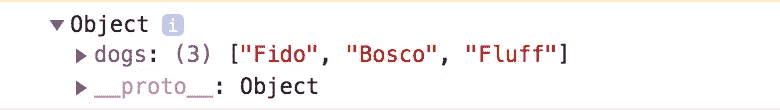

# React.js //辨别状态和道具

> 原文：<https://blog.devgenius.io/react-js-discerning-between-state-and-props-5bebcb160053?source=collection_archive---------20----------------------->


“只要有可能，你就必须茁壮成长，哪怕只是为那些不可能的时候提供一个缓冲。”乔丹·沃克

广受欢迎的 Javascript 前端库 React 提供了结构化和简化的[编程约定](https://en.wikipedia.org/wiki/Coding_conventions)，用于呈现特定项目后端所需的任何视图。为了有效地利用这个神奇的库，人们必须对*状态、*和**的反应概念以及它们如何协同工作有一个良好的理解。**

首先，*状态*和*属性*的概念是通过哪个组件拥有数据来辨别的。**状态**是本地拥有的(对于一个组件)，并由组件本身更新。**属性**不属于本地组件，而是源自父组件，因此由只读数据组成。为了更新 props，必须将回调函数传递给子组件，以提示上游的更改。

通过在代码中可视化这个过程，组件数据所有权的概念可以变得更加清晰。让我们从基础应用组件开始:

```
import React, { Component } from 'react';
import DogContainer from './DogContainer';Class App extends Component {
    const dogsData = [Fido, Bosco, Fluff]
    constructor(){
    super()
    this.state = {
      dogs: dogsData
    }
  }render() {
    return (
      <div className="app">
        <DogContainer dogs={this.state.dogs}/>
      </div>
    )
  }
}export default App;
```

> App 类**拥有**数据。换句话说，App 父类的状态等于“狗”的**键**和 **'** dogsData(一个狗对象数组)的**值**。

如果我们要' console.log(this.state)，'将返回一个包含 dogs 的键的对象，该键包含 dogs 对象的数组:



为了举例，狗的“对象”仅仅是字符串。

现在，注意第 16 行发生了什么:

```
 <DogContainer dogs={this.state.dogs}/>
```

这是将道具传递给子组件时必须遵循的约定， *key={this.state}* 。在这种情况下，子组件 DogContainer 正在接收一个对象作为道具；这个对象有一个指向父应用程序状态的“dogs”键(我们知道这是我们的 dogs 数据数组)。让我们看看这个 DogContainer 可能是什么样子:

```
import React, { Component } from 'react';Class DogContainer extends Component {
  renderDogs = () => {
    this.props.dogs.map(dogObj => {
      return <h1>{dogObj.name}</h1>
    }
  }
  render() {
    return (
      <div className="dogContainer">
        {this.renderDogs}
      </div>
    )
  }
}export default DogContainer;
```

在这里，如果我们要' console.log(this.props)'我们将得到相同的返回对象，它包含一个指向包含我们所有数据的值的' dogs '键。这些*道具* **属于**App 父类，但是 DogContainer 可以以只读方式访问。

React 为处理前端信息提供了一个独特的结构，而*状态/属性*对于实现该结构至关重要。在防止错误和呈现独立组件时，适当的信息流是非常重要的。更多信息请参考 React 官方文件[这里](https://reactjs.org/docs/faq-state.html)！