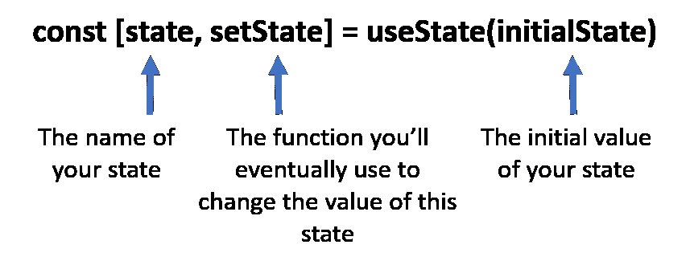
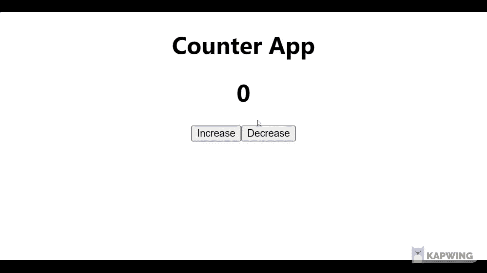

# React.js 状态:是什么，怎么用。

> 原文：<https://blog.devgenius.io/react-js-state-what-it-is-and-how-to-use-it-ba81d1ddd3c7?source=collection_archive---------7----------------------->


## 了解 React 状态管理，然后构建一个 React 计数器组件。

本文是[我的第一篇文章](https://rolandsankara.medium.com/a-responsive-landing-page-with-react-3d9282e24b74)的延续，第一篇文章对 React JavaScript 库进行了实用的介绍。在本文中，我将介绍 react 中状态的概念以及如何在 React 组件中实现它。

让我们开始吧...

# 🤔**什么是反应状态？**

*“状态只是 javaScript 数据结构的一个花哨的词”。*

这是 React 组件能够存储组件可以使用的数据位的一种方式。状态值可以是任何数据类型，即*字符串*、*数字*、*布尔*或 O *对象*。
需要注意的是，与使用 ***let*** 或 ***const*** 在组件中定义的变量不同，状态值可以被操纵，并且在随后的组件重新渲染过程中保持不变。

在 react 中，状态可以是 ***局部*** 或 ***全局*** 。

**本地状态:** 这是单个 app 组件内部使用的数据。
可以使用函数组件中的 ***useState*** 钩子来创建和管理。

**全局状态:**
这是 react app 中多个组件可以访问和使用的数据。在 react 中有许多创建和管理全局状态的方法，例如可以选择使用[上下文 API](https://reactjs.org/docs/context.html) 或 [Redux](https://redux.js.org/) 。

在本文中，我将向您展示如何使用***useState***react 钩子在函数组件中创建和管理 ***局部状态*** 。我将在后续文章中介绍全局状态管理。

# **什么是 React 钩子？**

你可能已经问过自己这个问题了，所以我想暂停一下，解释一下 React.js 中的钩子是什么。

React 挂钩是内置的 react 函数，它使我们能够管理状态，还可以挂钩到其他 react 特性。

下面是基本 react 挂钩的列表；

*   [使用状态](https://reactjs.org/docs/hooks-reference.html#usestate)
*   [使用效果](https://reactjs.org/docs/hooks-reference.html#useeffect)
*   [使用上下文](https://reactjs.org/docs/hooks-reference.html#usecontext)。等等

需要注意的是，react 挂钩只适用于 React 函数组件。函数组件基本上是一个返回反应元素(JSX)的 JavaScript/ES6 函数。

# **用 useState 钩子创建状态**

所以要用 useState 钩子创建状态，我们需要首先从 React.js 函数组件模块的顶层 *react* 导入 useState 函数，如下面的代码片段所示；

导入 useState 钩子/函数后，我们可以用它在函数组件内部创建状态。useState 函数采用单个参数，即 ***初始状态值*** ，然后 ***返回一个带有两个值的数组*** ，即:

```
- State value- State update function.
```

我们可以[析构](https://javascript.info/destructuring-assignment)useState 返回的数组来获取状态值和状态更新函数，这些可以在组件中使用。

下图说明了析构是如何完成的。



来源:[https://miro.medium.com](https://miro.medium.com/max/857/1*pEwyGLJSIlGhe068e1ojYQ.png)

下面的代码片段显示了初始化状态后的样子。我认为状态是一个 ***计数*** 值。

看起来棒极了！

现在让我们继续创建一个简单的计数器组件，它利用 react 中的本地状态管理。是时候实践我们所学的东西了。我建议你和我一起编码。

所以我们走吧…

# 🚀**创建计数器组件。**

首先，我们需要使用***create-react-app***工具创建一个新的 react 应用。因此，请转到您的终端/cmd 窗口，然后键入以下命令。

```
npx create-react-app counter-app
```

[点击此处了解更多关于设置 react-app 的信息](https://rolandsankara.medium.com/a-responsive-landing-page-with-react-3d9282e24b74)

在新的 react 应用程序安装完成后，您可以在您喜欢的代码编辑器中打开项目文件夹，即 [Visual Studio Code](https://code.visualstudio.com/) ，并执行以下操作:

**1:创建计数器组件；**

在 create app 的 ***src*** 文件夹中，继续创建一个名为 ***Counter.js.*** 的新文件，在该文件中创建一个名为 Counter 的函数组件，如下所示。

**2:创建计数状态值；**

使用 useState 钩子，创建一个名为 count 的状态值，并用值 0(零)初始化它。然后用文本内容更新***【h1】***元素， ***【计数值】*** ，使其保存计数状态值。您的代码应该如下所示:

**3:创建两个函数；增加计数和减少计数；**

计数器组件的 JSX 中有两个按钮。一个用于增加计数状态值，另一个用于减少计数状态值。这些按钮需要 onClick 事件处理程序，用于相应地更新计数状态。

函数***increase count***和***decrease count***将被用作事件处理程序，因此它们被创建在 return 语句的正上方。

每个函数都使用 ***setCount*** 函数来更新计数状态值，方法是调用 setCount 函数，根据当前的计数状态值使用新的计数值，如下所示。

注意增加了两个函数*和 ***减少计数*** 分别作为 ***增加按钮*** 和 ***减少按钮*** 的 onClick 事件处理程序。*

***4:将计数器 App 导入 App.js 组件；***

*是时候把计数器 App 集成到主组件中了——***App . js .***
这就是你的 ***App.js*** 组件应该的样子；*

*最后，完成这些之后，继续在终端中使用 ***npm start*** 命令启动 react 应用程序。*

*当应用程序成功启动时，您应该能够看到计数器应用程序如下所示。计数值从零开始作为初始值，可以通过点击增加按钮来增加，或者使用减少按钮来减少。*

**

*需要注意的是，在 react 中，当组件依赖的状态更新时，组件会被重新呈现。这对于我们的计数器组件来说是正确的，因为您会注意到当单击任何按钮时都会显示一个新的计数值，因为这些按钮会更新计数状态值，从而触发计数器组件的重新呈现。*

*好的，做得好…🎉🎉。很高兴您能看到这篇文章的结尾。*

*我希望它能帮助你理解 React 状态和它的用法。请在评论区告诉我你的想法。*

***附加资源:***

*[](https://reactjs.org/docs/hooks-state.html) [## 使用状态钩子-反应

### 钩子是 React 16.8 中的新增功能。它们允许您使用状态和其他 React 特性，而无需编写类。的…

reactjs.org](https://reactjs.org/docs/hooks-state.html)*