# React.js 教程:如何从头开始实现洗牌游戏(第 1 部分)。

> 原文：<https://blog.devgenius.io/react-js-tutorial-how-to-implement-a-shuffle-card-game-from-scratch-c994277d38b3?source=collection_archive---------3----------------------->


最终结果(第 1 部分、第 2 部分“已经完成”&第 3 部分即将完成):

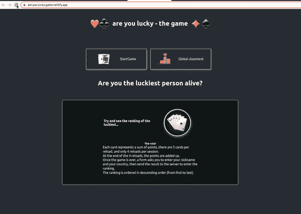

你可以试试这个 app 这里:[https://are-you-lucky-game.netlify.app/](https://are-you-lucky-game.netlify.app/)

今天的练习包括创建一个小应用程序，每次重新加载时随机出现 5 张(或更多)卡片。

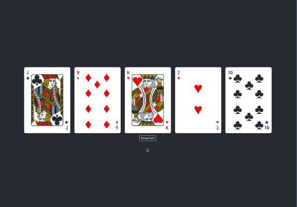

这就是我们今天要创造的。

目标是“从零开始”创建一套卡片，逻辑是无论是什么颜色的卡片，都不能有相同的号码。
我们将使用可重复使用的动态组件……
我们将动态创建卡片、数字(每种颜色 10 个)和图形(每种颜色 4 个)。

我们走吧...

首先使用以下命令创建一个 react 应用程序

```
npx create-react-app random-playing-card
```


然后，我们在/src 中创建两个文件夹。
组件和挂钩…

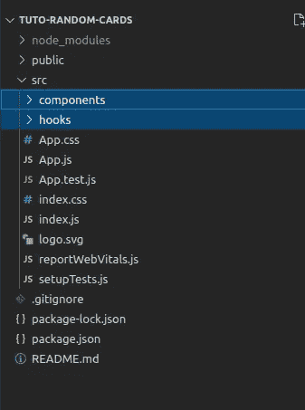

让我们首先在/src 文件夹根目录下创建一个 data.js 文件。

代码解释:
这个文件中有三个对象数组，

*   第一个包括数字(数字从 1 到 10，然后是数字 11、12 和 13……)
*   第二个包括颜色(红色和黑色)。
*   第三，每个家庭的象征。

好了，现在让我们创建一个可重用的组件 Card.js

这个组件在 props 中有 4 个参数

```
{ number, color, symbol, name }
```

有一个 div 表示地图，然后在里面有另一个 div 表示卡片的内容。

```
<div className="card-container">      
  <div className={`card-content__inner ${name}`}>
  </div>
</div>
```

卡片的左上方，

```
<div className={`card-content-inner__border-top ${color}`}><div className="top-symbol "><p>{number}</p><span className="top-symbol-sigle">{symbol}</span></div><div /></div>
```

在卡片的中央

```
<div className={`card-content-inner__center grid-${number} ${color}`}>{[...Array(Number(number))].map((_symb, index) => {index += 1;return (<span className="centerCard" key={index}><span className="center-symbol-sigle">{symbol}</span></span>);})}</div>
```

我首先用变量{name}使我的类动态化，以便容易地识别元素，{color}使元素的颜色动态化。我通过实现类“grid-${number}”来动态创建内容布局，这个类对于组织符号的位置非常重要。
然后我构建一个数组，用 number 变量的值作为元素的数量，并在上面映射，
在每次迭代中，我增加元素的索引，最后，我返回符号。

卡片的右下方，

```
<div className={`card-content-inner__border-bottom ${color}`}><div /><div className="bottom-symbol "><span className="bottom-symbol-sigle">{symbol}</span><p>{number}</p></div>
```

完整的 Card.js 组件代码

所有样式的 css 文件是:

先用“硬变量”修改 App.js 文件的内容…

好了，让我们测试一下我们的组件，看看是否一切正常！

结果是:

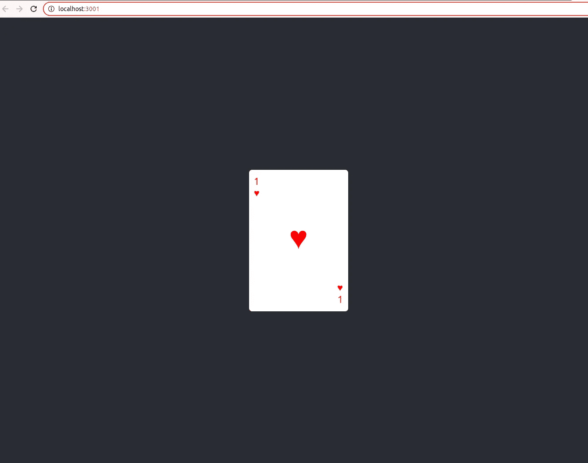

如你所见，它非常有效。

现在，为了使卡片的数量也是动态的，我们将创建另一个组件，命名为 CardWrapper.js

代码解释:
这个组件接受一个类似 props { cardsNumber }的参数，代表我们要在屏幕上显示的卡片数量。

```
{[...Array(Number(cardNumbers))].map((_numb, index) => {index += 1;return <Card key={index} symbol="♥" color="red" number={index} />;})}
```

在包装器中，我们再现了与前面 Card.js 组件相同的逻辑，我动态创建了一个数组，迭代次数为变量 cardNumber 中包含的数字。我在每一次迭代中增加我的索引…
然后我返回我的 Card 组件，并把元素的索引作为数字，这将使这个阶段的结果动态化一点。

现在让我们修改 App.js 文件来测试我们的包装器！

我将迭代次数设置为 5 张牌。

这一步的结果是:

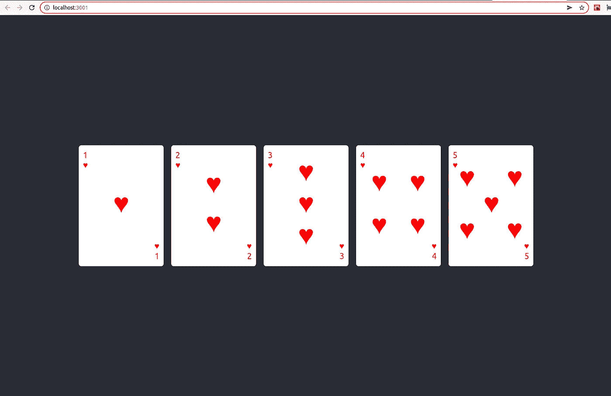

好了，一切正常，下一步…

让我们稍微修改一下 CardsWrapper 组件，使符号随机开始这一步。

发生了什么变化:

首先，我从之前创建的文件中导入我的数据…

```
import { colors, symbols } from "../data";
```

然后，在索引增量之后，我在迭代周期中创建一个随机变量。

```
const randomSymbols =symbols[Math.floor(Math.random() * symbols.length)];
```

最后，我为族颜色实现了一个条件，并用我的随机变量的结果替换前面的固定符号。

这个数字现在仍然是索引！

```
<Cardkey={index}name={randomSymbols.name}color={randomSymbols.name === "spade" || randomSymbols.name === "club"? `${colors[1].color}`: `${colors[0].color}`}symbol={randomSymbols.symbol}number={index}/>
```

这一步的结果是:

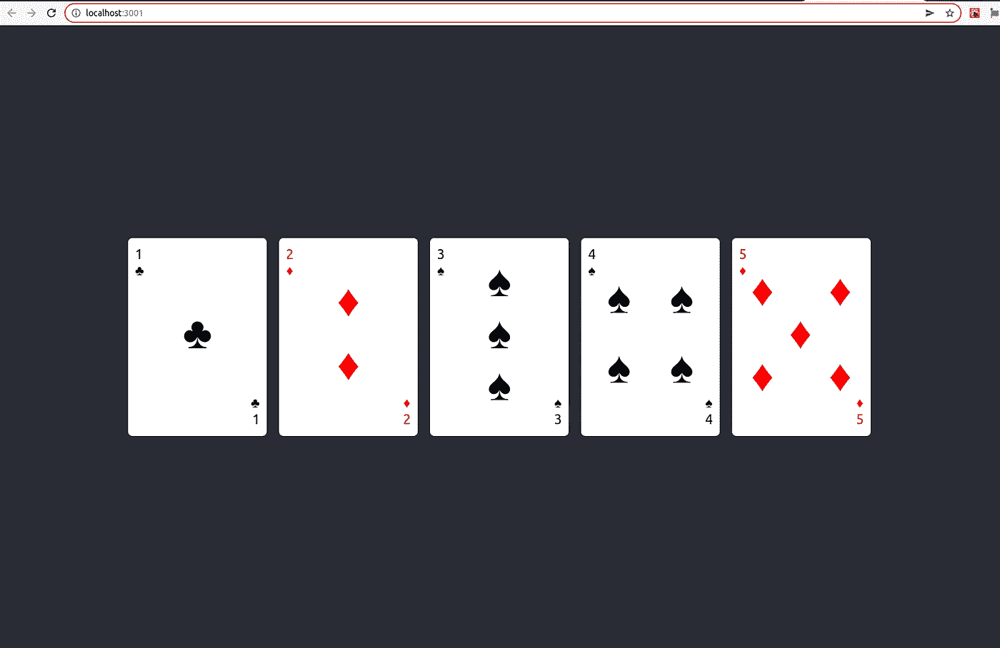

一切正常…下一个！

现在，我们将为随机卡号…
创建一个自定义挂钩，要求一个号码不能重复两次，不管是什么颜色。

代码解释:

这个函数从 data.js 中的数字数组(本例中是 MyArray 参数)中取出一个随机数，检查这个数字是否出现过一次以上，然后返回 my 数组的值。

为了，让我们通过集成我们的定制钩子来修改我们的 CardsWrapper 组件。

发生了什么变化:

我用变量 randomValueFromArray 导入我的自定义钩子…

```
const { randomValueFromArray } = useRandomValueFromArray();
```

然后我用我的随机值修改卡片组件的数值。

```
number={randomValueFromArray(numbers).number}
```

让我们看看这个阶段的结果:

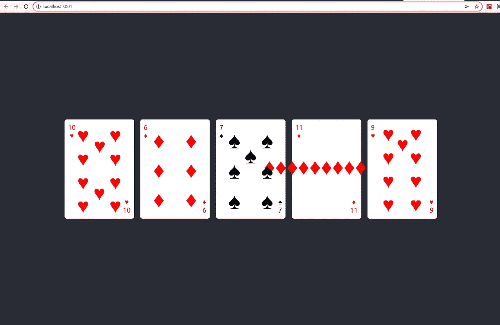

所有工作，但是…

好的，如你所见，数字和随机颜色都工作正常…
然而，在应该有数字(数字 11)的地方有一个错误！

这是正常的，我们需要在我们的 Card.js 组件中实现这部分。

我们开始吧！

你必须首先去获取每个图的 jsx 组件，到这里:

[](https://github.com/rodolphe37/random-playing-card-tuto/tree/main/src/components/figureComponents) [## 随机-扑克牌-tuto/src/components/figure 主组件…

### repo for the random playing card tutorial with react . js-random-playing-card-tuto/src/components/figure components at…

github.com](https://github.com/rodolphe37/random-playing-card-tuto/tree/main/src/components/figureComponents) 

从文件夹中下载每个文件，然后将它们放在 components/figureComponents 文件夹中。

之后，在 components 文件夹中，让我们创建一个名为 FigureCardCenter.js 的组件。

在这个组件中，props { name，number }中有两个参数。

然后是一个 FigureContent 组件，它包含一个值为{number}的 switch 语句，11 表示插孔，12 表示女王，13 表示国王。

对于每个系列，switch case 中都嵌入了一个条件，该条件返回 svg(作为 jsx 组件)。
父组件返回该条件序列的结果。

然后，让我们创建一个名为 CenterCardElement.js 的新组件，在这里我们将按照随机逻辑(数字、图形、符号、颜色)对组件进行分组。

我把卡片组件的数组部分移到这个组件中，我为符号实现了一个条件(数字 1 到 10，你把符号还给我，否则什么也不做。)，然后在下面，我用条件实现数字的部分，如果数字是 11 或 12 或 13，那么你把这个部分还给我，否则…什么也不做。

然后现在修改卡组件。

我只是用这个组件替换了 Array.map 部分(我把它移到了我们刚刚创建的组件中)。

```
<div className={`card-content-inner__center grid-${number} ${color}`}><CenterCardElement number={number} symbol={symbol} name={name} /></div>
```

好吧，我们来测试一下。

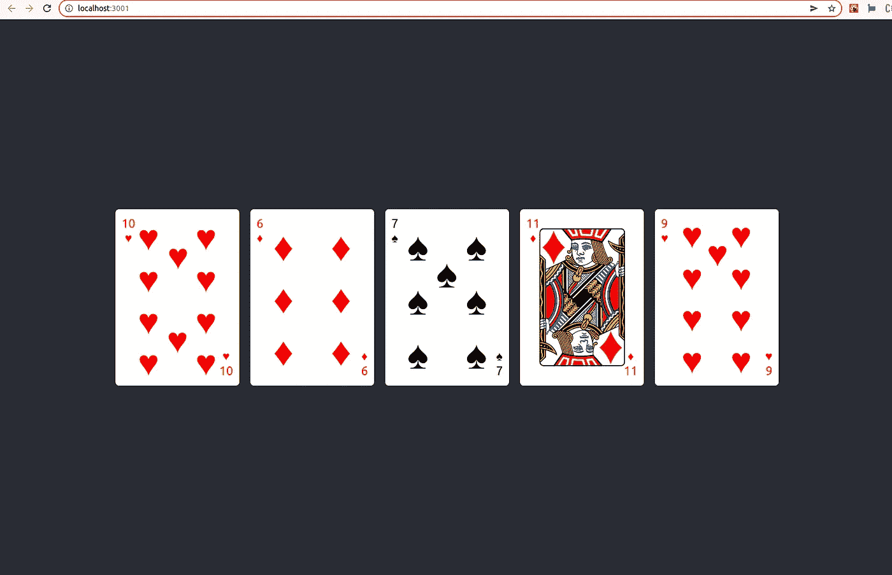

好的，一切正常…只是有一点小细节！

如你所见，之前的 bug 已经修复…
另一方面，插孔的数字 11…并不是真的…
让我们现在处理它。

对于这一步，我们将创建一个新的组件，我们称之为 BorderCardFigureConditions.js

这个组件非常简单，它接受参数{number}，如果数字是 11，那么显示 me "J "，如果是 12，那么显示" Q "，如果是 13，那么显示" K "，否则只显示数字。

就是这样。

现在让我们修改 Card.js 组件:

发生了什么变化:

我只是把

{number}

换成了
<bordercarddiguitrices number = { number }/>用于卡片的顶部和底部。

结果是:

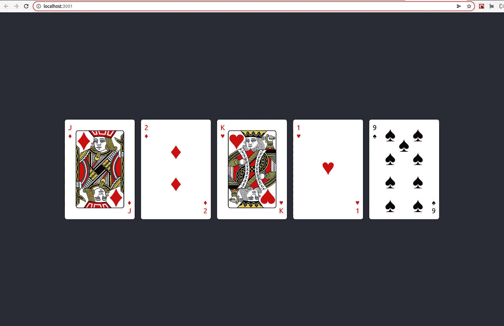

所有的工作，目标都完成了！

让我们添加最后一个修改，一个重新加载页面的按钮，以便生成一组新的随机卡片。

我刚刚补充说:

```
<button onClick={() => window.location.reload()}>Reload Cards</button>
```

最终结果:

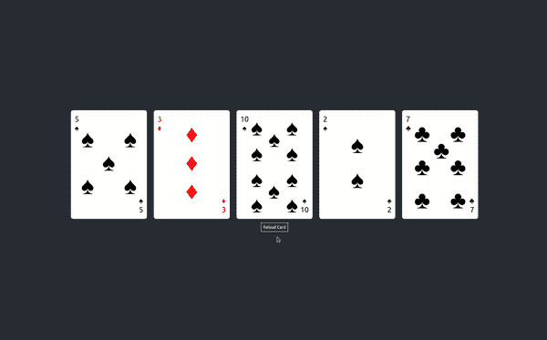

当然，如果你想要更多的卡片，你需要在你的包装卡片上写上大的数字，例如:

```
<CardsWrapper cardsNumber="10" />
```

结果是:

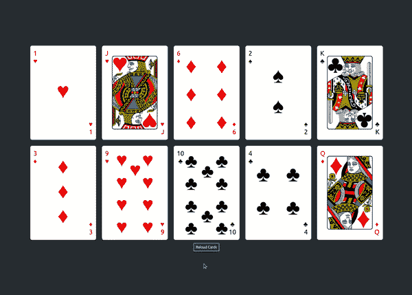

如你所见，没有一个数字在抽奖中出现两次。任务完成了。本教程到此结束。

PS:当然，由于每个家庭只有 13 种可能性(10 个数字，加上 3 个数字)，如果你放 13 张以上的牌，那么几张牌上永远不会有相同数字的逻辑不再成立。在这种情况下，概率不再一致。

比如这个例子:

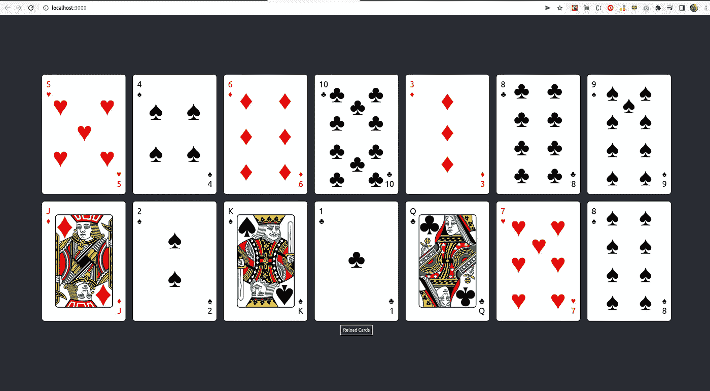

8 在这里出现了两次。

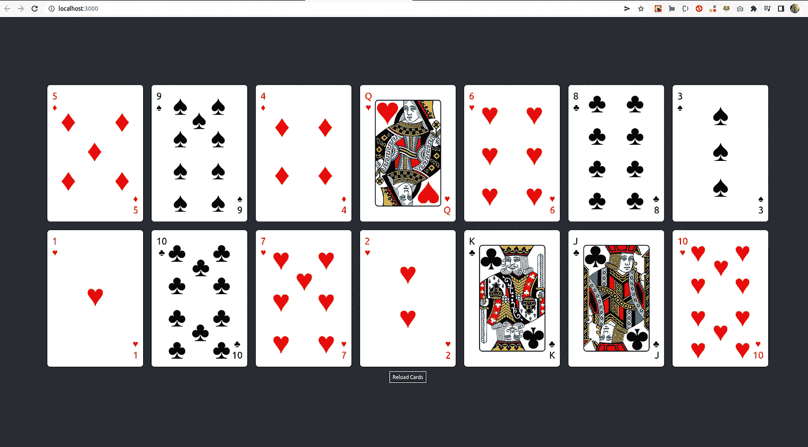

这里，10 出现了两次！

您可以在此处找到本练习的完整代码:

[](https://github.com/rodolphe37/random-playing-card-tuto) [## GitHub-rodolphe 37/random-playing-card-tuto:Repo for the random playing card tutorial with…

### Repo for the random playing card 教程用 react . js-GitHub-rodolphe 37/random-playing-card-tuto:Repo for the…

github.com](https://github.com/rodolphe37/random-playing-card-tuto) 

下一期 React.js 教程再见。

第 2 部分的链接—每张卡的积分逻辑和累积分数的所有积分:

[](https://medium.com/@rodolphe.a_97435/react-js-tutorial-how-to-implement-a-shuffle-card-game-from-scratch-part2-198dc972023c) [## React.js 教程:如何从头开始实现洗牌游戏(第 2 部分)。

### 对于这一部分，目标是实现一个点原则。

medium.com](https://medium.com/@rodolphe.a_97435/react-js-tutorial-how-to-implement-a-shuffle-card-game-from-scratch-part2-198dc972023c)