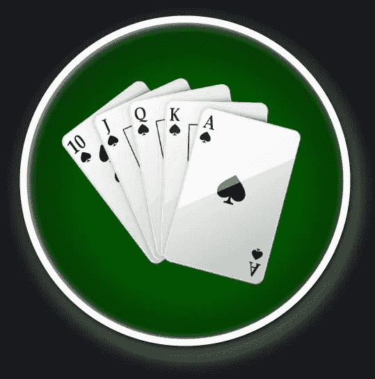
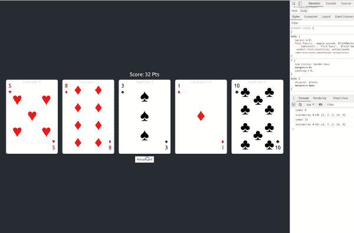
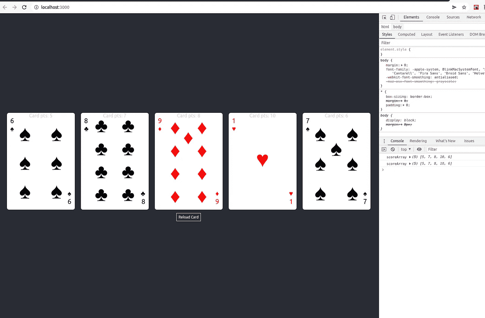
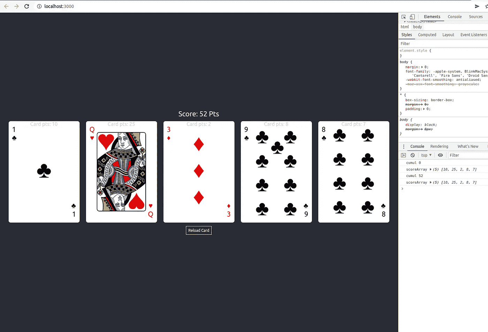
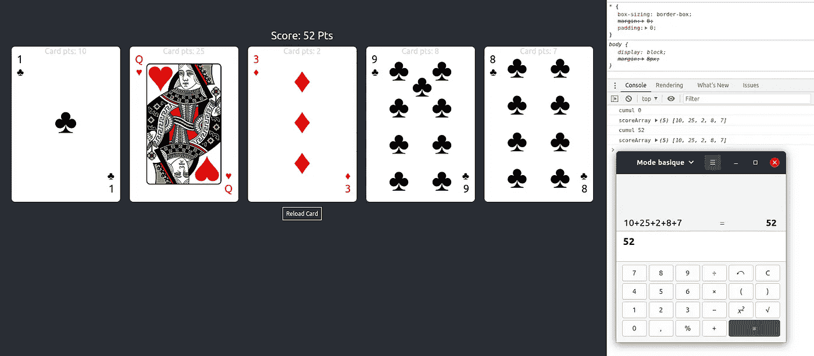

# React.js 教程:如何从头开始实现洗牌游戏(第 2 部分)。

> 原文：<https://blog.devgenius.io/react-js-tutorial-how-to-implement-a-shuffle-card-game-from-scratch-part2-198dc972023c?source=collection_archive---------6----------------------->



对于这一部分，目标是实现一个点原则。

*   每张牌代表一组点数，
*   每次抽签后，所有的分数都加起来...
*   总数会实时显示在屏幕上。

我们今天要开发的东西！



第一步-最终代码源代码的链接在此处:

[](https://github.com/rodolphe37/random-playing-card-tuto/tree/step1-final) [## GitHub-rodolphe 37/第一步随机出牌-tuto-最终

### repo for the random playing card tutorial with react . js-GitHub-rodolphe 37/random-playing-card-tuto at step 1-final

github.com](https://github.com/rodolphe37/random-playing-card-tuto/tree/step1-final) 

好，那么让我们继续发展…

首先，转到 data.js 添加一些分数键值对。

合成:

ace 为 10 分，2 为 1 分，3 为 2 分，4 为 3 分，5 为 4 分，6 为 5 分，7 为 6 分，8 为 7 分，9 为 8 分，10 为 9 分，杰克为 15 分，皇后为 25 分，国王为 50 分。这些只是任意值，你可以选择你想要的。

让我们进入 CardsWrapper.js 文件添加 scoreArray 作为状态，并与<card>组件共享它。</card>

有什么变化？

我在状态中添加了 scoreArray

```
const [scoreArray] = useState([]);
```

然后我添加了一个 console.log 来检查这个值是否真的是卡上的值…

```
useEffect(() => {console.log("numberArray", scoreArray);}, [scoreArray]);
```

在我的迭代周期(映射)中，在变量{randomSymbols}下，我声明了一个变量{randomValueArray}，它表示整个对象(id、数字和分数)

```
const randomValueArray = randomValueFromArray(numbers);
```

然后我改变了<card>组件的所有道具，除了颜色和符号。</card>

```
<CardcardsNumber={cardsNumber}scoreArray={scoreArray}randomValueArray={randomValueArray}name={randomSymbols.name}numberArray={randomValueArray}
```

注意两个道具{ number array } & {randomValueArray}取同一个变量{ randomValueArray }，这是在卡片组件里做一个 id 比较……对了，我们去那个组件。

有什么变化？

新道具已经导入。

```
numberArray,color,symbol,name,randomValueArray,scoreArray,cardsNumber,
```

生命周期(添加了 useEffect)

从 react 18 开始，useEffect 钩子的行为发生了变化，结果是使用了一个小技巧，使得组件只渲染一次。

```
const isMounted = useRef(false);useEffect(() => {if (!isMounted) {return;}isMounted.current = true;if (numberArray.id === randomValueArray.id &&scoreArray.length < Number(cardsNumber)) {scoreArray.push(randomValueArray.score);isMounted.current = false;}}, [isMounted, scoreArray, numberArray, randomValueArray, cardsNumber]);
```

这是我们进行比较的地方，以条件的形式。
如果数字的 id 与 randomValueArray 对象的 id 相同，并且如果 scoreArray 的长度小于 cardsNumber(屏幕上卡片的数量)，那么我将每张卡片的分数压入为此创建的数组中。

然后，我将 ref 的当前值设置为 false

```
if (numberArray.id === randomValueArray.id &&scoreArray.length < Number(cardsNumber)) {scoreArray.push(randomValueArray.score);isMounted.current = false;}
```

我添加了一个包含卡片分数的

标签。

```
<pstyle={{position: "absolute",width: "14rem",textAlign: "center",color: "lightgrey",}}>Card pts: {randomValueArray.score}</p>
```

并且，用 randomArray.number 替换所有的数字道具(记住，这是我现在发送的对象，而不只是像以前那样的数值)

```
//Change this:
number={number}//by this
number={numberArray.number}
```

现在来看看结果。



[5，7，8，10，6]，都没问题。

如您所见，每个地图上的点(顶部，浅灰色)与控制台返回的值一致。一切按预期运行。

对于第 2 部分的最后一步，还有一个组件，它累积每张卡片的分数并返回结果给我…

让我们来创造吧！

在/src 文件夹中创建一个组件，我们称之为 Cumulator.js

该组件将一个参数 scoreArray 作为参数。

然后创建一个 ScoreFinal 状态及其 setter。

让我们创建一个 useEffect 来为组件创建一个生命周期。

在这个 useEffect 中，我声明了一个变量，它表示这个数组中包含的所有值的总和。
(reduce 方法非常适合这种操作)，
然后我用这个总数来设置我的状态。

最后，在返回中，我用一个标签返回最终分数。

最后，在 CardWrapper.js 文件中返回。

有什么变化？

我只是用道具{scoreArray}加上了<cumulator>组件……就这样。</cumulator>

```
<Cumulator scoreArray={scoreArray} />
```

这部分的最终结果是:



用计算器验证:



好了，一切正常…这部分结束了。

这一步 github repo 的链接:

[](https://github.com/rodolphe37/random-playing-card-tuto/tree/step-2-final) [## GitHub-rodolphe 37/随机出牌-tuto 在第二步-最终

### 在步骤 2-final 用 react . js-GitHub-rodolphe 37/random-playing-card-tuto 回购随机扑克牌教程

github.com](https://github.com/rodolphe37/random-playing-card-tuto/tree/step-2-final) 

接下来的时间再见…

第 1 部分的链接:

[](https://medium.com/@rodolphe.a_97435/react-js-tutorial-how-to-implement-a-shuffle-card-game-from-scratch-c994277d38b3) [## React.js 教程:如何从零开始实现一个洗牌游戏。

### 今天的练习包括创建一个小应用程序，每次重新加载时随机出现 5 张(或更多)卡片。

medium.com](https://medium.com/@rodolphe.a_97435/react-js-tutorial-how-to-implement-a-shuffle-card-game-from-scratch-c994277d38b3)