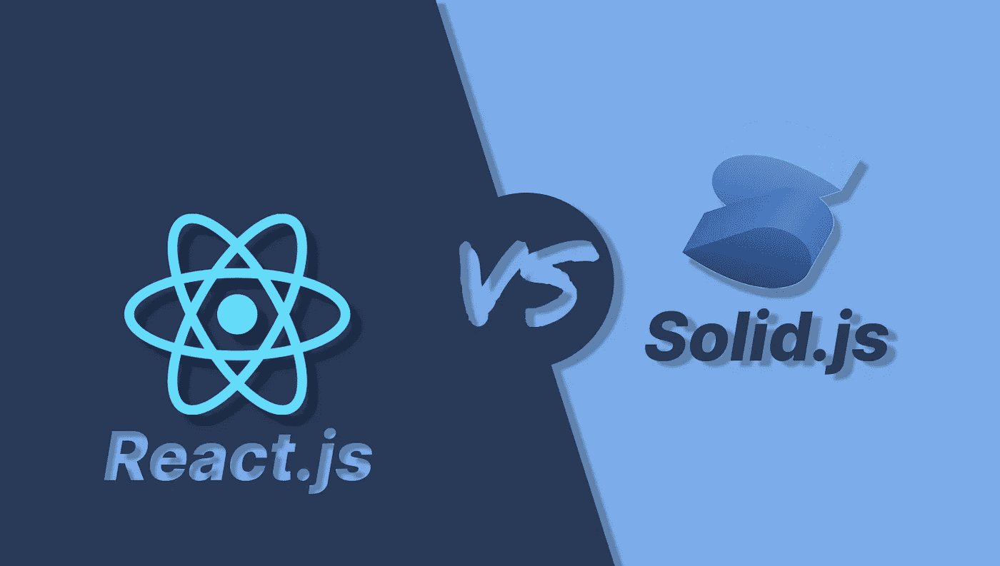
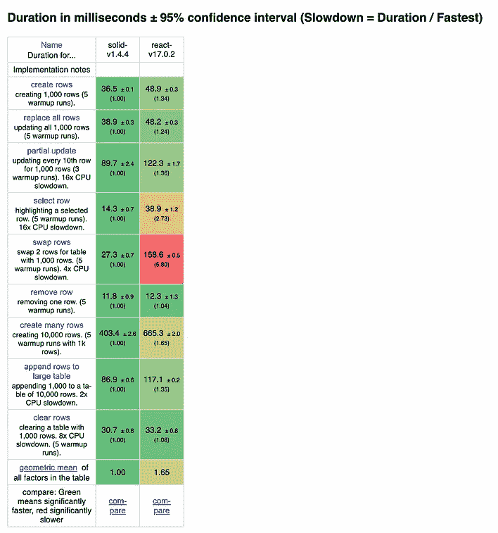
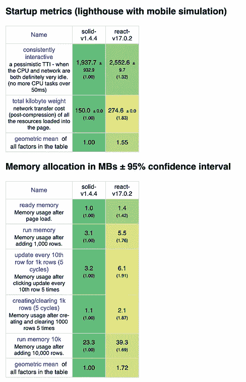

# React.js VS Solid.js，作为初学者应该学哪个？

> 原文：<https://blog.devgenius.io/react-js-vs-solid-js-as-a-beginner-which-should-you-learn-fcb34653defe?source=collection_archive---------1----------------------->

## 作为初学者，哪个框架对你的开发之旅帮助最大？

作为第一次接触 javascript 前端框架的初学者，你可能会想知道一些事情，比如，哪一个是最快的，哪一个是最常用的，哪一个更容易学习或者哪一个赚得更多。好吧，如果你想知道类似的事情，你偶然看到这篇文章是件好事，因为我们将讨论 Solid.js 和 React.js 哪个框架最适合初学者，并回答你可能会有的一些问题。

由于这是一篇初学者的文章，我将对一些在谈论前端框架时使用的术语做简短的解释。请记住，我们不会讨论任何高级的东西，比如水合方法、服务器端渲染、差分算法、粒度等。

*   **DOM** :文档对象模型(Document Object Model)是 HTML 文档的 API，它定义了文档的逻辑结构以及访问和操作文档的方式。
*   **JSX/TSX** :这分别是 javascript 和 typescript 的语法扩展。你会经常看到它们，尤其是在包含 React.js 或 Solid.js 代码的代码库中。具有。jsx 或者。tsx 文件扩展名将包含 JSX 或 TSX 代码。
*   **虚拟 DOM(VDOM)** :这是存储在内存中的 DOM 的表示，由 React.js 这样的库创建，它通过使用 diffing 算法与真实 DOM 同步。
*   **Diffing** :这是一种算法，它接受 2 个输入，并找出这些输入之间的差异。因为它是一种算法，不同的框架和库以不同的方式实现它，React.js 就是其中之一。
*   **组件** : React 和 Solid 有称为组件的东西，可以是可重用代码的不同部分，如导航菜单、下拉菜单、按钮、表单、助手等。你所拥有的部件的种类，取决于你自己。这两种类型的组件是函数和类组件。这只是一个简单的总结，
*   **渲染**:这是你的框架把你的代码转换成浏览器可以理解的 DOM(文档对象模型)节点的过程。

好了，现在我们已经解决了一些令人困惑的行话，让我们来谈谈你最好奇的是什么——哪一个更受欢迎或使用更广泛？

# 流行

毫无疑问，React.js 比 Solid.js 更受欢迎，因为它更老，并且是由更知名的公司/团队(即 Meta)制作的。随着 React.js 于 2013 年发布，它比 Solid.js 更受欢迎也就不足为奇了，solid . js 于 2018 年首次开源，并于 2021 年正式发布了 1.0 版本，比 React.js 年轻了大约 5 年。Meta、网飞、Airbnb、Dropbox 等公司都在使用 React.js。让 React.js 成为你学习的第一个框架根本不是一个坏主意。

如果你考虑一个框架是因为它受欢迎，我会建议你用 React.js 而不是 Solid.js，因为它提供了更多的工作机会。

注意:从现在开始，React.js 将被称为 React 或 React，而 Solid.js 将被称为 solidjs 或 Solid

# 学习曲线和发展经验

React 和 Solid 的学习曲线都相当低。对于刚从 HTML、CSS 和普通 JavaScript 训练营出来的初学者来说，它们是学习的理想前端框架，对这三者有基本的理解，掌握 React 或 Solid 应该不会超过 3 个月。

**但是**有些事情你需要记住:

*   React 有钩子，这些钩子是你在函数组件中使用的函数，为你提供只有类组件才有的特性。它们不能在功能组件之外使用，因为它们主要是为在功能组件内部使用而构建的。如果你试图在函数组件之外使用它们，你会遇到错误。
*   另一方面，Solid 拥有可以在组件内部和外部使用的原语。Solid 只有函数组件，所以你不必担心碰到类组件，也不必担心“这到底是什么？”。
*   在一个组件中存储状态时，你必须使用 useState 钩子。在 Solid 中，您必须使用 createSignal 原语或 createStore 原语。CreateStore 更多用于数组和对象，createSignal 更多用于存储数字、字符串和布尔。我敢肯定，你想知道为什么有两个东西做同样的事情，那么固体这样做，因为他们使 createStore 在这样一种方式，使用它的嵌套的东西，如对象和数组整体，使它更快，更轻，更具反应性。我不打算对此做太多的解释，但是如果你想知道更多的细节，你可以在这里找到**。**

**说了这么多，我肯定你还在想哪个更容易学，我不得不说 Solid 在这方面是最棒的。由于需要担心的事情较少，并且组件/助手使许多事情变得更容易，Solid 只是使 React 看起来像是仍处于测试阶段，我相信作为初学者，你不会想处理与测试软件一起工作的复杂性。**

**例如，Solid 有一个名为的内置组件，它有助于简化 JSX 代码中处理数组或数组内数据的复杂性。例如:**

**Solid.js**

**下面是 React 中相同代码**

**注意到 For 组件的细微差别和缺失了吗？根据你是什么样的人，你可能更喜欢在这种特殊情况下做出反应，但有了 Solid 的内置组件，很难说开发体验不好。**

**后来，一旦你开始使用更复杂的库，编写更复杂、更费力的代码，你就会遇到 React re-render 的障碍，这个障碍直到今天还困扰着全世界的开发人员。当你无数次地重新初始化某样东西时，你会发现它只是在做恶作剧，你会明白的🙃。**

**当你决定学习固体还是反应时，你会学到更多的东西。在这篇文章的最后，我会提供他们两个文档的链接，所以一旦你完成了，你可以随意阅读你选择的框架。**

# **表演**

**现在让我们来看最重要的部分，公司或初创公司在决定他们的技术堆栈之前应该考虑的部分，性能。在这一类别中没有竞争，固体打击反应了水。这里有几张照片给你一点背景**

************

**在所有这些比较中，越低越好**

**我知道这些对你们中的一些人来说可能像是胡言乱语，但是这些表格分析了每个框架执行第一篇专栏文章中的任务所花费的时间和内存。在第一张图中，你会注意到 Solid 比普通 javascript 慢 5%,而 React 慢 93%。这是一个巨大的差距。以下是查看完整表格的链接[互动结果(krausest.github.io)](https://krausest.github.io/js-framework-benchmark/current.html)**

**Solid 几乎和 vanilla JS 一样快，没有多少框架能超越它的速度。另一方面，React 用 VDOM、即使是最小的变化也要重新渲染整个组件、将长时间释放的组件保留在内存中等技术来扩充自己。Solid 做事情的方式非常不同，它只更新已经改变的东西，并尽最大努力通过懒惰的 prop 评估实时渲染和加载需要的东西，然后在不再需要它们时将其删除。换句话说，这就是所谓的消失组件方法。如果需要的话，我可以在另一篇文章中讨论这个和其他高级概念。**

**我敢肯定你可能还在问“Michael，是什么让 Solid.js 这么快？”很高兴你问了这个问题，幸运的是我已经从 Solid.js 的创始人 Ryan Carniato 那里得到了答案。他回答道:**

> **虽然 Solid 有一个用于创作的组件模型，但它对它的执行方式几乎没有影响。通过在运行时避开组件模型，Solid 能够比其他使用编译或 VDOM 来区分的库进行更有效的更新。 **—瑞安·卡尼亚托****

**你可以在 Ryan 发布的文章([Thinking Granular:solid js 是如何表现的？—开发社区👩‍💻👨‍💻](https://dev.to/ryansolid/thinking-granular-how-is-solidjs-so-performant-4g37))他对此进行了更详细的解释。**

**我们可以继续讨论固体打击在水面上的表现，但让我们继续讨论大多数人(如果不是所有人)都在思考的问题，也是最有可能在本文中找到答案的问题。**

# **工作机会**

**工作机会。成为开发人员的最终目标之一。多年来，许多公司已经将 React 集成到他们的网站、应用程序中，有些甚至集成到他们公司的整体基础架构中。直到今天，React 仍然是世界上最受欢迎和使用最广泛的框架，无论你在哪里生活或工作，无论你在哪里，你都会遇到一家公司、个人、政府机构甚至咖啡店在寻找 React 开发人员。有了 React 就有了无数的工作机会，但是请记住，有了无数的工作机会，也就有无数的人想要得到这些工作。**

**另一方面，我还没有遇到专门招聘 Solid.js 开发人员**的公司。你可能是第一个创建第一个 Solid.js 开发人员职位列表的创业公司，谁知道呢🤷‍♂️.综上所述，我非常确定这在未来会改变，尤其是考虑到开发人员每天表达的沮丧程度(我就是其中之一)🤣).****

# **社区支持和文档**

**React 社区是开发人员空间中最大的社区之一。写这篇文章的时候，React 已经 9 岁了，这并不奇怪。另一方面，Solid 成立仅 4 年多，其社区规模明显较小，但这不会永远保持不变。**

**在文档和覆盖范围方面，React 在官方文档和文档之外都有更多的文档，开发人员编写、记录和截屏了他们的应用程序、障碍、问题、里程碑或使用时的挫折。SolidJS 在网上发布了一些文章和视频，团队和创作者是社区的活跃分子。但目前还不能和 React 的相比。**

**说了这么多，请记住，Solid 和 React 非常相似，也非常不同，所以如果您遇到 SolidJS 的特定问题，您可以随时询问整个社区，因为每个人都在这里学习和成长。让你惊讶的是，一个从未接触过 SolidJS 的高级 React 开发人员可能会帮助你解决你的问题。**

**React 文档:[入门—React(reactjs.org)](https://reactjs.org/docs/getting-started.html)**

**固体文档: [SolidJS 反应式 Javascript 库](https://www.solidjs.com/guides/getting-started)**

# **结论**

**总之，如果让我来做一个推荐，我会说现在就从反应**开始。我不确定你会在何时何地看到这篇文章，也许 SolidJS 已经从 ReactJS 手中夺走了桂冠。但是从 2022 年 9 月 1 日起，React 是一个框架/库，初学者可以从普通 javascript 开始使用。只有当你完成了 React 的学习并磨练了你的技能后，我才会强烈建议你学习 Solid，因为它更有性能，有更好的开发体验，也更接近社区。****

**如果这篇文章有帮助，请留下掌声👏，分享并留下你对它的看法。如果我错过了什么或者犯了什么错误，请随时告诉我。我一直在寻找改进的方法。**

**编码快乐，祝你有美好的一天，✌️.**

**查看我的一些其他文章:**

** [## 使用 VelocityX 和 Sensor Plus 将视差动画添加到您的 Flutter 应用程序

### 了解在 Flutter 中使用补间动画的新方法

blog.devgenius.io](/add-parallax-animation-to-your-flutter-app-using-velocityx-and-sensor-plus-c0a832e4e12f)**