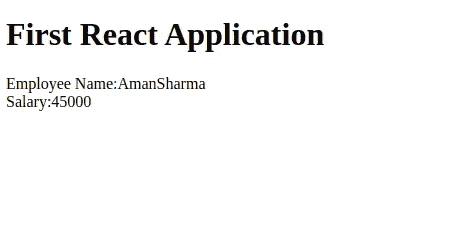

# 反应| JSX |巴别塔

> 原文：<https://blog.devgenius.io/react-jsx-babel-9e6a1dccc786?source=collection_archive---------14----------------------->


图多尔·巴休在 [Unsplash](https://unsplash.com?utm_source=medium&utm_medium=referral) 上的照片

**React:** React 是一个用于构建用户界面的 JavaScript 库React 使创建交互式用户界面变得轻而易举，为应用程序中的每个状态设计简单的视图，并且 React 将在数据发生变化时高效地更新和呈现正确的组件。

下载 [React](https://unpkg.com/react@16.13.1/umd/react.production.min.js) 和 [ReactDOM](https://unpkg.com/react-dom@16.13.1/umd/react-dom.production.min.js) 脚本，并包含这些脚本以使用 React。

**JSX:** JSX 是一种静态类型的、面向对象的编程语言，旨在运行于现代网络浏览器上。JSX 为我们提供了将 HTML 和 Java 脚本一起编写的条款。

**Babel:** Babel 是一款帮助你用最新版本的 JavaScript (JSX)编写代码的工具。当您支持的环境本身不支持某些功能时。

Babel 将帮助您将 jsx 代码转换为 js。

```
function abc()
{
 const a=<h1>You always pass failure on the way
to success.</h1> 
}
```

巴别塔会把这段代码转换成。

```
function abc() {
  const a =React.createElement("h1", null, "You always pass failure on the way to success.");
}
```

**巴别塔配置**

创建文件夹结构/react/jsx 并移动到 jsx 文件夹。

```
mkdir react
cd react
mkdir jsx
cd jsx
```

**巴别塔安装**

让我们运行命令来安装 babel-cli。

如果你是 windows 用户，你可以忽略 sudo。

```
sudo npm install babel-cli
```

让我们运行命令来安装 babel-preset-react

```
sudo npm install babel-preset-react
```

现在安装插件将 JSX 转换成 JavaScript。

```
sudp npm install babel-plugin-transform-react-jsx
```

现在我们都设置好巴别塔了，让我们检查一下它是否工作正常。

让我们用 jsx 创建第一个例子。

创建文件

/react/jsx/src/first jsx example . jsx

```
class Employee extends React.Component
{
constructor(props)
{
super(props);
this.state={"firstName":this.props.firstName,"lastName":this.props.lastName,"salary":this.props.salary};
}
render()
{
return (<div> 
Employee Name:{this.state.firstName+this.state.lastName}<br></br>
Salary:{this.state.salary}<br></br>
</div>);
}
}
class Company extends React.Component
{
constructor(props)
{
super(props);
}
render()
{
return(<Employee firstName="Aman" lastName="Sharma" salary="45000" />);
}
}
```

现在运行命令将 jsx 代码转换成 js。

```
..\node_modules\.bin\babel --plugins transform-react-jsx [jsxFilePath] -d [pathToJsFile]
```

就我而言

jsxFilePath:/react/jsx/src/first jsx example . jsx。

pathToJsFile:/Tomcat 9/web apps/first reactapp/react js/first jsxexample . js

babel 生成的输出文件是:

```
class Employee extends React.Component {
  constructor(props) {
    super(props);
    this.state = { "firstName": this.props.firstName, "lastName": this.props.lastName, "salary": this.props.salary };
  }
  render() {
    return React.createElement(
      "div",
      null,
      "Employee Name:",
      this.state.firstName + this.state.lastName,
      React.createElement("br", null),
      "Salary:",
      this.state.salary,
      React.createElement("br", null)
    );
  }
}
class Company extends React.Component {
  constructor(props) {
    super(props);
  }
  render() {
    return React.createElement(Employee, { firstName: "Aman", lastName: "Sharma", salary: "45000" });
  }
}
```

现在，我们已经为创建 React 应用程序做好了准备。

在你的应用文件夹中创建一个 HTML 文件，比如 index.html

```
<!Doctype html>
<html lang='en'>
<head>
<script src="reactjs/react.production.min.js"></script>
<script src="reactjs/react-dom.production.min.js"></script>
<script src="js/firstJSXExample.js"></script>
<script>
window.addEventListener('load',function()
{
let container=document.getElementById("main-container");let element=React.createElement(Company);
ReactDOM.render(element,container);
});
</script>
</head>
<body>
<h1>First React Application</h1> 
<div id='main-container'></div>
</body>
</html>
```

如果一切顺利，您将在浏览器中看到以下内容:



谢谢你，

悉达多·乔哈里