# 使用交叉点观察器对延迟加载图像做出反应

> 原文：<https://blog.devgenius.io/react-lazy-load-images-using-intersection-observer-60b6cc8790ff?source=collection_archive---------1----------------------->


# 举例。

1.  你有 4 个大的高清图像。
2.  你想优化它们。

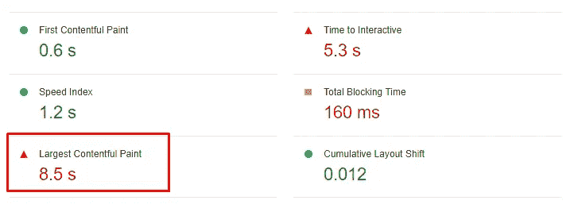

## 阅读前:

1.  我使用 Next.js 和 React
2.  默认情况下，分数比你看到的要低。
    **为什么？** 因为 Next.js 默认优化图片。

# 1.制作基本布局

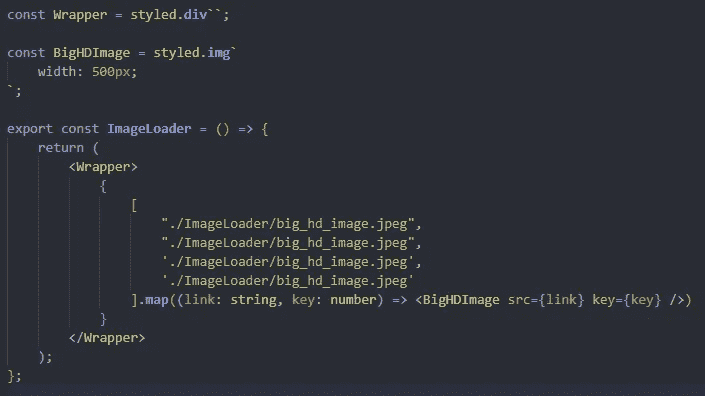

> 只是简单的布局，没有什么不同，但 Chrome 给了我很差的评级。

## 我们如何更新这个？

使用 **WEBP/AVIF** 代替 **JPEG/JPG** 或者使用 ***次世代格式*** 。那就让我们转变吧，但是你必须明白:

1.  压缩的 **WEBP** 算法比 **JPEG/JPG** 更好。
2.  **AVIF** 不是进步图像不是那个 **JPEG/JPG**

## 总之。

让我们开始吧。

# 2.准备 JPEG 到 WEBP

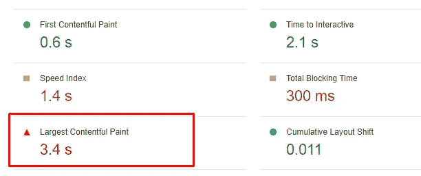

正如你所看到的，我们更新了最大内容绘制时间，但这还不是全部。

# 3.关于图像大小

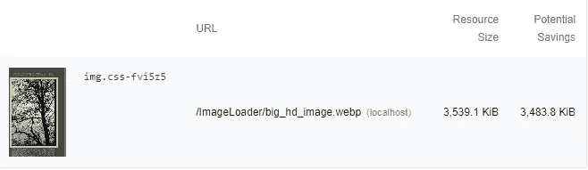

> 我们应该用图片标签来拯救 7.0784 KiB 吗？ ***是的*** *。*

## 为什么？

该算法试图将原始图像转换为 CSS 图像。

**例如**:

你的图像是 **4000px/6000px。你的 CSS 样式是 452px/435px。**浏览器获得完整图像。

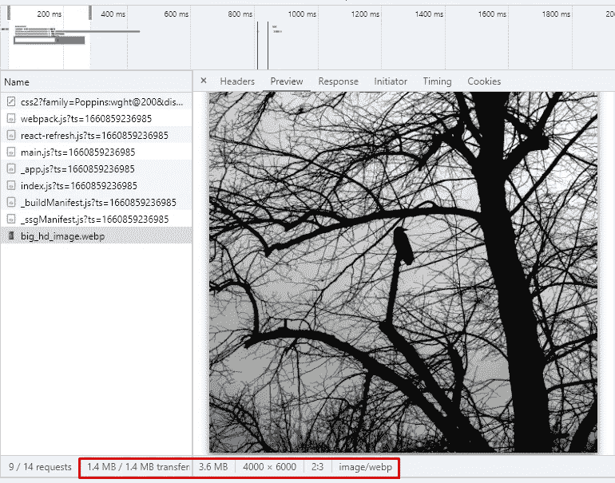

原图大小为 **3.45 MB** 。浏览器获取 **3.6 MB。**

**还有我们应该更新什么？**浏览器建议将原始图像大小更改为 CSS 样式，**但是例如**我们不能更改移动设备的徽标大小，因为我们必须在一个桌面上使用它 ***并且一个图像的大小是不好的*** 。

## 我们如何更新这个？

使用响应图像。对于这一个，我们必须使用一个**图片**标签。

# 4.制作响应图像并添加图片标签

响应图像是一种用于为当前帧/设备加载正确图像的技术。现在我要添加 ***图片/img/来源*** 标签。

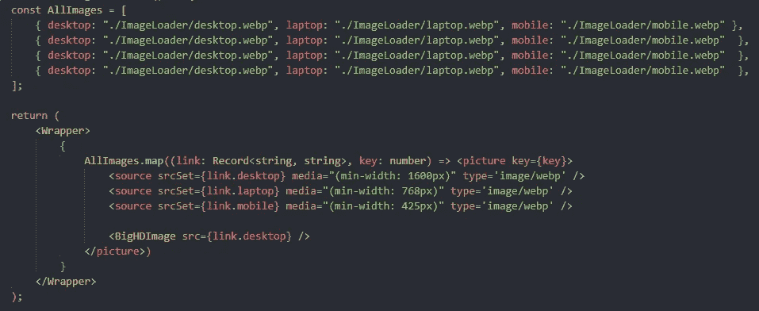

正如你所看到的，我改变了每张图片的宽度和高度。我知道我降低了图像的质量，但无论如何，在生产中- **你必须问设计师的图像。**

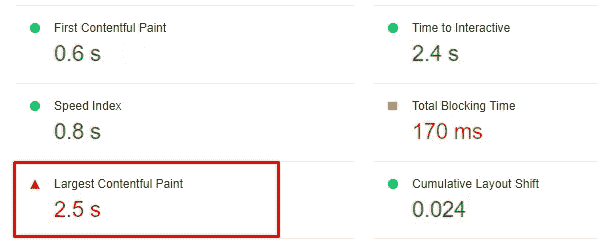

# 5.为图像添加延迟加载

在我们添加*惰性加载/交集观察器*之前——我们必须明白，使用惰性加载不会减少**最大内容绘制**时间，因为 **LCP** 是关于应用程序在性能通过加载阶段运行时的样子。

首先，我想展示我正在谈论的东西:

> 我为这个例子下载了[**react-lazy-load-image-component NPM**](https://www.npmjs.com/package/react-lazy-load-image-component)。

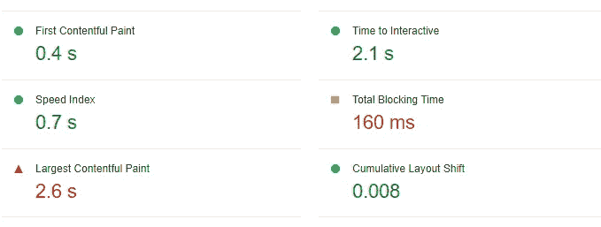

我们在项目中添加了一个 npm，但是我们不能说我们**真的更新了**我们的应用程序。*然而*，当我们有超过 3 张图片的时候**我们就能看出区别，例如**一百张，一千张在我们的应用中。

> L 让我们试着只为图像延迟加载重写这个 npm。

# 6.交叉观察者

我不会把一个 *IntersectionObserver* 作为对象来讨论，因为已经存在这个对象的 API [文档](https://developer.mozilla.org/en-US/docs/Web/API/Intersection_Observer_API)。

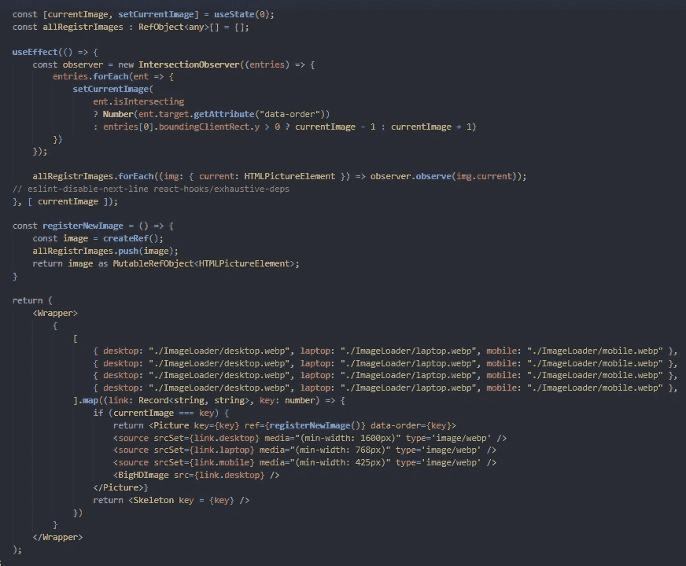

来说说我写的:

1.  **当前图像** *状态*是当前图像的 id。
2.  **all registerimages***state*是我们要与 *IntersectionObserver 绑定的所有项目的数组，*换句话说，就是当这个项目出现在用户的视口中时，我们需要隐藏和显示的所有项目。
    **我为什么要用 any？** *因为在这种情况下，我们确实不知道当前内容项是什么类型。*
3.  当我们更新***setCurrentImage***时，我们使用三元运算:
    ***a)*****is interest**布尔标志，用于定义是否是用户视口中的项目。
    ***b)*** 如果**感兴趣**为真-我们使用从*数据-订单*属性获得的当前 **id** 更新一个**当前图像**。
    ***c)*** 如果**is interest**为 false——这意味着我们从**可见项**和 [*相交项*](https://developer.mozilla.org/en-US/docs/Web/API/IntersectionObserverEntry) 看不到任何要显示的项，当这种情况发生时——我们定义下一个要显示的项。
    ***工作原理如下:***
    如果用户向上滚动- **y** 为正数，这意味着用户希望看到以前的项目并显示以前的项目:

```
const **PreviosSlide** = currentSlide — 1;
const **NextSlide** = currentSlide + 1;
```

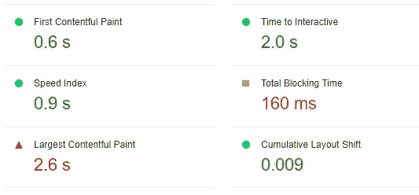

在这之后，我们创建相同的行为，就像拥有 npm 库一样。

> 不更新 ut LCP 和 TBT。

# 陷阱。

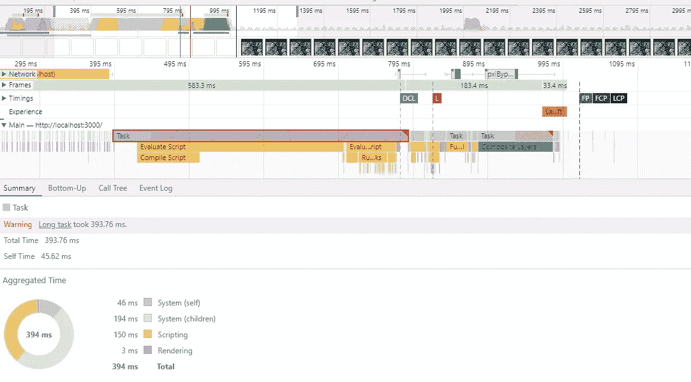

如果我们将测试我们的应用程序的性能，我们将得到一个警告: ***长任务占用了… ms.***

## 让我们深入这个案例，定义发生了什么。

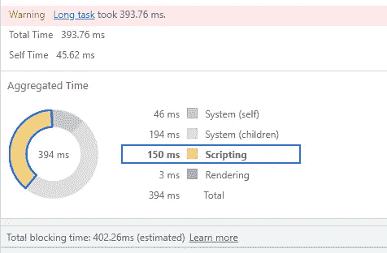

**什么是长任务？**
*长任务*——是耗时大于 50ms 的任务。在这种情况下，我们为此采用 **394ms** 。

如何才能更新**脚本**时间？

在前端- **没办法**。加载脚本时间的最大文件是我们的 WEBP 图像，但我们不能编码图像或为此更改 webpack 配置，因为 Next.js 已经这样做了。只有一个解决方案来解决这个问题- **从后端获取图像。**