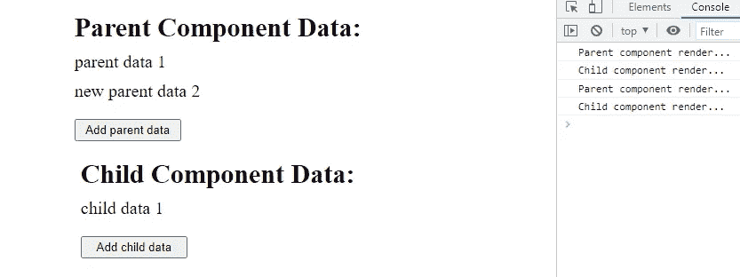
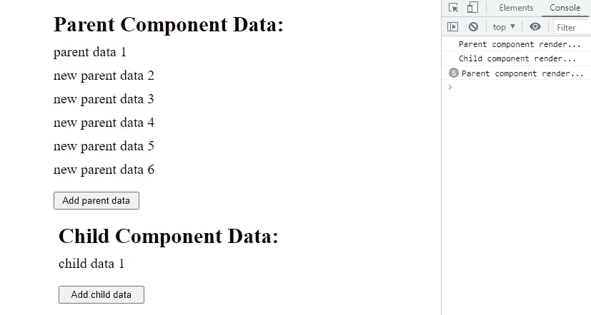
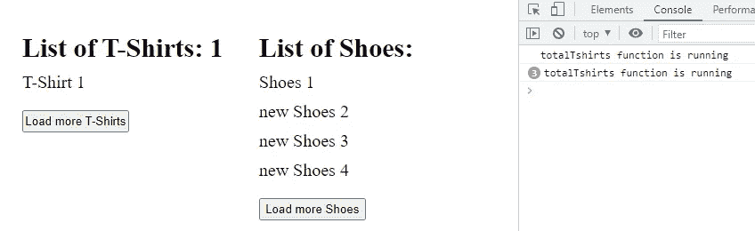
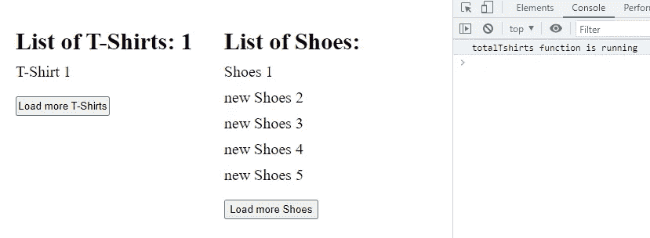

# React.memo 和 useMemo 用正确的方式解释:你应该知道这个

> 原文：<https://blog.devgenius.io/react-memo-and-usememo-explained-in-the-right-way-you-should-know-this-af10a805e620?source=collection_archive---------1----------------------->


在这篇博客中，我们将了解 **React.memo** 和 **useMemo** hook。我们将从介绍开始，然后举一些例子，看看什么时候使用哪一个。

在我们开始使用 **React.memo** 和 **useMemo** 之前，我们首先需要了解 [**什么是记忆化？**](https://rajeshi.medium.com/learn-memoization-in-javascript-to-optimize-your-code-653dc5cb36cc) 然后我们将推进记忆化的反应概念。

# 记忆入门

记忆化是一种优化技术，在这种技术中，代价高昂的函数调用的结果或输出会被缓存，以便下次使用相同的输入调用该函数时可以立即返回结果。

简单地说，我们用给定的输入运行一次函数，然后在某个地方缓存/存储它的结果。因此，下次用相同的输入调用函数时，我们只需返回存储的值，而不是再次运行整个函数。

通过不再运行整个函数，我们节省了一些计算时间，因此我们最终使我们的代码更快。点击 [**这里**](https://rajeshi.medium.com/learn-memoization-in-javascript-to-optimize-your-code-653dc5cb36cc) 可以阅读更多关于记忆化的内容

# React 中的重渲染和记忆介绍？


Pierre chtel-Innocenti 在 [Unsplash](https://unsplash.com?utm_source=medium&utm_medium=referral) 上拍摄的照片

为了更好地理解 React 中的记忆，您需要知道 React 何时重新渲染组件。

当道具或状态改变时，React 重新渲染组件。当一个组件被重新渲染时，所有的子组件也将被重新渲染。

# 重新渲染组件的问题是

重新呈现组件意味着重新呈现所有子组件，尽管子组件的属性和状态可能不会改变，它将返回与以前相同的输出。组件重新渲染经历了一个复杂的计算过程。

重新渲染子组件而不改变其属性或状态是一个性能缺陷。这会降低我们代码的性能。为了解决这个问题，React 引入了名为 React.memo 的高阶组件

# React.memo 简介

React 组件只是基于某些计算返回 JSX 的 JavaScript 函数。所以 react 为我们提供了 React.memo 来记忆组件。这防止了组件的重新渲染，并且仅在依赖项(如道具)发生变化时才允许。

# 何时记忆反应成分？

最好只在组件很重并且有一些复杂的计算要执行时才进行记忆。您不应该在每个组件中都使用内存化，因为内存化会占用内存，在某些情况下会降低性能。

# 何时不要记忆反应成分？

当组件计算不够复杂并且道具不断变化而组件不能接收相同的道具时，应该避免使用 React.memo。

# 如何在 react 组件中实现记忆化？

> 首先，让我们看一个没有实现记忆的例子。

> **App.js 组件(父级)**

> **Child.js 组件(子组件)**

> **输出**



如您所见，当我们单击“添加父数据”按钮时，它也会呈现子组件。但是子组件的道具和前面的一样。因此子组件不应再次重新呈现。

> 对子组件实现记忆

> App.js 组件将完全相同。我们只需要记住子组件。
> 
> **Child.js 组件**

> **输出**



现在你可以看到，当我们多次点击“添加父数据”按钮时，只有父组件得到重新呈现，而不是子组件。仅当页面被加载并且子组件的属性或状态被改变时，子组件才被呈现

## React.memo 的缺点

默认情况下，React.memo 对道具做了简单的比较。这意味着它只检查顶层属性是否改变。您可以添加第二个参数来自定义 props 比较。

```
React.memo(Component, [areEqual(prevProps, nextProps)]);
```

> 随着 React.memo 被排序，现在让我们转向 useMemo，看看它是什么


照片由 [TERRA](https://unsplash.com/@terra_gallery?utm_source=medium&utm_medium=referral) 在 [Unsplash](https://unsplash.com?utm_source=medium&utm_medium=referral) 上拍摄

当一个组件经历重新渲染时，组件内部声明的每个函数都会被再次执行。可能有一个计算量很大的函数，但它经常得到相同的输入，因此返回相同的输出。

在这种情况下，我们可以在组件内部记忆函数，而不是在每个组件重新渲染时执行函数，从而提高应用程序的性能。这可以通过使用 useMemo()钩子来实现。

# 什么是 useMemo 挂钩？

useMemo 钩子可以用来防止昂贵的、资源密集的函数不必要地在组件内部运行，从而导致相同的输出。

## 你需要传递两个东西来使用 Memo:

1.  需要记忆的昂贵功能。
2.  一个依赖数组，包含了你的组件中每一个在你的昂贵函数中使用的值。

```
import { useMemo } from 'react';
const value = useMemo(() => expensiveFunction(param), [param]);
```

# 如何在函数中实现 useMemo？

> 首先，让我们看一个没有实现 useMemo 的例子。

> **App.js 组件**

> 钩子组件. js

> **输出**



如你所见，当我们点击“加载更多鞋子”按钮时，totalTshirts 函数被执行，因为组件被重新渲染。在这里，我们清楚地知道，当单击“Load more Shoes”按钮时，totalTshirts 函数将给出与之前相同的输出。所以我们可以记住这个 totalTshirts 函数并优化我们的代码。

> 对 HookComponent 实现 useMemo

> App.js 组件将完全相同。我们只需要记住 HookComponent.js。
> 
> **HookComponent.js 组件**

> **输出**



现在，当我们多次点击“加载更多鞋子”按钮时，memoizedTotalTshirts 函数没有被执行，它只在页面加载时运行了一次。

# React.memo 和 useMemo 挂钩的主要区别

1.  React.memo 是一个高阶组件，用来记忆整个功能组件。
2.  useMemo 是一个 react 钩子，用来在一个功能组件中记忆一个函数。

**感谢你读到这里。我希望现在你明白了记忆在反应中的重要性。**

# 如果你想要更多这样的内容，请在媒体上关注我，并订阅我的 YouTube 频道。

# 有疑问吗？通过推特[联系我](https://twitter.com/izrajesh)