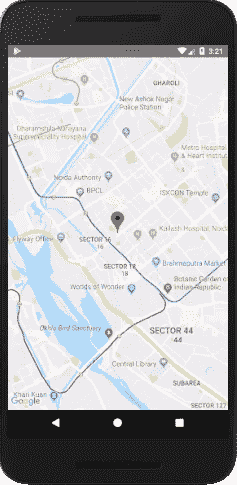
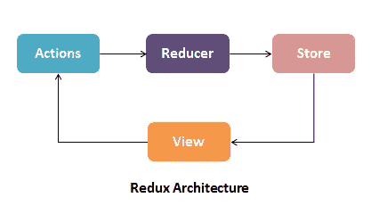
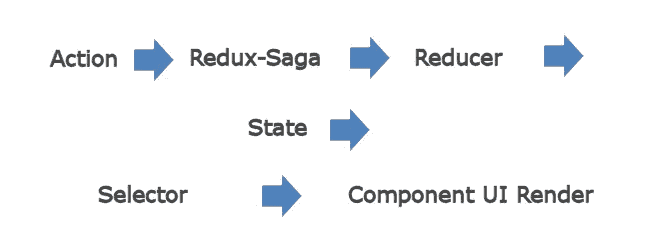

# React Native + Redux + Redux-Saga 作为应用架构。

> 原文：<https://blog.devgenius.io/react-native-redux-redux-saga-as-application-architecture-9c78af25fe63?source=collection_archive---------0----------------------->

我合作过的 Redux 和 Redux-Saga 的一些实用方面。


自从 React v16.8.0 以来，许多钩子变得可用。它简化了生活。

钩子让你不用类就可以使用更多的 React 特性。钩子为您已经知道的 React 概念提供了一个更直接的 API:props、state、context、refs(通过 id 引用访问对象)和 lifecycle。

**一、需要实施的实际任务:将 Google map 集成到 React 原生应用中。让我们看看 Android 部分。iOS 部分缺失，无法制作紧凑的文章。**



0.在 Intellij IDEA 或 Visual Studio 代码中创建新的 React 本机项目

1.  在计算机上安装 **npm** 或**纱线**并运行以下命令

**npm 安装—保存 react-native-maps**

**或纱线添加反应-原生-贴图**

2.对于 Android 版本，我们需要向 Android.manifest 添加 meta 标签

`<uses-permission android:name=”android.permission.ACCESS_COARSE_LOCATION” />
<uses-permission android:name=”android.permission.ACCESS_FINE_LOCATION” />`

`<meta-data
android:name=”com.google.android.geo.API_KEY”
android:value=”Google Api key”/>`

3.另外，需要在 Activity java 文件中正确处理 android 权限。

4.当新的 npm 库添加到项目中时，它也需要在/android/文件夹中运行一些干净的命令。在控制台中运行:

**梯度清理
npm 启动— —重置缓存**

5.我们必须使用 Axios 库的标准方式下载远程存储的数据。此外，让我们实现一个简单的循环周期，它将以 1 分钟为间隔进行更新。

6.上面的代码非常简单:它将实现逻辑和视图混合在一起。让我们在 **Redux** 和 **Redux-Saga** 的帮助下将它们分割出来。

我更愿意把 **Redux-Saga** 看作一个独立的线程，在后台模式下运行异步场景，并将结果返回给组件视图。

Redux 看起来像是一种 MVC 方法。组件是一个视图 UI，动作是一个控制器，Reducer 是一个模型(保持当前状态)，Redux-Saga 是一个后台服务。Store 就像一个状态容器，它聚集了所有的 reducers。



Redux 它只是一个支持异步方法的状态容器。当一个动作发生时，在 reducer 被调用并刷新状态后，对象发送到存储。

在异步方法的情况下，Redux 使用中间件 Redux-Saga 层。它在动作之后，但在调用 reducer 之前运行。



7.在 main.js 文件中使用 applyMiddleware 函数将`Root Saga`从 saga.js 插入到 store 中。

8.首先，我们必须定义根。将我们的发电机组合在一起(传奇故事):

Saga 实现为控制异步副作用的中间件。

Redux-saga 在 [ES6 发电机](https://developer.mozilla.org/en-US/docs/Web/JavaScript/Reference/Statements/function*)的帮助下完成。生成器是可以在必要时暂停或恢复的功能。生成器将执行代码，直到它发现**产生**关键字。

另一方面，如果您需要在外部发生某些事情(超时发生或用户操作)时取消传奇，那么使用 **yield race** 关键字是有意义的。

**yield put** 关键字告诉 Redux-Saga 应该调度该操作。

**yield take** 关键字导致 Redux-Saga 阻塞，直到指定的动作被分派。请注意，这不会阻止您的 UI 或页面上的任何其他处理。

9.现在我们定义无限循环来不时地下载数据。

10.是时候用 **Redux** 工作了。

**我们的商店将由类型、动作、减速器和可能的选择器组成。**

首先，让我们定义稍后将使用的类型:

11.动作是一个包含信息负载的对象。

动作是 Redux 存储更新的唯一信息来源。它们是 Redux 应用程序中唯一触发更改的东西，它们包含应用程序存储更改的有效负载。Reducers 根据**动作的值更新存储。键入**

12.Reducer 是一个纯粹的函数，它将应用程序和动作的状态作为参数，并返回一个新的状态。但是不改变先前的状态。

> 纯函数是没有任何副作用的函数，如果传入相同的参数，将返回相同的结果。

在缺省状态或 null 的情况下，Reducer 需要应用程序的初始状态。

因此，我们通过 GET_SUCCESS 类型定义了聚集这个调用的 reducer 部分。

13.Redux-Saga 引用了我们的存储，它调用 get state，将状态传递给我们的选择器。现在是时候编写一个 React 组件来获取数据并在地图上显示标记了。我们的任务已经完成了。

14.减速器的附加物。如果是大的实现逻辑，我们可以把它移到**选择器**中。这使得我们的缩减器小巧易读。假设我们需要过滤一些数据:


**二。其他想法。**某些物体的行为在反应原生。

1.  React 中的 Singleton:有时只运行一次函数非常有用:

`const useSingleton = (initializer) => {
React.useState(initializer);
}
const MyFunctionalComponent = () => {
useSingleton(() => {
// run only once
});
}`

2.FC -功能组件

FC 是无状态组件，没有组件生命周期。因此你不能指定一个`constructor`。

你必须扩展`React.Component`来创建一个有状态的组件，然后这个组件需要一个构造器，你就可以使用`state`。

**无状态:**

```
import React from 'react'const StatelessObject = ({title}) => (
  <div>{`${title}`}</div>
);
const [value, setValue] = useState(props.value || 0);
```

使用 **useEffect** 在 FC 中模拟构造函数。

`useEffect(() => {
// call some useful functions
}, []);`

**useEffect** hook 将旧的 React 生命周期方法 componentDidMount、componentDidUpdate 和 componentWillUnmount 组合在一起。

3.如果变量被改变了，如何通知组件？

`const myList: MyDataSource[] = [];
useEffect(() => {
console.log(‘value has been changed’);
if (myList?.data) treatData(myList.data);
}, [**myList**]); //it is a way to use it to only re-run if variable changes`

小心使用不依赖数组的效果。默认情况下，useEffect 总是在 render 运行后运行。这意味着如果你没有包含一个依赖数组，并且使用 useEffect，你可能会陷入一个无限循环。至少使用空数组[]。

有时候，数组数据并不总是更新的，我们可以用这个技巧:

除了使用 useEffect()的第二个参数数组中的数据，我们还可以使用[JSON.stringify(data)]:

`useEffect(() => {
console.log(‘value has been changed’);
}, [JSON.stringify(data)]); // Changes will be caught :) !`

4.处理地图标记行为的棘手部分。标记状态可以是活动的或不活动的。让我们改变颜色来区分点击地图。

**结论**

React Native 提供了另一个机会来创建移动应用程序，而不是使用 Flutter、Ionic、Android Java/Kotlin 或 iOS Swift。Redux 将逻辑拆分为类型、动作、缩减器和选择器，使代码更清晰，更易于单元测试。Redux-Saga 将实现逻辑作为后台进程运行。

[](https://reactnative.dev/docs/getting-started) [## 介绍反应自然

### 欢迎来到 React Native 之旅的起点！如果您正在寻找环境设置说明，他们已经…

反应性发展](https://reactnative.dev/docs/getting-started) [](https://redux.js.org/tutorials/fundamentals/part-3-state-actions-reducers) [## 基础知识，第 3 部分:状态、动作和缩减器

### 在第 2 部分:Redux 概念和数据流中，我们看到了 Redux 如何帮助我们构建可维护的应用程序

redux.js.org](https://redux.js.org/tutorials/fundamentals/part-3-state-actions-reducers)  [## 读我

### redux-saga 是一个旨在使应用程序副作用(即异步的东西，如数据获取和…

redux-saga.js.org](https://redux-saga.js.org/)