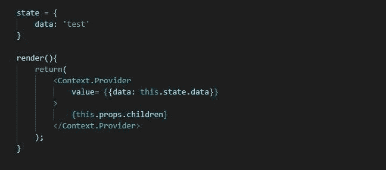

# 用上下文 API 反应本机状态管理

> 原文：<https://blog.devgenius.io/react-native-state-management-with-context-api-61f63f5b099?source=collection_archive---------0----------------------->

## 使用上下文 API 进行状态管理的快速指南。

Context API 是 React 中分离不连接组件的最佳状态管理解决方案之一。它解决了在多层组件之间通过 props 传递数据的复杂性。本文讨论了 Context API 并实现了一个使用 Context API 做移动应用的例子。完整的代码可以从[这里](https://github.com/KuWathsala/ToDoContextAPI/)取。

当我们讨论状态管理时，我们可以说 Redux 是一个很好的解决方案。你对 Redux 感兴趣吗？那么，我之前的帖子会有帮助。你可以从[这里](https://medium.com/@dkwathsala/getting-started-with-react-native-redux-479fb6e37be4)读到。

但是现在的开发者转向了上下文 API，因为它有很多好处。需要 Redux 作为状态管理工具来安装' react-redux '、' redux '和' redux-thunk '库。上下文 API 是“反应”的一部分。因此，您不希望为了状态管理过程而安装任何库。它缩小了你的包裹尺寸。

**1。什么是上下文 API？**

*上下文提供了一种通过组件树传递数据的方法，而不必在每一层手动向下传递属性。* 由[来源](https://reactjs.org/docs/context.html)

Context API 提供了一种简单明了的方法来在组件之间共享状态，而不需要 React 本身传递属性。

例如，您必须将数据从顶层组件传递到第 n 层组件。如果不使用全局状态，就必须将数据作为道具传递给每个组件，直到第 n 级组件。使用上下文 API，您可以简单地覆盖所有来自顶层组件的底层组件。

**2。上下文 API 的构建块**

我们可以将上下文 API 分为三个部分。

*上下文
提供者
消费者*

**2.1 上下文**
首先从‘React’导入 React。然后， *createContext()* 函数来自 React，它将默认值作为第一个参数。在这里可选传递一个 Java 脚本对象。单个应用程序中可以有多个上下文。

**2.2 提供者**
创建上下文后，提供者提供访问从其包装的上下文的能力。它提供了向下传递给所有组件的数据和函数。

**2.3 消费者**
消费者允许访问由提供者包装的父组件的子组件的值。它有两种类型。

1.

语境。消费者既可以使用基于类的组件，也可以使用功能组件。然而，这种方法只能在渲染中访问上下文。

2.静态上下文类型

静态*上下文类型*只能用于基于类的组件。

现在，我们用上下文 API 实现我们的示例 React 本地项目“ToDo”。项目的文件夹结构如下。

任务列表包括作为列表和删除任务的当前任务。页脚包括添加新任务功能。

**context.js**

上下文. js

**GlobalState.js**

GlobalState 将应用程序的逻辑分开保存。

全球状态. js

**TasksList.js**

TasksList.js

**Footer.js**

页脚. js

**App.js**

App.js 被 GlobalState 组件包装后，TaskList 和 Footer 就可以访问上下文了。

App.js

**参考文献**

 [## 上下文反应

### 上下文提供了一种通过组件树传递数据的方法，而不必每次都手动传递属性

reactjs.org](https://reactjs.org/docs/context.html) 

[https://academind.com/learn/react/redux-vs-context-api](https://academind.com/learn/react/redux-vs-context-api/)

[https://blog . log rocket . com/use-hooks-and-context-not-react-and-redu](https://blog.logrocket.com/use-hooks-and-context-not-react-and-redux/)x