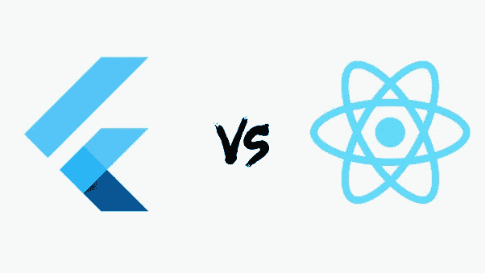

# React Native vs Flutter(跨平台框架)

> 原文：<https://blog.devgenius.io/react-native-vs-flutter-cross-platform-frameworks-313c7db8ee2f?source=collection_archive---------2----------------------->

图多尔·巴休在 [Unsplash](https://unsplash.com?utm_source=medium&utm_medium=referral) 上的照片

> 在这篇 ***文章*** 中，你将会一路走过 react native 的所有核心组件和旋舞这两个框架有什么区别。

在本文中，我们将**涵盖以下主题**:

1.  *什么是跨平台框架？*
2.  *什么是 React Native &颤振？*
3.  他们是如何在引擎盖下工作的？
4.  *颤振和反应原生的区别*
5.  *您需要为每项技术涵盖哪些技术？*
6.  有多少可用的支持？/社区等
7.  *性能统计(反应自然与颤动)。*
8.  你的下一个项目更喜欢哪个框架，为什么？

在讨论 Flutter 和 React Native 之前，我们必须了解跨平台框架，因为它们都是跨平台框架。

C

*   在各种平台上同时启动应用程序
*   更快的开发时间
*   成本节约和更短的盈利时间
*   触及更广泛的受众
*   更快更轻松的更新

## **什么是 React Native？**

*   一个开源框架，帮助您创建真实而令人兴奋的移动应用程序
*   由脸书于 2015 年开发
*   使用 Javascript 构建跨平台应用

只需学习一次，编码一次，然后 REACT 原生 app**iOS 和 Android 平台都有**

**下面给出了 React Native 的一些应用程序构建:**

*   ***脸书***
*   ***Instagram***
*   ***沃尔玛***
*   ***Skype***
*   ***特斯拉***

**还有更多…**

****

## **什么是颤振？**

*   **一个开源框架，可以轻松构建高性能、漂亮的应用程序**
*   **谷歌在 2018 年开发的**
*   **使用 Dart 编程语言构建跨平台应用程序**
*   **多平台上的代码可用性**

**从 Flutter 构建应用程序:**

*   **谷歌广告**
*   **阿里巴巴**
*   **反射地**
*   **白桦金融**

**还有更多…**

****

**React Native 和 Flutter 两个框架做了同样的事情，但是等等，有什么区别呢？迷茫？我也很困惑，但是过一会儿让我把这个弄清楚。是的，所以这两个框架的底层架构的区别以及它们如何在幕后工作。**

****

**乔恩·泰森在 [Unsplash](https://unsplash.com?utm_source=medium&utm_medium=referral) 上的照片**

## **React 本地应用的支柱/核心组件:**

**有一些核心组件/概念围绕着 react-native 架构**

*   ****Metro Bundler** :将你的整个 js 代码库打包成一个包文件**
*   ****JSCore 引擎:**支持 safari 运行 javascript 代码**
*   ****线程:** **UI 线程、Shadow 线程、JS 线程****
*   ****React Native Bridge:** 确保 b/w UI 和 JS 线程的通信**

**利用上述概念，react-native 使用 jsCore Engine 运行 JS 线程中的所有 JS 代码(业务逻辑)。UI 和 JS 线程之间的通信将由 RN Bridge 以 JSON 解析序列化的形式处理。所有的 react-native 应用程序都使用这个额外的桥梁层在线程之间进行通信，并使应用程序按照预期运行。**

****

**在上面的图表中，您可以看到，您的视图将仅部分编译为本机视图，这意味着 React Native Bridge 将仅在 react-native 视图和本机(Android，IOS)视图之间创建映射，并且该映射将在编译阶段创建。Javascript 代码将作为应用程序的一个捆绑包提供，这些代码将由 JSCore 引擎执行。**

> ****React Native 从不把你的 js 代码编译成本机代码(JAVA/Objective C)。****

## **颤振的核心概念；**

**颤振体系结构有一些核心组件/概念**

*   ****Flutter SDK:** 它是一个工具集合，允许你在一个代码库中为 Android 和 iOS 平台构建任何种类的应用**
*   ****Flutter 框架:**基本上它提供了所有预定义的 widget/widget 库，实用函数&包。**
*   ****Widgets:**flutter 里的一切都是 widget。**

****

**开发人员使用 flutter 框架来构建应用程序，Flutter 将负责一切。Flutter 提供了许多现成的小部件和实用工具，使开发变得更加容易和快速。
Flutter 需要一个来自应用程序的白色屏幕(画布),并使用自己的引擎 C++绘制每个像素。**

# **Flutter 不使用平台原语**

**这是 Flutter 和 React Native 之间的一个非常重要的区别，Flutter 不使用特定于平台的组件或原语。这意味着 flutter 提供了自己预定义的组件和部件集，Flutter 使用这些组件和部件在屏幕上进行渲染。Flutter engine 基本上使用 SKIA 引擎(C++)在屏幕上绘制小部件的每个像素。这就是颤振应用程序的高性能和平滑渲染的原因。
但在 React 原生应用中，使用平台原语来呈现 UI 组件，以获得类似 Android 或 IOS 的原生外观。**

****

## **反应自然和颤动之间的区别:**

****

# **跳进去之前要学什么？**

## **反应自然**

*   **Html，CSS，Javascript 最好是 Es6/ ES 2015**
*   **了解如何使用命令行**
*   **对 npm 及其工作原理的基本理解**

## **摆动**

*   **你必须对编程语言的面向对象模型有很好的了解**
*   **您必须了解 Dart 编程语言**
*   ****Dart 是**一种非常强大、灵活、易学的谷歌编程语言。**
*   **了解 C++/Java 是一个额外的优势，但不是强制性的！**

# **开发支持和社区！**

*   **React Native 更老，因此有一个更大的社区，到目前为止已经产生了大量现成的包和库。**
*   **Flutter 是一个相对较新的框架，越来越受欢迎。更重要的是，它的支持也在稳步增长。**

****

# **谷歌趋势**

*   **在[谷歌](https://trends.google.com/trends/explore?date=2019-01-01%202020-09-21&q=react%20native,%2Fg%2F11f03_rzbg)搜索 Flutter 的用户量超过了 React Native。这一趋势是未来增长和市场分布潜力的早期迹象。**
*   **你上市越早，你能获得的份额就越大。React Native 比 Flutter 早推出两年，这是 React Native 在跨平台开发中占据主导地位的主要原因。然而，Flutter 正走在正确的道路上，因为它的采用率正在更快地增长。Flutter 取代市场领导地位只是时间问题**

****

# **Flutter 应用程序中的内容**

****

*   **Flutter 是一个可移植的 UI 工具包，这意味着 Flutter 所依赖的一切都必须包含在 APK 文件中。所以每一次颤动都会提到这些。所以文件。**
*   **提到的。所以文件包括 **Dart 语言依赖、skia 引擎、flutter 框架、平台相关原生代码等****

# **React 本地应用程序中的内容**

****

*   **内容的主要部分是 index.android.bundle，它基本上包含了我们需要运行的所有 javascript 代码**
*   **运行应用程序，使用 JSCore 引擎，我们执行所有的 js 代码。**

# **下一个项目的首选框架？**

*   **这完全取决于需求(客户需求/项目性质)。**
*   **我无法预测哪个是最好的。**
*   **在 React Native 与 Flutter 的战斗中，没有赢家或输家。每个框架都有优点和缺点。每一个都是很好的解决方案，但是针对不同的问题。**
*   **我们可以定义一些参数或标准**

****

# ****结论****

**记住比较和所有其他的东西，我们可以说 React Native 和 Flutter 都有它们的优点和缺点，所以我们可以结束我们的讨论**

****使用颤振:****

*   **当你的应用程序在所有平台上都采用相同的设计时。**
*   **应用程序中需要大量动画。**
*   **不想更多依赖第三方包。**

****使用 REACT NATIVE:****

*   **当您的应用程序需要依赖于特定平台的本机外观和感觉时。**
*   **更加可扩展和复杂的应用程序**
*   **需要集成第三方软件包。**

**我们预测这两种技术和跨平台方法作为一个整体都有一个光明的未来。**

**嘿，我的名字是***Muhammad matti ullah***，我在过去的 2.5 年里是一名 Javascript 开发人员，现在在 react native 工作。**