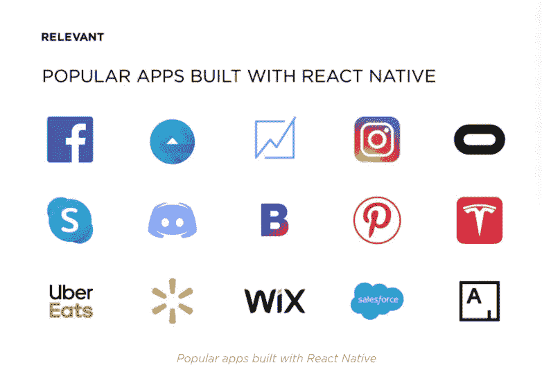
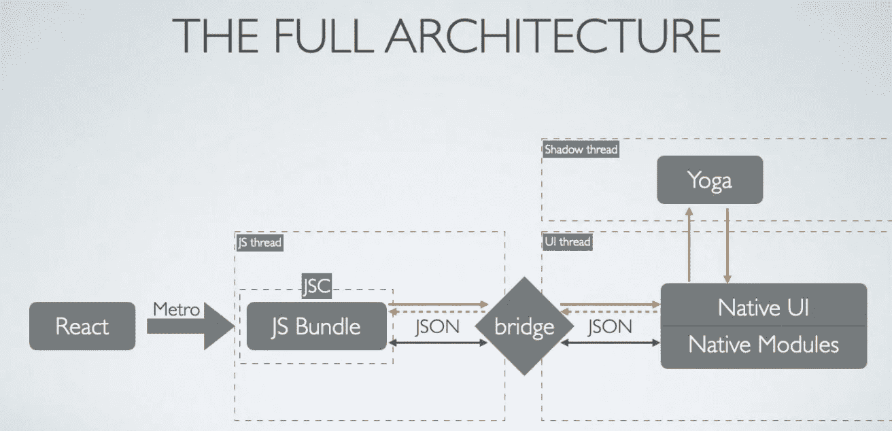
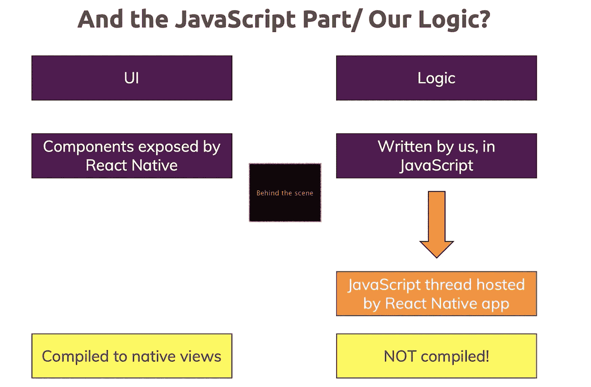

# React Native World(关于 React Native 你需要知道的一切)

> 原文：<https://blog.devgenius.io/react-native-world-all-you-need-to-know-about-react-native-bf902d80a164?source=collection_archive---------2----------------------->

> 所有的本地核心概念都集中在一个地方。

在这篇文章中，你会发现 react native 所有最重要的概念，比如它是如何工作的，react native 的架构是什么。

照片由[卡斯帕·卡米尔·鲁宾](https://unsplash.com/@casparrubin?utm_source=medium&utm_medium=referral)在 [Unsplash](https://unsplash.com?utm_source=medium&utm_medium=referral) 上拍摄

如果您是一名开发人员，并且希望开发原生移动应用程序，那么这是开始使用 react native anatomy 的合适地方。

只有当您对框架本身有了更好的理解时，您才能构建高性能的应用程序。我将简要介绍一下 react native 的所有核心概念。我们将在本文中涉及的主要概念如下:

*   什么是**反应原生**？
*   如何反应原生**作品**？
*   react native 的**架构**是什么？
*   react 原生应用中 ***原生*** 是什么意思？
*   **地铁**捆扎机的作用？
*   **节点 Js** 在 react 原生 app 中的作用？
*   JavascriptCore 引擎的作用？
*   如何反应本土**桥**作品？
*   react native 中有多少**线程**在工作？

好了，这就是我们将在本文中讨论的目录。

> 听起来不错？

[奥斯汀·陈](https://unsplash.com/@austinchan?utm_source=medium&utm_medium=referral)在 [Unsplash](https://unsplash.com?utm_source=medium&utm_medium=referral) 上的照片

先来点解释吧！

什么是**反应原生**？

eact Native 基本上使用单一代码库(即 **JAVASCRIPT** )为 android 和 IOS 平台构建应用。

*   开源框架，帮助您创建真实和令人兴奋的移动应用
*   由脸书于 2015 年开发
*   使用 Javascript 构建跨平台应用
*   只需学习一次，编码一次，然后 REACT 原生 app**iOS 和 Android 平台都有**

****从 React Native 构建应用程序:****

*   ***脸书***
*   ***Instagram***
*   ***沃尔玛***
*   ***Skype***
*   ***特斯拉***

**还有更多…**

****

**如何反应原生**作品**？**

**React Native 不会构建完整的本机代码。react native 中有关本机代码的概念是，它将只编译本机视图。所有的业务逻辑将在 JS 中保持不变，并将由 JS 引擎执行。**

**React Native 使用原生 API 渲染到特定于平台的组件:它调用 Objective-C/Swift 或 Java APIs 渲染到 iOS 和 Android 组件。这是 React Native 的一个与众不同的特性，使其有别于其他跨平台的移动应用程序开发技术，后者通常最终会呈现基于 web 的视图。**

****

**反应本地架构**

# **地铁捆扎机的作用:**

**etro 是一个 JavaScript bundler，它接受 options，一个入口文件，并返回一个包含所有 JavaScript 文件的 JavaScript 文件。每次运行 react 原生项目时，都会将许多 javascript 文件编译成一个文件。这个编译是由一个叫做 Metro 的捆绑器完成的。Metro 与节点服务器一起启动，节点服务器通过“ *npm start* 运行，我们可以在上面的图像中看到写在*绿框*中的捆绑包，它显示了每次我们运行新项目或重新加载当前项目时文件的捆绑。**

# **Metro Bundler 是如何工作的，或者说捆绑过程是如何进行的？**

**麦德龙在其捆绑过程中有三个独立的阶段**

1.  **解决方案(构建所有模块的图表，即维护依赖关系树)**
2.  **转换(将模块转换成特定于目标平台的格式)**
3.  **序列化(组合所有模块以生成一个或多个包。单个 javascript 文件)**

# **Javascript 核心引擎:**

**React Native 在 Android/ iOS 模拟器和设备上使用 JavaScriptCore(支持 Safari 的 JavaScript 引擎)。**

**默认情况下，Android 中不包含 avaScriptCore(当它在 iOS 中时)，因此 React Native 会自动在 Android 应用程序中捆绑一份 avascript core，使 Android 应用程序比 iOS 应用程序略重。**

****

**Alex Azabache 在 [Unsplash](https://unsplash.com?utm_source=medium&utm_medium=referral) 上拍摄的照片**

# **反应本机桥:**

**eact Native bridge 是一个 C++/Java 桥，负责本机线程和 Javascript 线程之间的通信。**

**在大多数情况下，开发人员会用 Javascript 编写整个 React 原生应用程序。要运行该应用程序，可通过 CLI 发出以下命令之一:“react-native run-ios”或“react-native run-android”。此时，React Native CLI 将生成一个节点打包程序/捆绑程序，该程序将 JS 代码捆绑到一个 main.bundle.js 文件中。可以认为打包程序类似于 Webpack。现在，每当 React 原生应用程序启动时，加载的第一项就是原生入口点。本机线程产生 JS VM 线程，该线程运行捆绑的 JS 代码。JS 代码拥有应用程序的所有业务逻辑。本地线程现在通过 RN 桥发送消息来启动 JS 应用程序。现在，衍生的 Javascript 线程开始通过 RN 桥向本地线程发出指令。指令包括加载什么视图、从硬件中检索什么信息等。**

# **节点 Js 在 React 本机应用程序中的作用:**

**Metro bundler 构建在 Node JS 之上，它基本上为 Metro 提供了捆绑 JS 代码的功能，您可以在设备上安装这些代码。**

# **反应本机中的线程:**

**每个 React 本机应用程序中运行着 3 个并行线程**

*   **JS 线程是所有 JavaScript 代码被读取和编译的地方，也是应用程序大部分业务逻辑发生的地方。 **Metro** 在应用被“捆绑”用于生产时生成 js 包，而 **JavaScriptCore** 在应用启动时运行该包。**
*   **本地线程负责处理用户界面。每当需要更新 UI 或访问本机函数时，它都会与 JS 线程进行通信。可以拆分成**原生 UI** 和**原生模块**。本机模块在启动时都是准备好的，这意味着蓝牙模块将总是被绑定，以备 React Native 使用，即使它不是。它只是在应用程序需要使用它的时候唤醒。**
*   ****阴影线程**是计算布局的地方。它使用脸书自己的布局引擎 **Yoga** 来计算 flexbox 布局，并将它们发送回 UI 线程。**

****

**好吧，差不多就是这样。干得好，您现在可以开始进行本地移动应用程序开发了。这就是你在 react native framework 上工作所需要了解的一切。**

**嘿，我的名字是 Muhammad Mattiullah，我在过去的 2.5 年里是一名 Javascript 开发人员，现在在 react native 工作。**