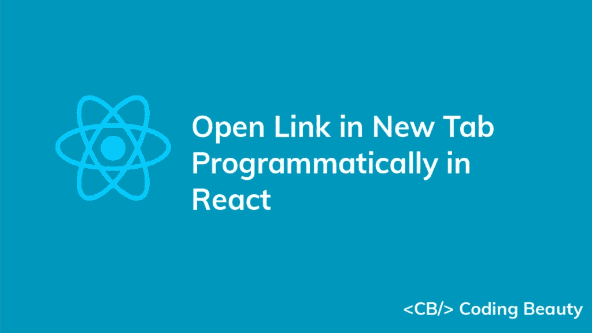
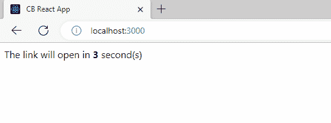
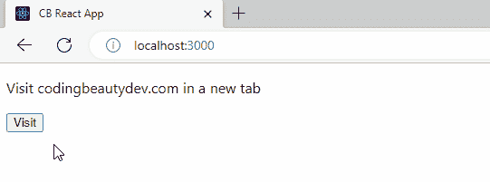

# 如何在 React 中以编程方式打开新选项卡中的链接

> 原文：<https://blog.devgenius.io/react-open-link-in-new-tab-programmatically-232824bb5694?source=collection_archive---------1----------------------->



要在 React 中以编程方式打开新选项卡中的链接，请使用链接作为参数调用`window.open()`方法，例如`window.open('https://codingbeautydev.com')`。`open()`方法将在新的浏览器标签中打开链接。

在以下示例中，我们以编程方式在倒计时结束时在新选项卡中打开链接:

`App.js`

```
import { useRef, useEffect, useState } from 'react';export default function App() {
  const [timeLeft, setTimeLeft] = useState(3);
  const interval = useRef(); useEffect(() => {
    interval.current = setInterval(() => {
      // Decrease "timeLeft" by 1 every second
      setTimeLeft((prev) => prev - 1);
    }, 1000); return () => clearInterval(interval.current);
  }, []); useEffect(() => {
    // Open the link in a new tab when the countdown ends
    if (timeLeft === 0) {
      clearInterval(interval.current); // 👇 Open link in new tab programmatically
      window.open('https://codingbeautydev.com', '_blank', 'noreferrer');
    }
  }, [timeLeft]); return (
    <div>
      The link will open in <b>{timeLeft}</b> second(s)
    </div>
  );
}
```



倒计时结束时，链接会在一个新标签页中打开。

我们使用`window`对象的 [open()](https://developer.mozilla.org/en-US/docs/Web/API/Window/open) 方法以编程方式在新标签页中打开一个链接。该方法有三个可选参数:

1.  `url`:在新标签页中打开的页面的 URL。
2.  `target`:和`<a>`元素的`target`属性一样，这个参数的值指定了在哪里打开链接的文档，即浏览上下文。它接受`<a>`元素的`target`属性接受的所有值。
3.  `windowFeatures`:以逗号分隔的窗口功能选项列表。`noreferrer`就是这些选项之一。

将`_blank`传递给`target`参数会使链接在新标签页中打开。

# 单击按钮时在新标签中打开链接

能够以编程方式在新标签页中打开链接意味着我们可以使用一个按钮来代替锚链接，从而在点击时打开一个 URL。我们只需在按钮元素上设置一个`onClick`事件监听器，并在监听器中调用`window.open()`方法。

例如:

`App.js`

```
export default function App() {
  const openInNewTab = (url) => {
    window.open(url, '_blank', 'noreferrer');
  }; return (
    <div>
      <p>Visit codingbeautydev.com in a new tab</p> <button
        role="link"
        onClick={() => openInNewTab('https://codingbeautydev.com')}
      >
        Visit
      </button>
    </div>
  );
}
```



*原载于【codingbeautydev.com】[](https://cbdev.link/0501f1)*

# *JavaScript 做的每一件疯狂的事情*

*一本关于 JavaScript 微妙的警告和鲜为人知的部分的迷人指南。*

**

*[**报名**](https://cbdev.link/d3c4eb) 立即免费领取一份。*