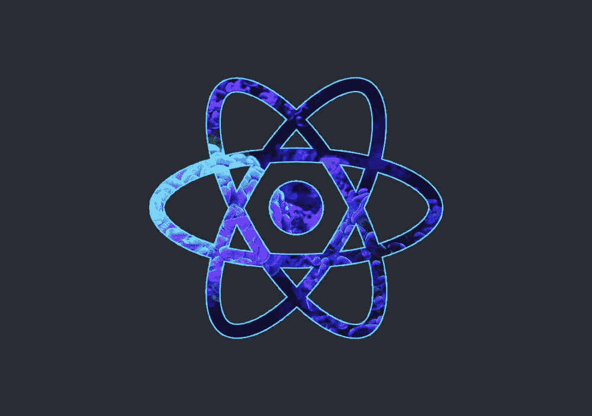
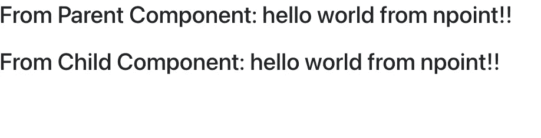
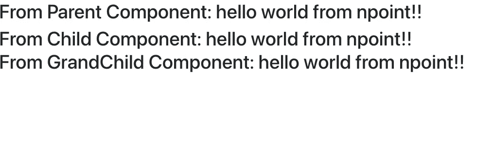

# react——将异步数据传递给子组件

> 原文：<https://blog.devgenius.io/react-passing-asynchronous-data-to-a-child-component-9fce801dd717?source=collection_archive---------1----------------------->



我记得当我还在学习 React 的基础知识时，我花了大量的时间来弄清楚如何将异步数据(例如，我们从调用 API 获得的数据)传递给子组件。因此，本文旨在尽可能直观地解释这一点，并作为我希望在过去学习这一点时拥有的文档。

# 我们的异步数据源

```
https://api.npoint.io/df2c42f9149aa832ea14
```

为了简单起见，我使用 *npoint.io* 创建了一个虚拟端点——这个端点简单地返回:

```
{"message": "hello world from npoint!!"}
```

# 我们的任务

1.  在`Parent`组件中向该端点发出 GET 请求。
2.  在`ChildComponent`组件中显示信息`"hello world from npoint!!"`(还有`Parent`用于比较)



我们的应用应该是什么样子

# 完整的代码

# 代码中发生了什么

## 1.进口材料

```
import React from "react"
import axios from "axios"
```

## 2.在父组件中发出 GET 请求

```
class Parent extends React.Component {

    state = {message: "default message"} componentDidMount() {
        const url = "[https://api.npoint.io/df2c42f9149aa832ea14](https://api.npoint.io/df2c42f9149aa832ea14)"
        axios.get(url)
            .then((response) => {
                this.setState({
                    message: response.data.message
                })
            })
        } // other stuff
}
```

在这里，我们首先定义我们的`state`。然后，我们使用`axios`库向我们的端点发出一个 HTTP GET 请求。请注意，我们接收的数据是异步的。

一旦我们收到响应，我们将`state.message`设置为`response.data.message`，也就是`"hello world from npoint!!"`。至此，`state`将为`{message: "hello world from npoint!!"}`。

## 3.使用 render()函数显示消息

```
class Parent extends React.Component { // stuff render () {
        return <div>
            <h1>From Parent Component: {this.state.message} </h1>
            <br/>
            <ChildComponent message={this.state.message} />
        </div>
    }
}
```

再一次，`render`函数是我们显示我们想要显示的东西的地方。在这里的`h1`元素中，我们显示我们的`state.message`。在下一行，我们将`state.message`作为道具传递给之后的`Child`组件，以便`ChildComponent`显示它。

## 4.创建我们的子组件

```
class ChildComponent extends React.Component {
    render() {
        return <h1>
            From Child Component: {this.props.message}
        </h1>
    }
}
```

在上一步中，我们将`message=this.state.message`作为道具传递给了`ChildComponent`。我们可以使用`this.prop.message`语法访问属性`message`(从`Parent`组件)。

注意:`message={this.state.message}`中的`message`在父级中，component 可以是任何其他变量，不一定是`message`。我可以做`words={this.state.message}`，只要我记得在子组件中使用`words`。

## 5.记得导出

```
export default Parent
```

此时，如果我们使用`npm start`运行我们的应用程序，我们应该会看到:


我们的应用

# Github 知识库以供参考

[](https://github.com/zlliu246/react_examples/tree/pass-async-data-to-child) [## GitHub-zlliu 246/react _ pass-async-data-to-child 示例

### 这个项目是用 Create React App 引导的。在项目目录中，您可以运行:在…中运行应用程序

github.com](https://github.com/zlliu246/react_examples/tree/pass-async-data-to-child) 

# 将异步数据从父传递到子，然后从子传递到孙

万一你们都需要这个例子——我们之前代码的一个简短扩展，但是有一个稍微不同的变量名

如果我们运行`npm start`，我们应该会看到这样的内容:



# 一些最后的话

如果符合以下条件，本条将达到其目的:

1.  您想知道如何将异步数据从父组件传递到子组件
2.  你正在与当前的网上例子作斗争(我发誓，做同样的事情有这么多奇怪的不同方法)
3.  你偶然发现了这篇文章，并设法解决了它

希望这是有用的！

# 结论

*如果这篇文章有价值，并且你希望支持我成为一名作家，请考虑注册一个 Medium 会员——每月 5 美元，你可以无限制地阅读 Medium 上的故事。如果你注册使用我的链接，我会赚一小笔佣金。*

[***点击此处无限制访问媒体***](https://zl-liu.medium.com/membership)

如果你希望在我发布时得到通知，请考虑加入我的电子邮件列表。

[](https://zl-liu.medium.com/subscribe) [## 每当 Zlliu 发布时收到一封电子邮件。

### 每当 Zlliu 发布时收到一封电子邮件。注册后，如果您还没有中型帐户，您将创建一个…

zl-liu.medium.com](https://zl-liu.medium.com/subscribe)