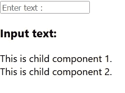
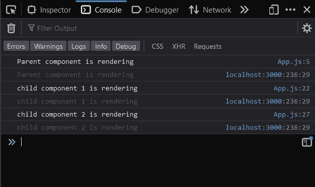
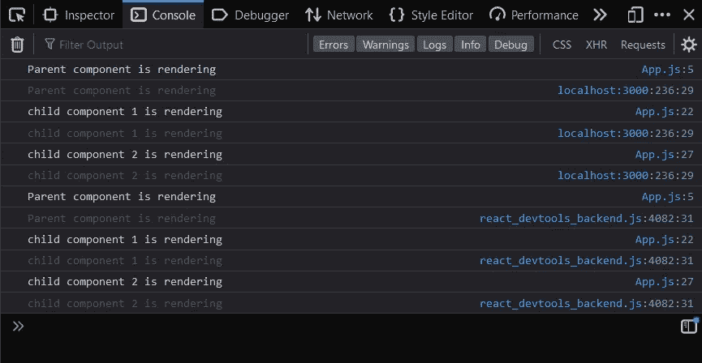
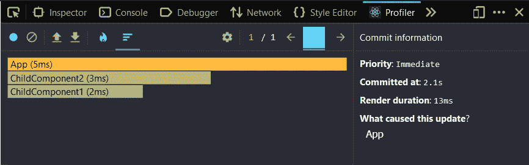
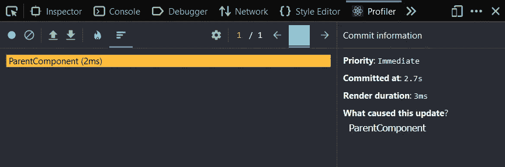

# 反应性能优化技巧

> 原文：<https://blog.devgenius.io/react-performance-optimization-tips-6f93715b9515?source=collection_archive---------23----------------------->

更好的用户体验是你第一眼看到 web 应用时所期望的第一件事。因此，优化应用程序在提高用户体验和性能方面取得了巨大的进步。

本指南将详细介绍在 react profiler 的帮助下优化 React 应用程序的技巧。React Developer tools 是我们添加到浏览器中的一个扩展，用于记录 React 组件是如何加载的。您可以从这些链接中添加适合您的浏览器的扩展名。

*   [React 谷歌浏览器开发工具(链接)](https://chrome.google.com/webstore/detail/react-developer-tools/fmkadmapgofadopljbjfkapdkoienihi?hl=en)
*   【Firefox 的 React 开发工具(链接)

# 提示 1:确定父组件中子组件的优先级

理想情况下，在 react 应用程序中，如果父组件的状态发生变化，父组件及其子组件都将被重新呈现，但有时，如果我们考虑它的使用和它所花费的时间，这并不是一件好事。

让我们举一个简单的例子，如果父组件由两个子组件组成，但是您只对父组件进行了更改。在这里，所有的子组件都将与任何后端 API 调用一起被重新呈现。这将增加延迟，需要一些时间来加载屏幕。看一下下面的示例代码，

图 1:用户界面

图 2:控制台日志-第一次加载应用程序时(左)|在输入框中键入文本时(右)

在这里，你可以看到每次在文本框中输入一个字母时，父组件都会被渲染，同时子组件也会被重新渲染。

现在让我们看看如何使用 React Profiler 以一种详细的方式可视化这个场景。

转到浏览器开发工具中的 Profiler 选项卡。您可以使用以下命令在 React 探查器中开始探查🔵图标，开始在文本框中键入一个字母，然后单击🔴图标停止分析。

图 3:反应分析器结果

在这里，我们可以清楚地看到在右边，这个应用程序的总渲染持续时间为 13 毫秒。但是这也包括加载两个子组件所花费的时间。所以基于加载的优先级，我们可以如下重构应用程序中的组件。

在这里，当我们隔离代码中的三个组件并移除不需要的重新渲染时，我们可以看到应用程序的性能显著提高。

react 探查器确认如下，

图 3:重构后的 React Profiler 结果

与前面代码的 13 毫秒相比，现在的总渲染持续时间是 3 毫秒。这里最有趣的部分是子组件没有用父组件重新渲染，但用户界面与前面的示例相同。

如果我们在子组件中有非常耗时的后端 API 调用，我们可以使用这个简单的技术节省很多时间。

因此，通过以这种方式对组件进行优先级排序和重构，我们可以在不损害用户界面的情况下获得更好的性能，如上例所述。