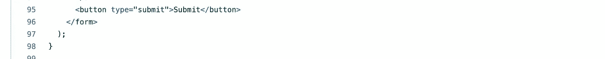

# React 项目-熨斗学校

> 原文：<https://blog.devgenius.io/react-project-flatiron-school-a499057b53a8?source=collection_archive---------16----------------------->

对于这个项目，我们需要下载 node.js。

[https://nodejs.org/en/download/](https://nodejs.org/en/download/)

这将是第一步，之后我们可以使用 React-create-app 实用程序来生成 React 应用程序。要做到这一点，请遵循以下 URL 中的说明。https://reactjs.org/docs/create-a-new-react-app.html

一旦我们完成了这个，我们就可以继续存储 json 服务器了。现在我们需要做的是

NPM I JSON-服务器

我们还需要创建一个 db.json 文件。

**{**

**【汽车】:**

**{**

**【姓名】:“阿斯玛·萨迪克”，**

**“邮箱”:“123@123.com”，**

**【价格】:【13000】，**

**“品牌”:“本田”，**

**“年”:“2015 年”，**

**《模特》:“思域”，**

**【id】:3**

**}，**

**{**

**《名字》:“木星”，**

**“邮箱”:“123@123.com”，**

**【价格】:【25000】，**

**【品牌】:【丰田】，**

**“年份”:“2010 年”，**

**【车型】:【凯美瑞】，**

**【编号】:4**

**}，**

**{**

**【姓名】:《木星》，**

**“邮箱”:“123@123.com”，**

**【价格】:【12000】，**

**【品牌】:【本田】，**

**“年份”:“2017”，**

**《车型》:《思域》，**

**【id】:5**

**}**

**】**

**}**

要完成 json 服务器配置，应该在 package.json 文件中添加以下脚本。

为了测试 json 服务器，请执行以下命令。

npm 运行服务器

并转到浏览器中的以下 url。

[http://localhost:3004/cars](http://localhost:3004/cars)

我们需要的下一个库是 react-router

npm 安装 react-router-dom@6

您的 package.json 文件现在应该是这样的。

让我们下载最后一个第三方库。

npm 安装反应器陷阱

npm 安装—保存引导

上图显示了在 app.css 之前导入 bootstrap css 以便能够在后者中覆盖 bootstrap 样式是很重要的。

您需要将您的应用程序包装在路由器中，如第 14 行和第 23 行所示。然后我们指定路由，如第 18 行和第 20 行所示。有了这个应用程序，我们有以下路线。

*   /
*   /表单
*   /信息

让我们创建 CarOffer.js 组件。

**从“React”导入 React；**

**功能 CarOffer({名称，品牌，价格，onClick }) {**

**归来(**

**T100【div class name = " d-flex justify-content-center ">**

**< div className= "汽车报价 mt-3 " onClick = { onClick }>**

**< div >名称:{name} < /div >**

**< div >品牌:{brand} < /div >**

**< div >价格:{price} < /div >**

**
**

**
**

**)；**

**}**

**导出默认的 CarOffer**

让我们使用 CarOffer.js 组件来创建 **CarOffersView.js**

**从“react”导入 React，{ useState，use effect }；**

**从“”导入 CarOffer。/caro ffer "；**

**从“”导入 CarOfferModal。/CarOfferModal "；**

**函数 CarOffersView() {**

**const [offers，setOffers]= use state([])；**

**const [activeOffer，setActiveOffer]= useState()；**

**const [showModal，setShowModal]= use state(false)；**

**const fetchOffers =()=>{**

**fetch(" http://localhost:3004/cars ")**

**。然后((res) = > res.json())**

**。然后((数据)= > {**

**console . log({ data })；**

**setOffers(数据)；**

**})；**

**}；**

**使用效果(()= > {**

**fetchOffers()；**

**}，[])；**

**回车(**

**< div >**

**{offers.map((offer，index) = > {**

**//index 是数组**中元素的位置

**回车(**

**卡罗弗**

**{…报价}**

**key={index}**

**onClick={() = > {**

**setActiveOffer(报价)；**

**setShowModal(真)；**

**}}**

**/ >**

**)；**

**})}**

**{ active offer&(**

**卡罗弗莫代尔**

**isOpen={showModal}**

**offer={activeOffer}**

**onClose={() = > {**

**setShowModal(假)；**

**} } **

**/>/**

**)}**

**< /div >**

**)；**

**}**

**导出默认的 CarOffersView**

CarOffersView.js 充当一个容器组件，保存视图的状态和逻辑需求。该组件还负责从我们之前设置的 json 服务器获取汽车报价。为了显示给定汽车报价的更多细节，我们使用 CarOfferModal.js 组件:

**从“React”导入 React；**

**从“reactstrap”导入{ Button，Modal，ModalHeader，ModalBody，Modal footer }；**

**函数 CarOfferModal({ isOpen，onClose，offer }) {**

**回车(**

**< div >**

**<模态 isOpen={isOpen} >**

**modal header>{ offer . brand }</modal header>**

**modal body>**

**
Name:{ offer . Name }
**

**< div >邮箱:{ offer . Email }
**

**< div >价格:{ offer . Price }
**

**< div >型号:{ offer . Model }
**

**< div >年份:{ offer . Year }
**

**< /ModalBody >**

**modal footer>**

**<按钮 color = " secondary " onClick = { onClose }>**

**关闭**

**</按钮>**

**</modal footer>**

**</莫代尔>**

**< /div >**

**)；**

**}**

**导出默认的 CarOfferModal**

下一个组件将被称为 **FormView.js** 。它将负责呈现一个由客户填写并提交的表单。

在上面的屏幕截图中，使用了 useState 来创建初始的表单状态。setFormData 是一个负责更新状态的函数。我们将在函数 handleChange 和 handleSubmit 中使用它。

handleChange 函数将作为 onChange prop 提供给每个 input 元素。每个输入都需要提供惟一的名称属性，该属性在第 15 行用作键(event.target.name)。

每当用户输入一个输入时，浏览器都会调度一个 onChange 事件。一旦发生这种情况，将使用 event 执行 handleChange 回调。此事件包含一个目标属性。该目标属性包括名称和值。

formData.name 包含名称属性为“name”的输入的值。在下一个屏幕截图中，您可以看到另一个不同名称和值的输入示例。

为了将数据发送到 json 服务器，需要一个表单中的 submit 按钮。

因为上面的按钮有一个提交类型，当我们单击它时，它也在我们的表单内部，表单上的 onSubmit 属性将被触发。

下图向我们展示了如何实现 handleSubmit。

需要第 20 行是为了防止浏览器在用户提交数据时刷新页面。在第 23 行，您可以看到一个获取请求是如何完成的。重要的是指定它是一个 POST 方法(第 24 行)。

navBar 组件呈现三个导航按钮，允许客户端访问应用程序中的不同页面。请注意，为了实现这一点，我们正在使用“react-router-dom”链接组件。