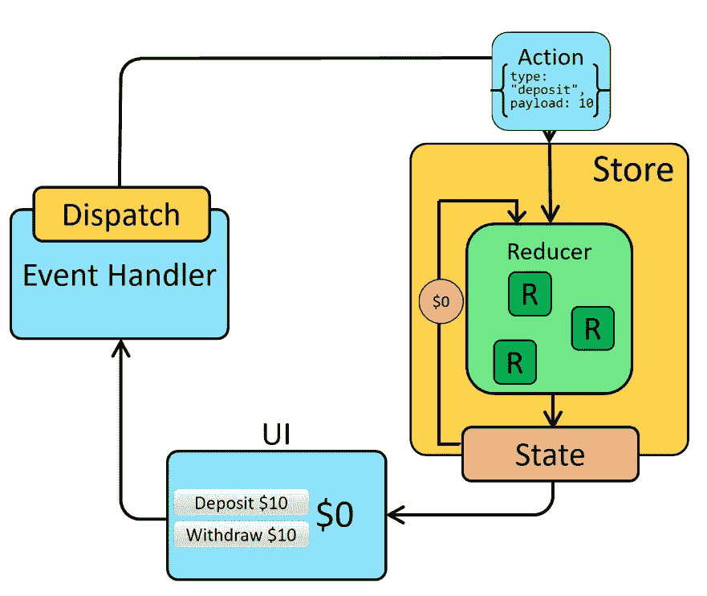
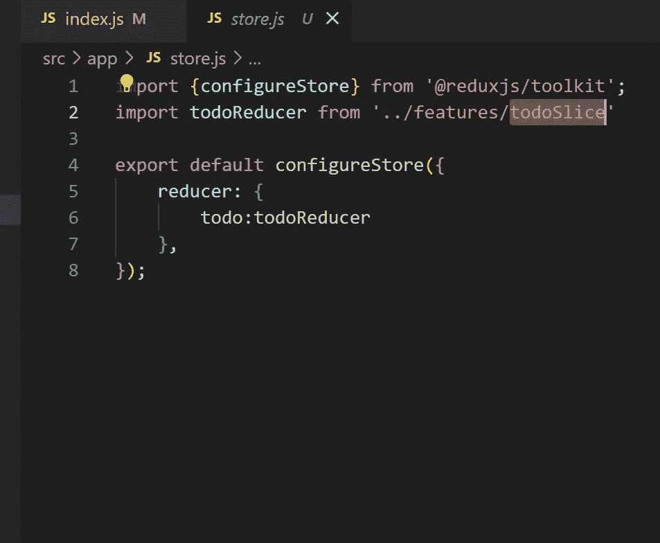
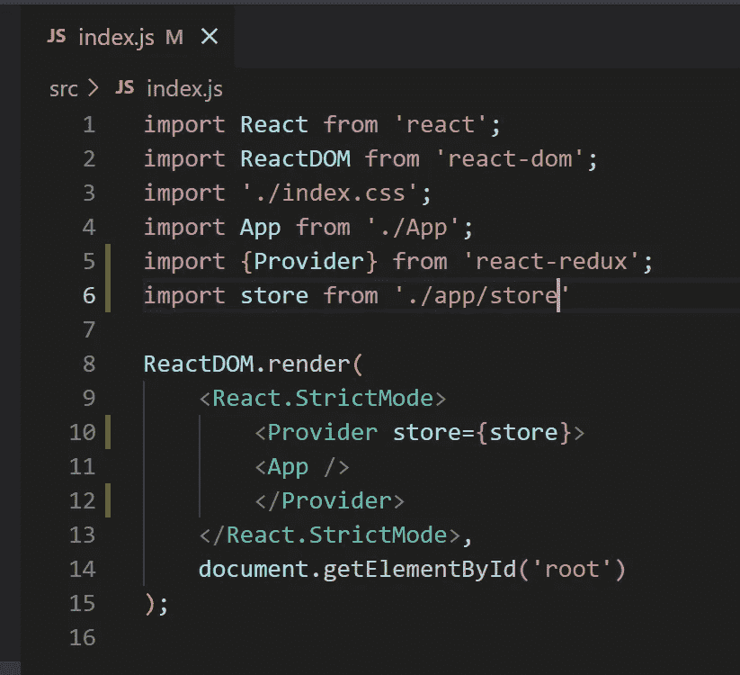
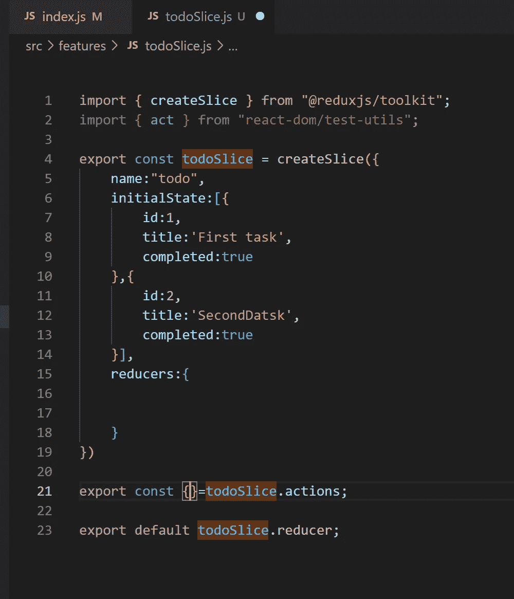
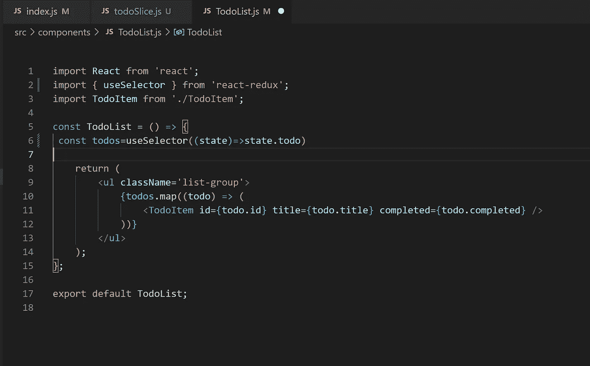
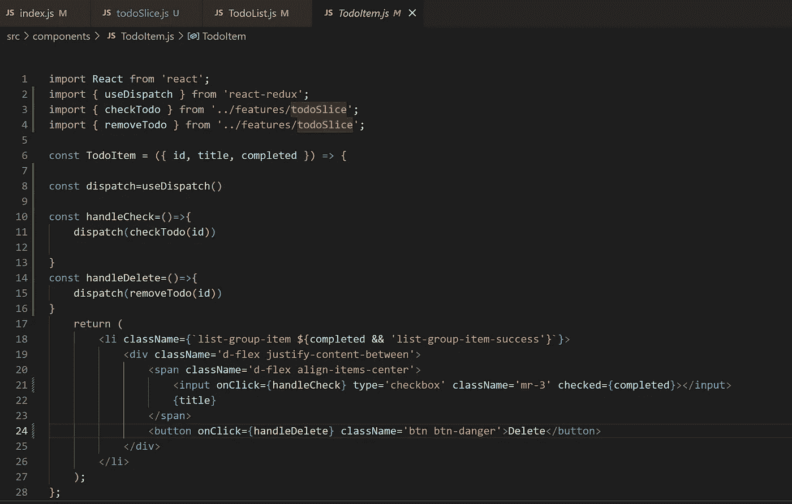
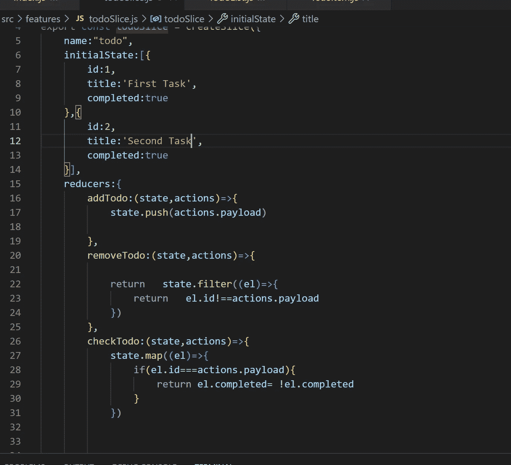

# React Redux 基础+样板 CRUD Todo 应用程序

> 原文：<https://blog.devgenius.io/react-redux-basics-boilerplate-crud-todo-app-6a9f9d5e7c27?source=collection_archive---------3----------------------->

# 在本文中，我们将探讨 Redux 的概念，包括它的优点和缺点，以及与之相关的术语。我们还将为 Todo 应用程序创建一个 Redux 样板文件。

反应还原

## **🎈简介**

Redux 是一个为 JavaScript 应用程序提供状态容器的库。它是由 Dan Abramov 和 Andrew Clark 开发的，用于管理应用程序的数据。它允许应用程序的不同组件通过动作、reducers 和中间件相互通信和交互。

Redux 通过提供一种标准的方法来处理应用程序中的状态，让我们的生活变得更加轻松。

## 🎈Redux 原则

这个库可以运行在不同的环境中，如客户机服务器或本机环境。Redux 通过将状态存储在一个名为 store 的全局对象中来管理状态

*   状态为只读
*   真理的单一来源
*   纯粹的函数做改变

## Redux 的✅优点:

*   状态的可预见性
*   高度可维护
*   防止重新渲染
*   调试更容易

## Redux 的❌ Cons

*   无数据封装
*   受限设计
*   由于状态不变性而导致内存使用过量
*   耗时的实施

# 📚Redux 中的术语

**🏬Store** — Store 是一个保存 React 应用程序所有状态的对象。整个 Redux 应用程序应该有一个存储。状态变化是作为减速器的动作而发生的。

*   getState()返回存储的当前状态。

Reducers 是纯粹的函数，它决定应用程序的状态如何改变，以响应发送到存储的动作。

本质上，reducer 监听事件(动作)并相应地更新状态。reducer 函数接受当前状态和一个 action 对象，并返回一个新状态:(state，action) => newState。本质上，这是一种根据收到的动作类型来指定状态应该如何更新的方法。

**您可以将 reducer 看作一个事件监听器，它根据接收到的动作(事件)类型来处理事件。**

*   动作只描述发生了什么，而不描述应用程序的状态如何变化。
*   reducer 是一个函数，它接受当前状态和动作，并通过执行的动作返回一个新状态。
*   combineReducers()实用程序是一个有用的工具，可以将一个应用程序中的所有 reducer 合并到一个索引 reducer 中。这使得应用程序的维护更加容易，因为所有的减速器都位于一个地方。
*   **分派**()分派一个动作。这是更新应用程序状态的唯一方法。
*   **subscribe** ()向状态订阅一个更改监听器。
*   **unsubscribe** ()在状态改变时不再想调用监听器方法时很有用。

一个**动作**是一个普通的对象，表示改变状态的意图。它们必须有一个属性来指示要执行的操作类型。

*   动作是将数据从应用程序发送到商店的信息负载。
*   任何数据，无论是来自 UI 事件还是网络回调，最终都需要作为动作进行调度。
*   动作必须有一个类型字段，指示正在执行的动作的类型。

**📌选择器**是可以从存储状态值中提取特定信息的函数。随着应用程序的增长，它们会很有帮助，因为当应用程序的不同部分需要访问相同的数据时，它们允许您避免重复逻辑。这有助于提高应用程序的可维护性。

`const selectCounterValue = state => state.value

const currentValue = selectCounterValue(store.getState())
console.log(currentValue)
// 2`

# 数据流

我们可以用这个图来总结 Redux 应用程序的数据流。它代表了:

*   响应用户交互(如点击)而分派动作
*   存储运行 reducer 函数来计算新的状态
*   UI 读取新状态以显示新值

# 🎨为 Todo 应用程序反应 Redux 样板文件

1.  第一步，我们需要创建商店

2.在 index.js 中创建提供者，并将存储作为道具传递

3.创建切片器:

*   切片器的名称
*   初态
*   减速器(保存所有动作的地方)

3.访问该州

*   使用 useSelector 钩子可以访问 Redux 的状态

4.为了使用减速器，我们必须做到以下几点:

*   需要导入 useDispatch 钩子
*   导入要使用的减速器
*   使用如下*调度(减速器(有效载荷参数))*

5.在切片器中创建每个减速器

*   动作可以保存附加信息的字段，按照惯例，它保存在“有效载荷”中

**快乐编码！💻**