# 反应路由器 V5:

> 原文：<https://blog.devgenius.io/react-router-v5-c3f3075c6af6?source=collection_archive---------5----------------------->

大家好，在这篇文章中，我们将讨论 react-router 和 react-router-dom v5。

## 一些基本组件:

## 1.浏览器路由器:

浏览器路由器使用 **HTML5 历史 API** 来保持 UI 与 URL 同步。要使用它，我们必须将整个应用程序包装在**浏览器路由器**组件中。

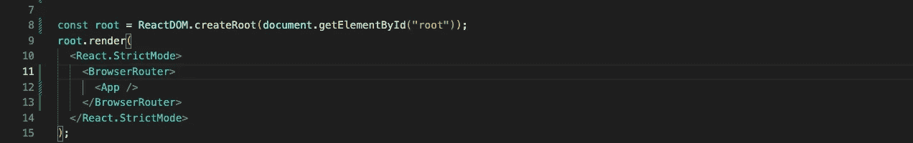

BrowserRouter 为整个`<App>`组件创建一个历史实例。该实例提供了对一些非常有用的 API 的访问，如 *history.location、history.push、history.replace、history.goBack 等。*

## 2.路线:

一旦我们的应用程序被包装，历史实例跟踪我们的会话，我们必须定义一些路线。这意味着我们必须告诉 react 应用程序应该为某个 URL 呈现哪个组件。我们可以在应用程序中定义多条路线。

像这里我们定义了四条路线。但是我们还没有完成路线。让我首先向您展示我们在使用这段代码时会遇到的问题。

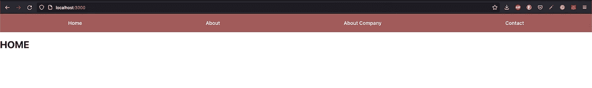

当我们在应用程序的 *'/'* 路线上时，home 组件正在被渲染，这看起来是正确的。但是，当我们转向其他路线，如*“关于”或“关于公司”*时，会发生什么呢

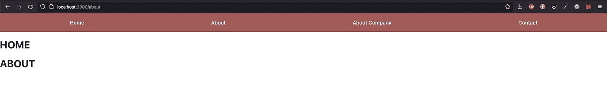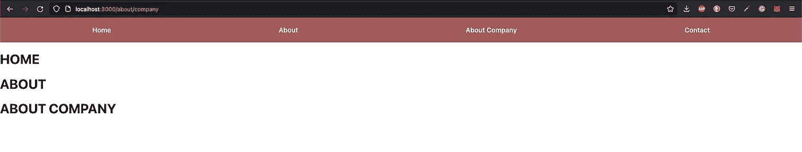

哎呀！这似乎是个问题。

首先，让我告诉你为什么会这样。我们当前的 URL 即[http://localhost:3000/about](http://localhost:3000/about)包含“/”和“about”。React router 按照我们在代码中定义的那样从上到下比较路径，然后呈现相关的组件。但是这里我们不希望用户在导航到 about 页面时看到我们的主页。所以**确切的**关键词出现在剧中。exact 关键字的作用是将路由的确切路径与 URL 进行比较，然后只呈现相关的组件。

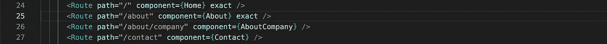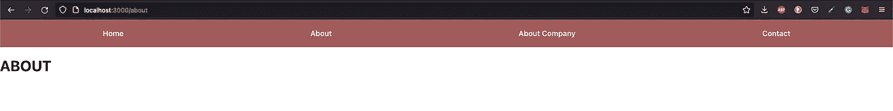

## 3.开关:

为了解释**开关**组件，我将首先介绍它所解决的问题。

在 react 中，我们也可以使用动态 URL，我们可以从 URL 中提取一些内容，并在我们的组件中使用它来从 API 中获取一些数据，或者我们可以在我们的组件中显示这些内容。

下面是我们如何定义这样的路线。

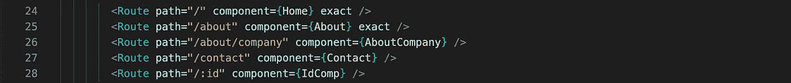

只需添加一个冒号(':')，然后添加一个有意义的名称，供用户稍后在组件中从 URL 访问数据时使用。现在，我们将保持它的简单，并将在组件中显示从 URL 获取的 id。

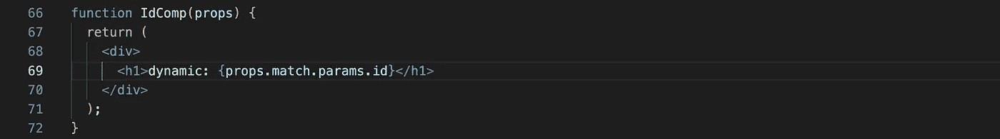

这里 react-router 将为我们完成这项工作，我们可以通过引用 *props.match.params.* 来简单地使用这些数据

但是现在如果我们发现我们的代码有很大的问题。假设用户导航到*about*about 组件将呈现的路线，对。让我们来看看…

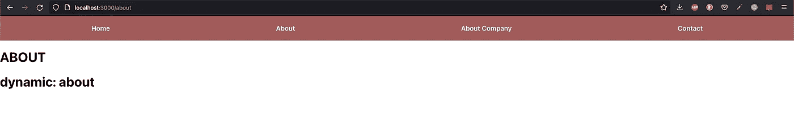

这个好像不太对。这里的问题是，当 react-router 开始按照我们在代码中编写的顺序从上到下比较路由时，它首先与 *'/about'* 路径匹配，并呈现正确的 about 组件，但随后它进一步与我们的动态路由匹配，并将 *about* 视为 id，并呈现 IdComp。
在这种情况下，开关组件开始发挥作用。

要使用它，我们只需将我们的路由包装在交换机组件中。

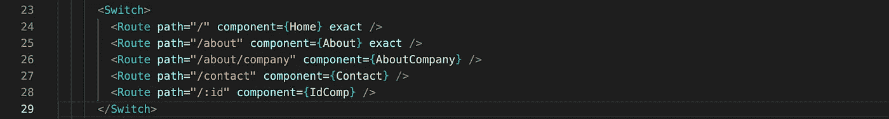

交换机所做的是，当从上到下比较路径时，它只呈现与当前路由匹配的第一个组件。

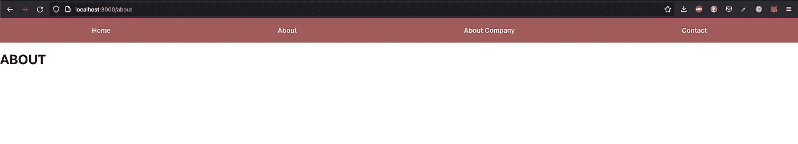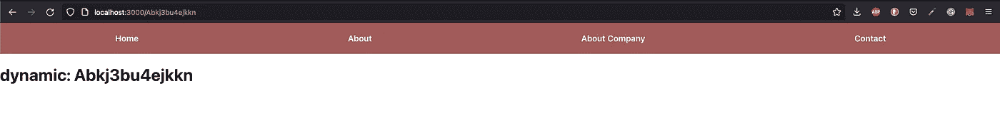

现在，这很好，现在我们只需要注意我们的路线总是与我们的 id 不同，否则可能会导致大问题。但这是一件我们可以轻松搞定的事情。

**4。链接:**

现在，在完成所有这些设置之后，我们需要一些用户可以用来在组件之间导航的东西，比如导航条。但现在问题来了，我们如何在 react app 中添加链接。如果我们使用像普通 HTML5 这样的超链接，那么每次我们点击那个链接，我们的整个页面都会刷新，这不是我们在 react 应用中想要的。这里我们可以使用 react-router-dom 提供的链接组件。

下面是我们如何使用链接组件

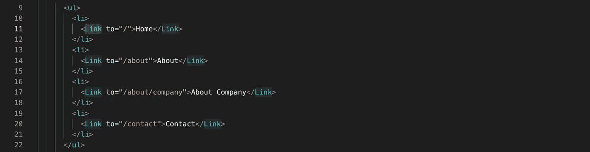

这里的“to”属性用于定义链接将用户重定向到的路由。

**5。导航链接:**

react-router-dom 还提供了一个 NavLink 组件，可以方便地创建交互式 UI。它为我们提供了一个名为 activeClassName 的道具。

我们可以将类名添加到链接中来设置它们的样式，然后当链接处于活动状态时，我们可以使用 activeClassName 来设置链接的样式。

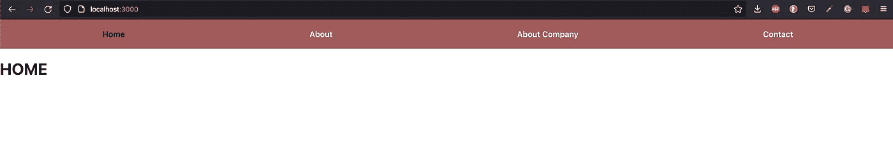

使用 activeClassName，我们可能会再次遇到之前在路由中遇到的相同问题。例如，如果我们有两条路由，如 *'/'和'/about'* ，其中两条路由都可以重叠，则活动类将影响两条链路

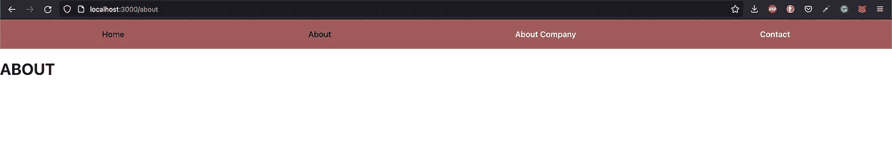

为了防止这种情况，我们可以在 NavLink 组件中再次使用 exact 关键字

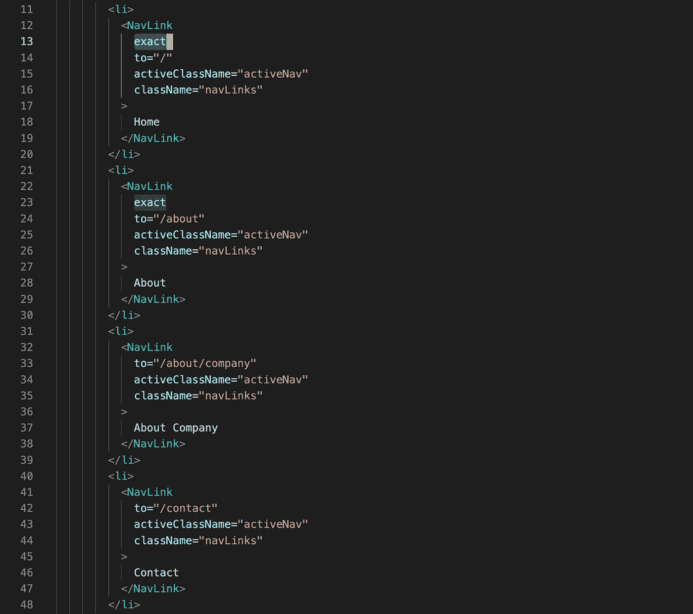

这将解决问题…..

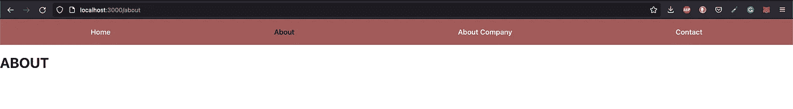

## **包装:**

这就是我们开始使用 react-router V5 所需要知道的全部内容。它还提供了其他一些特性，我们可以稍后再探讨。

谢谢你的时间😊….