# React 路由器 V6:

> 原文：<https://blog.devgenius.io/react-router-v6-d95b6ac438a4?source=collection_archive---------2----------------------->

大家好，在这篇文章中，我们将讨论 react-router 和 react-router-dom v6。

## 一些基本组件:

## 1.浏览器路由器:

浏览器路由器使用 **HTML5 历史 API** 来保持 UI 与 URL 同步。要使用它，我们必须将整个应用程序包装在**浏览器路由器**组件中。

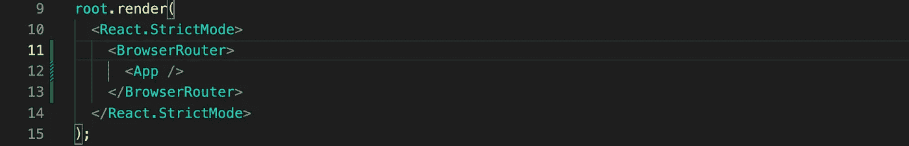

BrowserRouter 为整个`<App>`组件创建一个历史实例。该实例提供了对一些非常有用的 API 的访问，如 *history.location、history.push、history.replace、history.goBack 等。*

## 2.路线:

在 v6 中，您可以将 Routes 组件视为 Switch 组件的替代品。将它命名为路线更有意义。使用 Route 创建的所有路径都将被 Routes 包装。

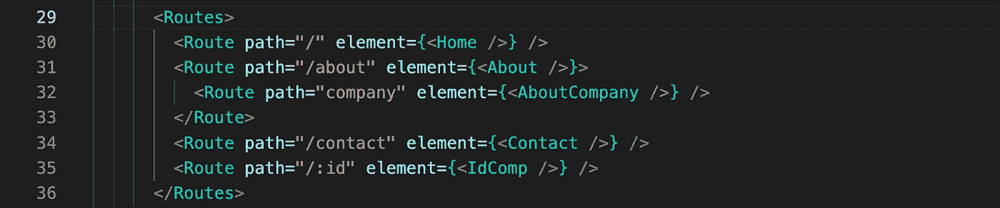

## 3.路线:

在 v6 中，我们可以像在 v5 中一样定义路由。只有一些语法上的变化，比如现在你使用 **element** prop 而不是 component，现在你必须在 element prop 中传递 jsx 来使它工作，而不只是像我们之前那样传递组件。

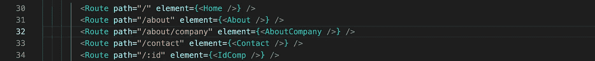

如果你使用 v5，你肯定会在上面的例子中找到**确切的**关键字，但是我们不需要它，它将完美地开箱即用。
在上面的例子中，我们定义了两条路线，即 *'/about'* 和 *'/about/company'* ，这非常好。但有趣的部分来了。在 v6 中，我们可以用一种非常容易理解和阅读的方式定义嵌套路径。我们可以在父路由和反应路由器之间包装嵌套路由，反应路由器将知道我们想要组合它们两者。

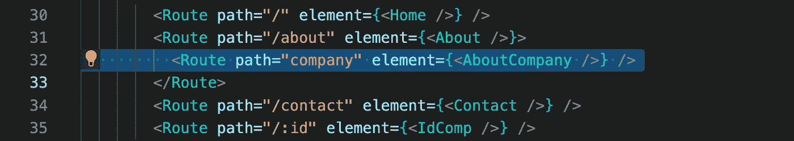

看，就这么简单。还有一点，在定义这些嵌套路由时，我们不需要在路由路径前加斜杠，否则路由器会抛出一个错误。

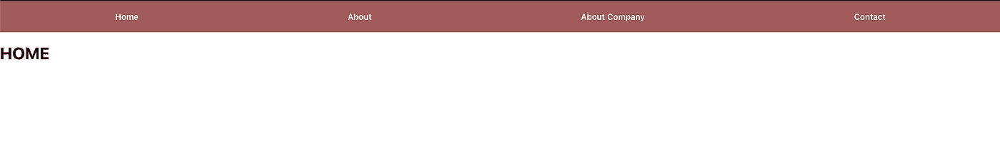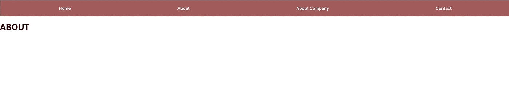

## 4.出口:

我们添加了嵌套路由，但是现在我们需要告诉 react-router 在哪里呈现嵌套组件。为此，**出口**组件开始发挥作用。我们需要在父 Route 元素中使用这个组件。

在我们的示例中，*' company '*route*是 *'/about'* route 的子元素，并且正在为 *'/about'* route 呈现< About/ >元素。所以我们只需要在我们的 About 组件中添加 outlet 组件就可以让它工作了。*

*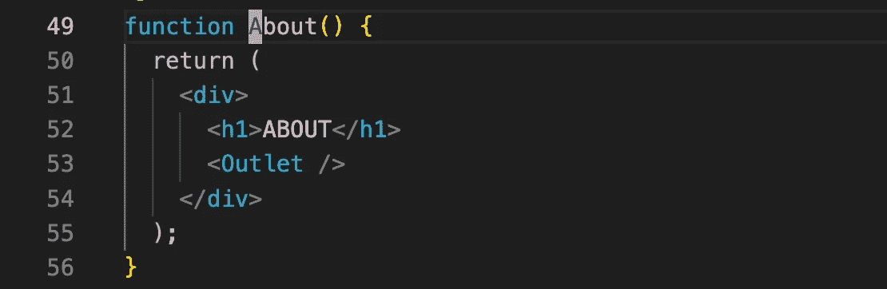**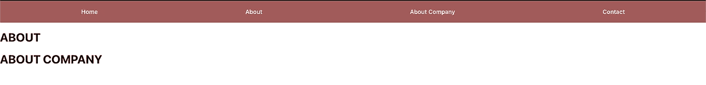*

*要将“about/company”显示为一个单独的页面，我们可以像处理其他路线一样，只声明路线而不嵌套。*

*我们可以定义多个嵌套路线，如下所示:*

*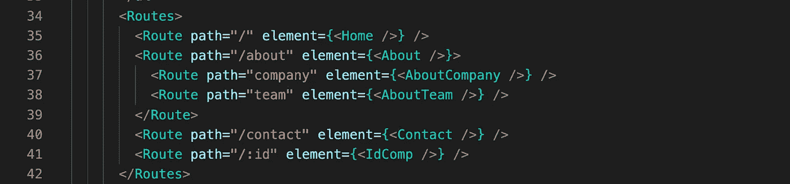**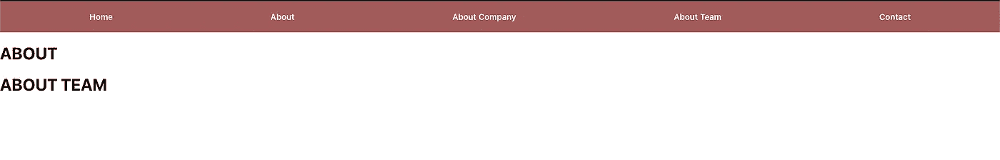*

## *5.链接:*

*现在，在完成所有这些设置之后，我们需要一些用户可以用来在组件之间导航的东西，比如导航条。但现在问题来了，我们如何在 react app 中添加链接。如果我们使用像普通 HTML5 这样的超链接，那么每次我们点击那个链接，我们的整个页面都会刷新，这不是我们在 react 应用中想要的。这里我们可以使用 react-router-dom 提供的链接组件。版本 6 中的链接组件与版本 5 中的相同。我们可以使用*到*属性来定义链接将用户重定向到的路径。*

*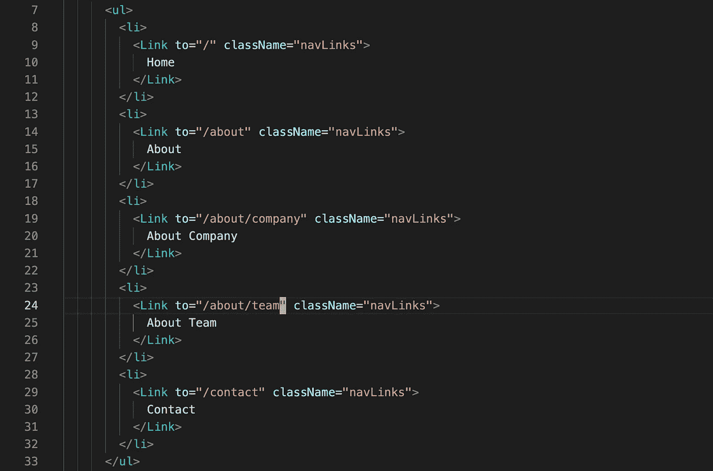*

## *6.导航链接:*

*现在，NavLink 组件在 v6 和 v5 中的用法有点不同。在 v5 中，我们使用*‘active class name’*来定义一个活动链接的类，但是现在在 v6 中，我们可以使用由 style prop 中的回调函数提供的 isActive 变量。*

*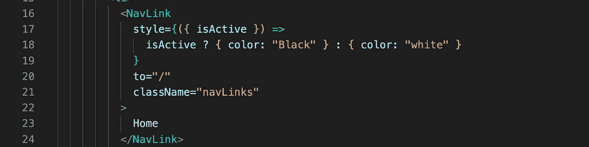**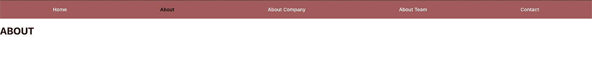*

*但是在 v6 中，如果转到任何既是父链接又是子链接的嵌套链接' *navLinks* '被显示为活动的，我们仍然会面临这个问题。*

*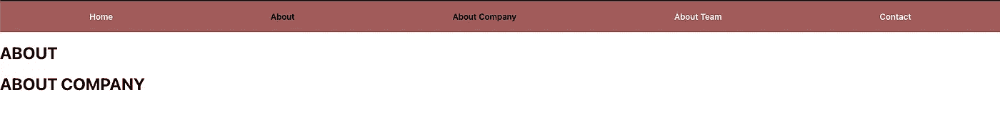*

*在 v5 中，我们在' *navLink* '组件中使用了 exact 关键字来解决这个问题，但在 v6 中，我们只需在父 navLink 中使用 *'end'* 关键字。它将确保该组件在其后代路径匹配时不会匹配为“活动的”。*

*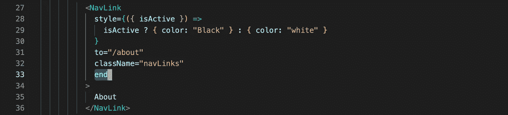*

## *奖金:*

*这篇文章是写给所有还在阅读这篇文章的人的😅。*

*v6 中引入了许多钩子，如 useNavigate、useLocation、useParams 等。*

*我将解释**使用参数**。如果我们在应用程序中使用动态路由，这个钩子就派上用场了，动态路由可以这样定义:*

*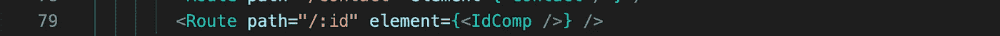*

*现在在 IdComp 组件中，我们可以使用 **useParams** 钩子从 URL 中提取 id。*

*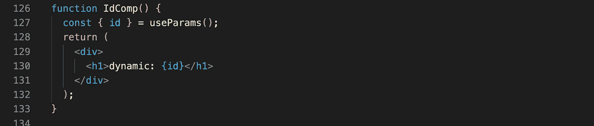**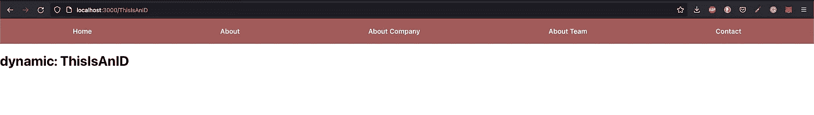*

# *总结:*

*这就是我们开始使用 react-router V6 所需要知道的全部内容。V6 中引入了更多的特性，你可以在他们的官方[文档](https://reactrouterdotcom.fly.dev/docs/en/v6)中查看。*

*谢谢你的时间😊….*