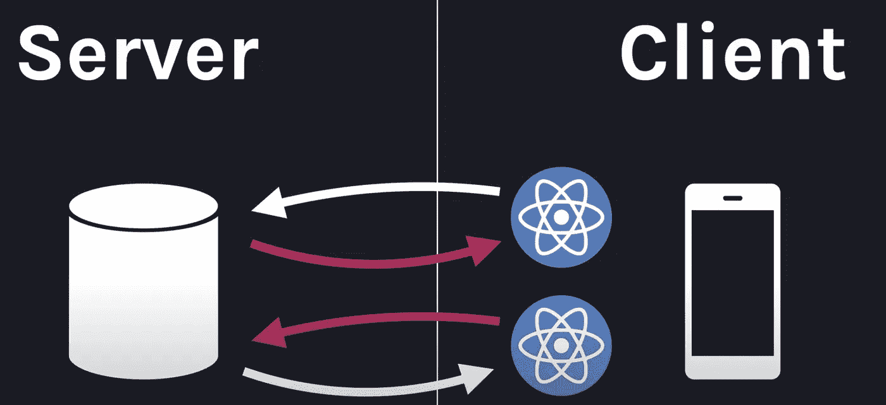
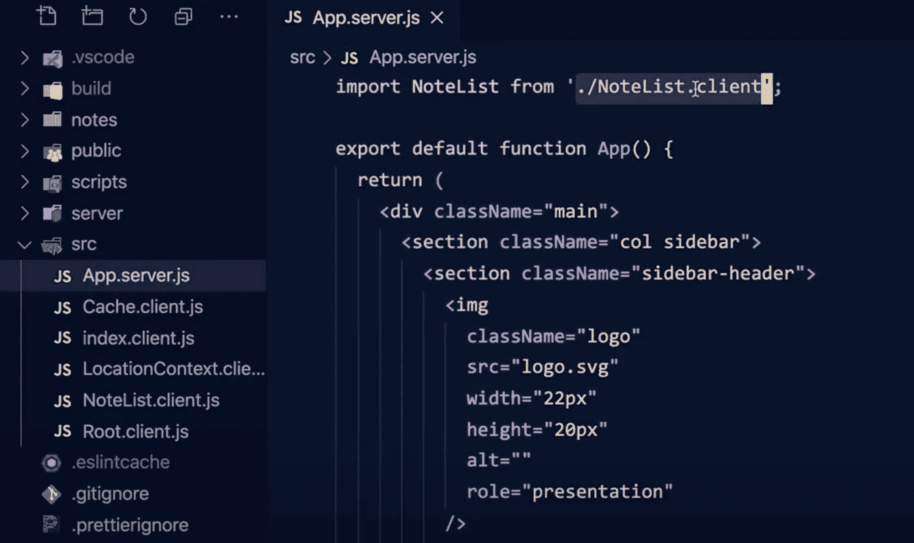
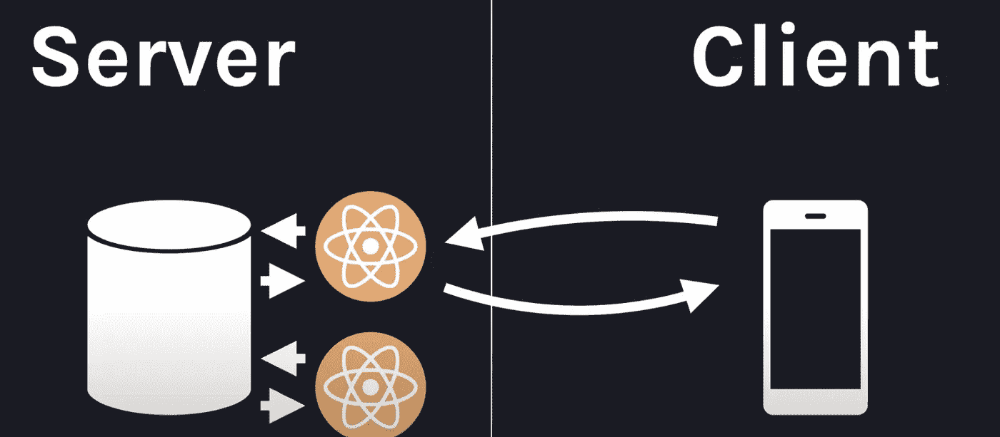
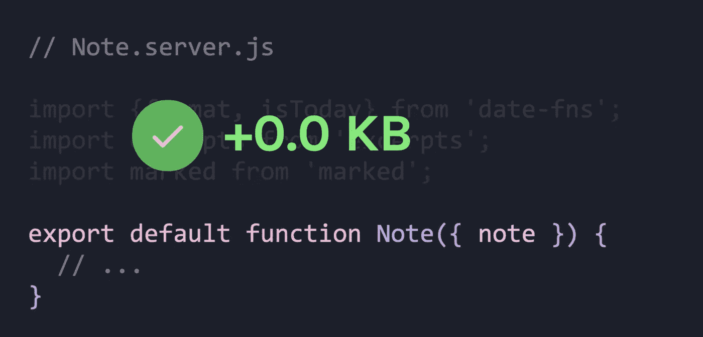

# React 服务器组件介绍

> 原文：<https://blog.devgenius.io/react-server-component-intro-e12bb2fb289c?source=collection_archive---------5----------------------->

React 团队最近推出了一个主要的新特性“ [**React 服务器组件**](https://reactjs.org/blog/2020/12/21/data-fetching-with-react-server-components.html) ”。它为前端工程师在编写更少代码的同时构建高性能应用程序开辟了一个新世界。

来自 reactjs.org[的 img](https://reactjs.org/blog/2020/12/21/data-fetching-with-react-server-components.html)

# 什么问题？

如今，众多的 react 应用程序提供了丰富的体验。但是，这些客户端呈现的应用程序仍然需要从服务器获取和解析数据。

数据下载往返为应用程序制造了性能瓶颈，并要求工程师编写更多代码。

对于没有交互的静态网页来说，从 React 组件框架下载 JS 源文件和数据是一种**的资源浪费。**

> 如果我们有一个既支持**服务器端渲染**又兼容其他客户端 React 组件的 React 组件会怎么样？

# 这是什么？

**React 服务器组件(RSC)** 是一种新型的 React 组件，只在服务器上呈现。

类似于服务器端渲染的想法，RSC 有一个限制，它**不能有任何交互性**。为了支持交互，我们需要创建客户端组件。

RSC 可以使用另外两种类型的组件:

*   **反应客户端组件**只在客户端执行(像传统组件一样)
*   **React 共享组件**可以在任一环境中执行

RSC 和 RCC 的显著区别在于文件名。RSC 的源文件名以“server.js”结尾，像“app.server.js”。

源代码

# 期待什么好处？

## **#1 呈现内容而不获取数据**

对于 RSC，数据提取已经在服务器端完成。像 SSR 一样，当 HTML 下载到客户端时，内容就完成了。

来自 reactjs.org 的 Img

## #2 对束尺寸没有影响

由于 RSC 不会被下载到包中，包的初始大小和下载时间将会减少。此外，RSC 只加载渲染所需的代码。

总的来说，这是优化应用程序启动时间的好消息。

来自[reactjs.org](https://reactjs.org/blog/2020/12/21/data-fetching-with-react-server-components.html)的 Img

# 下一步是什么？

由于 React 服务器组件还在**研发**。没有必要马上赶上和修改你的代码库。请继续关注 reactjs.org[电视台，看看情况如何。](https://reactjs.org/)