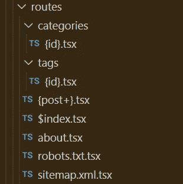
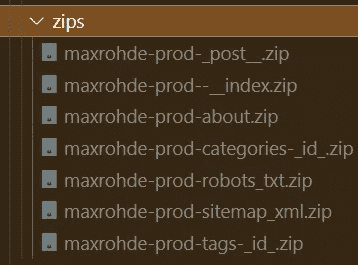
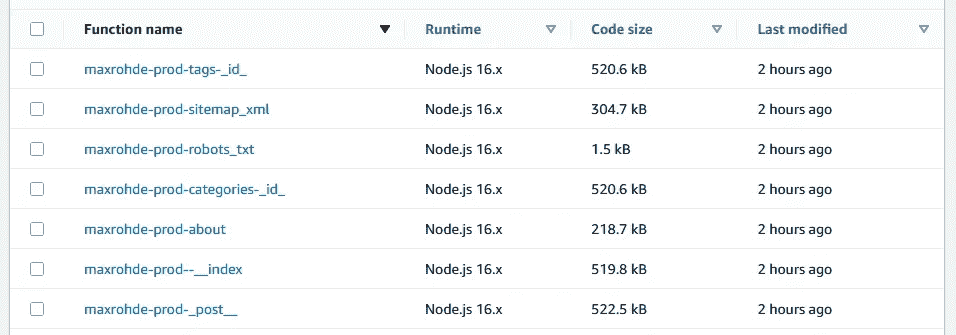
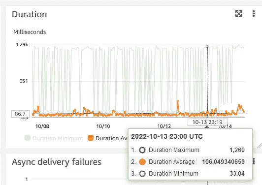
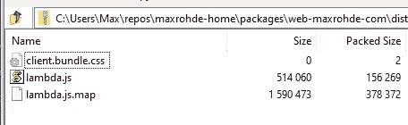

# React 无服务器 SSR:讨论和轻量级框架

> 原文：<https://blog.devgenius.io/react-serverless-ssr-a-discussion-and-lightweight-framework-6128e5d528da?source=collection_archive---------9----------------------->

React 应用程序的服务器端渲染(SSR)在过去几年变得越来越流行。像 [Remix](https://remix.run/) 和 [Next.js](https://nextjs.org/) 这样的框架已经证明了用 React 在服务器上呈现页面是一种有效的编写应用程序的方式。

在这篇文章中，我将探索如何为 React SSR 开发一个真正无服务器的**实现，它提供:**

*   📦每页一个优化的 Lambda 包
*   🚀客户端脚本的有效分发
*   🐦易于定制的轻量级框架

# tldr

要开始实施无服务器 React SSR 应用程序，欢迎使用我准备的可定制模板:

*   🌟 [Goldstack 服务器端渲染模板](https://goldstack.party/templates/server-side-rendering)

这个模板也可以在 GitHub 上分叉:

*   🍴 [react-ssr](https://github.com/goldstack/react-ssr)

# 一点历史和动力

请随意跳过这一部分，直接向下滚动到代码🤗。

这篇文章是多年努力和实验的积累。我一直在寻找一种开发 web 应用程序的方法，这种方法可以产生漂亮的代码(“易读”)和漂亮的基础设施(“低成本，易维护”)。

我发现 [Next.js](https://nextjs.org/) 非常接近我的理想。然而，它在两个关键方面有所欠缺:1) Next.js 引入了许多魔法，使得深度定制应用程序变得困难。2)难以[将 Next.js 部署到 AWS](https://maxrohde.com/2021/01/30/deploy-next-js-to-aws) 。

在 Wordpress 困扰了我多年之后，我犹豫了很久，决定将我的博客[快乐代码](https://maxrohde.com)从 Wordpress 中移走。在搜索了许多可用的选项(包括不同的博客托管平台和静态渲染解决方案，如 [Gatsby](https://www.gatsbyjs.com/) )后，我决定对我来说最好的选择是实现我自己的定制博客。

我不是轻易做出这个决定的。我总是告诉自己，修改博客本身只是我拖延写文章的一种方式。然而，我认为这对我自己来说可能是一个很好的编码实践，并帮助我改进我的开源项目，即 [Goldstack 项目构建器](https://goldstack.party)。

当我开始我的博客项目时，Goldstack 中最适合我的模板是 [Next.js 模板](https://goldstack.party/templates/nextjs)。然而，由于上述原因，我认为一个新的模板会更好地服务于一个博客。具体来说，一个模板将比 Next.js 更好地支持 AWS 上的服务器端呈现(Next.js 支持 Vercel 部署之外的服务器端呈现，但它需要部署在 VM 上，作为 Docker 映像或作为所有代码捆绑在一个 Lambda 中；所有不太“无服务器”的选项)。

因此，几个月前，我开始了开发服务器端渲染友好模板[的过程。我不久前发布了这个模板，之后也完成了我博客新版本的实现。这篇文章包含了我在这个过程中的经验和收获。](https://github.com/goldstack/goldstack/commit/ac13d13a915d225486ba42815aac3e7f2c153fbf)

# 定义路线

我喜欢在 [Next.js](https://nextjs.org/docs/routing/introduction) 中定义路由的方式:只需在专用目录中创建文件，Next.js 就会自动配置与文件名和路径匹配的路由。

许多无服务器框架需要配置复杂的 JSON 文件 YAML 来定义路由。然而，我希望保持与 Next.js 为我的无服务器 SSR 实现提供的相同水平的便利性。

因此，我为生成路线定义了以下规则:

*   **基本路由**:文件名称用于资源名称。例如，`src/routes/page.tsx`将在`mypage.com/page`下可用。
*   **子文件夹**:资源路径中将使用文件夹名称。例如，`src/routes/group/page.tsx`将在`mypage.com/group/page`下提供。
*   **索引页**:为了定义一个文件夹(或者网站的根目录)内匹配`/`的路径，可以定义一个名为`$index.tsx`的源文件。例如，`src/routes/group/$index.tsx`将在`api.com/group/`下提供。
*   **默认回退**:要定义一个在没有匹配路由时调用的回退，定义一个名为`$default.tsx`的源文件。API 中应该只有一个`$default.tsx`文件。这将匹配所有未被其他路由覆盖的路径。
*   **路径参数**:使用语法`{name}`支持路径中的参数。例如，`src/user/{name}.tsx`将使参数`name`在端点中可用。参数也支持作为文件夹名称。
*   **贪婪路径**:如果一个参数要匹配多个资源级别，可以定义如下`{greedy+}`。例如`src/group/{greedy+}.tsx`将匹配`mypage.com/group/1`和`mypage.com/group/some/path`以及`group/`下的所有其他路径。

下面是我为我的博客定义的所有[路线:](https://github.com/mxro/maxrohde-web/tree/blog-improvements/packages/web-maxrohde-com/src/routes)

请参见下面的*定义基础设施*部分，了解这些路由如何被投射到无服务器基础设施上。

# 定义处理程序

定义了服务器应该解析的路由之后，下一步是定义提供响应的实际处理程序。

参见下面一个样本处理器(`[posts.tsx](https://github.com/goldstack/react-ssr/blob/9fcbe5204697546ec2b5268b637b0012a582eb17/packages/server-side-rendering-1/src/routes/posts.tsx)`):

(这只是自动生成的示例项目中的处理程序，如果您对我的博客中的实际处理程序感兴趣，请参见呈现帖子列表的`[$index.tsx](https://github.com/mxro/maxrohde-web/blob/618c563ae20a99c91ee0fa48102d784a34a594b2/packages/web-maxrohde-com/src/routes/%24index.tsx)`。)

这里的关键是使用助手方法`renderPage`执行服务器端渲染的`handler`方法，以及确保页面在客户端正确初始化的`hydrate(Posts);`语句。

请注意，这些处理程序既支持服务器端呈现，也支持定义客户端交互性。

如果您需要任何特定的仅服务器端 npm 依赖项，建议创建第二个源文件，并在那里定义一个在`handler`方法中调用的方法。

(这是上面提到的`$index.tsx`文件所需要的，该文件需要对 DynamoDB 进行一些查询，参见`[renderIndex.ts](https://github.com/mxro/maxrohde-web/blob/618c563ae20a99c91ee0fa48102d784a34a594b2/packages/web-maxrohde-com/src/ssr/renderIndex.ts)`。)

然后，我们可以使用`[esbuild-ignore-with-comments-plugin](https://www.npmjs.com/package/esbuild-ignore-with-comments-plugin)`通过在源文件的开头放置注释`/* esbuild-ignore ui */`来确保客户端绑定期间不包含任何依赖项。

例如，您可以将脚本定义如下(`src/server/render.ts`):

然后在处理程序中导入这个呈现函数:

# 定义基础设施

无服务器项目通常需要比基于微服务或单一实现更复杂的基础设施定义。例如，在单一应用程序中，我们定义一个主计算实例，而在无服务器项目中，我们通常将计算分布在基础架构的许多不同组件中。

正如本文开头所概述的，我感兴趣的一个关键特性是在单独的 Lambda 函数中部署每个页面或路径，以确保快速冷启动。

我决定定义一个架构如下:一个 [CloudFront 发行版](https://docs.aws.amazon.com/AmazonCloudFront/latest/DeveloperGuide/Introduction.html)作为应用程序的初始入口。静态文件通过 [AWS S3](https://aws.amazon.com/s3/) 提供。对于每个定义的路由，我们定义了一个 [Lambda](https://aws.amazon.com/lambda/) 函数，并使用一个 [AWS HTTP API 网关](https://docs.aws.amazon.com/apigateway/latest/developerguide/http-api.html)将流量路由到正确的 Lambda:

对我来说，可扩展性是定义基础设施的关键，尤其是在无服务器项目中，因为我们通常需要扩展或修改我们的基础设施来实现更多的功能。

因此，我选择使用 [Terraform](https://www.terraform.io/) 来定义基础设施。参见`[infra/aws](https://github.com/goldstack/react-ssr/tree/master/packages/server-side-rendering-1/infra/aws)`中所有要求的地形配置。

我决定为所有针对[冷启动](https://medium.com/geekculture/pick-the-right-memory-size-for-your-aws-lambda-functions-682394aa4b21)优化的 lambda 提供一个通用的[配置。](https://github.com/goldstack/react-ssr/blob/9fcbe5204697546ec2b5268b637b0012a582eb17/packages/server-side-rendering-1/infra/aws/lambda_routes.tf#L13)

注意，变量`lambdas`是由一些工具动态提供的，这些工具将`src/routes`文件夹中的文件翻译成文件`[goldstack.json](https://github.com/goldstack/react-ssr/blob/9fcbe5204697546ec2b5268b637b0012a582eb17/packages/server-side-rendering-1/goldstack.json#L17)`中的功能配置。

当新的路由被定义时，这个配置由封装在 npm 包`[@golstack/utils-aws-lambda](https://www.npmjs.com/package/@goldstack/utils-aws-lambda)`中的[小实用程序](https://github.com/goldstack/goldstack/blob/master/workspaces/templates-lib/packages/utils-aws-lambda/src/generate/collectLambdasFromFiles.ts)动态更新。

# 部署

除了为我们的 lambda 函数和静态文件定义基础设施，我们还需要将我们开发的代码和资源部署到 AWS 基础设施。

我决定使用 [AWS CLI](https://aws.amazon.com/cli/) 来部署功能代码和静态资源。为了避免在本地机器上安装 CLI，Docker 用于运行 CLI。

捆绑和部署 Lambdas 以及生成和部署静态资源需要几个步骤。这些是使用用 TypeScript 编写的几个脚本编排的。这些在库`[template-ssr-cli](https://github.com/goldstack/goldstack/tree/master/workspaces/templates-lib/packages/template-ssr-cli)`中定义。

部署过程中最棘手的部分是客户端和服务器端的捆绑，下面将详细讨论:

# 服务器端捆绑

为了部署无服务器 SSR 应用程序，我们需要捆绑代码，以确保我们只为每个功能部署必要的代码。

这可以通过大多数 JavaScript 捆绑器实现，例如 [Webpack](https://webpack.js.org/) 、 [Rollup](https://rollupjs.org/guide/en/) 或 [esbuild](https://esbuild.github.io/) 。

我决定使用 *esbuild* 作为我的参考实现，因为它快速且易于定制。文件`[src/build.ts](https://github.com/goldstack/react-ssr/blob/9fcbe5204697546ec2b5268b637b0012a582eb17/packages/server-side-rendering-1/src/build.ts)`中定义了 esbuild 的配置:

这种配置同时使用了`[esbuild-css-modules-client-plugin](https://www.npmjs.com/package/esbuild-css-modules-client-plugin)`和`[esbuild-ignore-with-comments-plugin](https://www.npmjs.com/package/esbuild-ignore-with-comments-plugin)`。前者用于支持 [CSS 模块](https://github.com/css-modules/css-modules)，后者用于确保包中不包含仅客户端需要的文件。

注意，根据 [AWS 建议](https://docs.aws.amazon.com/lambda/latest/dg/lambda-typescript.html)，包的目标是`node16`，格式是`commonjs`。

除此之外，生成的`.js`和`.css`文件被简单地压缩，并准备好使用 AWS CLI 上传到 AWS。请看下面根据前面显示的路线为我的博客生成的 Zip 文件:

# 客户端捆绑

客户端捆绑也使用 esbuild 执行，配置也在`[src/build.ts](https://github.com/goldstack/react-ssr/blob/9fcbe5204697546ec2b5268b637b0012a582eb17/packages/server-side-rendering-1/src/build.ts)`中提供:

这种配置也使用了`[esbuild-css-modules-client-plugin](https://www.npmjs.com/package/esbuild-css-modules-client-plugin)`和`[esbuild-ignore-with-comments-plugin](https://www.npmjs.com/package/esbuild-ignore-with-comments-plugin)`。

生成的包和 CSS 文件不包含在上传到 Lambdas 的 Zip 文件中。相反，它们使用哈希文件名上传到 S3。使用实用程序`[static-file-mapper](https://www.npmjs.com/package/static-file-mapper)`和`[static-file-mapper-build](https://www.npmjs.com/package/static-file-mapper-build)`完成到文件名的映射。生成一个文件`[src/state/staticFiles.json](https://github.com/goldstack/react-ssr/blob/9fcbe5204697546ec2b5268b637b0012a582eb17/packages/server-side-rendering-1/src/state/staticFiles.json)`,它维护生成的包的映射:

静态文件使用 CloudFront 提供，因此客户端加载时延迟最小。

# 地方发展

无服务器开发的最大挑战之一是如何提供良好的本地开发体验。

因此，我想确保我的方法允许简单的本地测试。为此，我选择使用一个简单的 [Express](http://expressjs.com/) 服务器，在本地提供路由和静态文件。

为此，我开发了实用程序`[@goldstack/utils-aws-http-api-local](https://www.npmjs.com/package/@goldstack/utils-aws-http-api-local)`。参见 [expressRoutes.ts](https://github.com/goldstack/goldstack/blob/ae3c9b35f0970b26f10727fcec342b004f247a5c/workspaces/templates-lib/packages/utils-aws-http-api-local/src/expressRoutes.ts) 查看本地路线如何映射到快速路线。

这使得可以运行一个简单的`yarn watch`来启动并运行应用程序的本地版本。

这需要大量的魔法才能正常工作，包括即时捆绑客户端包。然而，对于 AWS 上的部署来说，这些都不是必需的，在 AWS 上，客户端资源是作为静态文件提供的，如上所述。

# 好的，坏的和丑陋的

在写我的 React 服务器端渲染方法之前，我想在一个真实的项目中对它进行测试。我很高兴能够使用这篇文章中描述的方法将我的博客`[maxrohde.com](https://maxrohde.com)`从 Wordpress 迁移到一个无服务器的项目中。

我发现，对于这个博客所需的所有路由，Lambda 代码的大小都保持在 1 MB 以下，甚至对于包括 DB 连接在内的函数也是如此。

(大于 500 kb 的函数需要 React 和 DynamoDB 客户端库，其他函数需要这两者的组合，而`robots.txt`的函数不需要这两者。)

冷启动通常会在 1.5 秒内完成，而其他请求通常会在 30-50 毫秒内完成，这是几千次调用的样本。

欢迎探索博客[maxrohde.com](https://maxrohde.com)和[源代码](https://github.com/mxro/maxrohde-web/tree/master/packages/web-maxrohde-com)。

基于这种方法的几周工作，我发现:

# 好人

*   ✔高生产率和良好的开发者体验；允许关注应用程序逻辑，而不是样板文件和配置。
*   ✔将每条路由打包成自己的 Lambda 工作方式，结果是可接受的性能、非常低的成本、易于维护和高可伸缩性。
*   通过 CloudFront 的客户端资源的✔分布导致快速的加载时间。
*   ✔易于扩展；使用 [Tailwind CSS](https://tailwindcss.com/) 为博客设计风格，这需要定制构建过程。

# 坏事

*   🤔React 使得 Lambdas 和客户端包比我希望的要重。可能需要使用[预测](https://preactjs.com/)进行探索。
*   🤔TypeScript 很好，但是需要将源地图和源代码一起发送，这使得需要部署的 Zip 存档的大小增加了一倍以上。

# 丑陋的

*   🤯虽然 1 s 左右的冷启动是可以接受的，但我希望它们能更快。这段时间的大部分被 AWS 用来做好准备，而不是加载实际的源代码(因此减少源代码的大小只会对冷启动时间产生最小的影响)。

# 从这里去哪里？

我花了很长时间来开发本质上是用于开发服务器端渲染 React 应用程序的全栈框架。我学到了很多关于 React 和 CSS 生成的工作原理。我希望在十年左右的时间里不必重新实现我的博客，同时继续改进[模板](https://goldstack.party/templates/server-side-rendering)。

然而，如果你想尝试一下，去 [Goldstack](https://goldstack.party) 并选择*服务器端渲染*模板。或者，您也可以克隆自动与模板保持同步的`[react-srr](https://github.com/goldstack/react-ssr)`存储库。

如果你有任何想法或主意，请不要犹豫[在社交平台](https://maxrohde.com/about)上寻求帮助，或者通过创建[问题](https://github.com/goldstack/goldstack/issues)🤗。