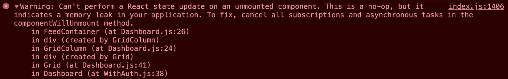
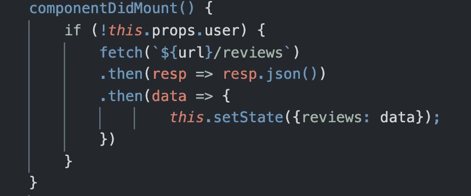
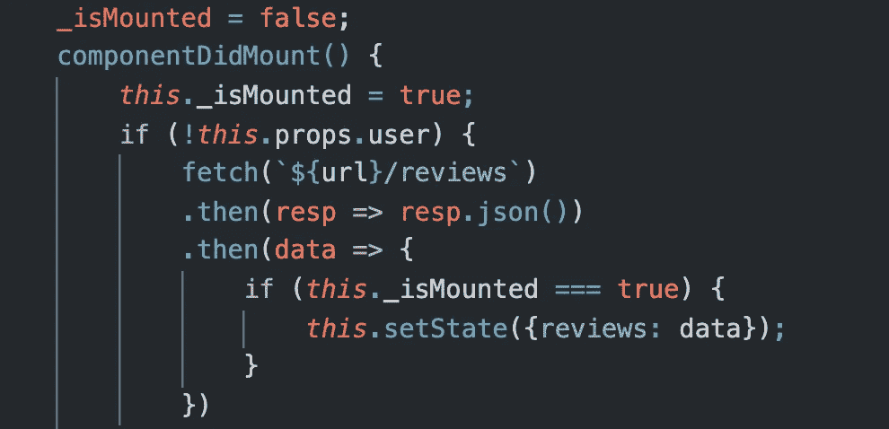
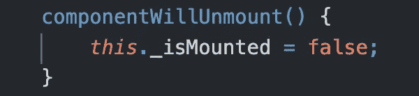

# 反应状态更新内存泄漏

> 原文：<https://blog.devgenius.io/react-state-update-memory-leak-8e84a45e1695?source=collection_archive---------2----------------------->

## 使用 componentWillUnmount()停止已卸载组件的状态更新

由 [Luis Tosta](https://unsplash.com/@luis_tosta?utm_source=medium&utm_medium=referral) 在 [Unsplash](https://unsplash.com?utm_source=medium&utm_medium=referral) 上拍摄的照片

## 警告标志

即使你的应用程序看起来运行良好，你的 DevTools 控制台中也会显示大量警告。这些是有帮助的，留意这些警告以确保它们以后不会咬你总是一个好主意。如果您发现类似以下的警告，我有一个解决方案:

我看到这个警告是因为我的异步获取请求试图在组件被卸载后改变组件的状态。幸运的是，这一失误并没有破坏任何东西，因为就像警告所说的那样，这是一次失败。No-op 是“no operation”的缩写，这实质上意味着程序忽略了更新未安装组件的状态。然而，我们最好注意这个问题，以确保我们未安装的组件不会不必要地使用任何宝贵的内存。

## 警告背后的问题

检查上面的警告，我们得到了问题所在的线索。它建议检查的第一个组件是警告第 4 行的“FeedContainer”。FeedContainer 中发生了什么导致了内存泄漏？我们需要寻找某种异步任务。

在我的 FeedContainer.js 文件中，我在 c `omponentDidMount()`和`componentDidUpdate()`生命周期中都有 fetch 请求。使用来自承诺的响应，我用`setState()`方法更新组件的状态。由于这是异步的，组件等待获取的响应来更新状态。当组件在等待 fetch 的承诺实现时被卸载，当收到响应时，`setState()`方法仍然试图在现在卸载的组件上执行。下面是`componentDidMount()`中导致内存泄漏的获取请求:

那么少了什么呢？因为我在这个应用程序中使用了生命周期方法，所以我可以利用一个`componentWillUnmount()`方法。

## 修复

为了堵塞内存泄漏，我创建了一个名为`_isMounted`的类变量，在 FeedContainer 组件中保存一个布尔值。此变量指示组件是否已安装。最初，我给这个变量赋了一个假值。在`componentDidMount()`方法开始时，_isMounted 变量被赋予一个真值。那么任何异步状态更新都是有条件的，取决于 _isMounted 变量是否为真。

接下来我添加了一个`componentWillUnmount()`方法，在这里我给`_isMounted`赋值一个假值。如果在卸载组件后**实现了获取承诺，则条件为假，并且`setState()`方法从不运行。**

我已经概述了一个组件在被卸载后试图更新其状态的解决方案。如果您在类组件中使用生命周期方法，这是可行的。如果没有，你就得用钩子。下面的 stackoverflow 帖子概述了如何在您的解决方案中使用这两种方法。

 [## 无法对卸载的组件执行反应状态更新

### 我正在 React 中编写一个应用程序，无法避免一个非常常见的缺陷，即调用 setState(...)…

stackoverflow.com](https://stackoverflow.com/questions/53949393/cant-perform-a-react-state-update-on-an-unmounted-component)