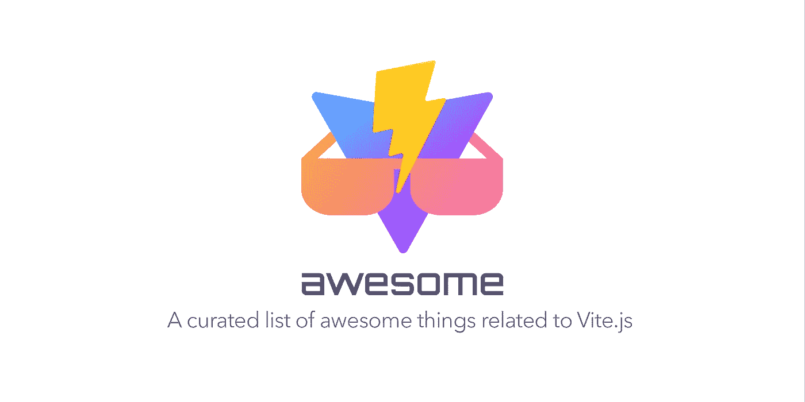

# React+Vite+Tailwind CSS+twin . macro+story book+SVG 作为 React 组件导入。

> 原文：<https://blog.devgenius.io/react-vite-tailwind-css-twin-macro-storybook-svg-imports-as-react-component-6b44d5e2641?source=collection_archive---------0----------------------->



[**Vite**](https://vitejs.dev/) 是新一代 JavaScript 构建工具，旨在改善 Webpack 的开发者在构建 JavaScript 应用时的体验。

像 Webpack 这样的基于 bundler 的工作流必须在单个浏览器请求之前处理整个 JavaScript 模块，而 Vite 只在单个浏览器请求之前处理依赖模块。当您的应用程序需要时，您的应用程序模块将由 Vite 进行转换和服务。这就是为什么 Vite 能够比 Webpack 更快地处理您的开发构建。

我有一个 react 应用程序，它包含故事书、twin.macro、tailwind 和使用 React 脚本的 story book。关于如何将这样的应用程序迁移到 Vite，没有一个单一的信息。以下是步骤

1.  从 package.json 中删除 react-scripts 并安装

```
npm install vite -D
npm install @vitejs/plugin-react
```

2.移除与 react-scripts 相关的包 json 脚本并添加 Vite 脚本

```
"scripts": {
-    "start": "react-scripts start",
-    "build": "react-scripts build",
-    "test": "react-scripts test",
-    "eject": "react-scripts eject"
+    "start": "vite",
+    "build": "vite build",
+    "preview": vite preview"
     }
```

3.[将包含 JSX 的](https://github.com/vitejs/vite/issues/769#issuecomment-780593283)文件从`*.js`重命名为`*.jsx`。

我不需要这样做，因为我所有的文件都是. tsx。

4.[将](https://vitejs.dev/guide/#index-html-and-project-root) `public/index.html`移动到`index.html`(项目根文件夹)。

5.从`index.html`上移除`%PUBLIC_URL%`:

```
-  <link rel="icon" href="%PUBLIC_URL%/favicon.ico" />
+  <link rel="icon" href="/favicon.ico" />
-  <link rel="apple-touch-icon" href="%PUBLIC_URL%/logo192.png" />
+  <link rel="apple-touch-icon" href="/logo192.png" />
-  <link rel="manifest" href="%PUBLIC_URL%/manifest.json" />
+  <link rel="manifest" href="/manifest.json" />
```

6.在`index.html`中添加入口点:

```
 <noscript>You need to enable JavaScript to run app.</noscript>
  <div id="root"></div>
+ <script type="module" src="/src/index.jsx"></script>
```

7.添加一个`vite.config.js`文件

```
import { defineConfig } from 'vite';
import react from '@vitejs/plugin-react';

export default defineConfig({
  plugins: [react()],
}
```

至此，您可以从 Vite 文档或其他媒体文章中获得信息。现在当你跑的时候

```
npm start
```

Vite dev 服务器运行在 [http://localhost:3000，](http://localhost:3000,)但是 UI 没有呈现。我将列出所有故障以及我是如何解决的。

# 失败和解决方案

1.  Svg 图标错误

```
Uncaught SyntaxError: The requested module '/src/Icons/logo.svg?import' does not provide an export named 'ReactComponent'
```

我已经将 svg 文件作为 ReactComponent 导入到我的组件中。React scripts 内置了`[svgr](https://github.com/gregberge/svgr)`，可以将 SVG 转换成随时可用的组件，这是 Vite 所没有的。

## 分辨率:

安装 [vite-plugin-svgr](https://www.npmjs.com/package/vite-plugin-svgr) —将 SVG 转换成 React 组件的 vite 插件。

更新 `vite.config.js`文件

```
import { defineConfig } from 'vite';
import react from '@vitejs/plugin-react';
import svgrPlugin from 'vite-plugin-svgr';

export default {
  plugins: [
     react(),    
     svgrPlugin({
      svgrOptions: {
        icon: true,
      },
    }),
  ],
}
```

2.巴别尔误差

```
Uncaught ReferenceError: Process is not defined
```

在 Vite 中，他们使用`import.meta.env.*`来访问 ENV 变量，然而，一些像 Babel 这样的库在他们的源代码中使用`process.env`，这导致了运行时错误`Uncaught ReferenceError: process is not defined`。

## 分辨率:

安装[与 vite-plugin-env 兼容的](https://www.npmjs.com/package/vite-plugin-env-compatible)。这个插件支持设置前缀如`VUE_APP_`或`REACT_APP_`，并加载到 process.env

更新 `vite.config.js`文件

```
import { defineConfig } from 'vite';
import react from '@vitejs/plugin-react';
import svgrPlugin from 'vite-plugin-svgr';
import envCompatible from 'vite-plugin-env-compatible';export default {
  plugins: [
     react(),
     envCompatible(),   
     svgrPlugin({
      svgrOptions: {
        icon: true,
      },
    }),
  ],
}
```

3.双宏误差

```
Uncaught TypeError:css is not a function
```

我使用过 twin.macro 中的 css，如下所示:

```
import { css } from 'twin.macro';const aspectSquare = css`{ aspect-ratio: 1; }`;
```

## 分辨率:

安装 vite-plugin-babel- [宏](https://www.npmjs.com/package/vite-plugin-babel-macros)。这个插件支持 [Vite](https://vitejs.dev/) 项目中的[巴别塔宏](https://github.com/kentcdodds/babel-plugin-macros)。

更新`vite.config.js`文件

```
import { defineConfig } from 'vite';
import react from '@vitejs/plugin-react';
import svgrPlugin from 'vite-plugin-svgr';
import envCompatible from 'vite-plugin-env-compatible';
import macrosPlugin from 'vite-plugin-babel-macros';export default {
  plugins: [
     react(),
     envCompatible(),
     macrosPlugin(),  
     svgrPlugin({
      svgrOptions: {
        icon: true,
      },
    }),
  ],
}
```

4.没有应用顺风 Css

```
warn - The `content` option in your Tailwind CSS configuration is missing or empty.
warn - Configure your content sources or your generated CSS will be missing styles.
warn - https://tailwindcss.com/docs/content-configuration
```

UI 没有出现错误，但是我的 UI 组件看起来很奇怪，因为没有应用 tailwind css。

## 分辨率:

安装`[vite-plugin-windicss](https://windicss.org/integrations/vite.html)`。这个插件从`tailwind.config.js`加载配置

更新 `tailwind.config.js`文件

```
 module.exports {
  content: [
+   "./index.html"
    "./src/**/*.{js,jsx,ts,tsx}"
    ]
  }
  ...
```

更新 `vite.config.js`文件

```
import { defineConfig } from 'vite';
import react from '@vitejs/plugin-react';
import svgrPlugin from 'vite-plugin-svgr';
import envCompatible from 'vite-plugin-env-compatible';
import macrosPlugin from 'vite-plugin-babel-macros';
import WindiCSS from 'vite-plugin-windicss'export default {
  plugins: [
     react(),
     envCompatible(),
     macrosPlugin(),
      WindiCSS(),     
      svgrPlugin({
      svgrOptions: {
        icon: true,
      },
    }),
  ],
}
```

5.现在，一切看起来都很好，但我们也需要为故事书使用 vite，以保持一致。Storybook 也不适用于我现有 webpack5 builder。

## 分辨率:

安装[故事书-构建器-邀请](https://github.com/eirslett/storybook-builder-vite)。该插件从`tailwind.config.js`加载配置。这允许你使用 Vite 来创建故事书。

更新`.storybook/main.js`文件

```
 module.exports = {
      "stories": [
      "../src/stories/**/*.stories.@(js|jsx|ts|tsx)"
     ],
  "framework": "@storybook/react",
  core: {
+   builder: "storybook-builder-vite"
-   builder: "webpack5"
   }
 }
```

6.故事书中的 Svg 图标错误

```
Uncaught SyntaxError: The requested module '/src/Icons/logo.svg?import' does not provide an export named 'ReactComponent'
```

现在 storybook-builder-vite 默认不读取`vite.config.js`文件，这就是为什么我们得到上面的错误。

## 分辨率:

在`.storybook/main.js`中，我们需要覆盖 Vite 配置，如下所示:

```
const svgrPlugin = require('vite-plugin-svgr');module.exports = {
  async viteFinal(config, { configType }) {
    // customize the Vite config here
    config.plugins = [
      ...config.plugins,
      svgrPlugin({
        svgrOptions: {
          icon: true,
        },
      })
    ];

    // return the customized config
    return config;
  },
  "stories": [
      "../src/stories/**/*.stories.@(js|jsx|ts|tsx)"
     ],
  "framework": "@storybook/react",
  core: {
     builder: "storybook-builder-vite"
   }
 }
```

7.现在，我又在故事书里遇到了双宏错误

```
Uncaught tw.div is not a function
```

## 分辨率:

好了，现在我知道该怎么做了，我需要在 main.js 中添加 babel 宏和 tailwind vite 插件

更新`.storybook/main.js`文件

```
const svgrPlugin = require('vite-plugin-svgr');
const macrosPlugin = require('vite-plugin-babel-macros)';
const WindiCSS = require('vite-plugin-windicss)'module.exports = {
  async viteFinal(config, { configType }) {
    // customize the Vite config here
    config.plugins = [
      ...config.plugins,
      macrosPlugin(),
      WindiCSS(),
      svgrPlugin({
        svgrOptions: {
          icon: true,
        },
      })
    ];

    // return the customized config
    return config;
  },
  "stories": [
      "../src/stories/**/*.stories.@(js|jsx|ts|tsx)"
     ],
  "framework": "@storybook/react",
  core: {
     builder: "storybook-builder-vite"
   }
 }
```

7.故事书中的插件错误

```
TypeError: macrosPlugin is not a function.
```

## 分辨率:

出于某种原因，当使用“require”时，vite-plugin-babel-macros 和 vite-plugin-windicss 的默认值都显示为`.default`。所以，我需要打电话。`default()`。

更新`.storybook/main.js`文件

```
const svgrPlugin = require('vite-plugin-svgr');
const macrosPlugin = require('vite-plugin-babel-macros)';
const WindiCSS = require('vite-plugin-windicss)'module.exports = {
  async viteFinal(config, { configType }) {
    // customize the Vite config here
    config.plugins = [
      ...config.plugins,
      macrosPlugin.default(),
      WindiCSS.default(),
      svgrPlugin({
        svgrOptions: {
          icon: true,
        },
      })
    ];

    // return the customized config
    return config;
  },
  "stories": [
      "../src/stories/**/*.stories.@(js|jsx|ts|tsx)"
     ],
  "framework": "@storybook/react",
  core: {
     builder: "storybook-builder-vite"
   }
 }
```

最后，故事书和本地开发服务器在所有这些变化之后都工作了。希望这对那些想转用 Vite 的人有所帮助。