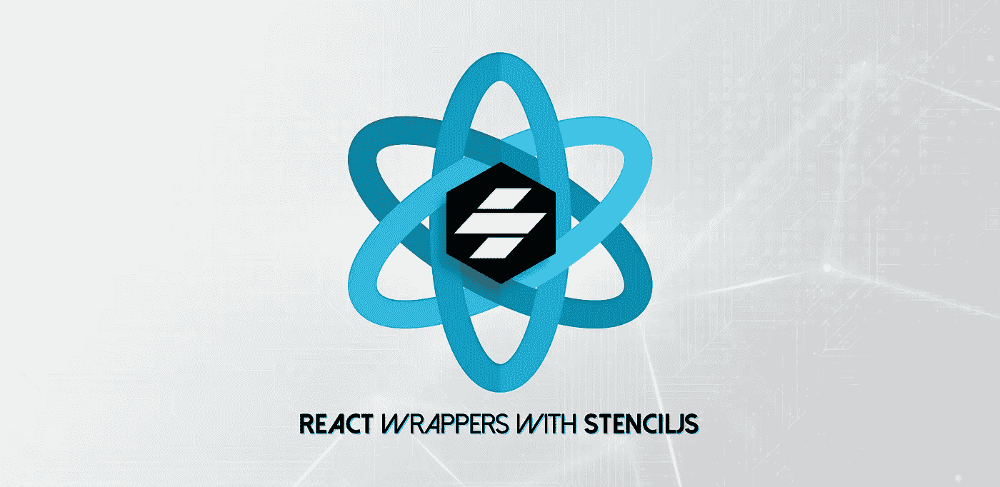
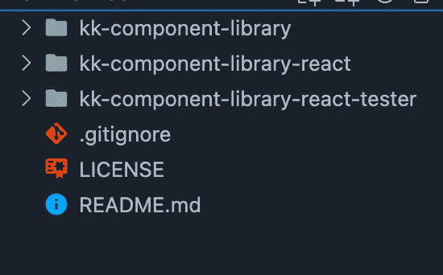
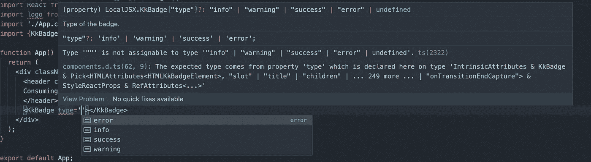

# 用 StencilJS 反应包装器

> 原文：<https://blog.devgenius.io/react-wrappers-with-stenciljs-6b574500f6f6?source=collection_archive---------2----------------------->



在上一篇文章中，我们介绍了 StencilJS 如何让我们更容易地使用 web 组件。

[](https://medium.com/@kkakroo/working-with-stenciljs-a4d75f7b1131) [## 使用模板 JS

### StencilJS 如何简化 Web 组件的使用

medium.com](https://medium.com/@kkakroo/working-with-stenciljs-a4d75f7b1131) 

我们还学习了什么是 Web 组件以及如何开始使用它们。

[](https://medium.com/@kkakroo/what-are-web-components-cbfdf08c35a9) [## 什么是 Web 组件

### 什么是 Web 组件以及如何开始使用它们。

medium.com](https://medium.com/@kkakroo/what-are-web-components-cbfdf08c35a9) 

现在我们将看到如何从模板组件库中创建 react 包装器。

但在此之前，我们需要理解为什么我们需要这些。

在上一篇文章中，我们使用了一个徽章来理解模板是如何工作的。虽然徽章可以很好地与 react 一起工作，但是当组件开始变得复杂时，我们会遇到一些问题。

1.  HTML 自定义元素不支持现成的复杂属性/特性。
2.  智能感知——我们需要好东西。类型检查、props 元数据和自动完成。这是我们消费原生包时得到的东西。
3.  自定义事件处理不正确。

为了理解这些问题，我们创建了一个简单的模板组件，它接受一个列表并在浏览器中显示它。

这里`kk-list`有一个属性`items`,它是一个字符串数组，并从项目中呈现一个`ul`。

现在我们尝试从一个 HTML 页面中消费`kk-list`

但是当我们试图使用它时，它不起作用，工作示例[这里是](https://codesandbox.io/s/stencil-complex-object-issues-7nh4xp?file=/index.html)。

这是因为不支持除了`boolean`、`number`和`string`之外的任何道具。

这个问题的解决方案是使用 javascript 获取元素并将属性传递给它，这在下面实现。

这里我们用 javascript 获取 HTML 定制元素(第 21 行),并传递 prop，这样就可以了。工作示例[此处](https://codesandbox.io/s/stencil-complex-object-fix-1zp9hq?file=/index.html)。

类似地，这可以通过使用 [ref](https://reactjs.org/docs/refs-and-the-dom.html) 在 React 中实现，这里的工作示例[是](https://codesandbox.io/s/stencil-complex-object-react-qxk508?file=/src/App.js)

这种方法不太方便，在 React 中工作的人不会觉得这很直观。

此外，我们没有任何智能感知、类型检查，元数据也无法通过。在组件库的情况下，知道什么是道具、它们的描述以及要传递什么值是非常有帮助的。

为了帮助我们解决这些问题并提供原生体验，stencil 为我们提供了为不同框架添加输出目标的插件。

这将发出一个包，其行为与在这些框架中创建的本地包相同。

我们现在只关注 React，因为其他框架的过程可能会有所不同。目前支持 Angular，Ember，React 和 Vue。

一旦设置完成，您就可以在 stencil 中一次性创建组件，并在任何受支持的框架中生成本地组件库。

Stencil 建议采用单一回购结构。



用于模板反应包装材料的单报告结构

`kk-component-library` —需要为其创建 react 包装器的模板 js 组件库(在前一篇文章中创建)

`kk-component-library-react` —帮助从模板组件库中创建 react 包的模板。从[这里下载](https://github.com/ionic-team/stencil-ds-react-template)

`kk-component-library-react-tester`(可选)—生成的 React 包的 React tester 应用程序。仅添加用于测试生成的包。

首先，我们需要将包`[@stencil/react-output-target](https://www.npmjs.com/package/@stencil/react-output-target)`添加到组件库中。这有助于配置我们的组件库来构建 React 包装的组件。

我们先安装它

```
cd kk-component-library
npm install @stencil/react-output-target
```

安装完成后，我们需要更新 stencil.config.ts 文件，如下所示

这里，我们通过使用已安装的包为 React 添加了一个新的输出目标(第 7 行)。

我们为它提供了`proxiesFile`的路径(定义文件需要在这里生成)。模板项目需要这个文件来生成 React 包装器。

当`includeDefineCustomElements`为真时，React 组件将从`dist-custom-elements`而不是`dist`导入和定义元素，这是一种更优化的树抖动方式，也是 stencil 推荐的方式。如果一个库有多个组件，并且只使用了其中的一部分，那么所有的代码都不会被放到项目中。

一旦设置好了，我们就可以通过命令构建组件库

```
npm run build
```

这将在下面提到的路径上生成`proxiesFile`

一旦构建成功，我们就发布库(包装项目将需要这个发布的包)

```
npm publish
```

现在，我们的模板组件库包已经发布到 npm [这里](https://www.npmjs.com/package/kk-component-library)，我们转到模板项目并安装新发布的库。

我们还需要根据我们在`package.json`文件中的要求更新包名和描述。

```
cd kk-component-library-react
npm install kk-component-library
```

一旦安装了库，我们就构建模板项目

```
npm run build
```

一旦它构建成功，我们就可以发布它了

```
npm publish
```

我们的 react 包已经准备好并在这里发布[。](https://www.npmjs.com/package/kk-component-library-react)

现在我们可以转移到 tester 项目，安装软件包并运行它

```
cd kk-component-library-react-tester
npm i kk-component-library-react
```

如下更新`App.tsx`

我们可以在第 23 行看到，我们能够将一个项目列表直接传递给`KkList`



流经 react 包的 Intellisense 和属性元数据

此外，所有的智能感知和元数据也流过，工作示例[在这里](https://codesandbox.io/s/kk-component-library-react-tester-ut1swf)。

所有代码都可以在[这里](https://github.com/kkakroo/stencil-js)找到

有一个[提议](https://github.com/facebook/react/issues/11347)来改进[对 React 中自定义元素](https://custom-elements-everywhere.com)的支持，这是一个实验版本，可能会在 React 的未来版本中结束。

希望你喜欢这篇文章。如有任何建议或问题，可在[*LinkedIn*](https://www.linkedin.com/in/kkakroo/)*与我联系或在下方评论。*