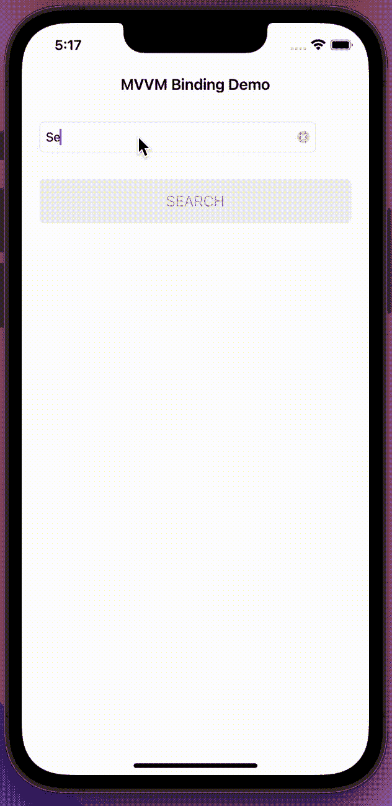

# UIKit 中的反应性 MVVM 模式

> 原文：<https://blog.devgenius.io/reactive-mvvm-pattern-in-uikit-30dde1574b6b?source=collection_archive---------0----------------------->

## 在 UIKit 项目中应用 MVVM 模式的最佳实践

照片由[格式](https://www.pexels.com/it-it/@format-380633?utm_content=attributionCopyText&utm_medium=referral&utm_source=pexels)来自[像素](https://www.pexels.com/it-it/foto/foto-di-imac-near-macbook-1029757/?utm_content=attributionCopyText&utm_medium=referral&utm_source=pexels)

最近几天，Model-View-ViewModel 模式成为了一个标准，每个 iOS 开发者都必须知道。

在今天的文章中，我将向你展示如何在经典的 UIKit 上使用著名的 MVVM 模式，构建一个非常简单的应用程序，但是使用一种反应式的方法。我将指导您完成该模式中使用的所有步骤和术语。

## 介绍

几周前，我写了一篇使用 SwiftUI 框架处理 MVVM 模式的文章([完整文章可在此处](/mvvm-pattern-in-swiftui-a-practical-example-c79c5cc44f74)获得，或者 [YouTube 视频可在此处](https://www.youtube.com/watch?v=uD17rPSUnm0))，但是如果你是一名“普通”的 iOS 开发人员，你可能必须从事相当老的项目。开发必须与旧操作系统兼容的应用确实非常普遍，所以你将无法使用 SwiftUI 和 Combine 这样的现代框架。这可能会令人难过和沮丧，但它不能阻止你尝试编写干净和高性能的代码。一个解决方案可以是使用第三方框架，比如 RXSwift，但是说实话，自己编写功能代码要有趣得多！

首先，让我们看看我们要编码的最终应用程序。为了简单起见，我设计了一个超级简单的 UI。一个文本列表，一个活动指示器，一个按钮，没有错误弹出窗口，没有哨声和铃声…

在本例中，当用户在搜索字段中至少输入三个字符时，搜索按钮自动启用。当点击该按钮时，加载轮开始活动，并且仅当从服务器获取结果列表并显示在 UITableView 的屏幕上时才停止。

# MVVM——一些理论

什么是 MVVM 模式？如果你正在阅读这篇文章，你可能已经有一个模糊的想法，但请允许我解释一下。让我们从维基百科的定义开始:

> ***模型:*** *模型*要么指的是[领域模型](https://en.wikipedia.org/wiki/Domain_model)，它表示真实状态内容(一种面向对象的方法)，要么指的是[数据访问层](https://en.wikipedia.org/wiki/Data_access_layer)，它表示内容(一种以数据为中心的方法)。
> 
> ***视图*** :在[模型-视图-控制器](https://en.wikipedia.org/wiki/Model%E2%80%93view%E2%80%93controller) (MVC)和[模型-视图-演示者](https://en.wikipedia.org/wiki/Model%E2%80%93view%E2%80%93presenter) (MVP)模式中，*视图*是用户在屏幕上看到的结构、布局和外观。它显示模型的表示，并接收用户与视图的交互(鼠标点击、键盘输入、屏幕点击手势等)。)，并通过[数据绑定](https://en.wikipedia.org/wiki/Data_binding)(属性、事件回调等)将这些处理转发给视图模型。)被定义为链接视图和视图模型。
> 
> ***视图模型:****视图模型*是公开公共属性和命令的视图的抽象。MVVM 不是 MVC 模式的控制器，也不是 MVP 模式的呈现者，他有一个*绑定器*，它自动化了视图和它在视图模型中的绑定属性之间的通信。视图模型被描述为模型中的数据状态。在 MVP 模式中，视图模型和表示者之间的主要区别在于，表示者有对视图的引用，而视图模型没有。相反，视图直接绑定到视图模型的属性来发送和接收更新。为了有效地运行，这需要一种绑定技术或者生成[样板代码](https://en.wikipedia.org/wiki/Boilerplate_code)来进行绑定。
> 
> ***绑定器*** :声明性数据和命令绑定隐含在 MVVM 模式中。在微软[解决方案栈](https://en.wikipedia.org/wiki/Solution_stack)中，绑定器是一种[标记语言](https://en.wikipedia.org/wiki/Markup_language)，叫做 [XAML](https://en.wikipedia.org/wiki/XAML) 。绑定器使开发人员不必编写锅炉板逻辑来同步视图模型和视图。当在微软堆栈之外实现时，声明性数据绑定技术的出现使这种模式成为可能，如果没有绑定器，人们通常会使用 MVP 或 MVC，并且必须编写更多的样板文件(或者用其他工具生成它)。

嗯，这个定义相当冗长，所以也许一张图片和一些简单的单词会有所帮助:

我们来解释一下。我们有三个主要组成部分。视图将负责创建所有的 UI 小部件，并在屏幕上呈现它们。该模型将保存所有要在屏幕上显示的原始数据，ViewModel 将负责所有的业务逻辑，并操纵来自模型的数据，以便根据需要将它们显示在屏幕上。

每个组件*可以与一个或两个其他组件*通信，如下所示:

*   视图将只与视图模型对话。
*   视图模型将直接与模型对话，间接与视图对话，以某种方式(我们将在后面看到)通知它状态的变化。
*   模型将与视图模型间接对话，通知其状态的变化。

每个组件*知道*其他组件遵循以下规则:

*   视图确切地知道谁是它的视图模型，因为它拥有它的一个实例。视图对模型一无所知。
*   ViewModel 确切地知道谁是它的模型，因为它拥有它的一个实例。ViewModel 与某个视图对话，但它不知道这个视图是谁。
*   该模型与某个 ViewModel 对话，但它不知道它到底是谁。模型对视图一无所知。

模型将与视图模型对话，视图模型将使用绑定器与视图对话。

让我们考虑一下视图模型与视图本身的通信。

有许多方法允许 ViewModel 向视图发送消息。要实现一个纯 MVVM 模式，第一个模式必须对第二个模式一无所知，例如，协议不是一个好主意，因为视图模型会产生一个小的耦合。第二种选择是在每次视图需要更新时使用闭包，但是有一种更好更干净的方法:**Binder 对象**。

# 编写代码

为了对我将要处理的数据有一个概念，我从唯一需要的 REST 服务开始，iTunes 的[搜索 API，并分析响应以便为模型创建一个结构。](https://developer.apple.com/library/archive/documentation/AudioVideo/Conceptual/iTuneSearchAPI/index.html#//apple_ref/doc/uid/TP40017632-CH3-SW1)

## 模型

这是一个 JSON 响应的例子:

如您所见，响应有一个带有两个属性的根对象: **resultCount** 和一个数组 **results** 。结果对象有很多属性，但是对于我们的例子，我们只需要其中的几个。

使用 JSON 作为参考，我对响应的模型进行了编码:

这是不言自明的，但是看看第 18 行发生了什么。我已经用一个静态计算的 var 创建了一个扩展，我将在我的项目中使用它来准备好一个**示例**。这东西在很多方面都非常有用。例如，您可能需要一个成型的模型在您的测试套件中使用……
有时您不希望您的示例在生产版本中发布到 AppStore，因此只需添加**活动编译条件**以在需要时排除这部分代码。

## 视图…实际上是视图控制器

我们的模型完成后，下一步将是为我们的应用程序创建一个简单的 UI。一个搜索字段、一个活动指示器、一个表格视图和一个执行搜索的按钮就足够了。

这将是我们的应用程序的主要和唯一的 **ViewController** 。

让我们解释一下代码:

*   第 8 行:实例化了一个 **ViewModel** 类，稍后将使用它来执行应用程序的所有逻辑任务。每次 **ViewController** 需要做一些逻辑时，都会引用 **ViewModel** 。风投必须尽可能保持沉默。这个类中的代码必须只处理更新用户界面。
*   第 35 行:我们稍后会回来实现这个函数，因为它非常重要。
*   第 49 行:单元格在这里组成。如您所见，单元格本身是一个**视图**，因此它不会直接与模型对话。一个 **SearcResultVM** 由主视图模型创建(它创建所有的逻辑……)并被赋予单元格。

## 粘合剂

在继续学习 ViewModel 之前，我需要向您展示这个新的基本对象。输入活页夹！

我们必须找到一种方法，每当 ViewModel 中的属性改变其值时，自动触发 View/ViewController 上的函数或闭包。对象是这样的:

*   第 1 行:该类有一个**泛型**，因为我们将使用它来绑定任何类型的对象。
*   第 5 行:每次值变量被更新时，都会触发一个函数。
*   第 13 行:这是这个类唯一的公共方法。我们将从 ViewController 调用它来配置我们希望在绑定值的每次更新时执行的操作。
*   第 18 行:因为我们将使用这个对象来更新 View/ViewController 中的 UI 内容，所以在主线程上调度这个动作以避免崩溃总是安全的。

在看到**活页夹**工作之前，让我们先看看另一个组件…

## 视图模型

是时候编写我们的小应用程序的引擎了，主视图模型。

很好，让我们来看看这段代码…

首先让我们关注一下**绑定器**对象:

对于我们希望在 ViewController 中自动更新的所有内容，我们需要一个 Binder 类型的属性。如您所见，我们需要为每个对象指定一个通用值和一个默认值。

*   第 1 行:这个数组的更新将重新加载 tableView。
*   第 2 行:每次这个变量改变时，我们可以显示一个错误弹出窗口(本教程中不使用)。
*   第 3 行:这个变量将驱动搜索按钮的启用/禁用状态
*   第 4 行:这个 bool 将在我们的 ViewController 中显示/隐藏加载指示器。

让我们回到主 ViewModel 类…

*   第 8 行:每当这个属性被更新时，它将使用第 46 行的函数设置控制搜索按钮状态的绑定变量的值。
*   第 12 行:使用 iTunes Web 服务完成搜索。根据结果，在第 30 或 33 行更新变量。请注意，这里没有必要回到主线程，因为任务已经在绑定变量中完成了。
*   第 39 行:这里创建了一个 SearchResultViewModel。我们以前见过它，它被用于创建 tableView 的单元格。让我们看看这个班…

超级简单的类，它只是一个包装器，精心制作模型并以不同的方式返回一些变量。

注意，绑定值是使用对象本身的`.value`属性更新的。

## 设置绑定

是时候回到我们最初的 ViewController 来实现最后剩下的函数`setupBindings()`了。

如您所见，更新 ViewController 所需的所有代码都在这里，不再扩展到整个类。由于一个简单的闭包，viewModel 的每个绑定变量都与 UI 的一些更新相关联。每次变量更新时，闭包都会被触发。函数`.bind()`用于实现这一结果。

一切都很干净整洁。

## 让它变得更好…

绑定器可以工作，但是你用得越多，你就会发现闭包几乎是一样的:绑定一个 var 到一个按钮状态，绑定一个 var 并重新加载 tableView，等等…

避免重复编写相同代码的一个聪明方法是为我们需要绑定的每种 UI 组件创建扩展……这真的非常简单:

如你所见，我只为最常见的 UI 元素创建了几个扩展…你可以随意添加。

现在，通过我们的扩展，我们可以重写我们的`setupBindings()`函数:

超干净，超精干，超可读！

我希望你喜欢这篇文章，如果你喜欢，请鼓掌。
如果这篇文章对你有用，请随意[给我一杯咖啡](https://www.buymeacoffee.com/dy59tqxn794)并允许我创造更多酷的内容和文章。

我也有一个 YouTube 频道:【https://www.youtube.com/channel/UCHv7KRr7VeG5Oe-6BxTIRww 

支持我，喜欢就订阅👍

享受你的编码！

 [## 通过我的推荐链接加入 Medium—Alessandro mani LII

### 作为一个媒体会员，你的会员费的一部分会给你阅读的作家，你可以完全接触到每一个故事…

medium.com](https://medium.com/@alessandromanilii/membership)