# Java Quartz、DynamoDB 和 Quarkus 的反应式定时器微服务。

> 原文：<https://blog.devgenius.io/reactive-timer-microservice-with-java-quartz-dynamodb-and-quarkus-bb4cf6e0dc23?source=collection_archive---------6----------------------->

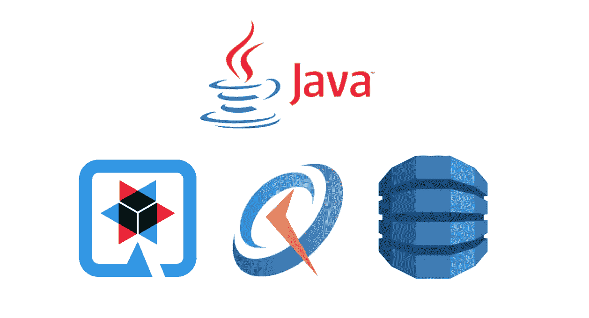

Java，Quarkus，Quartz 和 DynamoDB。

在继续我们的前端对应物之前，让我们谈谈 AWS 上的后端微服务。正如我在过去的文章中提到的，我一直在为智能城市的物联网平台进行个人倡议。我想分享一个令人兴奋的服务，它允许我们使用 Java Quartz 以编程方式创建预定任务。考虑到这个服务，假设您想要创建一个定时任务，在一天中的特定时间和一周中的特定日期打开垃圾收集器机器人。有趣吧？！让我们从用提到的技术创建微服务开始这篇文章。然后，在接下来的文章中，我们将使用 ECS Fargate 和本地 Docker 映像在 AWS 上部署这个微服务。

要完成本指南，您需要:

*   使用 Java 17 的 GraalVM，以及相应的适当配置的`JAVA_HOME`和`GRAALVM_HOME` 。
*   Apache Maven 3.8.1 或更高版本。
*   像 IntelliJ 或 Eclipse 这样的 IDE。
*   访问 DynamoDB 服务的 AWS 帐户。

**注**:您可以按照下面的说明从我的 GitHub 账号下载 [***项目库***](https://github.com/aosolorzano/java-timer-service-quarkus) 。

以下命令在您配置的 DynamoDB 帐户上创建任务表:

```
# aws dynamodb create-table --table-name Task \
    --attribute-definitions AttributeName=id,AttributeType=S \
    --key-schema AttributeName=id,KeyType=HASH \
    --billing-mode PAY_PER_REQUEST
```

然后，是时候用下面的 maven 命令创建我们的新 CRUD 项目，并用我们最喜欢的 IDE 打开它:

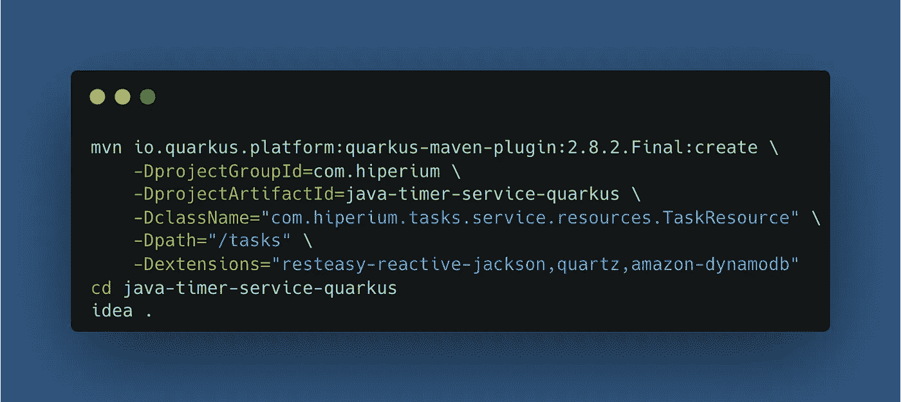

首先，创建我们的任务实体:

```
@RegisterForReflection
**public class** Task {

    **private** String id;
    **private** String name;
    **private** Integer hour;
    **private** Integer minute;
    **private** List<String> daysOfWeek;
    **private** String executionCommand;
    **private** ZonedDateTime executeUntil;
    **private** String description;
    **private** ZonedDateTime createdAt;
    **private** ZonedDateTime updatedAt;
    ...
}
```

**注意**:注释“*@ RegisterForReflection”*指示 Quarkus 在原生编译期间保留类及其成员。

创建一个包含帮助器方法的抽象任务服务，这些方法为任务表上的 CRUD 操作构建 DynamoDB 请求:

```
**public abstract class** AbstractTaskService {

    **protected** ScanRequest scanRequest() {
      ...
    } **protected** GetItemRequest getItemRequest(String id) {
      ...
    } **protected** PutItemRequest getPutItemRequest(Task task) {
      ...
    } **protected** UpdateItemRequest getUpdateItemRequest(
      Task actualTask, Task updatedTask) {
      ...
    } **protected** DeleteItemRequest getDeleteItemRequest(Task task) {
      ...
    }
}
```

我们可以结合使用 AWS SDK 版本 2 中当前支持的异步编程模型和 [**哗变库**](https://smallrye.io/smallrye-mutiny/index.html) 以反应方式与我们的任务表进行交互:

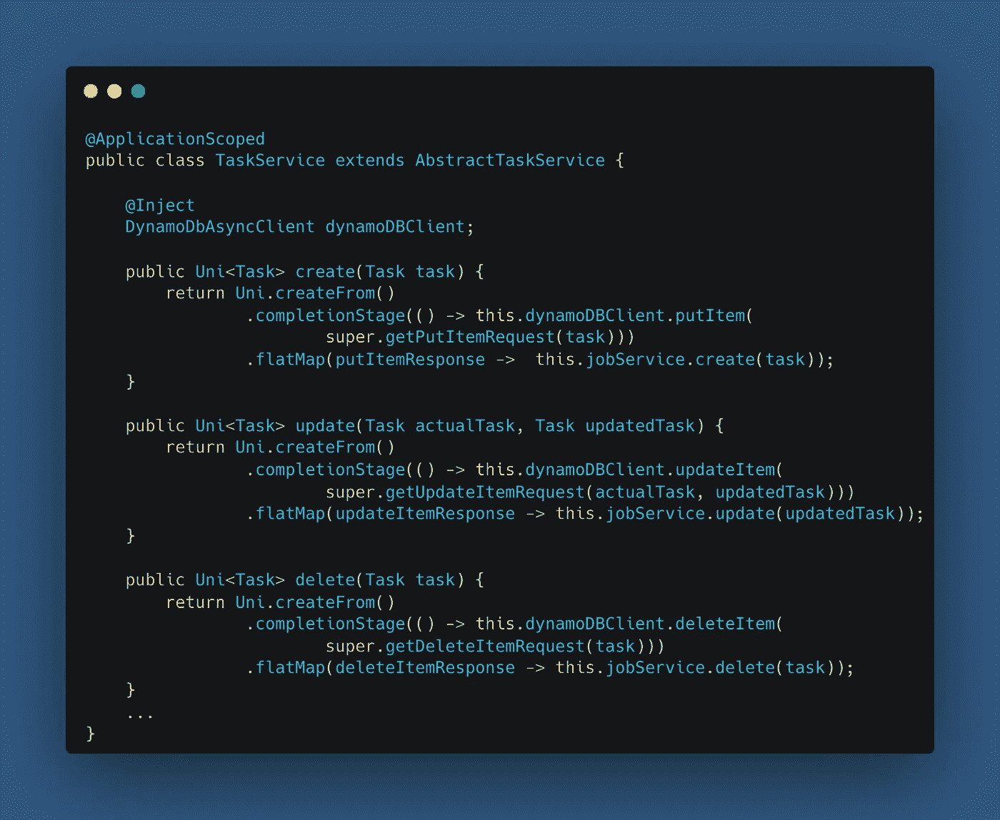

所有这些操作还必须创建 Quartz 作业，这些作业必须在任务对象中指定的特定日期和时间自动执行:

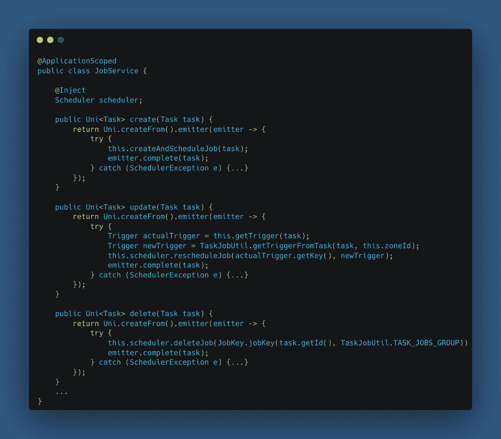

现在是时候创建我们的异步 REST 资源组件了，它以异步方式使用 CRUD 服务方法:

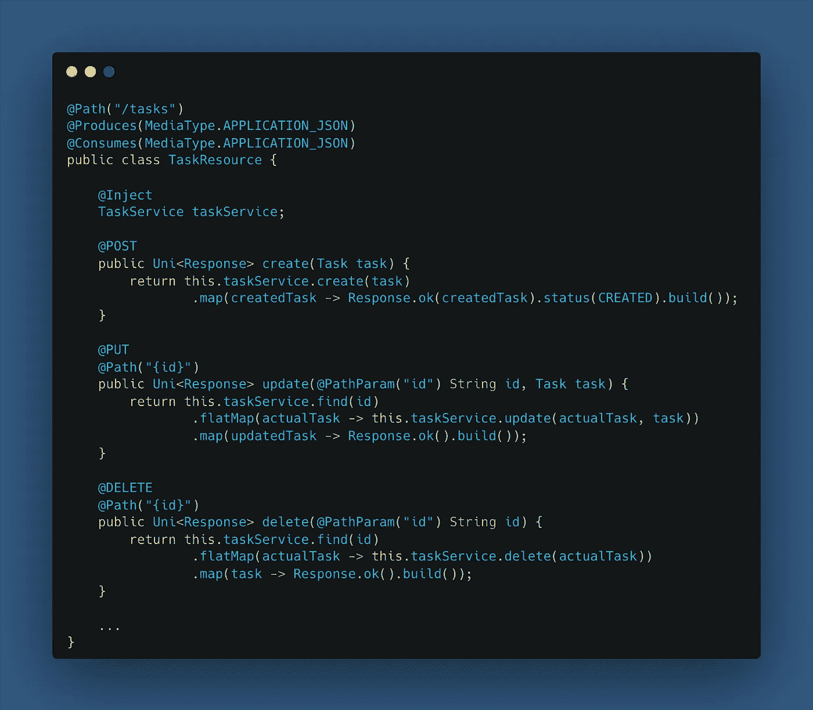

请注意，我在前面的图片中省略了很多代码。您可以找到更多代码，如验证、异常处理、实用程序类等。，在我的 [*项目资源库*](https://github.com/aosolorzano/java-timer-service-quarkus)GitHub 上。

为了使用异步 HTTP 调用与 DynamoDB 进行交互，我们需要 Maven POM 中的 NIO 客户端依赖:

```
<dependency>
    <groupId>software.amazon.awssdk</groupId>
    <artifactId>netty-nio-client</artifactId>
</dependency>
```

为了结束这一部分，我想向您展示的最后一个组件是执行作业操作的类。该类必须包含作业执行期间执行的业务逻辑。在这里，您可以与您的架构中的其他微服务进行交互，或者与 AWS SQS 等预定义服务进行交互，以发送其他软件组件必须以事件驱动的架构方式使用的消息:

```
**public class** TaskJob **implements** Job {

    @Override
    **public void** execute(JobExecutionContext executionContext) {
        *LOGGER*.debug("execute() - START");
        /* Your business logic */
        *LOGGER*.debug("execute() - END");
    }
}
```

是时候在本地部署我们的微服务了；您只需要执行以下命令来启动我们的 Quarkus 应用程序:

```
# mvn clean package
# java -jar target/quarkus-app/quarkus-run.jar
```

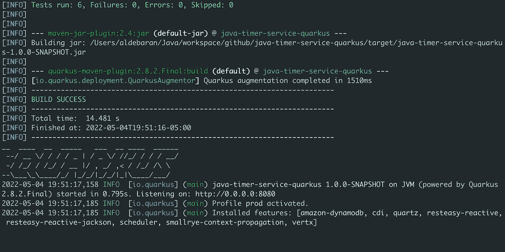

我用邮差工具消费了微服务的 REST 方法。让我们从最简单的 POST 方法开始:

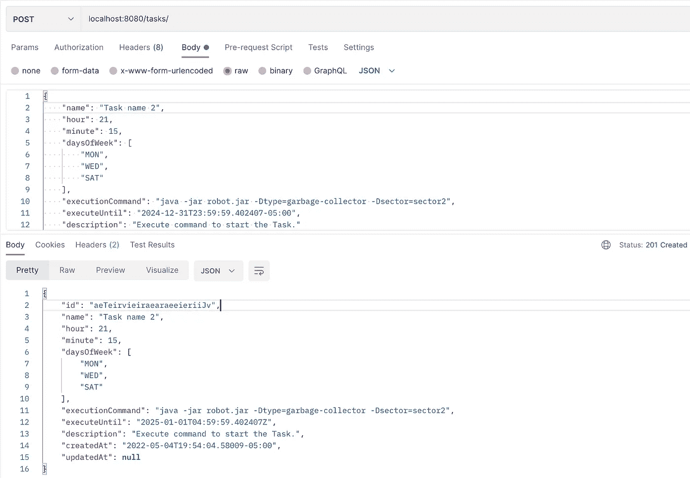

我创建了一个任务，必须在周一、周三和周六的 21:15 执行。该任务完成后，必须运行“ *executionCommand* ”字段中指示的命令。正如我在本文开头提到的，这个任务模拟由我在 AWS 上构建的物联网平台管理的垃圾收集器机器人的激活。然后，我们下面的消费方法是一个 GET 操作:

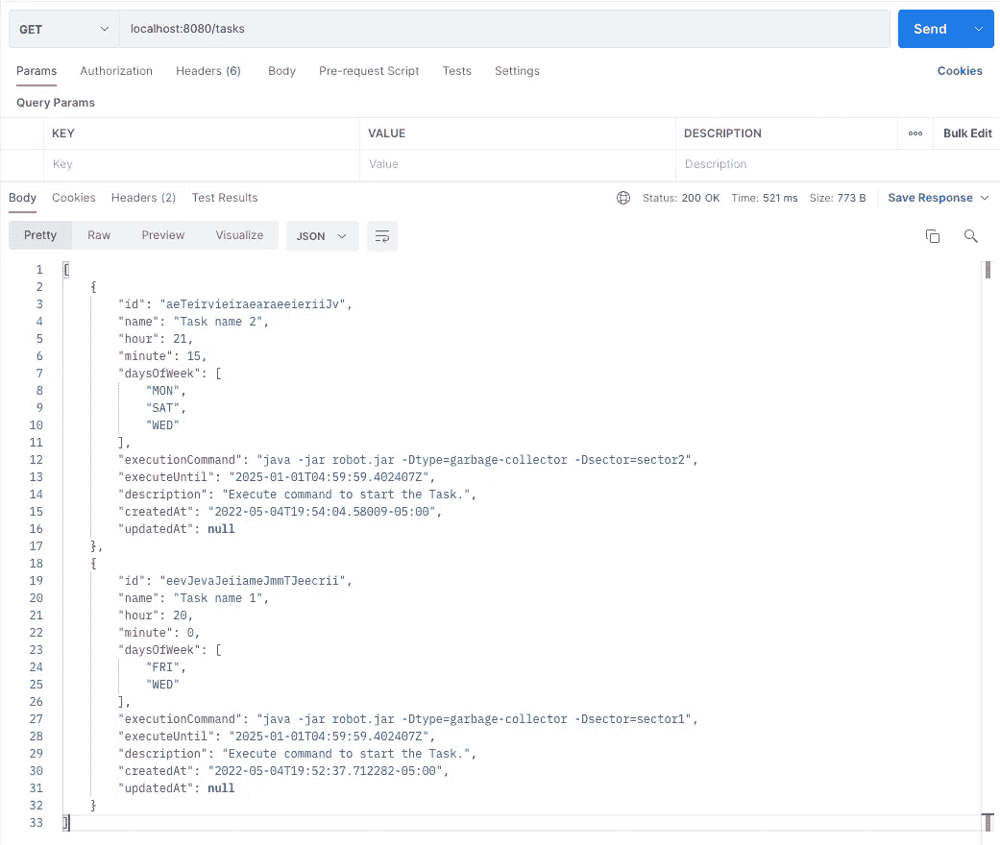

这里你可以看到我已经创建了两个任务。最后一个必须在周三周五 20:00 执行。当我写这几行字的时候，是星期三晚上。当完成此任务的时间到来时，我们的终端将打印以下行:

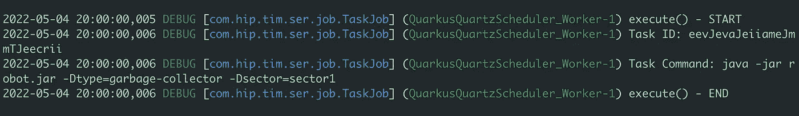

在上图中，您可以看到我之前描述的“TaskJob”类的“execute”方法。请注意，图中显示的日期时间是 20:00 小时。让我们更新配置为在 21:15 执行的任务，以便它更早执行。

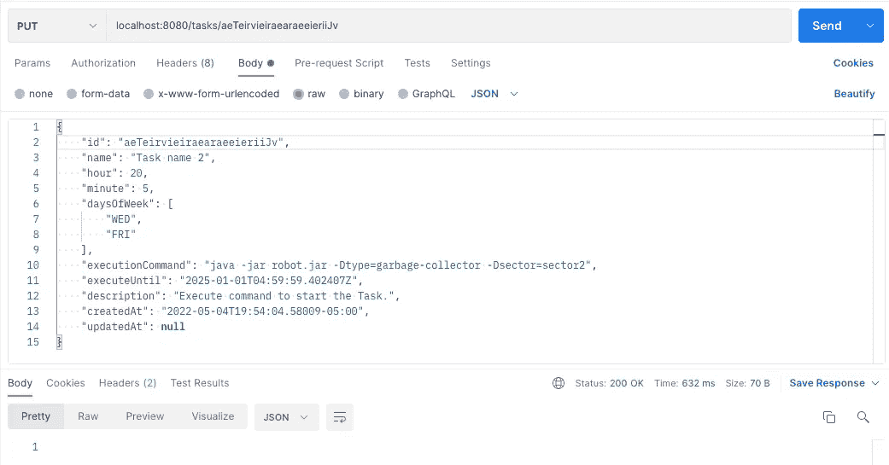

我更新了“daysOfWeek”字段以及“小时”和“分钟”，所以现在我们的任务将在 20:05 运行。如果我们再次执行 GET 方法，我们将看到更新后的任务:

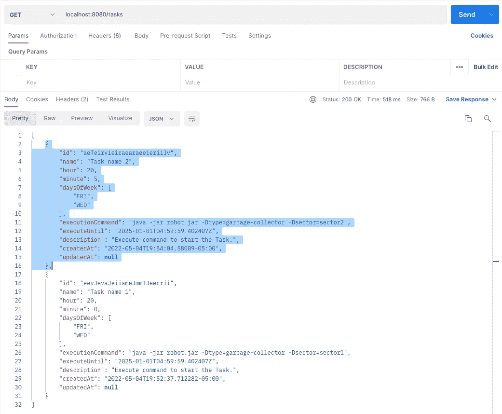

这个更新包括与任务相关的 Quartz 作业的修改。我们需要与 Quartz 上下文进行交互，以更新与实际作业相关的触发器对象。因此，我们的任务现在在编辑的时间执行。您可以在项目的源代码中看到更多的细节。

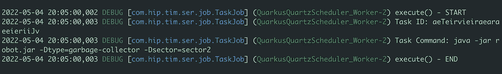

如果我们转到 DynamoDB 控制台，我们将看到我们的 2 个任务；其中一个更新了字段:

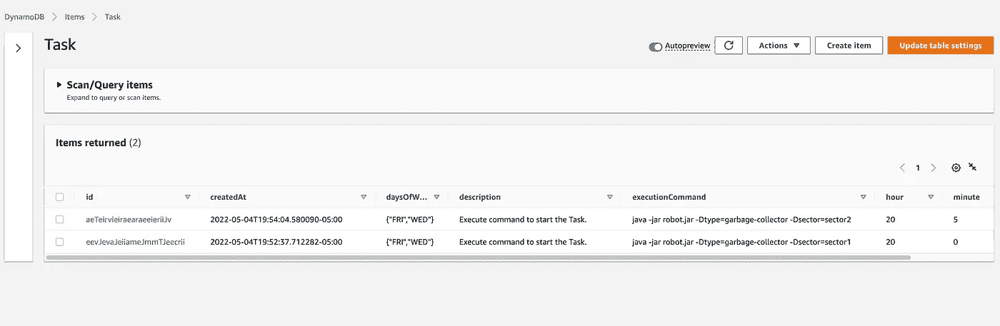

最后，是时候展示 DELETE 方法操作了。现在我想删除其中一个任务，结果是这样的:

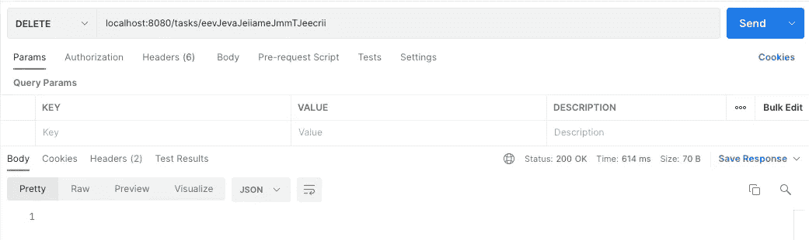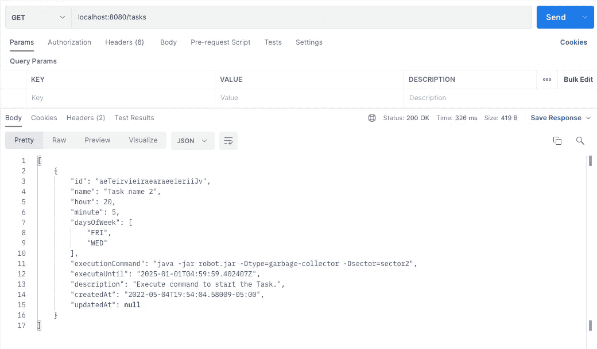

如我们所见，只有一个任务。如果我们转到 DynamoDB 控制台，我们必须看到剩下的任务:

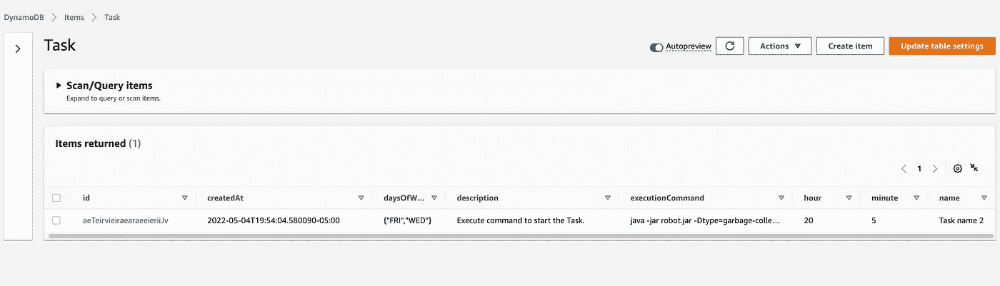

就是这样！！我创建了一个 bash 文件来编译和打包整个项目。我还创建了一个在 DynamoDB 上创建任务表的脚本。您只需在项目的根文件夹中运行以下命令:

```
# ./run-scripts.sh
```

下面的文章将向您展示如何使用 Fargate(无服务器风格)在 AWS ECS 上部署这个微服务。为此，我们将使用 Docker 为这个微服务创建容器映像，但是在 Quarkus 技术的帮助下使用相同的本地映像。

感谢您的阅读，我将在下一篇文章中与您见面。