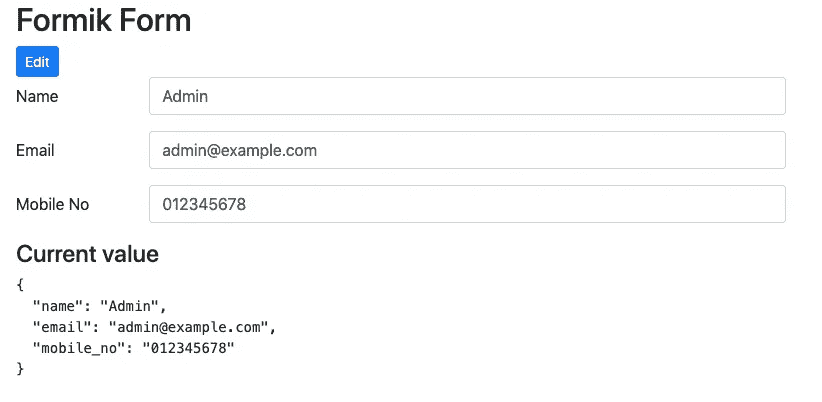

# 用 React 构建和处理可编辑的表单。射流研究…

> 原文：<https://blog.devgenius.io/reactjs-form-editable-473e48fb6c9e?source=collection_archive---------3----------------------->

我们构建的大多数应用程序都有一个维护表单字段，供用户操作数据。在这里，我将分享用 React.js 和 Formik 构建的表单切换可编辑。

我自己构建了一个项目，我发现这对于构建维护表单很有用。在文章的结尾，我们将有一个带有编辑、保存和取消按钮的表单。用户可以随时通过取消按钮恢复修改后的数据。



你也可以在这里用登录表单查看简单的 formik 解释。该链接还将解释为什么我在构建表单时更喜欢使用 formik 库。

[https://medium . com/@ eka Leonardo/basic-log in-form-with-react-hooks-and-formik-c 069 de 5b 5f 0b](https://medium.com/@ekaleonardo/basic-login-form-with-react-hooks-and-formik-c069de5b5f0b)

如果您希望找到完整的代码，您可以在本文的底部找到 github 代码。

在本文中，我们将使用 **Bootstrap 4** 和 F **ormik** 库来实现我们的目标。决不，让我们通过创建我们的 react 项目并安装我们需要的所有模块来开始我们的小项目

```
npx create-react-app formik-advance
cd formik-advance
npm install bootstrap formik
```

完成所有模块后，让我们通过修改 App.js 将引导程序包含到我们的应用程序中

现在我们将创建维护表单。稍后会有解释

在这里，我们在 formik 的帮助下使用 **withFormik** 构建表单。这个 Formik 将处理我们以前从头开始编写的所有样板文件。Formik 将自动处理所有事情，如处理更改和存储的值。我们用 Formik 在**中应用了一些参数。**

1.mapPropToStatus

此参数允许我们的用户指定表单的状态。Formik 会将其结果转换为可更新的表单状态，并使这些值在我们的组件中作为`props.status`可访问。在这种情况下，我们存储编辑标志，以确定是否应该更新。

2.mapPropsToValues

值，这些值将用于将我们的输入保持为可更新的表单状态。每一个输入都会相应地存储在`<Field>`组件中，以其自己的名字命名。用户也可以手动初始化输入或通过道具。

3 .启用重新初始化

如果包装的组件属性已更改，允许 Formik 重置表单。提醒一下，如果表单被重置，`props.status`将被重置为初始值(该功能将重新运行)。

4 .提交

当提交表单时，分配给`mapPropsToValues`的任何值都将进入这个方法。用户可以根据需要处理数据。

我们渲染和设计的形式分为 3 类；`_renderFormView` `_renderAction`，和`_renderFormInput`。

RenderFormView 一个类别，用于呈现组件的仅查看模式。正如您所注意到的，我们用`props.fields`填充数据作为我们的值。这些值是从父组件获得的，作为我们的初始值。

RenderFormInput 用于呈现组件的编辑模式。在这里，我们用`props.values`设置我们的<field>。这些值将在我们提交表单时用到。</field>

RenderAction 是组件的标题按钮。在这里，我们有编辑，取消和保存按钮。具有`editOnClick`功能的编辑按钮将通过调用`props.setStatus()`将 formik 编辑状态更新为真。至于取消`cancelOnClick`，我们将使用 formik 内置函数`props.resetForm()`将`props.values`初始化为来自父组件的原始值，并将 formik 编辑状态设置为 false。最后是保存按钮，这将自动转到 handleSubmit 函数，我们从父组件父组件传递函数来更新表单的状态。

完成表单组件的设计后，将维护表单包含到我们的 App.js 中

在 App.js 中，我们可以设置初始值，并按照上面的例子传递给我们的维护表单。这个初始值通常是从 REST API 服务器获得的。在这里，我们还传递函数 updateFields，以便在用户提交表单时更新表单数据。就这样，你已经完成了可以用 React.js 编辑的表单，希望你觉得有用:')。

感谢您的阅读。我希望我能分享一些对你有用的东西。为这个故事鼓掌，帮助我提高我的媒体形象。本文是为开发社区目的而写的。

更多 formik 文档:[https://jaredpalmer.com/formik/docs/overview](https://jaredpalmer.com/formik/docs/overview)

Github 代码

[](https://github.com/ekaleonardo619/form-toggle-edit-formik) [## ekaleonardo 619/表单-切换-编辑-formik

### 在 GitHub 上创建一个帐户，为 ekaleonardo 619/form-toggle-edit-formik 开发做出贡献。

github.com](https://github.com/ekaleonardo619/form-toggle-edit-formik) 

示例运行代码