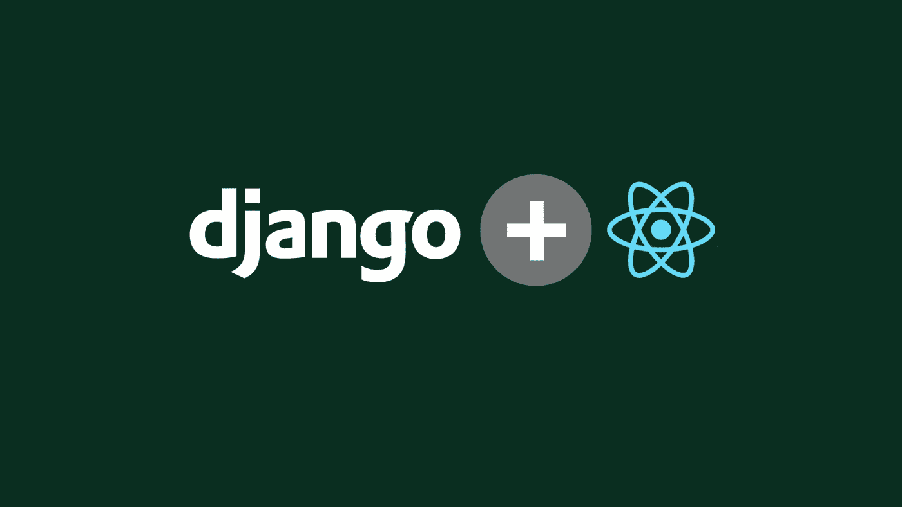
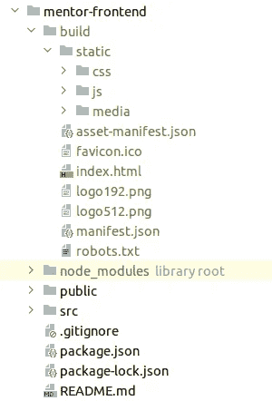
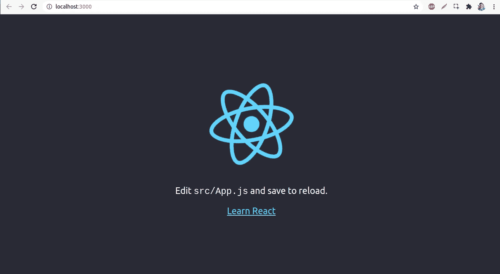
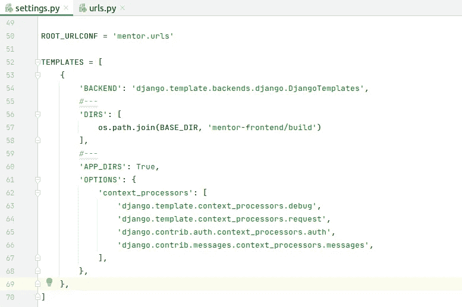
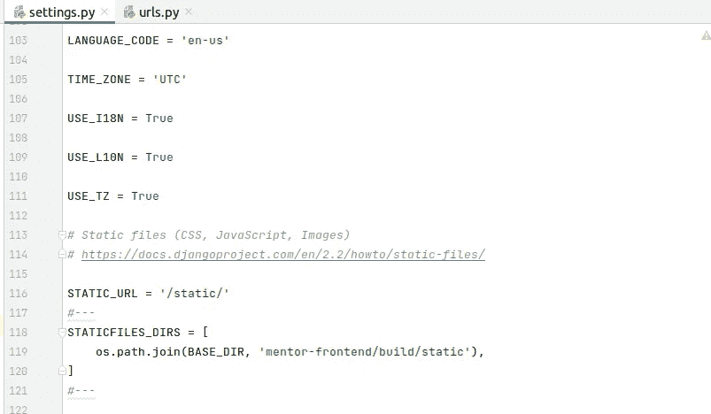
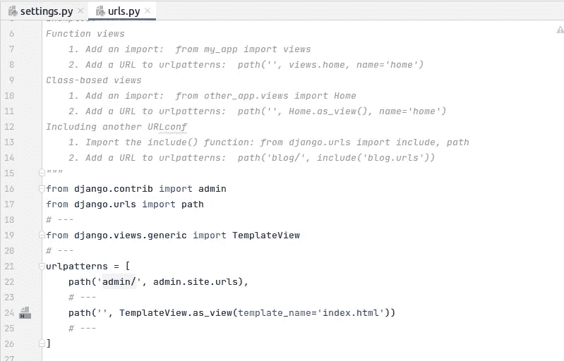

# ReactJS 作为后端与 Django 集成

> 原文：<https://blog.devgenius.io/reactjs-integration-with-django-as-backend-af7577b9ae6e?source=collection_archive---------5----------------------->



Pic 信用-开发至

ReactJS 是一个用于开发单页面应用程序(SPA)的 javascript 前端 web 框架。

Django 是一个基于 python 的 web 框架，遵循模型-视图-模板架构。Django 是可靠的，它有一个稳定的库的变体生态系统，支持共同的开发需求。

在本教程中，我们将使用 ReactJs 来服务前端或客户端框架，处理用户界面并通过对 Django 后端的请求来获取设置数据，Django 后端是一个使用 Django Rest 框架构建的 API。

# 1.设置 React 前端

我假设您的机器上安装了 Python3、Django、Nodejs& Npm。现在让我们开始吧

步骤 1:创建 React 项目给你想要的任何名字。我将我的项目命名为“导师-前端”

```
npx create-react-app mentor-frontend
```

步骤 2:现在运行下面的命令来生成生产中使用的构建文件夹

```
npm run build
```

下面是完成以上 2 个步骤后的项目结构



步骤 3:现在您可以验证您的项目安装

```
npm start
```

这是它在前端的样子



# 2.设置 Django 后端

步骤 1:创建一个任意名称的 Django 项目。我将我的项目命名为导师

```
django-admin startproject mentor
```

这里我们添加了 ReactJS 生成的构建目录，Django 可以访问这个目录



```
 'DIRS': [
    os.path.join(BASE_DIR, 'mentor-frontend/build')
], 
```

确保在 settings.py 文件的底部添加 **STATICFILES_DIRS**

```
STATICFILES_DIRS = [ 
              os.path.join(BASE_DIR, 'mentor-frontend/build/static'), 
]
```



要在 url.py 中进行的更改

```
from django.views.generic import TemplateViewpath('', TemplateView.as_view(template_name='index.html'))
```



您的整个项目设置已经完成。现在，您可以通过运行以下命令来启动 Django 应用程序

```
python3 manage.py runserver 8000
```

现在去浏览器打开 [http://localhost:8000](http://localhost:8000) 你会看到 ReactJS 的默认页面。

你喜欢这篇文章吗？如果有，通过 [**订阅获取更多类似内容解码，我们的 YouTube 频道**](https://www.youtube.com/channel/UCvEB7wXUEXGFE9lCx0USR3Q) **！**

感谢阅读。