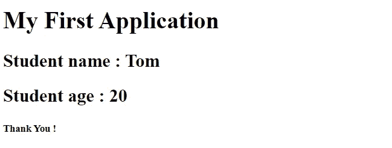

# 理解巴别塔和 JSX

> 原文：<https://blog.devgenius.io/reactjs-introduction-to-babel-and-jsx-642e420952c9?source=collection_archive---------6----------------------->


费伦茨·阿尔马西在 [Unsplash](https://unsplash.com?utm_source=medium&utm_medium=referral) 上的照片

**ReactJS** : ReactJS 是一个开源的、基于组件的前端库，仅用于构建用户界面。React 是灵活的声明式 JavaScript 库。由于 DOM(文档对象模型)速度较慢，React 实现了一个虚拟 DOM，它基本上是 DOM 的抽象。ReactJS 还为我们提供了一起编写 JavaScript 和 HTML 的条款。

Babel 是一个 JavaScript 编译器，它将并非每个浏览器都能理解的最新 JavaScript 特性转换成当前和旧版本浏览器或环境中的 JavaScript 向后兼容版本。

JSX:JSX 是 JavaScript 的语法扩展。它具有 JavaScript 的全部功能。JSX 产生 React 元素，可以嵌入任何 JavaScript 表达式。最终，使用编译器/转换器将 JSX 转换成 JavaScript。

# 设置 React 和 Babel

获取 [React](https://unpkg.com/react@16.13.1/umd/react.production.min.js) 和 [ReactDOM](https://unpkg.com/react-dom@16.13.1/umd/react-dom.production.min.js) 脚本，将它与其他脚本放在一起，并记住每次使用 React 或 ReactDOM 时都要包含它。

现在为 Babel 创建一个文件夹结构，比如说 *C:\react\work* 并移动到它。我们现在将安装 transpiler 来处理 Babel。运行以下命令:

```
npm install babel-clinpm install babel-preset-reactnpm install babel-plugin-transform-react-jsx
```

最后下载的插件将负责把 JSX 转换成 JavaScript。现在我们已经准备好创建一个应用程序了。

# Babel 入门

现在，为了确保所有的依赖项都能正常工作，我们将使用它们设计一个小应用程序。对于 jsx，在*工作*目录下新建一个文件夹，比如说 *myjsx* ，写一个 JSX 文件如下:

C:\ react \ work \ myjsx \ myfirstjsx . jsx

```
class Student extends React.Component{
constructor(props){
super(props);}
render(){
return (
<div>
<h2>Student name : {this.props.name}</h2>
<h2>Student age : {this.props.age}</h2>
</div>
);}
}class School extends React.Component{
constructor(props){
super(props);}
render(){
return <Student name="Tom" age="20"/>;
}}
```

现在为了传输文件，移动到*工作*文件夹并输入以下命令:

```
node_modules\.bin\babel --plugins transform-react-jsx [folder path to the JSX file] -d [destination folder path for the js file]
```

现在对于 HTML 和 JavaScript 部分，在应用程序文件夹中创建一个*index.html*，如下所示:

```
<!doctype html>
<head>
<title>My First Application</title>
<script src='reactjs/react.production.min.js'></script>
<script src='reactjs/react-dom.production.min.js'></script>
<script src='js/myFirstJSX.js'></script>
<script>
window.addEventListener('load',function(){
let container=document.getElementById('container');
let school=React.createElement(School);
ReactDOM.render(school,container);
});
</script>
</head>
<body>
<h1>My First Application</h1>
<div id="container"></div>
<h5>Thank You !</h5>
</body>
</html>
```

一旦你完成了所有这些，由*index.html*提供的内容将如下所示:

