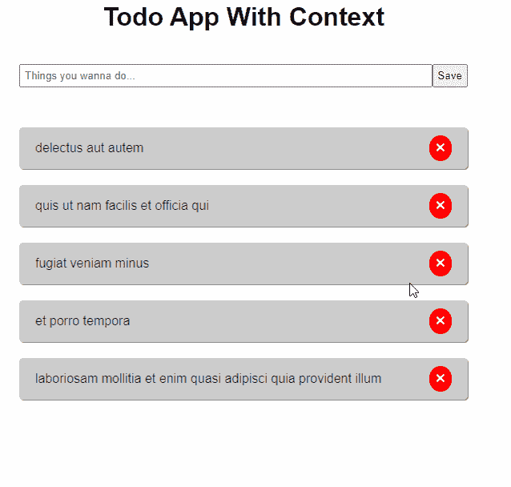

# ReactJS——利用上下文很好地管理您的状态

> 原文：<https://blog.devgenius.io/reactjs-manage-your-state-nicely-with-context-1ed3090a6a46?source=collection_archive---------2----------------------->

用一种反应的方式表达你的状态


ReactJS——让你的状态与上下文相得益彰

嗨，我们回到自由式语言！是啊，Javascript！

好了，我现在要谈谈前端，尤其是 React 或 React Native for the mobile。我将告诉你如何更有效、更容易地管理你的状态。那我们走吧！

# 遵循这篇文章的要求

1.  非常基础的 JavaScript(ES6)。
2.  非常基本的反应。

# 跟随这篇文章的必备工具

## 1.NodeJS

重要的是 NodeJS 本身，因为 NodeJS 附带了 **NPM** ，在这种情况下，我们将使用它来安装 ReactJS。你可以在这里下载(【https://nodejs.org/en】T2)。我推荐安装 **LTS** 版本，我写这篇文章的时候用的是 v 12 . 2 . 0*。*

## 2.文字编辑器

有很多文本编辑器，我更喜欢使用可以在这里下载的**vs code**([https://code.visualstudio.com](https://code.visualstudio.com/))。
如果你想使用像 **Sublime Text** 或 **Atom 这样的文本编辑器，没关系，**只需选择适合你的工具。

# 你是通过 Props 解析数据吗？

你还在使用 props 把数据解析成组件吗？如果你有，那也没关系。但是，如果您有一个更大的应用程序，并且您仍然通过 props 解析这些数据，并且您有很多数据，或者可能有几十个数据。通过组件传输数据会让你精疲力尽。

下面是一个例子:

通过 props 解析数据

这是一个因素，那么其他因素呢？

> "**没有我还没有用尽使用道具！**“是的，你不是。但是你会的！

这篇文章对于处理这类事情来说很方便，那么我们该怎么处理呢？没错。没错，我们将使用 ReactJS 提供的**上下文**，它非常强大！

# 什么是语境？

根据文档，以下是解释:

> 上下文提供了一种通过组件树传递数据的方式，而不必在每一层手动向下传递属性。

让你知道，上下文就像一个全局变量，你不用把道具传给组件就可以访问它。

您可以在以下文档中了解更多信息:

[](https://reactjs.org/docs/context.html) [## 上下文反应

### 上下文提供了一种通过组件树传递数据的方法，而不必每次都手动传递属性

reactjs.org](https://reactjs.org/docs/context.html) 

# 什么时候使用上下文？

我认为如果你开始处理 React，你应该为你的应用程序使用这个上下文。但是，如果你必须分析你的应用程序，它是否会变大？如果没有，我推荐你用这个方法。

如果你有一个大的 app，你就不能使用这个上下文。因为如果你有一个更大的应用程序，也许你应该使用 Redux 来实现更好的状态管理。但是你不用担心这个。我会在这之后的下一篇文章中解释 redux。

所以我的观点是，如果你有一个低到中等大小的应用程序，你应该使用上下文来使应用程序易于维护。我将向您展示如何使上下文易于阅读，并让其他人理解代码。

# 开始吧！

好吧，那么我们要构建什么样的应用程序呢？我们将构建一个简单的 todo 应用程序，带有 React 和上下文，让您简单并完全理解。我们将使用名为[JSON typical code](https://jsonplaceholder.typicode.com/)的假 rest API。

我假设您已经安装了 NodeJS。

## 1.安装 React

首先，您需要自己做出反应，要做到这一点，您可以简单地在您的 CMD 或终端中运行它。

```
npm i -g create-react-app
```

它将在您的本地计算机上全局安装 ReactJS。

## 2.创建 React 项目

在您完成了 ReactJS 的全局安装之后，您可以简单地运行这个命令来创建您的项目。

```
npx create-react-app name-of-your-project
```

之后，在文本编辑器中打开项目。

## 3.创建上下文

好了，我们终于到了，所以我要创建一个上下文来处理我们的应用程序和一些状态。

首先，我将在 **src** 文件夹中创建一个名为 **context** 的文件夹，该文件夹将包含我们管理应用程序的上下文。

在这个**上下文**文件夹中，我们将在其中创建几个文件。但是，在这一步，我将只创建一个名为 **TodoContext.js** 的文件。这只是一行简单的代码。

待办事项上下文

简单到让一个语境正确？那我们继续吧。

## 4.创建类型

在这里，我们要制造类型，什么是类型呢？在这种情况下，用于定义我们的应用程序动作的类型，类似于“嘿，我想从 API 获取数据，调用这个类型！”。

如果你不明白，顺便给你看看代码。这些类型将用于我们的应用程序。顺便说一下，代码是不言自明的。

尽管如此，在**上下文**文件夹中，我们将创建一个名为 **TodoTypes.js** 的文件。

待办事项类型

## 5.创建减速器

那么，reducer 是什么？在我们的应用中，ReactJS 中的 Reducer 是确定状态变化的手段。如果你想改变状态，在这里控制你所有的状态。

在这里，我也想导入类型，因为我们要处理一个函数，分派这个缩减器，我们将在这之后创建它。

不过，在**上下文**文件夹中，我将创建一个名为**todore reducer . js**的文件。这是代码。

Todo 缩减器

如果你看到上面的代码，你会看到，缩减器是用来把状态转换成新值的，对吗？代码在那里是不言自明的。

## **6。创建状态**

这是上下文中的主要内容。不过，在**上下文**文件夹中，我将创建一个名为 **TodoState.js** 的文件。它将包含我们的状态，函数，以及组件将使用的值。这就是我们用**上下文**创建全局变量的地方。这是代码。

待办事项状态

上面的代码是不言自明的，其中的 TodoState 用于定义我们的状态，任何处理服务器的函数，以及应用程序中的一些逻辑。

如果你想添加更多的功能，在这个文件中添加，**不要在你的组件中添加功能！**

于是就有了这个，我们做一个**上下文**，只要记住，上下文有一个**状态，Reducer，Type，**和**上下文**本身。

类型到底做什么？当您想要改变状态时，您必须从第 28 行调用 dispatch，并且 dispatch 内部带有两个对象(类型和有效负载)，dispatch 本身来自 react 的 **useReducer()** 。

顺便问一下如何在我们的应用程序中使用它？让我们滚动！

## 7.设计组件的样式

在你为上下文创建完一个模式后，你将创建一个简单的样式，名为 **style.css** ，的文件放在你的 **src** 文件夹中，如果你愿意，你可以复制粘贴这个样式，这是代码。

单体花柱

## 8.制作表格

在你把样式写出来之后。您将制作一个用于创建新待办事项的表单。我将在 **src** 文件夹中创建一个名为 **components** 的文件夹。我把这个文件命名为 **TodoForm.js** 。在那个组件中，我也想实现我们的上下文。这是代码

待办事项表单

上面的表单已经准备好与服务器交互，代码很容易阅读。

## 9.添加待办事项列表组件

在我们制作了那个 **TodoForm.js** 之后，我们将制作一个组件来处理 **todo** 数据。尽管如此，在我们创建的**组件**文件夹中，我将创建一个名为 **TodoList.js.** 的组件，我们也将在这里实现该上下文，这是代码。

待办事项列表项目

它只是一个简单的组件，对吗？但是你看，我们在这之前不处理任何道具，这很好。我们只是得到我们在上下文状态中定义的函数，并在组件中得到我们想要的任何东西，这就是使用 React 的上下文的优势。

## 10.更新 App.js

最后，为了让您的应用程序和上下文准备好工作，您需要更新根 **src** 文件夹中的 **App.js** 。这是代码。

更新的 App.js

如果你注意到，我们在哪里使用上下文？好吧，事情是这样的。您刚刚创建的上下文，您必须在应用程序的主文件中定义它，在本例中是 **App.js** 。您必须用您的**状态包装整个组件，在本例中，**是**to State**。因为**tod state**正在接受子组件在里面，*参见****tod state****返回语句*。这就是你要处理的上下文，**每次你为应用程序创建一个新的上下文，你必须在你的主应用程序文件中注册它，这样才能工作。**

## 11.运行应用程序

在您更新了您的 **App.js** 之后，通过运行。

```
// Run this in root of your project folder
npm start
```

这是我们构建的应用程序的结果



待办事项应用程序

界面 XD 很难看，但是，我们在这里关注的是上下文。功能都是一样的吧？但是我们在代码中做了不同的事情，应该说更加结构化了。

我们终于做到了！使用上下文创建简单的应用程序！

# 如何注册新的上下文？

这里有一个注册新州的例子。但是，想象一下，如果你有一个更大的应用程序，请看这个例子。

注册一个新的州

看到了吗？就像嵌套的对吗？就像一棵树 XD，好吧，这是使用上下文的缺点。**但是，不用担心，对付一个中等大小的 app 还是可以的。这是非常强大的，易于维护的背景**！

# 结论

看完这篇文章，也许你想用上下文？或者您可能会继续解析组件之间的属性？实际上这取决于你。但是，我建议你使用这个**上下文**，因为它使你的状态更清晰，使你的组件无状态，而且非常重要的一点是，你将使你的应用程序易于管理和结构化。

难道是可以用于**反应的原生**？绝对的！

说到**结构化**，我在后面为**后端**写了一些文章，谈论**节点**——**让你的响应 API 更好**，非常简单，朗朗上口！以下是链接:

[](https://medium.com/dev-genius/nodejs-make-your-api-response-nicely-f562f78cb67) [## NodeJS——让您的 API 响应更加完美

### 嗨，朋友们，自从一年前我写了一篇关于 Laravel API 的文章已经有一段时间了，下面是这篇文章，我写于…

medium.com](https://medium.com/dev-genius/nodejs-make-your-api-response-nicely-f562f78cb67) 

顺便说一下，这是这个带有上下文的 Todo 应用程序的代码。

[](https://github.com/hudaprs/todo_react_context) [## hudaprs/todo_react_context

### 带有 React 上下文 API 的 Todo 应用程序。在 GitHub 上创建一个帐户，为 hudaprs/todo_react_context 开发做贡献。

github.com](https://github.com/hudaprs/todo_react_context) 

如果你仍然困惑，请在讨论中留下评论。

下一篇文章再见！