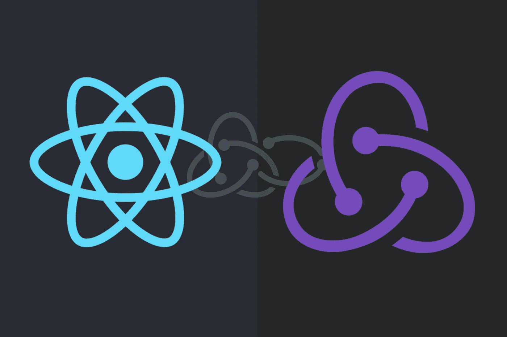
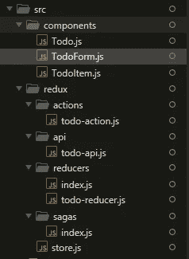
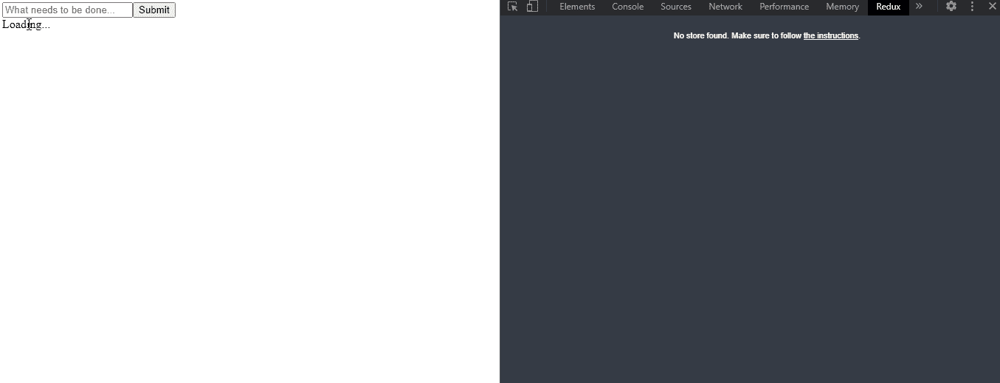

# react js——用 Redux-Saga 简单理解 Redux

> 原文：<https://blog.devgenius.io/reactjs-simple-understanding-redux-with-redux-saga-f635e273e24a?source=collection_archive---------0----------------------->

Redux 没有你想的那么复杂！



ReactJS —简单理解 Redux 和 Redux-Saga

再次回到 ReactJS。尽管如此，在自由式语言中，JavaScript！

又来了，我们回来讨论**状态管理，**现在我们使用 Redux！我将用这个 React & Redux-Saga 制作一个简单的应用程序，这样你就可以完全理解发生了什么。

如果你不知道**状态管理**是什么，我建议你先看看我的文章，它讨论了使用带有 React 的上下文 API 的基本状态管理。

[](https://medium.com/dev-genius/reactjs-manage-your-state-nicely-with-context-1ed3090a6a46) [## ReactJS——利用上下文很好地管理您的状态

### 用一种反应的方式表达你的状态

medium.com](https://medium.com/dev-genius/reactjs-manage-your-state-nicely-with-context-1ed3090a6a46) 

那我们就直接进入主题吧…

# 遵循这篇文章的要求

1.  非常基础的 JavaScript(ES6)。
2.  非常基本的反应。

# 跟随这篇文章的必备工具

## 1.NodeJS

重要的是 NodeJS 本身，因为 NodeJS 带有 **NPM** ，在这种情况下，我们将使用它来安装 ReactJS。你可以在这里下载([https://nodejs.org/en](https://nodejs.org/en/))。我推荐安装 **LTS** 版本，我写这篇文章的时候用的是 v 12 . 2 . 0*。*

## 2.文字编辑器

有很多文本编辑器，在这篇文章中我更喜欢使用 **Sublime Text 3** ，因为它平滑而轻便，你可以在这里下载([https://www.sublimetext.com/](https://www.sublimetext.com/))。
如果你想使用文本编辑器，比如 **VScode** 或 **Atom，**只要选择适合你的工具就可以了。

## 3.Redux 开发工具扩展

这是可选的，Redux Devtools 扩展是为了帮助开发人员使用 Redux，这个 Redux Devtools 扩展使开发人员可以跟踪应用程序中正在发生的事情，例如从服务器获取数据等等。这是一个来自浏览器的扩展，如果你使用 chrome，你可以在这里下载这个([https://chrome . Google . com/web store/detail/redux-devtools/lmhkpmbekcpmmknlioeibfkpmmfibljd？hl=en](https://chrome.google.com/webstore/detail/redux-devtools/lmhkpmbekcpmknklioeibfkpmmfibljd?hl=en) )。

# Redux 是什么？

根据文档，Redux 是…

> Redux 是 JavaScript 应用程序的可预测状态容器。
> 
> 它帮助您编写行为一致、在不同环境(客户机、服务器和本机)中运行、易于测试的应用程序。

一个非常简单的解释，它是你的状态的容器。例如，您有一个 todo 状态，然后在 redux 中控制您的 todo 状态。因为 redux 用于状态管理，包含了所有与组件或用户交互的状态。不要困惑，如果你跟着这篇文章走，你会明白的。

您可以在 Redux 文档中阅读更多内容:

[](https://redux.js.org/introduction/getting-started) [## Redux | Redux 入门

### Redux 是 JavaScript 应用程序的可预测状态容器。它帮助您编写行为一致的应用程序…

redux.js.org](https://redux.js.org/introduction/getting-started) 

# 那么什么是 Redux-Saga 呢？

根据 Redux-Saga 的文档…

> Redux-Saga 是一个库，旨在使应用程序副作用(即异步的事情，如数据获取和不纯的事情，如访问浏览器缓存)更容易管理，更有效地执行，易于测试，并更好地处理故障。

Redux-Saga 基本上是你的 Redux 的中间件。为什么我需要一个 Redux 的中间件？

**答案**。使用简单的基本 Redux，您只能通过分派一个动作来进行简单的同步更新。**中间件扩展了商店的功能，让你可以编写与商店交互的异步逻辑**。—根据 Redux-Thunk docs(Redux 拥有的另一个中间件)。

你可以在这里的文档中阅读更多的 Redux-Saga，它非常吸引人。

 [## 读我

### redux-saga 是一个旨在使应用程序副作用(即异步的东西，如数据获取和…

redux-saga.js.org](https://redux-saga.js.org/) 

# 为什么一定要 Redux-Saga？

基本上，Redux-Saga 比 [Redux-Thunk](https://github.com/reduxjs/redux-thunk) 更强大。为什么？根据文档，以下是解释…

1.  它使用一个名为 Generators 的 ES6 特性来使那些**异步流易于读取、写入和测试**。*(如果你不熟悉它们* [*这里有一些介绍性链接*](https://redux-saga.js.org/docs/ExternalResources.html) *)* 通过这样做，这些异步流看起来就像你的标准同步 JavaScript 代码。(有点像`async` / `await`，但是生成器有一些我们需要的更棒的特性)
2.  您可能以前使用过`redux-thunk`来处理您的数据获取。与 redux-thunk 相反，您不会陷入回调地狱，您可以轻松地测试您的异步流，并且您的操作保持纯净。

# 该不该用 Redux？

正确答案是，视情况而定。因为你不能强迫你的应用程序在你开始一个项目的时候都使用 redux，你必须调查你的情况，你的应用程序是否使用 Redux。或者你的应用程序需要你所在州的一个真实的来源，那么就使用 Redux。

# 用 Redux 和 Redux-Saga 制作 App

我们要开发什么样的应用程序？为了简化这篇文章，我要做一个 Todo 应用程序，你可以很容易理解，我使用了一个用于 API 的 [JSONPlaceholder](https://jsonplaceholder.typicode.com/todos) ，这对练习很有好处。下面是用 Redux-Saga 实现 Redux 的简单步骤。我们开始吧。

我假设你已经安装了 NodeJS，因为我们稍后会处理 NPM。

## 1.安装 ReactJS(如果已经安装了 ReactJS，请跳过这一步)

我们将在全球范围内安装 ReactJS，为此，请打开您的终端/ CMD 并开始键入以下命令。

```
npm i -g create-react-app
```

## 2.创建 React 项目

成功安装 ReactJS 后，你将开始一个项目。为此，请键入以下命令。对于这个项目，我将把它叫做**反应-状态-管理**，你可以随便叫它什么。

```
npx create-react-app react-state-management
```

## 3.为 React 项目安装依赖项

创建 React 项目后，您可以进入该项目或在文本编辑器中打开它，并使用该命令开始安装一些依赖项。

这些依赖项包含我们将用于状态管理的 redux。

```
npm i -S redux react-redux redux-devtools-extension redux-saga axios
```

我要重复上面发生的事情。

*   **redux** ，本质上就是 redux 本身。
*   react-redux ，我们要用它来连接 react 和 redux。
*   redux-devtools-extension ，它只是一个软件包，用于将我们的 React-redux 应用程序集成到我们为调试 Redux 而安装的扩展中。
*   当然，这是我们将要使用的 redux-saga 中间件的一个包。
*   **axios，**只是一个简单的 HTTP 客户端与服务器交互。

## 4.为我们的应用程序创建文件夹结构

因此，在这一步中，我们将创建一个文件夹结构，我们将在其中放置文件，并使其便于开发使用。

所以文件应该是这样的。



文件夹结构

与 redux 相关的所有内容都将被放在 **redux** 文件夹中。

如果你不喜欢看这个图片，看看这个文件夹的结构，但是它还是一样的。

```
src/
  components/
    TodoForm.js
    Todo.js
    TodoItem.js
  redux/
    actions/
      todo-action.js
    api/
      todo-api.js
    reducers/
      index.js
      todo-reducer.js
    sagas/
      index.js
    store.js
```

## 5.为 Redux 制作 store.js

我们要做的第一件事是准备我们的 Redux。因此，我将在 **src** 文件夹中创建一个文件夹，并将其命名为 **redux** 。在里面，我们将创建一个名为 **store.js** 的文件。这个文件将用于我们的应用程序连接到 Redux。这是代码。代码非常简单明了。

Redux store.js

但是，不要运行那个代码，它还没有完成，我们必须创建另一个文件来使 **store.js** 工作。

## 6.采取行动

什么是行动？在这种情况下，action 将用常量填充，这些常量定义了我们的应用程序要做什么。例如，向服务器发出请求。代码类似于`const GET_TODOS = GET_TODOS`。

就这样？是啊。这很有帮助，因为当我们向 reducer 发出请求时，这将减少应用程序中的拼写错误。因此，在我们刚刚创建的 **redux** 文件夹中，我将创建一个名为 **actions** 的文件夹，在 **actions** 文件夹中，我将创建一个名为 **todo-action.js** 的文件。这是代码。

待办事项操作

## 7.制造减速器

那么，reducer 是什么？在我们的应用中，ReactJS 中的 Reducer 是确定状态变化的手段。如果你想改变状态，在这里控制你所有的状态。在 redux 中，您的状态在这里定义。

在这里，我也想导入**动作**，因为我们将处理一个分派这个减速器的函数。

因此，仍然在 **redux** 文件夹中，我将创建一个名为 **reducers** 的新文件夹，在 **reducers** 文件夹中，我将创建一个名为 **todo-reducer.js 的文件。**

Todo 缩减器

如果你看到上面的代码，你会看到，缩减器是用来把状态转换成新值的，对吗？代码在那里是不言自明的。

## 8.注册减速器

在这一步中，我们将注册刚刚在上面创建的减速器。代码非常简单。这里，还是在 **reducers** 文件夹里，我要做一个名为 **index.js** 的文件，这个文件也叫 **rootReducer** ，我们在 **store.js** 里用过。这是代码，代码解释得很清楚。

根部减速器

## 9.制作 API

在这里，我们将请求与服务器交互。

我将在 **src** 文件夹中创建一个名为 **api** 的文件夹(小写)。在 **api** 文件夹中，我将创建一个名为 **todo-api.js** 的文件。这个文件包含向服务器发出请求的函数。这是代码。

待办事项 API

这只是一个简单的向服务器发出请求的函数。

## **10。制作传奇**

我们刚刚在那里创建的所有代码和文件的核心将在这一步中正确运行。我将在 **src** 文件夹中创建一个文件夹，我将它命名为 **sagas** 。在这个 **sagas** 文件夹中，我将创建一个名为 **todo-saga.js** 的文件。在这个**中，todo-saga.js** 将包含我们的**动作，以及将要分派一个**缩减器**的 api** 。这是代码。

托多传奇

我觉得你搞混了，“那里到底发生了什么事”**？我要重复上面发生的事情。**

1.  **Redux-Saga 使用来自 ES6 的**生成器**，基本上和`async/await`一样但是它使用 **yield** 作为关键字，*里面所有包裹* ***生成器*** *必须调用使用****yield****。*如果你想了解更多关于发电机的知识，可以访问这个[链接](https://redux-saga.js.org/docs/ExternalResources.html)。**
2.  ****放**，是为了从佐贺调度减速器，**放**是它里面的接受对象，在我们的例子中，我们使用**型**和**有效载荷**作为对象。**
3.  ****调用**，用于调用一个函数，在本例中，我们调用一个与服务器交互的函数。**调用**在第一个参数中接受一个函数，第二个参数是免费的，在本例中，用于将有效载荷传递给函数。**
4.  ****takeLatest** ，用于触发异步请求。但是，如果**采用最新的**触发，任何之前运行的异步任务都将被取消。这对我们的情况很好，在这种情况下，我们不希望在用户已经发出请求的情况下，每次用户发出请求时都启动 create todo。**
5.  ****takeEvery** ，也用于触发一个异步请求，但是，如果有一个异步任务在后台运行，它不会被取消，否则，它将同时异步运行。任何使用 **takeEvery、**的生成器都将被称为 **watchers** 。**
6.  **注意，你看我一直在做一个叫**的后缀请求**？你可以看到我分派了不同的动作？这是因为如果你调度相同的动作，你将得到一个无限循环！**

**之后，仍然在 **sagas** 文件夹中，我要做一个名为 **index.js** 的文件，也就是我们在 **store.js** 中导入的 **rootSaga** 。这是代码。**

**根传奇**

**我要再次重复上面发生的事情。**

**本质上，上面的代码是正确的。但是如果你有更多的传奇，你必须让一个新的后代成为一个新的传奇，类似于，`spawn(anotherSaga)`**

**那么，什么产卵呢？spawn 用于为传奇故事创建一个新的孩子。如果你使用这个 spawn，每次出现错误等请求时，父进程不会被取消，它将继续运行，错误本身将被独立处理。**

**我希望，我在里面说的有意义。如果你想挖掘更多，你可以访问关于这个 **redux-saga** 的 API 参考。链接如下:**

**[https://redux-saga.js.org/docs/api/](https://redux-saga.js.org/docs/api/)**

## **11.让我们的应用发挥作用**

**好了，**这里介绍一下本文的主要内容**。在这一步，我们将使这个应用程序和 Redux 准备使用。**

****11.1。创建 Todo 组件。****

**我将在 **src** 文件夹中创建一个名为**组件**的文件夹。在里面，我将为组件创建一个名为 **Todo.js** 的文件，下面是代码。**

**待办事项组件**

**代码非常简单，它解释了如何与 redux 交互。本质上，当您想要将组件连接到 Redux 时，您必须:**

*   **将**连接到 react-redux 的**上。**
*   **获取**动作**将 saga 发送到减速器。(记得导入请求的**)因为我们要在`export default function* todoSaga()`内部调度，而不是像`getAllTodos`那样的函数****
*   ******mapStateToProps**&**mapdispatctoprops**用于获取**状态**和**调度**，你要将这些变量传递给**连接**函数，第一个参数是针对**状态**，第二个参数是针对**调度**。这个来自 **mapDispatchToProps** 的 **dispatch** 函数与来自 saga 的 **put** 相同，它是接受对象，在这种情况下，我们使用 **type** 和 **payload** 作为对象。****

******11.2。创建 TodoForm 组件。******

****尽管如此，在**组件**文件夹中，我将创建一个名为 **TodoForm.js** 的文件。这是代码。****

****待办事项表单****

****代码与 **Todo.js** 相同，但功能不同。****

****11.3。创建 TodoItem 组件。****

****尽管如此，在**组件**文件夹中，我将创建一个名为 **TodoItem.js** 的文件。这是代码。****

****待办事项****

****请注意，我正在使用**双击**删除待办事项。****

******11.3。更新 App.js******

****为了让这个应用程序工作，你只需将你的 **App.js** 文件更新到这个。****

****应用****

****本质上，您只需要使用这个将 **store.js** 传递给提供者****

```
**<Provider store={store}>
  // Your app in here...
</Provider>**
```

****就是这样！终于可以运行这个 app 了！要运行此应用程序，请编写以下命令****

```
**npm start** 
```

****这是应用程序的结果，我正在使用 chrome 打开 redux 开发工具。如你所见，redux 开发工具正在跟踪我在那里做什么。****

********

****应用程序的结果****

****我知道这看起来很丑，但我们在这里关注的是**还原**和**还原-传奇**。你完全可以打造自己的风格。我这样做的原因很简单。****

# ****结论****

****当你的应用程序需要一个单一的真实来源时，使用 Redux 对一个大的可扩展的应用程序是很好的。之所以使用 **Redux** 是因为它易于维护，让你的代码更加结构化，让你的 React 应用更加健壮。我之前提到过一个叫做 redux-thunk 的中间件，也许你也想试试？但是，上次我在用 **redux-thunk** 的时候，代码乱糟糟的，不知道哈哈。****

****我希望你明白在那里发生了什么，如果你仍然困惑，请留下讨论，如果你喜欢就鼓掌。****

****谢谢，下一篇文章再见！****

****下面是本文的代码。****

****[](https://github.com/hudaprs/react_state_management_saga) [## hudaprs/react _ state _ management _ saga

### 此时您不能执行该操作。您已使用另一个标签页或窗口登录。您已在另一个选项卡中注销，或者…

github.com](https://github.com/hudaprs/react_state_management_saga)****