# 🚀2D 反应堆正在走向统一

> 原文：<https://blog.devgenius.io/reactor-2d-on-its-way-to-unity-ab54140a6d1a?source=collection_archive---------17----------------------->

## 统一发展 2D 的新途径

## 2D 应用程序的统一框架

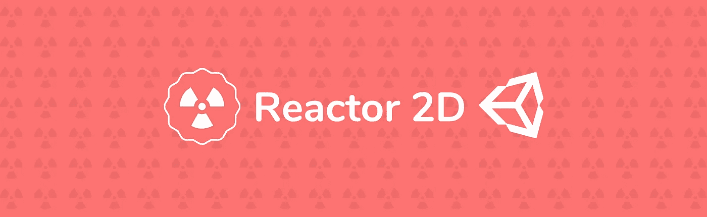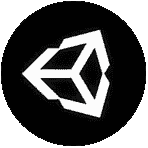

## 一种开发应用程序的新方法正在走向 Unity

但是首先，什么是应用程序？

> 为实现特定目的而设计的程序或软件。

在 Unity 中，通常有一个单一应用程序的概念，但对我来说，一个应用程序可以成为屏幕的一部分，包含逻辑，可以自动工作，只需注入它需要的信息。但是为了实现这个目标，我们需要一个系统来帮助我们。在 Web 上有 React 或 Angular 这样的系统作为开发平台，Unity 并没有提供我所体验到的任何类似的东西。

在我的例子中，我希望能够有多个应用程序组成一个上下文。我们来看一个例子！

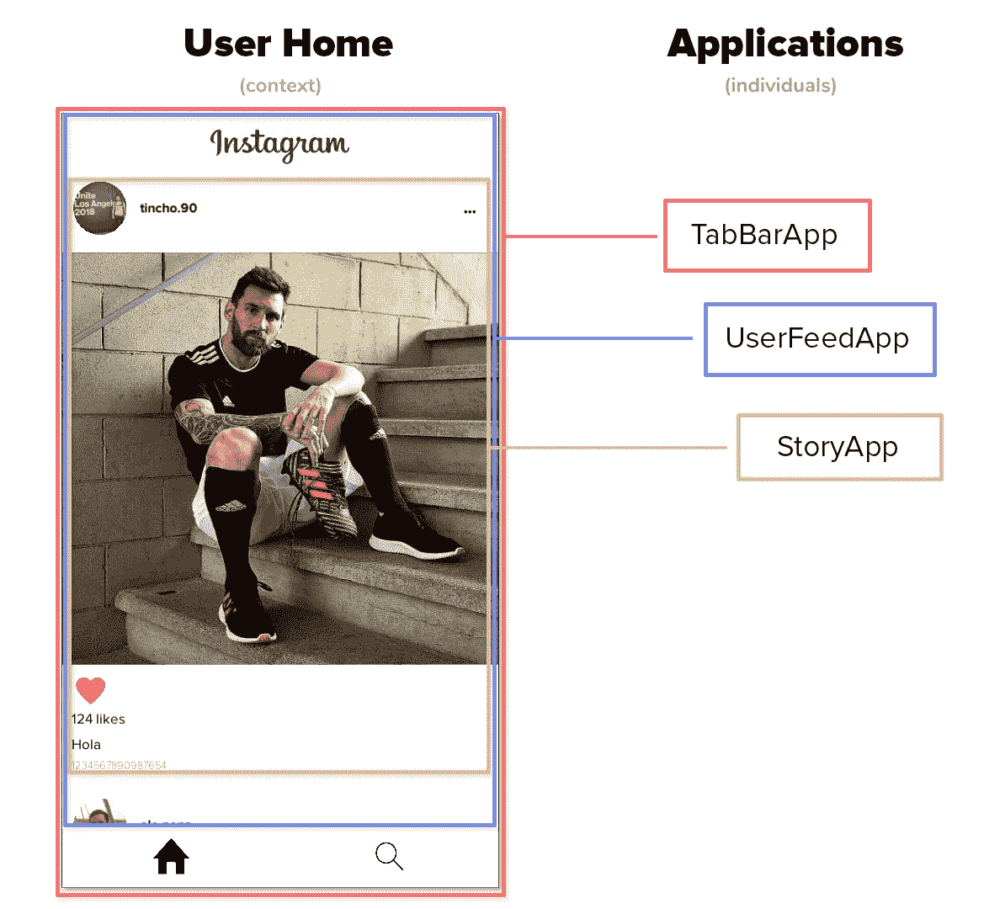

在上图中，我们可以看到用户 Home 上下文是如何由一个 **TabBarApp** (父应用程序)、 **UserFeedApp** (子应用程序)和 **StoryApp** (UserFeedApp 子应用程序)组成的。这些应用程序中的每一个都有一个独特和特殊的任务，所以如果我们把它们分开，每一个都应该继续以相同的方式工作。

# 三叉戟反应堆

这个框架被设计成 Unity 的 React 或 Angular，开发者可以有一个平台，在这个平台上事情变得更容易，并加速我们产品的开发。正如我之前所说，Reactor 将处理应用程序**创建**、**导航**和**通信**。通过这种方式，Reactor2D 提供了模块间完全解耦的形式。

# 反应堆应用

Reactor2D 的应用程序是一个模块，例如 **ShopApp** 或 **UserFeedApp** 。该框架赋予这些应用程序独立性以及与其他模块的解耦。在 Reactor 应用程序中，我们将找到您工作所需的一切:脚本、艺术、动画等。

要创建应用程序，只需转到`Windows-> Reactor 2D -> New Application`。

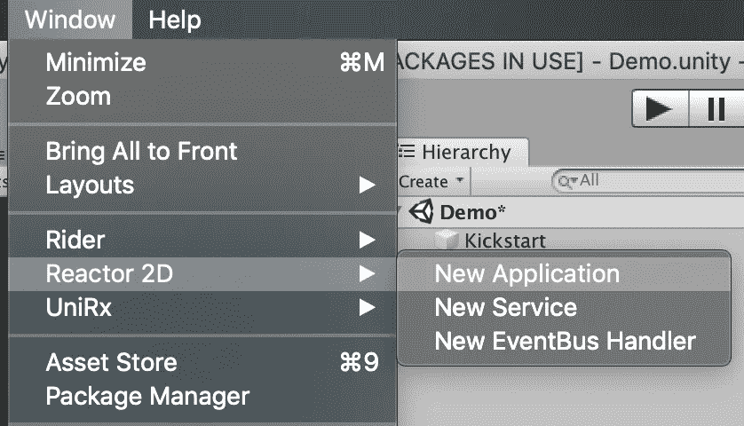

该选项将生成以下文件夹结构。

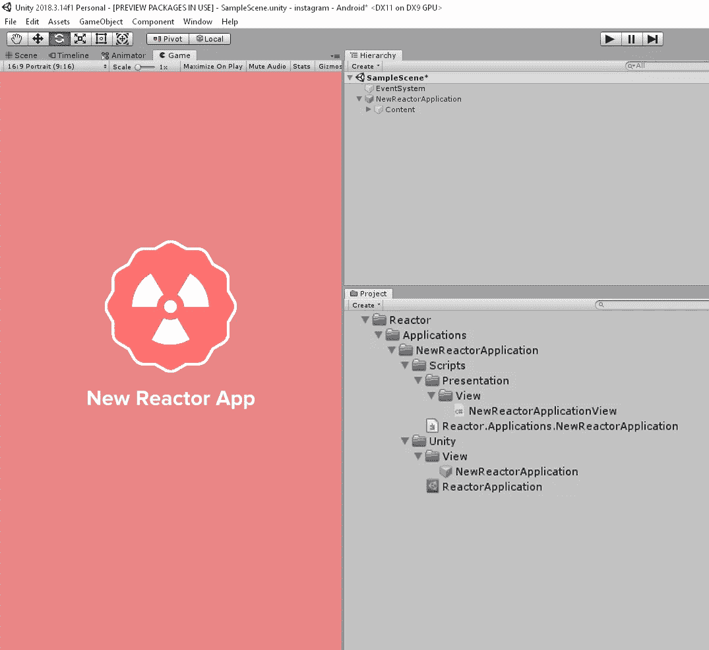

它将自动创建文件夹的层次结构，这是我们的应用程序的脚本，一个组装定义和应用程序的脚本已经在它的预置。

## 应用程序

这些应用包含一个由 Reactor 控制的生命周期。

*   **DidLoad:** 当通过浏览另一个应用程序或预加载将应用程序放入历史记录时，将调用该函数。
*   **将出现**:在显示应用程序之前调用。*(预设画布将被启用)*。
*   **DidAppear** :当哪个应用程序完成了它的转换(如果有)并准备好使用时，它将被调用。
*   **将消失**:它将在开始退出转换之前被调用，然后应用程序将关闭。*(画布将关闭)*。
*   **WillUnload** :当应用程序将从历史中移除并销毁或缓存时，将调用该函数。

## ReactorApplication.asset

它是一个 ScriptableObject，表示我们模块的配置。这是我们放置标识符和预置名称的地方。

默认情况下，Reactor 使用 AddressableAssets 来加载预置和 ReactorApplications.assets，这是一个很好的做法。他会自动为您记录它们。😃

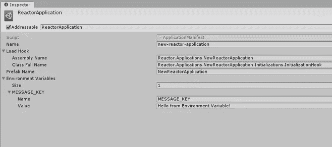

*   **Name** 它是您可以用来导航的应用程序的唯一 id。
*   **Load Hook:** 添加我们的程序集定义的名称和我们实现 **ILoadHook** 的类的全名，Reactor 将在加载应用程序时调用该代码。

*   **预置名称:**是 AddressableAssets 中的预置 id，必须从 Reactor 提供的 ReactorApplication 继承。*(反应器选项中的创建已经为您完成了所有这些任务)*
*   **环境变量:**是配置模块的键值列表。

是时候试试我们的应用了！我添加了一个日志来显示 ReactorApplication.asset 中配置的环境变量的值。

是时候见见浏览器，看看我们的应用程序如何运行了。我将创建一个名为 **MyApplication** 的脚本，这将是应用程序的开始，它将从 MonoBehavior 继承，我将把它添加到场景中的游戏对象，然后单击 Play！。

反应器使用 UniRx 进行反应编程。

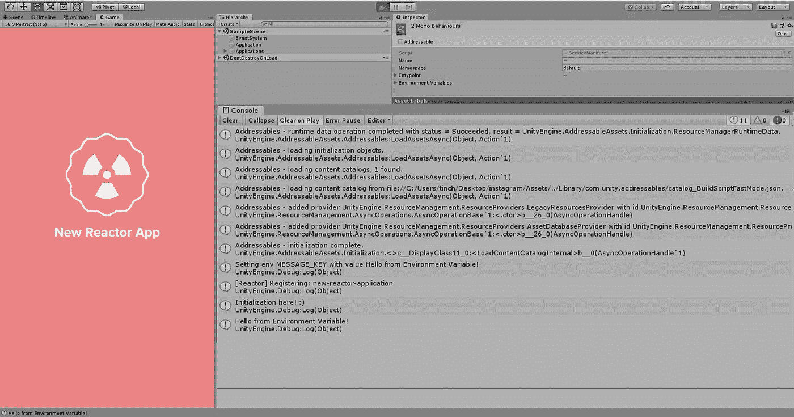

这里的消息初始化！:)和 Hello from 环境变量！在控制台中

# 反应堆服务

在某些时候，我们需要有人为我们做一些工作，这是有服务的。对于 Reactor 来说，服务是另一个类似于应用程序的模块，只是在这种情况下，框架会创建一个我们定义为**入口点**的类。一个路由器将被注入到课堂中，作为模块间的电话。作为一个建议，这些服务应该执行一个单一的任务，例如，在微服务风格中，一个服务负责提供用户配置文件，另一个服务负责管理经济。

要创建服务，只需转到`Window-> Reactor 2D -> New Service`。

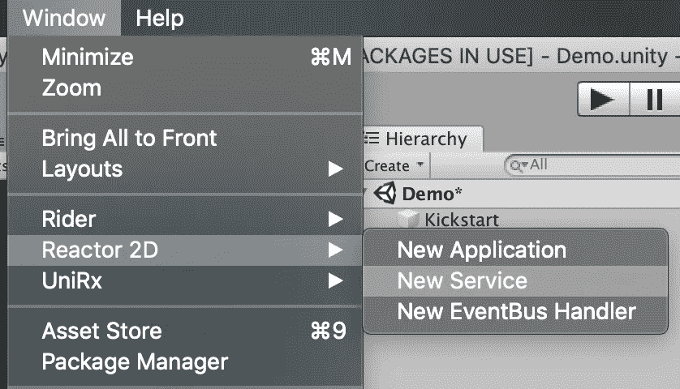

该选项将生成以下文件夹结构。

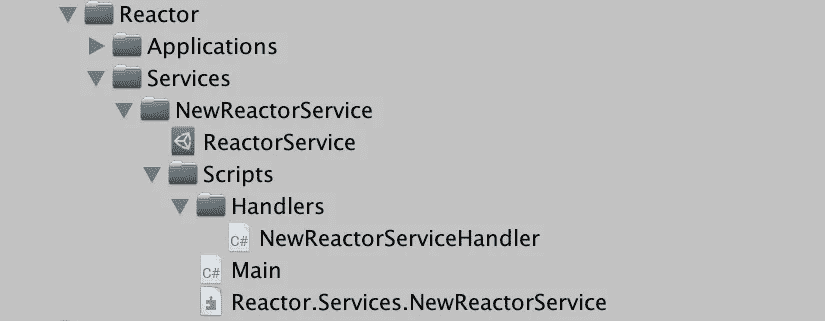

将在程序集定义旁边自动创建一个服务文件夹 ReactorService.asset，一个包含 Main 和 NewReactorServiceHandler 类的脚本文件夹。*(可在创建前放置自定义名称)*

## ReactorService.asset

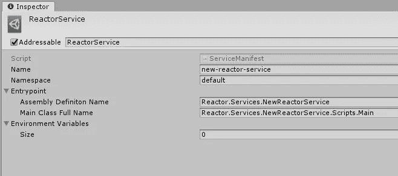

*   **名称**:唯一的服务名称。
*   **Namespace** :可以用来对同一组内的服务进行分组。
*   **入口点**:它是组装定义的名字，也是引导类的全称。*(主)*
*   **环境变量:**是配置模块的键值列表。

## 入口点类

我们在 ReactorService.asset 中配置为入口点的类将由 Reactor 在部署服务时创建*(我们将了解如何进行)*。我们来看看主类里面有什么。

我们的主类将从 ReactorService 扩展，这将允许我们将一个 **IRouter** (communicator)注入到框架中。在 Run 方法中，我们应该注册我们的服务处理程序。

> 服务处理程序是监听特定路径/资源并执行作业的类。

ve amos nuestro**NewReactorServiceHandler**

下面是一个处理程序的例子，它的主要任务是返回一个字符串“Hello World from service！”。框架也调用 Use 方法，这是服务将监听的路由被记录的地方。在这个例子中，服务将听到*“http://new-reactor-service . default/hello-world”。*

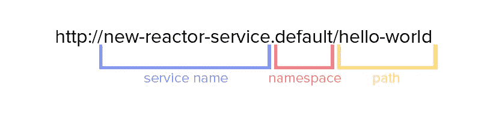

## 部署 in app-服务

现在我有了一个服务，我需要 Reactor 来启动它，为此我将返回到 **MyApplication** 脚本(应用程序启动)并做一些小的更改。

DeployServices 方法将告诉 Reactor 提升所有具有 ReactorService.asset 的服务。

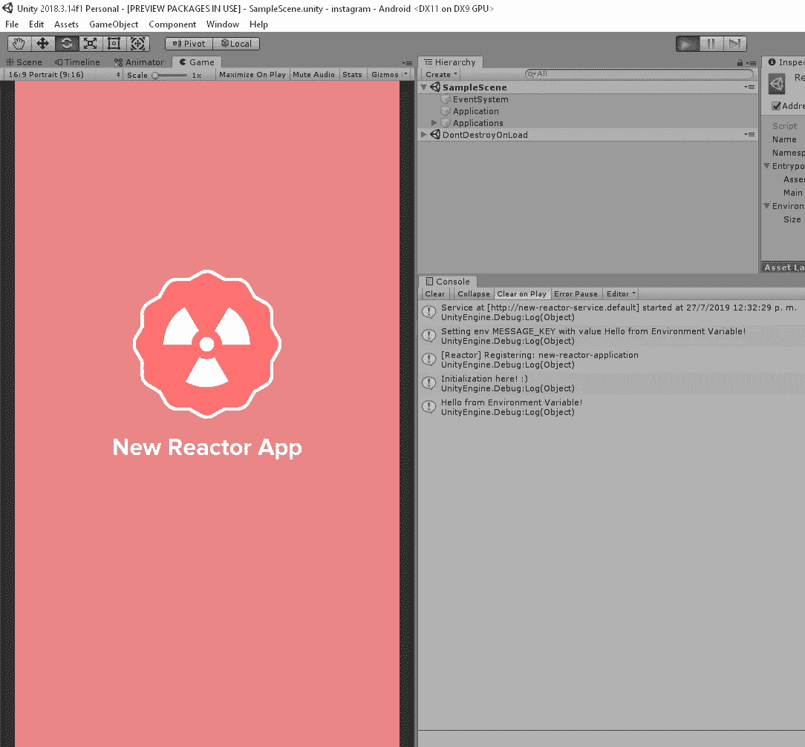

我们可以在控制台上看到以下消息。

> [[http://new-reactor-service . default](http://new-reactor-service.default)]的服务开始于…

这意味着我们的 new-reactor-service 正在接收和监听，所以如果我们调用*http://new-reactor-service . default/hello-world*，我们将收到一个字符串作为消息。*(我们稍后会看到如何)*😄

# 反应堆事件总线处理器

事件总线处理程序是其他模块，也类似于服务和应用程序。这些模块的主要任务是听一个特定的主题，每次有人通过该主题发布消息时，他们都会收到一个信息被传输的刺激。

要创建 EventBus 处理器，只需转到`Window-> Reactor 2D -> New EventBus Handler`。

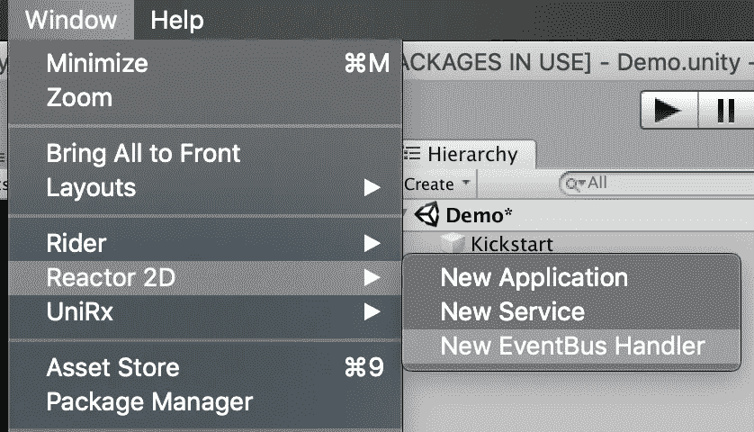

该选项将生成以下文件夹结构。

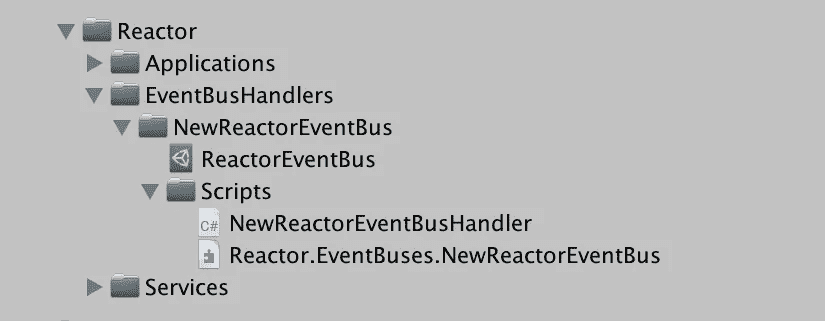

## ReactorEventBus.asset

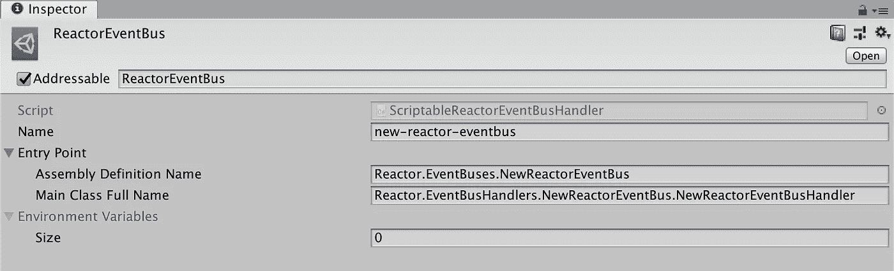

*   **名称**:唯一的服务名称。
*   **Entrypoint** :它是程序集定义的名称，也是引导类的全称。*(处理程序)*
*   **环境变量:**是配置模块的键值列表。

## 入口点类

我们在 ReactorEventBus.asset 中配置为入口点的类将由 Reactor 在部署事件总线处理程序时创建。让我们看看**new reactoreventbushandler**类。

## 部署 EventBus 处理程序

我将修改我的 **MyApplication** 脚本*(应用程序启动)*，并放置代码来提升事件总线的处理程序。

DeployEventBusHandlers 方法将创建每个事件总线处理程序。

既然我们知道了这两种类型的交流，问题是:“我们如何交流？”

# 模块间的通信

模块间通信在应用程序中起着最重要的作用，因此 Reactor 提供了两种形式的通信，**reactorestclient**和 **ReactorEventBusClient** 。

## ReactorRestClient

这种类型的通信是打电话并等待回答，无论是内部服务还是在互联网上的服务，客户端都会自动知道去哪里。

作为一个例子，我将把我之前创建的应用程序称为服务`new-rector-service`。

为了在 **NewReactorApp** 脚本中做到这一点，我将放入以下代码并运行 Unity。

> **ReactorConnectionsProvider**是一个类，它将为我提供与模块间通信相关的一切。

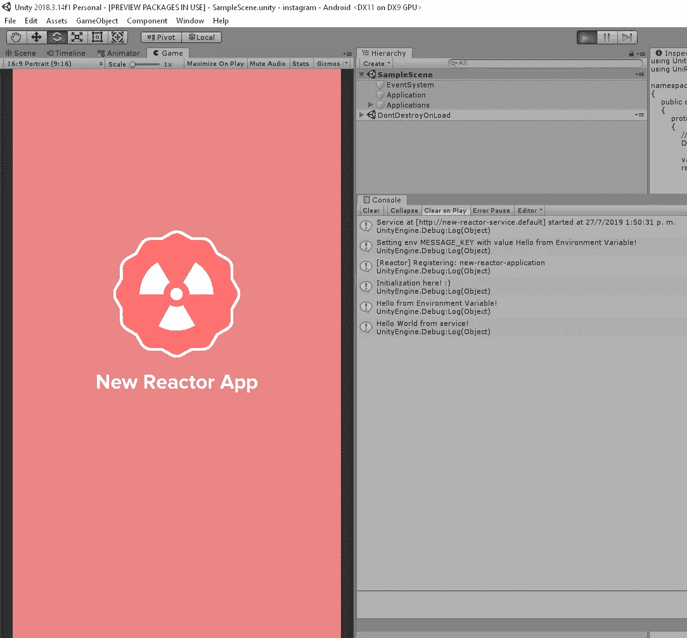

我们可以在控制台中看到日志“Hello World from service！”。这意味着我们的服务和视图可以在彼此不了解的情况下进行通信！😲 👏

## ReactorEventBusClient

这种类型的沟通是发布一个带有主题的事件，当消息发布时，注册该事件的人会获得动力。

在本例中，我将从 **TEST_TOPIC** 主题中的 **NewReactorApp** 发出一个事件，以便我的事件总线处理程序可以接收它。

运行 Unity 时，您应该会看到以下消息:*“嘿！我是一个 eventBus 处理程序，监听 TEST_TOPIC，收到了这条消息:来自 EventBus 的消息！:D"* 因为这是我的事件总线处理器在控制台中显示的内容。

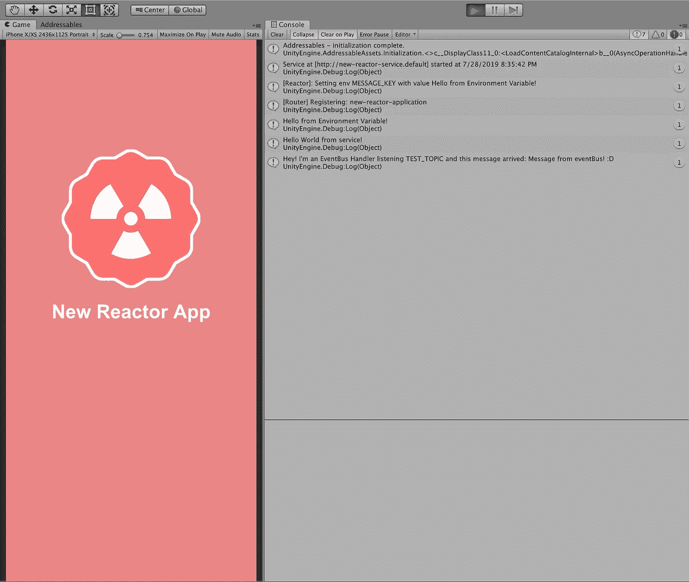

# 航行

我们已经看到了 Reactor 如何创建和通信应用程序和服务，但是我们如何导航其他应用程序呢？

从“本质”上讲，所有应用程序都可以访问它们所属的导航器，并从那里给出导航指令。对于这个例子，我将使用由 NewReactorApp 创建的应用程序和一个名为 AwesomeApp 的新应用程序。

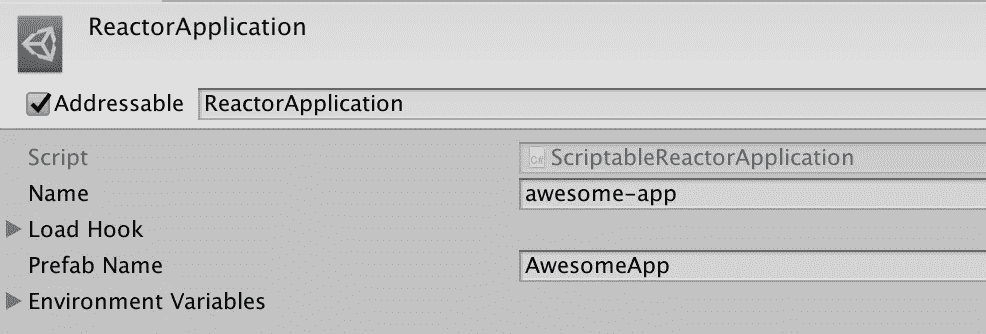

我在两个应用程序中都添加了一个 Unity 按钮，并使用**registerectivebutton**通过传递给它一个 lambda 来注册它，lambda 将是按钮被按下时执行的动作。使用 RegisterReactiveButton 的好处是，当应用程序消失时，订阅将自动取消注册。

这是新的 **AwesomeApp** ，它将有一个按钮，当按下时，它将简单地告诉**导航器**返回其历史。

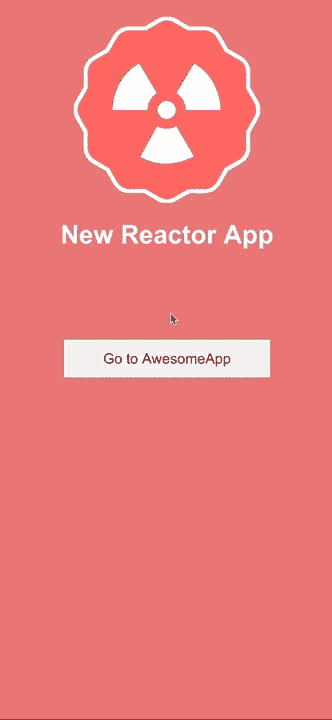

也可以将信息传递到下一个屏幕。将一个对象作为第二个参数传递，在应用程序 id 之后，传入的应用程序将拥有一个名为 Props 的 **JsonObject** ,在这里您可以获得您需要的信息。

将信息发送到下一个应用程序

从应用程序接收信息

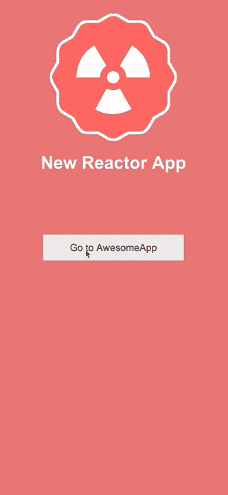

# 内部应用

Reactor 支持一个应用程序拥有子应用程序，静态*(通过编辑器引用)*和动态*(在运行时创建)*。父应用程序和子应用程序将自动共享相同的生命周期和另一个应用程序注入的相同信息。

# 例子

一个小的 Instagram 风格的例子创建了 2D 反应器在几个小时的发展。

# 摘要

Reactor 2D 是一个全新的框架，旨在解决模块之间的创建、导航和通信，以加快开发速度，并为未来打开新的大门。这只是这个框架要做的核心，它还将提供一套组件，不仅帮助开发者，也帮助艺术家和集成商。它将提供缓存，音频，本地化和更多现成的。

让我看看你的想法！

如果您想了解更多信息，可以关注我:

**推特:**@马丁 _g90

**领英:**[https://www.linkedin.com/in/martin-gonzalez-90/](https://www.linkedin.com/in/martin-gonzalez-90/)

如果你有兴趣，你可以在 Unity post 看到我的[微前端。](https://medium.com/@gonzalez.martin90/the-frontends-revolution-in-unity-f1e3e1ddb14e)

感谢阅读！希望你喜欢它！想分享就分享吧！😄 🚀