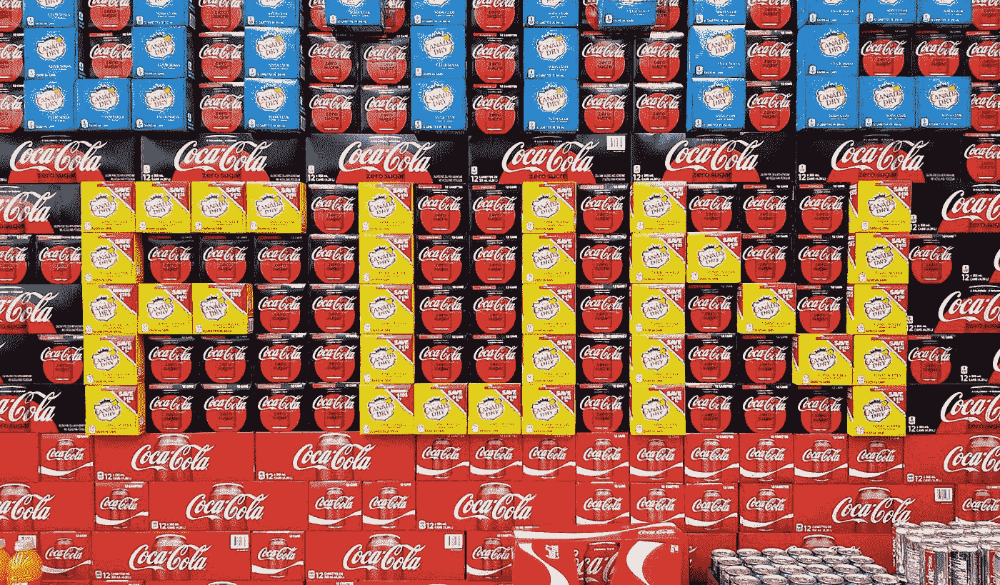

# 反应阱—popover

> 原文：<https://blog.devgenius.io/reactstrap-popovers-fc6736bc5987?source=collection_archive---------4----------------------->


由[约书亚·科尔曼](https://unsplash.com/@joshstyle?utm_source=medium&utm_medium=referral)在 [Unsplash](https://unsplash.com?utm_source=medium&utm_medium=referral) 上拍摄的照片

Reactstrap 是为 React 制作的一个版本引导程序。

这是一组具有 Boostrap 陷阱样式的 React 组件。

在本文中，我们将看看如何用 Reactstrap 添加 popovers。

# 松饼

Popovers 是当我们触发它们时弹出的元素。

react 陷阱弹出器是用 react-popper 库构建的。

例如，我们可以通过添加以下内容来添加一个:

```
import React from "react";
import "bootstrap/dist/css/bootstrap.min.css";
import { Button, Popover, PopoverHeader, PopoverBody } from "reactstrap";export default function App() {
  const [popoverOpen, setPopoverOpen] = React.useState(false); const toggle = () => setPopoverOpen(!popoverOpen); return (
    <div>
      <Button id="Popover" type="button">
        Launch Popover
      </Button>
      <Popover
        placement="bottom"
        isOpen={popoverOpen}
        target="Popover"
        toggle={toggle}
      >
        <PopoverHeader>Popover Title</PopoverHeader>
        <PopoverBody>
          Lorem ipsum dolor sit amet, consectetur adipiscing elit. Nulla tempus
          fermentum lacus
        </PopoverBody>
      </Popover>
    </div>
  );
}
```

我们添加了`Button`组件来触发弹出窗口。

`id`与`Popover`的`target`支柱配合使用触发。

`Popover`组件拥有 popover。

`placement`有放爆米花的地方。

`toggle`是一个让我们切换弹出窗口的功能。

`PopoverHeader`有 popover 头。

而`PopoverBody`有 popover 的车身。

当我们点击按钮时，我们应该可以看到弹出窗口。

`isOpen`道具控制弹出框是否显示。

# Popovers 触发器

我们还可以添加一个不受控制的弹出组件。

我们不需要改变弹出窗口的`isOpen`状态来控制弹出窗口。

例如，我们可以写:

```
import React from "react";
import "bootstrap/dist/css/bootstrap.min.css";
import {
  Button,
  UncontrolledPopover,
  PopoverHeader,
  PopoverBody
} from "reactstrap";export default function App() {
  return (
    <div>
      <Button id="PopoverFocus" type="button">
        Launch Popover (Focus)
      </Button>
      <UncontrolledPopover
        trigger="focus"
        placement="bottom"
        target="PopoverFocus"
      >
        <PopoverHeader>Focus Popover</PopoverHeader>
        <PopoverBody>
          Lorem ipsum dolor sit amet, consectetur adipiscing elit. Nulla tempus
          fermentum lacus
        </PopoverBody>
      </UncontrolledPopover>
    </div>
  );
}
```

用一个触发弹出窗口显示的按钮创建弹出窗口。

我们使用带有`trigger`和`id`道具的`UncontrolledPopover`组件来避免设置一个状态来控制弹出窗口。

`trigger`是触发弹出框的事件，`target`应该与触发元素的`id`相同。

我们也可以通过编写以下内容来触发弹出窗口:

```
import React from "react";
import "bootstrap/dist/css/bootstrap.min.css";
import {
  Button,
  UncontrolledPopover,
  PopoverHeader,
  PopoverBody
} from "reactstrap";export default function App() {
  return (
    <div>
      <Button id="PopoverClick" type="button">
        Launch Popover (Click)
      </Button>
      <UncontrolledPopover
        trigger="click"
        placement="bottom"
        target="PopoverClick"
      >
        <PopoverHeader>Click Popover</PopoverHeader>
        <PopoverBody>
          Lorem ipsum dolor sit amet, consectetur adipiscing elit. Nulla tempus
          fermentum lacus
        </PopoverBody>
      </UncontrolledPopover>
    </div>
  );
}
```

我们有带`target`的`UncontrolledPopover`。

我们将`trigger`设置为`click`以使弹出窗口在点击时显示。

还有由 Reactstrap 自己的触发值触发的遗留 popover。

例如，我们可以写:

```
import React from "react";
import "bootstrap/dist/css/bootstrap.min.css";
import {
  Button,
  UncontrolledPopover,
  PopoverHeader,
  PopoverBody
} from "reactstrap";export default function App() {
  return (
    <div>
      <Button id="PopoverLegacy" type="button">
        Launch Popover
      </Button>
      <UncontrolledPopover
        trigger="legacy"
        placement="bottom"
        target="PopoverLegacy"
      >
        <PopoverHeader>Click Popover</PopoverHeader>
        <PopoverBody>
          Lorem ipsum dolor sit amet, consectetur adipiscing elit. Nulla tempus
          fermentum lacus
        </PopoverBody>
      </UncontrolledPopover>
    </div>
  );
}
```

我们将`trigger`设置为`legacy`来制作一个传统的 popover。



唐·达斯卡洛在 [Unsplash](https://unsplash.com?utm_source=medium&utm_medium=referral) 上的照片

# 结论

Popovers 可以添加各种触发器。

它们可以是受控的或不受控的/