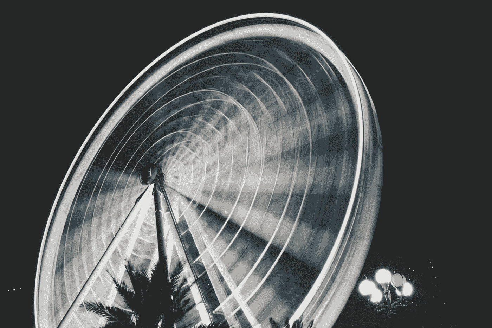

# 反应陷阱-进度条和微调按钮

> 原文：<https://blog.devgenius.io/reactstrap-progress-bars-and-spinners-44133270e53b?source=collection_archive---------5----------------------->


照片由[艾萨克·史密斯](https://unsplash.com/@isaacmsmith?utm_source=medium&utm_medium=referral)在 [Unsplash](https://unsplash.com?utm_source=medium&utm_medium=referral) 拍摄

Reactstrap 是为 React 制作的一个版本引导程序。

这是一组具有 Boostrap 陷阱样式的 React 组件。

在本文中，我们将看看如何添加一个进度条和带有 Reactstrap 的 spinners。

# 最大值

我们可以改变进度条的最大值。

为此，我们更改了`max`属性。

例如，我们可以写:

```
import React from "react";
import "bootstrap/dist/css/bootstrap.min.css";
import { Progress } from "reactstrap";export default function App() {
  return (
    <div className="text-center">
      <Progress value={50} max="200" />
    </div>
  );
}
```

我们将`max`设置为 200，这样，如果酒吧已满，`value`将为 200。

如果我们有一个分段的进度条，我们必须单独设置每个分段的`max`值。

例如，我们写道:

```
import React from "react";
import "bootstrap/dist/css/bootstrap.min.css";
import { Progress } from "reactstrap";export default function App() {
  return (
    <div className="text-center">
      <Progress multi>
        <Progress bar value="5" max={10}>
          5
        </Progress>
        <Progress bar color="success" value="15" max={200}>
          15
        </Progress>
        <Progress bar color="warning" value="10" max={200}>
          10
        </Progress>
        <Progress bar color="danger" value="10" max={200}>
          10
        </Progress>
      </Progress>
    </div>
  );
}
```

每个分段的条形宽度是单独计算的，因此它们的`max`值不会相互影响。

# 纺纱机

我们可以使用`Spinner`组件添加一个微调器。

例如，我们可以写:

```
import React from "react";
import "bootstrap/dist/css/bootstrap.min.css";
import { Spinner } from "reactstrap";export default function App() {
  return (
    <div>
      <Spinner color="primary" />
    </div>
  );
}
```

添加`Spinner`组件并用`color`道具设置颜色。

其他颜色值包括`secondary`、`success`、`danger`、`warning`、`info`、`light`或`dark`。

# 生长纺纱机

我们可以添加一个`type`道具设置为`grow`的生长微调器。

例如，我们可以写:

```
import React from "react";
import "bootstrap/dist/css/bootstrap.min.css";
import { Spinner } from "reactstrap";export default function App() {
  return (
    <div>
      <Spinner type="grow" color="primary" />
    </div>
  );
}
```

# 大小

尺寸可随`size`支柱而变化。

所以我们可以写:

```
import React from "react";
import "bootstrap/dist/css/bootstrap.min.css";
import { Spinner } from "reactstrap";export default function App() {
  return (
    <div>
      <Spinner size="sm" color="primary" />
    </div>
  );
}
```

`sm`表示小，`lg`表示大。

我们也可以单独改变`width`和`height`:

```
import React from "react";
import "bootstrap/dist/css/bootstrap.min.css";
import { Spinner } from "reactstrap";export default function App() {
  return (
    <div>
      <Spinner style={{ width: "5rem", height: "5rem" }} color="primary" />
    </div>
  );
}
```

我们通过改变样式对象的`width`和`height`属性来放大它。

我们可以通过编写以下代码来添加微调器的所有变体:

```
import React from "react";
import "bootstrap/dist/css/bootstrap.min.css";
import { Spinner } from "reactstrap";export default function App() {
  return (
    <div>
      <Spinner color="primary" />
      <Spinner color="secondary" />
      <Spinner color="success" />
      <Spinner color="danger" />
      <Spinner color="warning" />
      <Spinner color="info" />
      <Spinner color="light" />
      <Spinner color="dark" />
    </div>
  );
}
```



[Shahzin Shajid](https://unsplash.com/@shahzin_2903?utm_source=medium&utm_medium=referral) 在 [Unsplash](https://unsplash.com?utm_source=medium&utm_medium=referral) 上拍摄的照片

# 结论

我们可以改变进度条的最大值。

我们可以用`Spinner`组件添加一个装载旋转器。