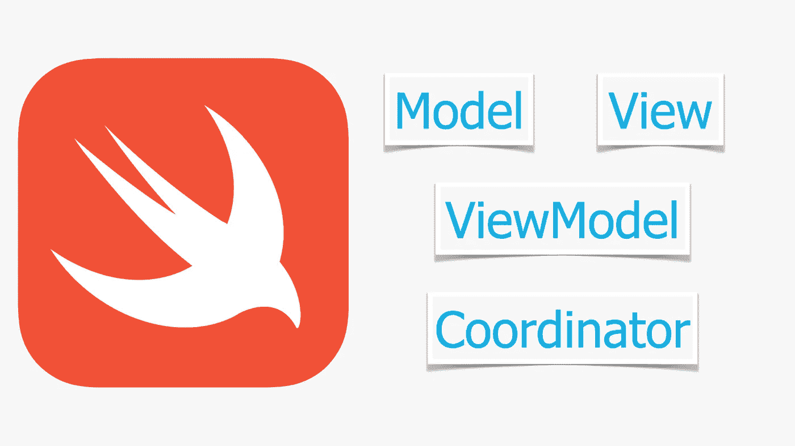

# 可读性、可扩展性和可测试性

> 原文：<https://blog.devgenius.io/readability-scalability-and-testability-ae0d1d8b08c0?source=collection_archive---------8----------------------->

MVVM-C 在 swift 中的应用更加接近完美

从现在开始，许多架构设计模式被引入，其中少数几个在开发 iOS 应用程序时更受欢迎。早些时候，我们使用 MVC 设计模式开发 iOS 应用程序，这种模式现在已经很老了，因为许多开发人员已经为他们的 iOS 应用程序采用了 MVVM 设计模式，以更加专注于清晰地定义架构各层的责任。

在接下来的故事中，我们将看到，为什么需要进一步增强 MVVM，以及 MVVM-C 如何成为广泛使用的建筑设计模式之一。

要回答这些问题，让我们先来看看 MVC 和 MVVM。

## MVC 中负担过重的 ViewControllers

MVC 有三个组件:模型-视图-控制器。

**模型**被很好地定义并有具体的责任。

**视图**组件与 **iPhoneSDK** 中的*视图控制器*概念有些混淆。

开发人员倾向于让 *ViewController* 负责**视图**的渲染以及**控制器**活动(*即导航逻辑、业务逻辑等)。*)

这使得**视图**和**控制器**彼此紧密耦合，因此它们难以重用，当然也难以进行单元测试。

## 呼叫 MVVM 救援以减轻管制员的责任

与 MVC 相比，MVVM 相当不错，因为它有助于克服 MVC 设计模式的视图控制器负担过重的缺点。

MVVM 也有三个组件模型-视图-视图模型。

**模型**是直接的，像 MVC 一样有单一的职责。

**视图**被简化，更加清晰，避免了 ViewController 与 MVC 中的**控制器**混淆。**视图**负责 UI 在屏幕上的渲染。它可以是 UIView 或 UIViewController 子类。

**视图模型**负责业务逻辑的实现，同时也是**模型**和**视图**之间的沟通者。ViewModel 可以是`struct`或者`class`。

**ViewModel** 负责包含*导航逻辑、业务逻辑等*。因为它不是 UIViewController 子类，所以测试在 **ViewModel** 中实现的业务逻辑更容易。

**ViewModel** 也有助于使**视图**组件变得愚笨，因为它去除了 ViewController 包含导航逻辑的责任。使用一个愚蠢的**视图**组件，它是完全可重用的。

## ViewModel 有许多职责，使得重用更加困难

视图模型有助于视图组件的可重用性和可测试性，也使得业务逻辑的单元测试变得更加容易。

然而，如果你观察过，除了实现业务逻辑的主要职责之外，它还有其他的职责(即*导航逻辑*)。

现在是时候考虑减轻视图模型的责任了。

## 随着在 MVVM 引入新的组成部分“协调员”,出现了 MVVM-C 模式。

为了减少`ViewModel`的责任，我们可以增加一个组件，它可以从`ViewModel`中取出责任来实现*导航逻辑*

我们称新组件为`Coordinator`，因为它充当了`View`和`ViewModel`之间的协调器。

`Coordinator`将帮助**视图模型**单独负责实现*业务逻辑，*这意味着它现在更容易测试和重用*。*

我们可以通过向 MVVM 引入第四个组件(**协调器**)来实现关注点的分离。

## 调用 MVVM-C 来提高可读性、可伸缩性和可测试性

MVVM-C 中每个组成部分的概述:

**型号**

*   表示数据对象
*   可以是`struct`或`class`(推荐使用`struct`，并符合`Codable`协议，便于编解码操作。)

**查看**

*   负责在屏幕上呈现用户界面元素
*   使其成为哑对象，它应该只遵循`ViewModel`的命令
*   建议用`Protocol`代替`Concrete`类型使`View`依赖于`ViewModel`。(即数据源、可加载、可刷新、可搜索等。)
*   使其成为附加行为(数据渲染除外)`Abstract`(即加载可显示)

**ViewModel**

*   负责实现业务逻辑
*   与`DataLayer`通信以从 API/数据库加载数据
*   为`View`充当方便的`Datasource`
*   当`state`改变时必须通知`View`(即*正在加载*，*正在刷新*
*   更新时必须通知`View`(例如，来自 API/数据库的数据或任何种类的数据分类/过滤)
*   可选地与`Coordinator`通信以进行`Error`处理

**协调员**

*   负责实现导航逻辑
*   通过`start()`方法实例化并返回`ViewController`
*   实例化`ViewModel`并将其提供给`ViewController`
*   可选地作为`ViewModel`的`ErrorDelegate`来处理错误
*   通过`finished()`方法通知父协调器其任务完成

到目前为止，我们只关注理论部分。也许你对实施 MVVM 协议不是 100%清楚

放心吧！！在下一节中，我们将围绕实际代码进行讨论，以便让您更好地理解。:)

我们将构建一个演示应用程序，它使用远程 API 并填充屏幕上的列表。

在这个演示中，我们使用[https://rest countries . eu](https://restcountries.eu)API 根据*搜索关键字*在屏幕上填充国家。

让我们开始为我们的应用程序逐个定义实体。

# 模型

如下图所示，我将我的模型定义为`struct`，并将我的模型确认为`Codable`协议，以便于编码/解码。

想了解更多`Codable`，可以查看我的故事:[Swift 中“可编码”的必备](https://medium.com/macoclock/essential-of-codable-in-swift-18c83718d010)

# 视图模型

如上所述，`ViewModel`负责实现业务逻辑，并通知`View`其*状态*的变化。

所以，我更喜欢定义`ViewModel` *协议*，用方法不断通知`View`它的*状态*改变，并在*用数据更新*时通知`View`。

> 这种通知视图的机制将使`View`和`ViewModel`之间的通信非常容易实现和理解。
> 
> 它还会使`View`实现变得清晰易读，以便在`ViewModel`更新时呈现更新的数据。

现在，我们可以定义我们的具体`ViewModel`，让我们命名为`CountryListViewModel`。

`CountryListViewModel`确认`CountryListDatasource`协议，这将使`CountryListViewModel`作为`View`的*数据源*。

`CountryListViewModel`确认`ViewModel`协议，通知`View`状态变化。

`CountryListViewModel`执行“*func seach for(keyword:String)*方法确认`Searchable`协议。

`CountryListViewModel`通过`RequestManager`与数据层通信。

并且通过`ErrorDelegate`协议与`Coordinator`通信。

`CountryListViewModel`实现了所有需要的东西，我们在上面部分列出了这些东西，可读性很好**。**

我们还增加了****`CountryListViewModel`的可扩展性，在某种意义上可以轻松添加新行为。****

****它可以确认`Refreshable`协议，并像我们实现“func searchFor(keyword: String)”一样实现“ *func refresh()* ”方法。****

****现在，让我们来看看，它是如何帮助提高代码的可测试性的。****

****正如你在上面看到的，我们可以很容易地测试我们`ViewModel`的所有职责。它具有 100%的代码覆盖率。****

****不仅仅是代码覆盖率，它还会让你更容易实现 100% *功能覆盖率*来测试你的*业务逻辑*的各种场景。****

# ****视角****

****我更喜欢把`View`做成哑对象，让它易于重用。****

****它必须与`ViewModel`通信以获取数据并将其呈现在屏幕上。应观察*状态*变化和*更新`ViewModel`的*刷新屏幕数据。****

****`CountryListViewController`通过`CountryListViewControllerDelegate`协议与`Coordinator`通信。****

> ****`View`取决于“func configure(viewModel:CountryListViewModelProtocol)”中`ViewModel`的协议类型****
> 
> ****这会增加*****`View`的伸缩性。例如，如果我们想增加“刷新”屏幕的能力，我们可以很容易地要求我们的`ViewModel`成为如下的`Refreshable`。*********
> 
> *****type alis CountryListViewModelProtocol = countrylistdata source & ViewModel & Searchable &**可刷新*******

# *****协调者*****

*****`Coordinator`主要负责实现*导航*逻辑。*****

*****我更喜欢定义`Coordinator`协议，它定义了`Coordinator`的基本职责。*****

*****让我们实现具体的协调器，并将其命名为`CountryListCoordinator`。*****

*****你可以看到`CountryListCoordinator`实现了`Coordinator`协议的功能。*****

*****`CountryListCoordinator`实例化`CountryListViewController`并从`start()`方法返回。*****

*****`CountryListCoordinator`通过确认`CountryListViewControllerDelegate`协议充当`View`的`delegate`。*****

*****通过确认`CountryListViewModeLoadingErrorDelegate`协议，`CountryListCoordinator`也作为`ViewModel`的`ErrorDelegate`。*****

*****执行`Coordinator`可以很容易地将执行*导航逻辑*与`View`或`ViewModel`分开。*****

*****我们现在可以轻松测试`Coordinator`了。*****

> *****MVVM-C 帮助遵循鲍勃大叔的坚实原则。*****
> 
> *****坚实的原则帮助你提高应用程序的可读性、可伸缩性和可测试性。*****

*****我希望您喜欢阅读这个故事，并对 MVVM-C 的 swift 应用有很好的了解。*****

*****我很乐意回答你的问题。*****

*****编码快乐！！:)*****