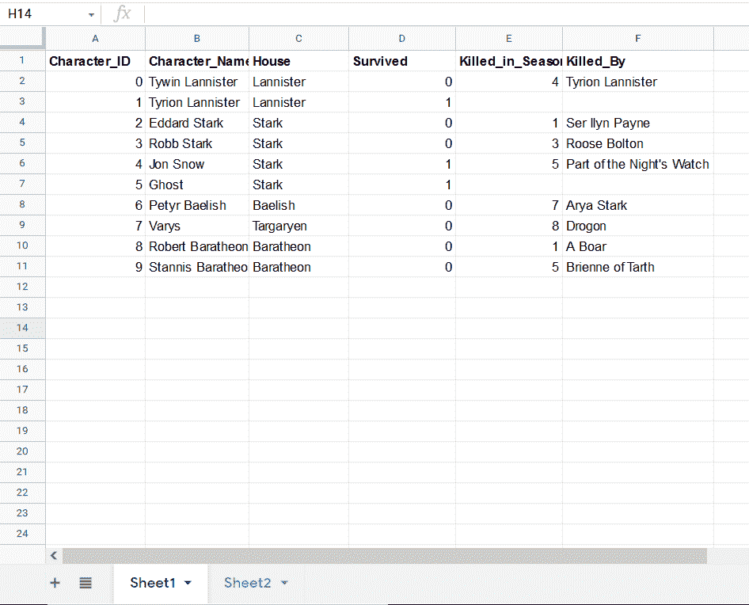
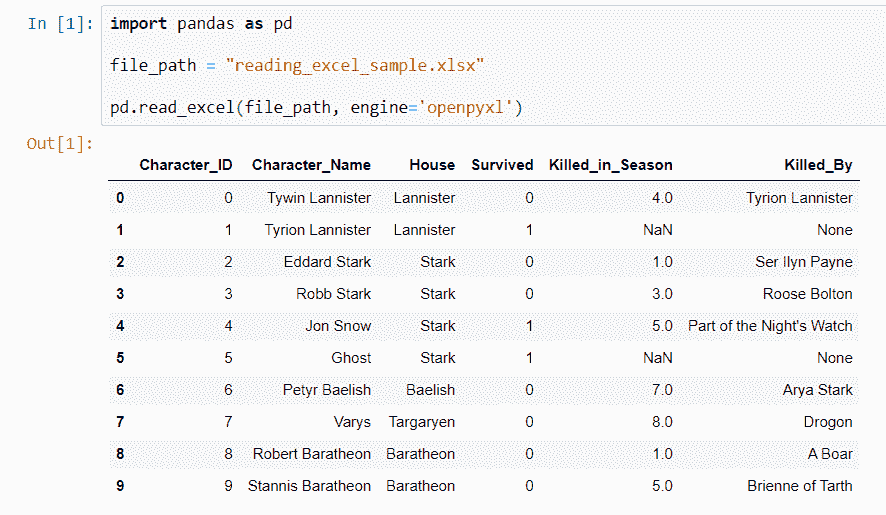
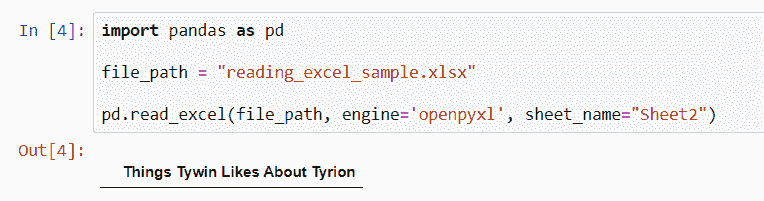
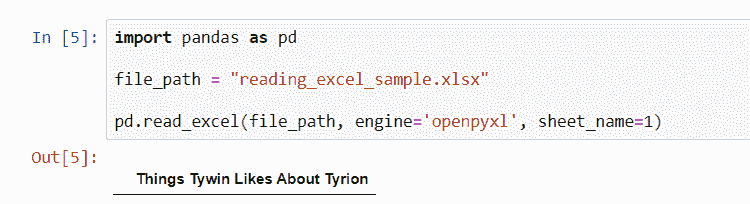
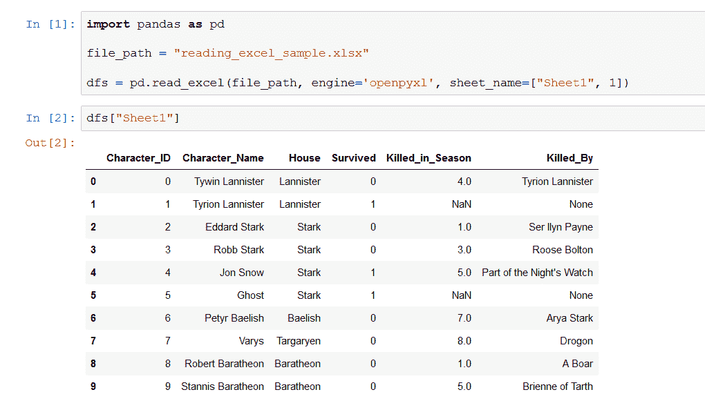
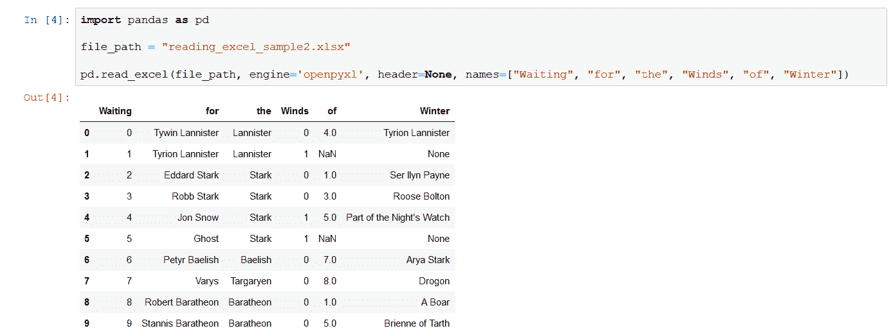
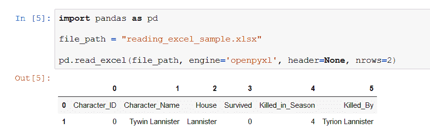

# 如何使用熊猫阅读 Excel 文件

> 原文：<https://blog.devgenius.io/reading-excel-files-with-pandas-the-basics-6a6be9cc8763?source=collection_archive---------1----------------------->

## 关于如何使用熊猫阅读 Excel 文件的指南。

照片由[米尔法](https://pixabay.com/users/myrfa-3126475/)从[皮克斯拜](https://pixabay.com/)拍摄

读写文件通常是你需要在编码中能够执行的基本过程之一。读取数据——假设这次是在 Excel 中——相当简单，但是，在不太理想的情况下，一些细节可能会派上用场。

鉴于您正在读入数据以进行进一步操作，我们将使用 **Pandas** 来完成这项任务。这听起来可能是一个很大的假设，但是从 Excel 文件中读取数据以便对其不做任何事情的人相对较少。我抓住机会，你不是其中之一。

让我们开始吧:这是您想要阅读的文件:

作者截图

我给你的不是一个大的，但是更多的数据不适合截图。在不同的文件扩展名中有不同的读取方法，在我们的例子中，我使用的是 XLSX 文件，它需要 pandas 的`read_excel()`方法。

作者截图

非常有效——现在您的数据被加载到 DataFrame 对象中。通常这就是全部了——你给出一个文件名(和路径，以防它和你的脚本不在同一个目录中),读取文件，然后开始。棘手的是，当你不得不使用任何参数时，就像我对“引擎”所做的那样——你注意到了吗？

小故事: **XLRD** 是熊猫读取 Excel 文件的默认引擎，碰巧 **XLRD** 停止支持 XLSX 文件。如果你想读一个，你需要 pip 安装 **openpyxl** ，并设置它为阅读引擎而不是默认的。

让我们看看其他一些参数，看看它们能做什么(完整文档请访问[文档](https://pandas.pydata.org/docs/reference/api/pandas.read_excel.html))！

> 如果你想让我保持咖啡因创造更多这样的内容，请考虑支持我，只要一杯咖啡。

## **工作表名称**

默认情况下，如果有多个工作表，pandas 将读取文件的第一个工作表:如果您想选择另一个工作表，您可以提供工作表的索引(当然从 0 开始)，或者以字符串形式提供工作表名称。

作者截图

作者截图

请注意，您可以提供一个表名/索引列表来读取多个表，在这种情况下，返回值将是一个字典，键是表名/索引。

作者截图

## **表头**

如果您的数据碰巧在第一行之外的某个地方有标题行，您当然可以指定它的位置。如果没有，应该加上 none，并在下一个参数中指定(理想情况下)列名， **names** 。

## **名字**

您可以在此列出列的名称。

作者截图

## **用途**

尽管将数据帧缩小到比最初加载的列数更少是相当容易的，但是如果输入中有很多列，并且事先知道不会用到很多列，则应该使用“usecols”参数来提供希望在数据帧中使用的列。您有多种选择:

*   以字符串形式提供 Excel 列字母，可以是逗号分隔的(如果有多个)，也可以是一个范围，例如“A，B，C”，(“A:C”)，
*   列的索引列表，例如[1，2，4]，
*   列名列表，例如[“字符 ID”、“字符名称”、“房屋”]，
*   一个可调用的，遍历列名并返回评估为 True 的列名，
*   如果没有，所有列都将包含在数据框架中。

## **nrows**

在数据帧中只包含某些行。

作者截图

## **skipfooter**

您可以提供要从数据集末尾截断的行数。

当然，您可以使用更多的选项，首先，我认为这些选项最有可能在您最初的几次文件读取练习中派上用场。请务必阅读[文档](https://pandas.pydata.org/docs/reference/api/pandas.read_excel.html)了解更多细节，一般来说也是如此——你肯定能学到很多东西。

现在你知道了。感谢您的阅读。

*更多内容请看*[*plain English . io*](http://plainenglish.io/)*。报名参加我们的* [*免费周报在这里*](http://newsletter.plainenglish.io/) *。*