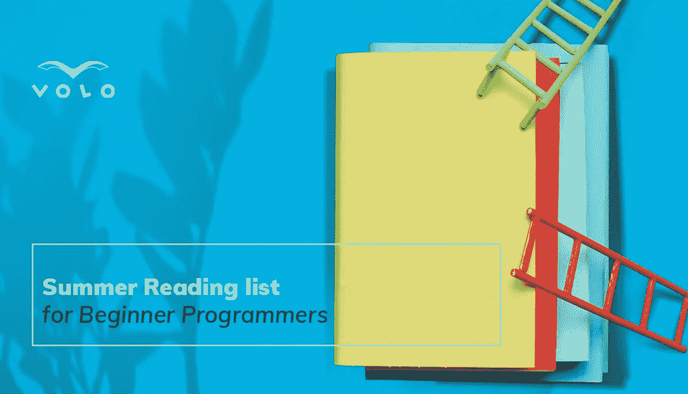
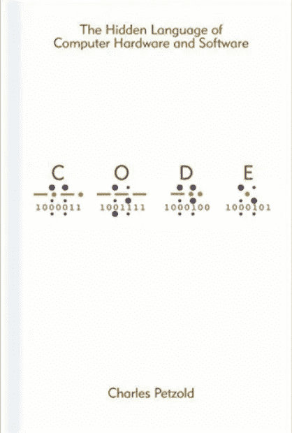
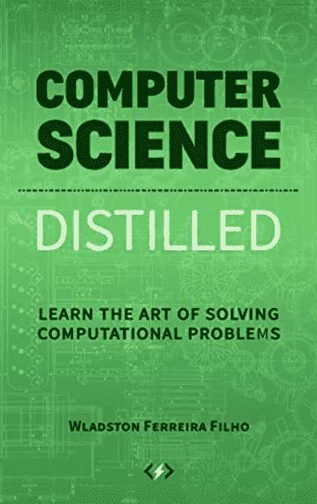
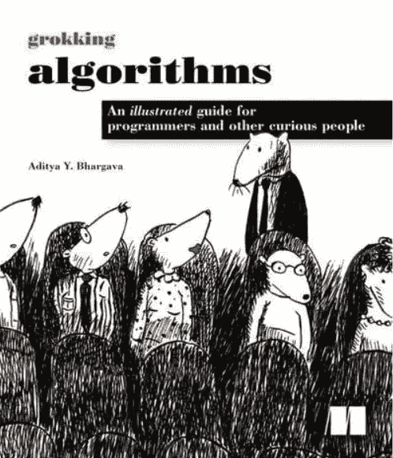
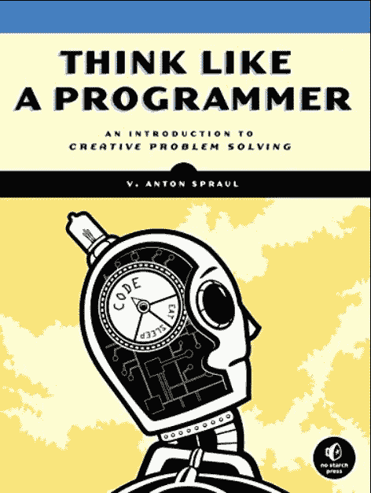
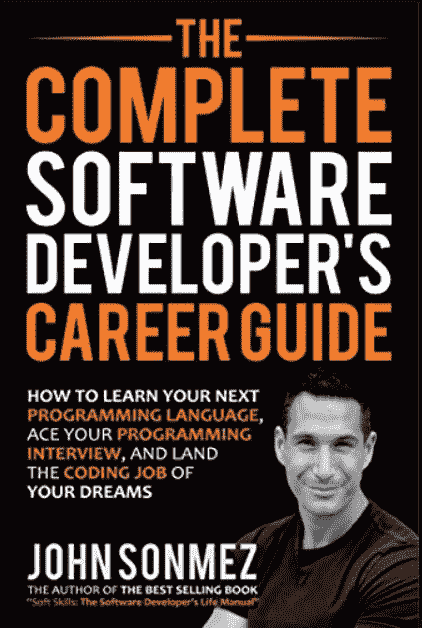

# 初学程序员的暑期阅读清单

> 原文：<https://blog.devgenius.io/reading-list-for-beginner-programmers-a69e16708d0f?source=collection_archive---------11----------------------->

O***ne of***[***VOLO***](https://www.volo.global/)*[***Ruben Markosyan***](https://medium.com/@markosyanruben)***为初学软件开发人员整理了一份阅读清单，旨在帮助他们成为更好的专业人士，推进他们的职业生涯。****

*不久前，一位初露头角的年轻专业人士让我向他推荐一些书籍，这些书籍对刚刚涉足该领域的软件开发人员会有所帮助。他在寻找那些不仅能给他提供坚实的编程知识基础，而且易于理解的材料。*

> *现在，如果你在谷歌上搜索“程序员必读书籍”，你不可避免地会遇到一些书籍，比如鲍勃叔叔的，也就是罗伯特·c·马丁的，*干净的代码*，*干净的编码器*，以及*干净的架构*；史蒂夫·麦康奈尔的*代码完成*；福勒和贝克的*重构*；亨特和托马斯的*实用主义程序员*；伽马、Vlissides、约翰逊和赫尔姆的*设计模式*；科尔曼的*算法介绍*等。虽然所有这些都很优秀，但对于初学者来说，由于它们覆盖的主题的数量和深度，它们可能看起来有点吓人。这方面的一个例外是 *Clean Code —* 这是一本出色的书，在你熟悉了编程的基础之后，你就可以欣赏它了。*

*经过长时间的深思熟虑，我列出了 5 本书。同样，这些对初学者和那些没有 CS 教育背景的人来说是最有用的。虽然有经验的软件工程师也会觉得这些有用和有趣，但他们最好还是从上面的列表中挑选一些。*

*所以，我们开始吧，不分先后。*

# *1.代码:计算机硬件和软件的隐藏语言*

**

**代码*带你了解计算机的内部运作——它是如何“思考”和工作的。它从介绍“代码”的一般概念和信息的编码和解码开始，通过莫尔斯电码和盲文字母表一直到二进制系统和布尔代数。*

*整本书图文并茂，简单到天才的地步。它让你了解计算机和其他智能机器的“引擎盖”下发生了什么，从指导你如何制作一个基本的计算器开始，到最终教你如何从零开始(徒手)建造一台计算机并运行 CPU。*

> *如果你曾经遇到过不仅懂计算机，而且“感觉”到计算机的人，你会敏锐地感觉到这个人对内部计算过程有如此深刻的知识和理解，对他们来说几乎是直觉的。这正是*代码*要为其读者实现的目标。*

*我认为这是基本理解代码概念以及计算机硬件和软件内部结构的重要的第一步。*

# *2.Wladston Ferreira Filho 提炼的计算机科学*

**

*就页数而言，这是列表中最短的一本书，然而它涵盖了计算机科学中最广泛的各个领域。我个人认为它是一套很好的浓缩的计算机科学笔记，可以帮助你轻松掌握这门学科的概念，填补你可能有的知识空白。虽然由于其简洁的性质，它确实跳过了一些细微差别，但这本书熟练地触及了计算原理的所有主要问题，而没有用专业术语过度混淆读者。作者解释一切，就像他向非技术人员解释一样。整本书简明扼要。*

*我认为这是初学程序员的绝佳选择，尤其是那些参加在线课程的人，比如“如何在 3 个月内成为一名程序员并被录用”——这些课程永远不会涵盖像菲洛的*计算机科学精粹那样的计算机科学基础。**

# *3.Aditya Bhargava 的搜索算法*

**

*在我们开始之前，我想再一次提到科尔曼等人写的《T4 算法导论》一书。是的，这本书非常棒，非常全面——毕竟有 1300 页，其中大约三分之一涵盖了离散数学。现在，你能对数字上帝说你已经从头到尾读完了吗？如果有，你会推荐给初学者吗？*

*如果你希望有人像你 6 岁时一样向你解释算法，没有比 *Grokking Algorithms* 更好的选择，这是一本 250 页的图文并茂、初学者友好的指南，教你如何将算法应用于程序员面临的日常问题。作者真的想出了一个巧妙的方法，用一种简单的语言和古怪的真实世界的例子来解释复杂的概念，如算法和数据结构。*

# *4.像程序员一样思考*

**

*这本书是我在上面设定的规则的一个例外，因为它不是语言不可知的——作者使用 C++示例来介绍涵盖的编程概念。然而，这不是一本关于 C++的书，而是一本关于解决问题的书，它的创造性思维概念超越了任何特定语言的领域。如果您忽略本书的“指针”部分，其余部分可以适用于任何编程语言。*

*任何编程导师都会告诉你，问题不在于教学生该语言的语法，而在于教他们使用该语言解决问题。这就是这本书派上用场的地方——它真正教会你像程序员一样思考，并增强你解决问题的能力。*

# *5.完整的软件开发人员职业指南*

**

*这个完全偏离了上面的列表。我把它看作是作为软件开发人员推销自己的百科全书。一般来说，如果工程师有弱点，那就是他们的软技能——他们经常努力展现自己最好的一面。这份职业指南将教你如何做到这一点——从磨练你的技术和社交技能，到理解人和事背后的心理，以及成功创建你的个人品牌。毕竟，技术技能是你提供的服务，你*必须*能够销售。*

*诚然，作者 John Sonmez 作为一名程序员的资历经常受到质疑。有人说他更像是一个蛇油推销员，而不是程序员。他似乎在社交媒体上邀请和/或创造了围绕他自己和他的品牌的大量争议。我是这样看的——这个人写了几本畅销书，在社交媒体和商业上也很成功。换句话说，他已经完全实现了他在书中宣扬的东西。如果这还不能证明这本书的可信度，我不知道还有什么能证明。*

*如果你想专业地而不仅仅是娱乐性地编程，我强烈推荐你买这本书。它涵盖了重要的专业概念和想法，这些都是我多年来通过反复试验，以一种非常容易理解的方式学到的。你甚至不需要从头到尾读一遍，而是专注于你目前最感兴趣的章节。*

**我试着整理了一份我认为对这个领域的年轻专业人士最有益的书籍清单，尽管它们可能不在你在互联网上找到的最传统的清单的上半部分。我希望你喜欢它们，并在你的职业生涯中充分利用它们。**