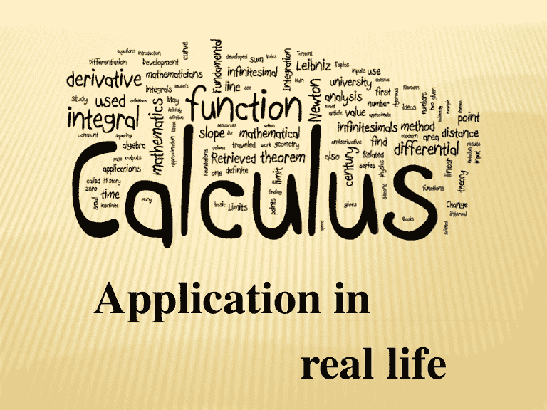

# 微积分在现实生活中的应用

> 原文：<https://blog.devgenius.io/real-life-applications-of-calculus-f8cc1d08a85a?source=collection_archive---------3----------------------->

*微积分主题中有许多实际应用需要学习。以下是微积分在现实生活中最常用的一些应用。*

在统计学之后，微积分在数学中有着最现实的应用，涵盖了各种各样的主题。学习现实生活中的应用程序可以帮助你学习更多的微积分知识，并利用你所拥有的知识来解决现实生活中的大多数问题。现在，让我们来看看现实生活中的应用:

## 1-算法

算法是从给定的输入中获得期望输出的一组规则。简而言之，我们的输入导致了输出(解决方案)。因为函数中有集合和定义域，所以每个输入只有输出。所以，算法的逻辑可以通过微积分课上对函数的理解来理解。

## 2-业务分析

长期成本计算、长期利润计算、长期收入产生、长期投资回报以及许多其他应用都依赖于衍生品。当我们分解这些主题中的导数时，导数的使用会有一定的区别，但它们有相同的逻辑。

**用于成本计算(最小化目的)**

在微观经济学中，当总成本与边际成本相等时，成本就会最小化。边际成本可以通过对总成本求导来计算，以了解增加一个单位的投入所产生的额外成本(单位可以根据您自己的指标来定义)。

**营利性计算(为了最大化目的)**

我们计算利润的时候也是这个逻辑。当边际收益和边际成本相等时，利润最大化。在数学上，总收入和边际成本的导数是相等的。

**对于长期而言**

从长远来看，公司的盈利能力完全取决于他们最小化长期固定和可变成本的能力(这是理论，有更多的参数来决定企业运营的可能性。但是为了微积分的应用，我们决定给出这个理论)。

**对于可变收益(利息、投资等。)**

每当银行向你发放抵押贷款时，根据投资组合创造的平均回报对你的投资组合进行建模，并据此进行预测。只要通货膨胀率在几年内可能完全不同，就可以根据变量不同点的差异进行规划，并相应地用偏导数进行优化。

## 3-工程

无论何时需要热量计算、体积计算或任何其他工程计算。事情是，每个工程师将不得不使用微积分上的任何主题来确定长度、空间和热量将被转移的时间。所有这些计算都需要积分和导数来计算斜率、热传递速度以及任何需要的计算。

*根据你的说法，微积分在现实生活中有哪些应用？在下面的评论区分享你的想法？*