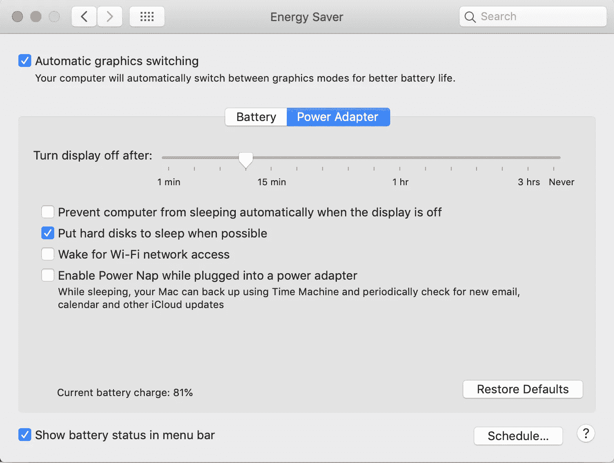

# 真实调试

> 原文：<https://blog.devgenius.io/real-life-debugging-3fe936a9d1b7?source=collection_archive---------14----------------------->

[Zan](https://unsplash.com/@zanilic?utm_source=medium&utm_medium=referral) 在 [Unsplash](https://unsplash.com?utm_source=medium&utm_medium=referral) 上的照片

调试是分析系统或应用程序中的错误情况并找出该情况的根本原因的艺术(部分是科学)。这是软件工程中非常常见的活动，但不一定仅限于该领域。当我们调试一个问题时，很容易被问题的影响所淹没，这很容易分散我们的注意力。但是，像任何其他方法一样，如果我们遵循一个有条不紊和有纪律的过程，我们就更接近于找到我们看到的所有症状的根本原因。

我的职业是软件工程师，每天都要调试很多问题。在我职业生涯的最初几天，调试问题是软件工程中最可怕的部分。毕竟，写新代码更容易，也更酷，对吧？但是让我告诉你——当你花几个小时在你见过的奇怪的错误/问题上，并最终找到根本原因时，解决问题的真正乐趣就来了。有一些成熟的技术可以让你更好地掌握这种微妙的艺术，就像任何其他技能一样，通过更多的练习，你可以更好地调试。最近，我在家里遇到了一个问题，我成功地调试并修复了它！让我更详细地解释一下。

# 问题是

我家里有一个双频 Wi-Fi 路由器，我们使用多种设备连接到该路由器，包括 2 部手机和 2 台笔记本电脑。根据每台设备处理的工作负载，每台设备都连接到特定的 Wi-Fi 频段。现在，像任何其他典型的路由器一样，我的路由器有那些小 LED 灯，每当数据正在传输(上传或下载)时就会闪烁。当我用完每月套餐中 X%的可用数据带宽时，我的互联网服务提供商(ISP)会向我发送通知。如果对我的互联网使用统计有一个公平的理解，我确信我不会从我的 ISP 那里得到任何这样的警告。但事情还是发生了——就在新的计费周期开始几周后，我从 ISP 那里收到一条消息，说我已经消耗了 50%的带宽(大约 150GB)。根据我的直觉，这听起来很荒谬。至少我*认为*我是对的。是时候调试这个问题了。

# 该过程

这是我们在调试问题时必须注意的第一件事——*找出预期的行为并注意观察到的行为*。在这种情况下，我的预期行为是没有收到来自 ISP 的任何警告消息，但我观察到的行为是收到了警告。在我们全面探索问题的潜在原因之前，这是极其重要的一步。在某件事成为问题之前，它总是以我们预期行为中的异常现象出现。只有当我们有一个非常明确和缩小的期望时，我们才能将观察到的行为归类为异常。

一旦我们对异常行为有了清晰的了解，我们现在就可以继续*寻找元凶*。为此，我们需要对您正在调试的系统有一个彻底的了解——所有的涉众，包括系统的消费者。在我的例子中，是 Wi-Fi 路由器和 4 个连接到它的设备。在我们获得这些信息后，我们就可以进入流程的下一步。

我们现在知道了异常点和可能导致异常点的元凶。下一步是*隔离罪魁祸首*。有时，不仅仅是潜在的罪魁祸首的数量，还有他们的配置和操作模式都可能导致问题。回到 Wi-Fi 问题，路由器支持 2 个频段 2.4GHz 和 5GHz，设备可以连接到其中的任何频段。在这种情况下，更深入地了解系统组件有助于我们缩小搜索范围。例如，在我拥有的 4 台设备中，我知道只有 3 台可以连接到 5 GHz 频段。为了获得进一步的帮助，我检查了路由器的任何提示。我注意到有一个频段被特别使用，即使我没有主动使用任何设备。

根据我的路由器的提示，我开始隔离罪犯。我检查了所有设备配置，以找出哪些设备正在使用 LED 持续闪烁的频段。然后，我关闭了这些设备的 Wi-Fi，然后一个一个地打开，以查看我的路由器中的使用模式。我注意到，当我打开工作用笔记本电脑的 Wi-Fi 时，使用率急剧上升。这没问题，因为我们的 IT 团队安装了各种后台流程(例如备份等。)但是，即使在我让笔记本电脑进入睡眠状态后，Wi-Fi 的使用也没有停止。这很奇怪。但是现在，我离目标更近了一步——我找到了真正的罪犯。

# 解决方案

现在我知道了罪魁祸首，是时候解决它了。谷歌了一下我的系统偏好设置，它阻止了 Wi-Fi 的使用，因为它会持续检查邮件、日历更新，并定期唤醒 Wi-Fi 组件。一旦我禁用了这个定期检查，事情就恢复正常了。又节省了一天。作为参考，下面是具体设置的截图。请注意，这是针对 Mac 的，不同操作系统的具体设置会有所不同。

我的 MacBook Pro 上的节能设置

正如我前面提到的，调试是一门艺术(和一些科学)，如果勤奋地应用，可以解决很多问题——无论是在软件中还是在现实生活中。在这篇文章描述的例子中，解决方案看起来很简单；但重要的是要明白，我们只有在成功调试后才能解决问题，而且是有条不紊地解决。即使在软件中，观察到的许多问题/错误通常通过添加对值和边界条件的简单检查来解决；挑战在于将问题缩小到那个变量。希望这有所帮助！干杯！