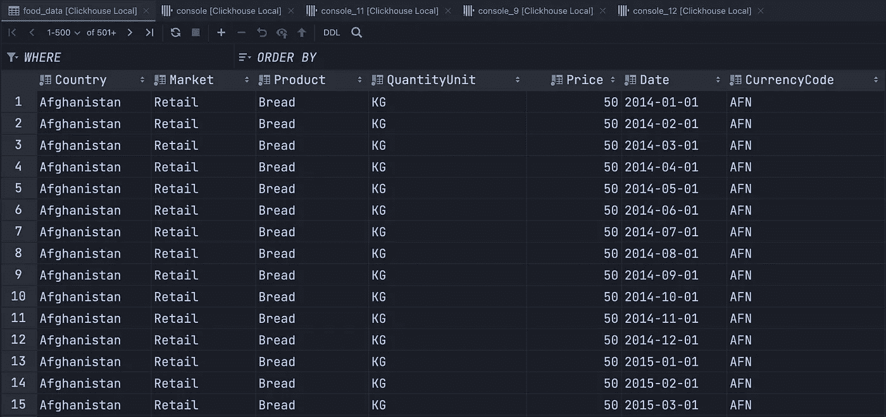

# 使用 Kafka 和 ClickHouse 的实时数据管道

> 原文：<https://blog.devgenius.io/real-time-data-pipeline-using-kafka-and-clickhouse-c83134e6f5d9?source=collection_archive---------0----------------------->


卢克·切瑟在 [Unsplash](https://unsplash.com?utm_source=medium&utm_medium=referral) 上拍摄的照片

在本文中，我们将构建一个数据管道，通过 Kafka 将数据接收到 ClickHouse 中，然后根据新数据自动进行聚合。我们将使用[全球食品价格数据集](https://www.kaggle.com/datasets/jboysen/global-food-prices)作为一个例子，但是，当然，这个例子对于 Kafka 来说不是很有代表性，因为它错过了[速度标准](https://www.oracle.com/big-data/what-is-big-data/#three)。

让我们定义我们的计划——首先，我们将创建一个生成消息的 Python 脚本(消息是我们数据集的行)。接下来，我们将设置 ClickHouse 来接收和处理这些消息。最后，我们将修补实时视图和数据删除。

## 0.要求

*   拥有一个卡夫卡集群。我个人使用这个 [GitHub 库](https://github.com/conduktor/kafka-stack-docker-compose)中的`zk-single-kafka-single.yml` docker-compose 文件。一旦通过`docker-compose -f <file> up`启动，就没什么可做的了。
*   安装 Python 3.x
*   拥有一个 ClickHouse 服务器(只需使用官方的二进制文件)。

## 1.消息生产者

在我们的例子中，消息生产者非常简单。在生产环境中，我们可以想象获取多个源并发送给 Kafka，但是，在我们的例子中，我们只需读取一个 CSV 文件，将行转换成 JSON 并发送它们。ClickHouse 对格式解析非常严格，这就是为什么我们将使用 JSON 而不是 CSV(例如，双逗号可以阻止您的数据被使用)。

这是我们的 Python 制作人:

```
import csv
import json

import kafka

producer = kafka.KafkaProducer()

with open('global_food_prices.csv', 'r', encoding='iso-8859-1') as f:
  r = csv.DictReader(f)

  for row in r:
    producer.send('food', json.dumps(row).encode('utf-8', 'replace'))

producer.close()
```

因此，我们正在读取`global_food_prices.csv`，将缓冲区传递给一个`csv.DictReader`，最后通过 JSON 发送每一行。请记住，这个例子过于简化了，我们可以通过 Python 驱动程序将数据插入 ClickHouse，但是 Kafka 有更多的优势。
*(我在编码方面有问题，iso-8859–1 很好用)*

## 2.使用来自 ClickHouse 的消息

启动 ClickHouse 和 Kafka 服务器后，进入 ClickHouse 控制台(通过 CLI 或使用 GUI，我喜欢使用 DataGrip)。

我们将设置总共 3 张桌子:

1.  一个`queue`，这个表有我们所有的 CSV 列，并使用 Kafka 引擎从`food`，我们上面定义的主题接收数据。
2.  一个结果表，只包含我们想要保留的列，具有更好的名称和类型(如果您的数据具有不一致的数据类型，如 CSV，这不再是一个问题)。
3.  一个物化视图将数据从队列转移到结果表，这个物化视图是 SQL 中的一个`SELECT`语句，我们将把我们的类型转换放在那里。

让我们从第一张表开始:

```
CREATE TABLE queue (
  adm0_id String,
  adm0_name String,
  adm1_id String,
  adm1_name String,
  mkt_id String,
  mkt_name String,
  cm_id String,
  cm_name String,
  cur_id String,
  cur_name String,
  pt_id String,
  pt_name String,
  um_id String,
  um_name String,
  mp_month String,
  mp_year String,
  mp_price String,
  mp_commoditysource String
) ENGINE = Kafka()
SETTINGS
    kafka_broker_list = 'localhost:9092',
    kafka_topic_list = 'food',
    kafka_group_name = 'clickhouse_reader',
    kafka_format = 'JSONStringsEachRow';
```

因为 CSV 没有类型，我们将在`String`中设置所有的列，稍后我们将转换类型。
这是结果表:

```
CREATE TABLE food_data (
  Country String, -- from: adm0_name
  Market String, -- from: pt_name
  Product String, -- from: cm_name
  QuantityUnit String, -- from: um_name
  Price Float32, -- from: mp_price
  Date Date, -- computed from: mp_month, mp_year
  CurrencyCode String -- from: cur_name
) ENGINE = MergeTree()
ORDER BY (Country, Product);
```

最后，我们可以创建处理表:

```
CREATE MATERIALIZED VIEW food_processing TO food_data AS
    SELECT
        adm0_name as Country,
        pt_name as Market,
        cm_name as Product,
        um_name as QuantityUnit,
        toFloat32OrZero(mp_price) as Price,
        toDate(format('{0}-{1}-01', mp_year, mp_month)) as Date,
        cur_name as CurrencyCode
    FROM queue
```

一旦创建了物化视图，它将立即开始处理数据。如果您还没有执行 Python producer，现在可以执行了。



现在已经填充了 food_data 表！

## 3.如果数据需要更新或删除怎么办？

有时，数据可能不正确，需要更正，不幸的是，这对于 OLAP 数据库来说不太实用，因为它们针对读写进行了优化，但不适合覆盖和删除。

```
SELECT Product,
       avg(Price) as AveragePrice,
       toYear(Date) as Year
FROM food_data
WHERE Country = 'Afghanistan'
GROUP BY Product, Year
ORDER BY Product, Year
```

该查询将计算阿富汗每年每种产品的平均价格。现在让我们考虑几个用例及问题。

## 3.1.数据集很小

如果`food_data`很小，那么你想直接查询或者使用一个`VIEW`。
如果我们从源表中删除行，使用`VIEW`将只是重新执行查询，我们不会受到影响。

## 3.2.数据集很大，但不可变

如果您从不删除行，但是查询太慢，无法在最终用户端执行，您可以使用`SummingMergeTree`，如下所示:

```
CREATE TABLE afghanistan_products (
  Product String,
  AveragePrice Float32,
  Year UInt16
) ENGINE = SummingMergeTree([Product, Year]) 
-- Every row is unique on Product and Year.
```

```
CREATE MATERIALIZED VIEW afghanistan_processing TO afghanistan_products AS
  SELECT Product,
         avg(Price) as AveragePrice,
         toYear(Date) as Year
  FROM food_data
  WHERE Country = 'Afghanistan'
  GROUP BY Product, Year
  ORDER BY Product, Year
```

当数据添加到`food_data`时，`afghanistan_processing`将被触发并执行查询。它不是仅仅将数据添加到`afghanistan_products`中，而是比较产品和年份列来替换现有的内容。

当您的数据可更新或可删除时，不应使用此解决方案，因为`ALTER TABLE <table> [UPDATE/DELETE]`不会触发实体化视图的更新。

## 3.3.数据集很大并且是可变的

我们之前了解到物化视图不会随着变化而更新，不幸的是，似乎 ClickHouse 没有办法监听变化。我们将使用一种受批量数据处理启发的方法:cron jobs，这有点超出了本文的范围。

在批处理中，大多数情况下，数据每 N 个小时在一个 cron 之后聚集一次。 **ClickHouse 也有类似的东西:** [**直播查看**](https://clickhouse.com/docs/en/sql-reference/statements/create/view/#live-view-experimental) **。**

```
CREATE LIVE VIEW afghanistan_products WITH REFRESH 120 AS (
    SELECT
        Product,
        avg(Price) as AveragePrice,
        toYear(Date) as Year
    FROM food_data
    WHERE Country = 'Afghanistan'
    GROUP BY Product, Year
    ORDER BY Product, Year
)
SETTINGS allow_experimental_live_view = 1
```

该查询将每 120 秒更新一次，**数据被写入内存**，使得最终用户查询更快。请注意，这是 ClickHouse 的一个实验性功能，随时可能被删除。


结果表

数据写在内存中，考虑到这一点，如果查询结果很大，这仍然不是一个好主意。

在 OLAP 场景中拥有可变数据可能是一种反模式，但有时，根据数据集，这是不可避免的，例如，计费数据可能经常受到价格修正的影响。然而，我希望您喜欢这三种方法的快速概述。在进入实时视图之前，我建议你检查一下你的数据集是否可以使用 [CollapsingMergeTree](https://clickhouse.com/docs/en/engines/table-engines/mergetree-family/collapsingmergetree) 或 [ReplacingMergeTree](https://clickhouse.com/docs/en/engines/table-engines/mergetree-family/replacingmergetree) 。

最后，我希望您喜欢这篇文章，我想我已经讨论了开始实时处理时的大部分问题，但是还有更多需要了解的内容(Kafka 安全和认证、优化 ClickHouse 模型等。)

感谢您的阅读:)