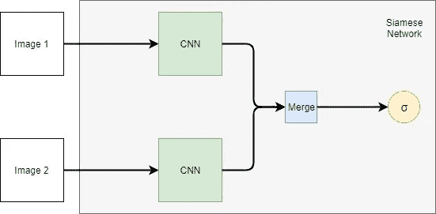
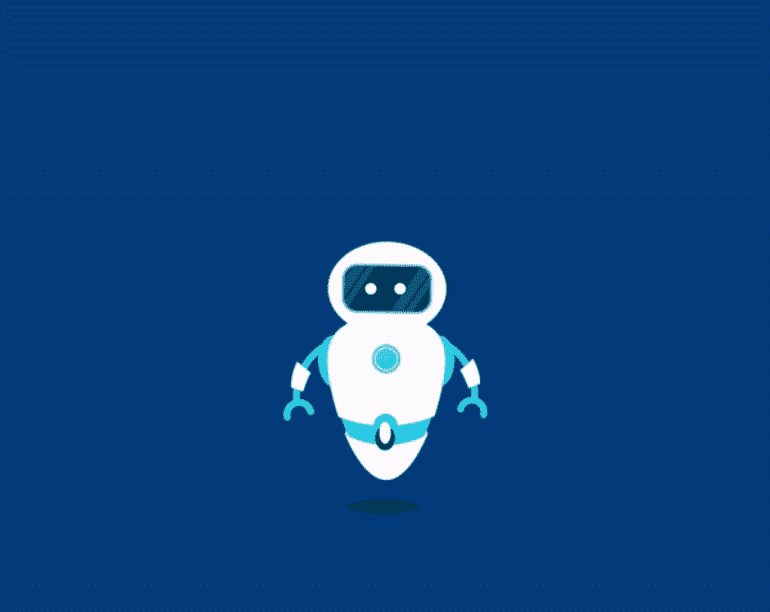

# 基于连体卷积神经网络的实时人脸识别

> 原文：<https://blog.devgenius.io/real-time-face-recognition-with-siamese-convolutional-neural-networks-54275ecd7322?source=collection_archive---------16----------------------->

众所周知，面部识别存在严重缺陷，尤其是当涉及到隐含的种族偏见时。然而，作为一个热爱编程和 AI 的书呆子，我决定实现一种我最近了解到的卷积神经网络，并自己创建这样一个软件。

GitHub 项目链接:[https://github.com/zarif101/face_find](https://github.com/zarif101/face_find)

# **那个什么**

我所指的网络是“暹罗”CNN。在我开始实际构建它之前，让我告诉你它是什么；(我假设你熟悉神经网络、CNN、计算机视觉、人工智能等基础知识)。与大多数神经网络将单一输入分类为固定数量的类别不同，连体网络旨在计算两个输入的相似程度。给定图像，网络将通过一个相同的——或者你可以说是连体的——“基本”CNN 来传递每一个图像，以生成特征地图，然后使用诸如欧几里德距离之类的损失函数来计算每个特征地图之间的*差异。这在每类没有成千上万个样本或训练图像的情况下，或者在类的数量不断变化的情况下尤其有用，因为它不是学习哪种类型的图像是什么，而是学习如何比较两个不同的图像。考虑这样一种情况，给定一个大型人脸数据库，您想要找出一个人是谁。你可以创建一个传统的 CNN 来做到这一点，但是每次有新面孔加入数据库时，你都必须重新训练整个网络。另外，你需要每个人的许多照片。我强烈推荐你阅读这篇论文，以便更好地理解暹罗网络是如何运作的。*

图鸣谢:[https://medium . com/@ kuzuryu 71/improving-siamese-network-performance-f7c 2371 BDC 1 e](https://medium.com/@kuzuryu71/improving-siamese-network-performance-f7c2371bdc1e)

# **该怎么做**

我使用 Keras 作为我的深度学习库的选择，但请随意使用您喜欢的任何一个。注意:我使用的是 PlaidML 后端，而不是 Tensorflow，因为我运行在 AMD GPU 上。我用的数据集可以在这里找到[。数据集提供了描述图像对的 CSV 文件——一些图像对有不同人的 2 幅图像，而其他图像对有相同人的 2 幅图像。网络将采用这些对和输入，并试图预测二元目标；输入图像要么是同一个人的，要么不是。我使用一个定制的生成器来为训练、验证和测试集生成图像。在对基本 CN 进行大量参数调整后，我能够在测试集上实现大约 61%的准确性，而不会过度拟合模型。这可能看起来不太好，但我会解释为什么它仍然提供令人满意的结果。如果您对模型的确切架构感兴趣，请查看名为“best_results”的文件。GitHub 上的 MD。我已经将整个实验变成了一个用户友好的项目，所以可以随意克隆存储库并训练自己的模型！](https://www.kaggle.com/jessicali9530/lfw-dataset)

现在剩下要做的就是使用 OpenCV 从网络摄像头捕捉一个提要，并尝试识别人。我将训练后的最佳模型保存为 h5 文件，并在启动网络摄像头馈送之前加载它。然后，程序不断尝试使用 OpenCV 的 HaarCascade 检测帧中的人脸。当找到一张脸时，它递归地检查已知人目录中的图像，如果这张脸与某个人的所有图像都匹配，那么它就宣布对这个人的识别。这就是为什么在这里 61%的准确率是非常好的——一个人的每一张图像都必须匹配，所以如果提供 2-3 张(不多也不少)，网络错误地预测帧中的人与每张图像中的人相同的可能性相对较低。这整个过程听起来可能有点复杂，但是再次强调，请随意阅读 GithHub 上的代码和整个项目。

# 结论

我知道我在这里没有达到最先进的结果，但探索机器学习的这个领域并看看这个领域有多大的能力肯定是很有趣的。通过适当的审查、道德监控和非歧视性数据集，我相信面部识别技术(如 Siamese networks)有能力使各种各样的任务(如大公司的员工验证，警察识别罪犯)大大提高效率。感谢阅读，并确保继续创作！

