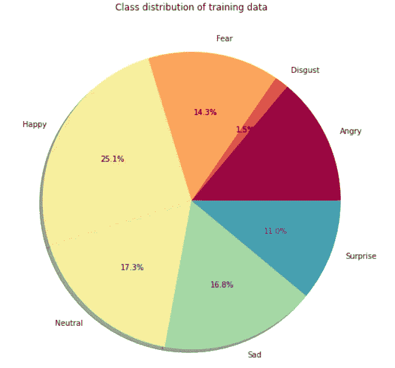
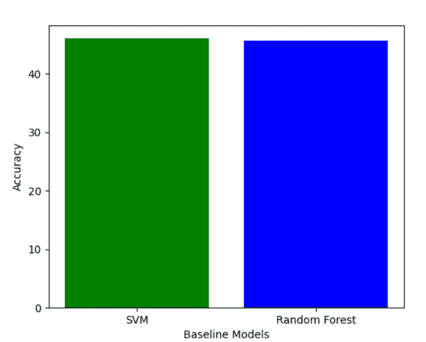
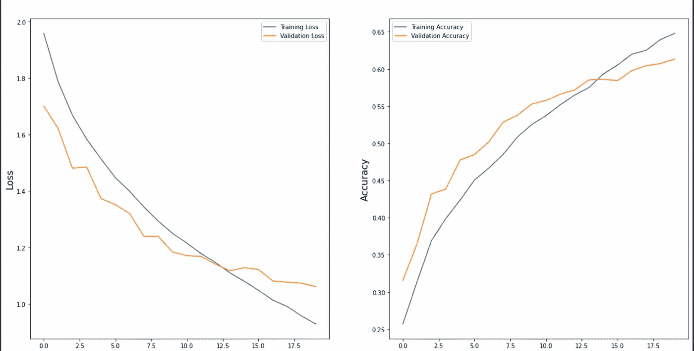
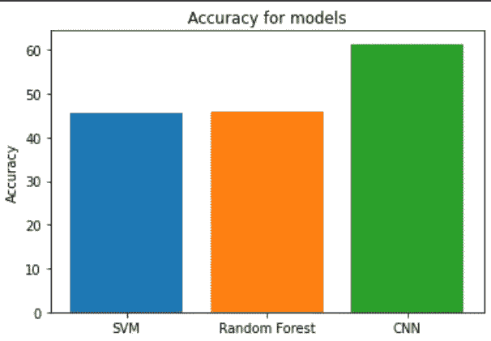

# 基于卷积神经网络的实时人脸情感检测

> 原文：<https://blog.devgenius.io/real-time-facial-emotion-detection-using-convolutional-neural-network-7800e8681bc3?source=collection_archive---------3----------------------->

**作者:德万什·舒克拉、内哈尔·舒拉西亚、库尔迪普·辛格**

[腾雅特](https://unsplash.com/@tengyart?utm_source=medium&utm_medium=referral)在 [Unsplash](https://unsplash.com?utm_source=medium&utm_medium=referral) 上的照片

> 面部表情对于社会互动非常重要，并且在非语言人机互动中发挥着重要作用

# 动机

在社会交往中，面部表情在非语言交流中起着至关重要的作用。心理学家**保罗·艾克曼**提出，有七种情绪表达是全世界人通用的: ***快乐、悲伤、惊讶、恐惧、愤怒、厌恶、轻蔑*** 。建立更好的人机交互，例如通过图像检测人类情绪，可能是一项艰巨的任务。

我们的目标是创建一个模型，可以使用简单的设备(如网络摄像头)识别和分类一个人当前的情绪或心情。

# 资料组

所使用的数据集是从 Kaggle 的 2013 年**面部情感识别挑战赛**中收集的，可以在:[https://www.kaggle.com/msambare/fer2013](https://www.kaggle.com/msambare/fer2013)找到

该数据由 48x48 像素的面部灰度图像组成。面部已经被自动注册，使得面部或多或少地居中，并且在每个图像中占据大约相同的空间。

任务是根据面部表情中显示的情绪将每张脸分为七类*(0 =愤怒，1 =厌恶，2 =恐惧，3 =快乐，4 =悲伤，5 =惊讶，6 =中性)*。训练集包括 28，709 个示例，公共测试集包括 3，589 个示例。

面部图像，每行分别代表
愤怒、厌恶、恐惧、快乐、中性、悲伤和惊讶的情绪

# **数据预处理**

图像在不同情感类别中的分布

在我们的数据集上执行基本数据分析，我们可以看到我们的数据遭受了 ***类别不平衡问题*** ，其中来自一个类别“厌恶”的图像以低量存在，而其他情绪的图像要多得多。

**类别不平衡:**为了处理这种类别不平衡问题，根据原始数据集中出现的情况，将单独的 ***权重*** 添加到每个类别中。

**数据扩充:**然后通过执行基本的图像操作和深度学习方法来扩充图像数据，如***imagedata generator***，其生成具有实时数据扩充的批量张量图像数据。

**人脸检测: *Haar cascade*** 是 Viola 和 Jones 提出的使用边缘或直线检测特征的算法。这个 Haar 级联分类器用于在我们的图像数据集中执行人脸检测。

# 基线

**支持向量机**

SVM 是一种**监督学习算法**，用于数据集的分类、回归和异常值检测问题。它通过创建一个超平面来最好地分离数据点。用于我们分类的支持向量机是通过将给定数据以 3:1 的比例分成训练和测试数据，然后设置超参数 C 的值为 1000，gamma 的值为 0.01(由 GridSearchCV 找到)来实现的，并且用于我们目的的核函数是 ***径向基函数*** 或 RBF。我们将模型拟合到训练数据上，然后在测试数据上测试模型。这种实现给出了大约 46%的准确度。

**随机森林**

***随机森林*** 是一种监督学习算法，可用于分类和回归问题。它使用称为估计器的决策树的数量，并组合它们的结果来获得它的结果。这种技术也被称为 ***集成决策树*** 。在分类问题中，它使用估计者的多数投票来分类特定的数据点。为了在给定数据集上实现 RF，数据被分成 3:1 的训练-测试比率。使用 250 个估计器，并且超参数最大特征和最小样本叶分别设置为 0.5 和 3。使用大小为 48x48 的图像，所有这些像素值作为我们模型的尺寸。在对训练数据拟合随机森林后，对测试数据的类别进行了预测，给出了 45.62%的准确率。

基线模型的性能

# **卷积神经网络**

在深度学习中，**卷积神经网络** ( **CNN** ，或 **ConvNet** )是一类人工神经网络，最常用于分析视觉意象。

CNN 主要用于分析视觉图像。基本上，CNN 使用数学概念 ***卷积*** 来显示一个函数在另一个函数上卷积时如何改变另一个函数的形状。CNN 是一个 ***多层网络*** ，由每一层的神经元组成。当一个图像被提供给一个层时，它导出传递给网络其他层的激活函数。第一个卷积层通常提取基本特征，如水平或对角边缘，随着我们在层中进一步向下移动，这些特征变得更加复杂，我们也可以识别人脸。 ***汇集*** 层，减少卷积特征的空间大小，以减少计算量。 ***激活*** 层负责添加激活功能。激活函数有助于决定每一层将激发哪些神经元。最常用的激活功能之一是 ***ReLu*** ，因为它不会同时激活所有的神经元。
给定数据集的 CNN 模型实现由 26 层组成，包括 2 个完全连接的层以及卷积、汇集、ReLu、批量标准化、密集、丢弃和激活层。

使用 ***GridSearchCV*** ，搜索优化器和学习率的最佳组合，看哪一个给我们最好的准确性。我们使用 ***SGD(随机梯度下降)*** ，学习率为 0.01、0.001 和 0.0001，分别给出 48%、45.5%和 49%的准确率。然后对于优化器 ***Adam*** ，用同样的一组学习率，分别获得了约 55.05%、57.60%、61.34%的准确率。最佳优化器和学习率被发现是 Adam 和 0.001。使用的历元数是 20。我们继续这个优化器和学习率。这是上面找到的参数的损耗图和精度图。

损失和准确度图

我们可以说，当我们将具有 Adam 优化器和学习率 0.0001 的 CNN 模型与我们的两个基线(SVM 和随机森林，其准确度分别为 45.62%和 46%)进行比较时，我们获得了更好的准确度 **61.34%** 。

讨论的每个模型的精确度

# 贡献

***Devansh shuk la:****文献调查，数据分析，CNN，数据预处理，报告。*

***Nehal Chourasia:****文献调查，支持向量机，CNN，数据预处理，报告。*

***kul deep Singh:****文献调查，随机森林，CNN，哈尔卡斯克德，报道。*