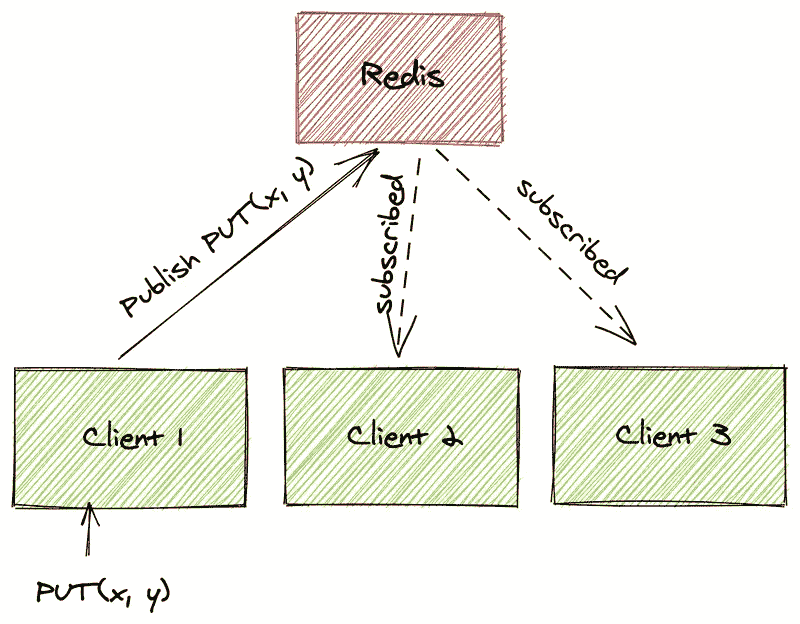
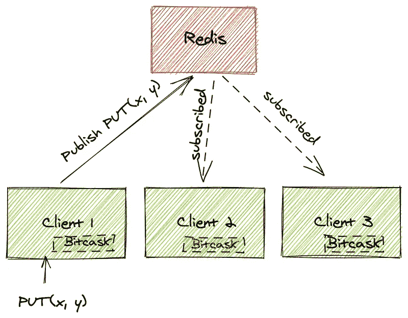
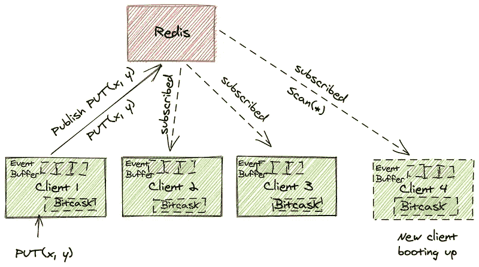

# Golang 中的实时键值存储

> 原文：<https://blog.devgenius.io/real-time-key-value-store-in-golang-d53b27ea4947?source=collection_archive---------1----------------------->

这篇文章的目标是建立一个实时的 T2 数据库。为简单起见，我们将范围限制为:

*   持久键值存储。
*   每个客户端都必须有自己的存储版本。
*   与其他客户端制作的事件同步。

这是我处理这个问题的方法。

# V1:使用散列表的简单 KV 存储

让我们从一个简单的散列表开始，并在其上构建一个抽象。

```
type Store struct {
	db map[string]string
}func NewStore() *Store {
	store := &Store{db: map[string]string{}}
	return store
}func (k Store) Get(key string) string {
	return k.db[key]
}func (k Store) Put(key string, value string) {
	k.db[key] = value
}
```

现在，虽然这是一个关键价值存储，但它不是。它不持久存储数据，不了解其他客户端，所以基本上不能解决我们的问题。

# V2:使用 Redis 作为发布订阅引擎来同步客户端

为了在客户端之间同步数据，我们使用 Redis 的发布-订阅功能。这个想法是每个客户将广播所有的`PUT`事件。所有其他客户端都订阅了相同的频道，并将基于事件更新其本地数据库。我们不做任何冲突解决，只是让最新的事件获胜。

```
type Store struct {
	db          map[string]string
	redisClient redis.Client
}func NewStore() *Store { redisClient := redis.NewClient(&redis.Options{
		Addr:     "localhost:6379",
		Password: "",
		DB:       0,
	}) store := &Store{db: map[string]string{},
		redisClient: *redisClient,
	}
}
```



每个客户端都订阅了一个 redis 主题，每当有 PUT 请求时，get 就会得到通知。

# V3:为冷启动在每个节点上保存数据

到目前为止，我们的客户还没有持久化数据，因为我们只使用了内存中的散列表。Bitcask 是一个嵌入式键值存储。我们用它来替换内存中的散列表。Bitcask 强制在给定时间只有一个操作系统进程可以打开数据库进行写入。所以我们的每个客户都需要有自己的客户 id。

```
type Store struct {
	db          *bitcask.Bitcask
	redisClient redis.Client
}func NewStore() *Store { redisClient := redis.NewClient(&redis.Options{
		Addr:     redisAddr,
		Password: redisPassword,
		DB:       redisDB,
	})
	var dbFile = "/tmp/" + *clientId db, err := bitcask.Open(dbFile) if err != nil {
		log.Fatal("Failed to open db " + err.Error())
	}
	store := &Store{db: db,
		redisClient: *redisClient,
	}
	return store
}
```



每个客户端都使用 Bitcask 维护数据库的本地副本

# V4:事件缓冲区

现在，我们已经解决了保存数据的本地持久副本以及在客户端之间同步事件的问题。还有一个问题是冷启动。

1.  我们现在通过在 bitcast 和 redis 中保存数据来解决这个问题。
2.  在所有客户端中引入事件缓冲区。

一旦客户端启动，它开始从 redis 中读取旧数据，它还向 redis 订阅新事件并将它们存储在缓冲区中，一旦它从 redis 中读取初始状态，它就开始处理新事件。

```
type Store struct {
	db          *bitcask.Bitcask
	redisClient redis.Client
	buffer      chan string
	initDone    chan bool
	bufferSize  int64
}func NewStore(redisAddr string, redisPassword string, redisDB int, redisChannel string, clientId string, bufferSize int64) *Store { redisClient := redis.NewClient(&redis.Options{
		Addr:     redisAddr,
		Password: redisPassword,
		DB:       redisDB,
	})
	var dbFile = "/tmp/" + clientId
	bufferChan := make(chan string, 100) db, err := bitcask.Open(dbFile) if err != nil {
		log.Fatal("Failed to open db " + err.Error())
	}
	store := &Store{db: db,
		redisClient: *redisClient,
		buffer:      bufferChan,
		initDone:    make(chan bool),
		bufferSize:  bufferSize,
	}
	go store.loadData()
	go store.subscribe()
	return store
}
```



每个客户端将订阅的事件存储在事件缓冲区中。新客户端首先从 redis 读取当前状态，同时将活动事件存储在事件缓冲区中。

仍然有很大的改进空间，但是到目前为止，对于我正在开发的一个简单的应用程序来说，这种设置工作得很好。

源代码可在 [Github](https://github.com/lastlegion/rtdb) 上获得

最初发表于[https://iyer.ai/realtime-db-in-golang/](https://iyer.ai/realtime-db-in-golang/)